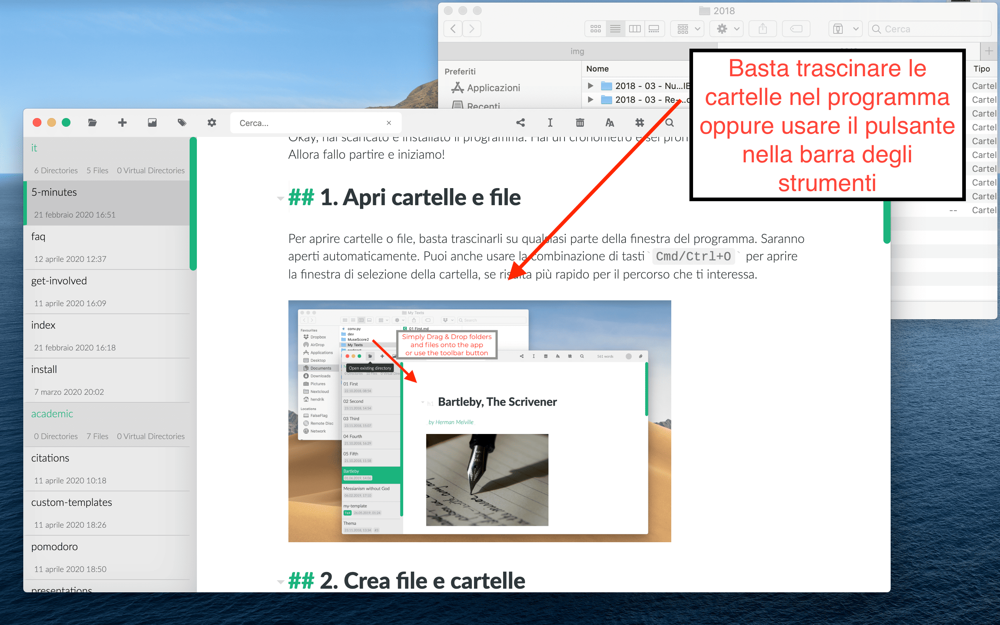
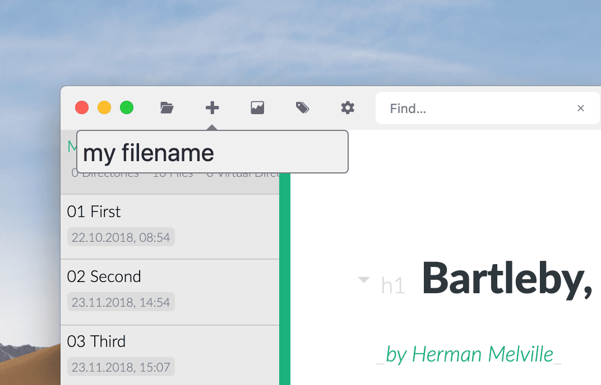
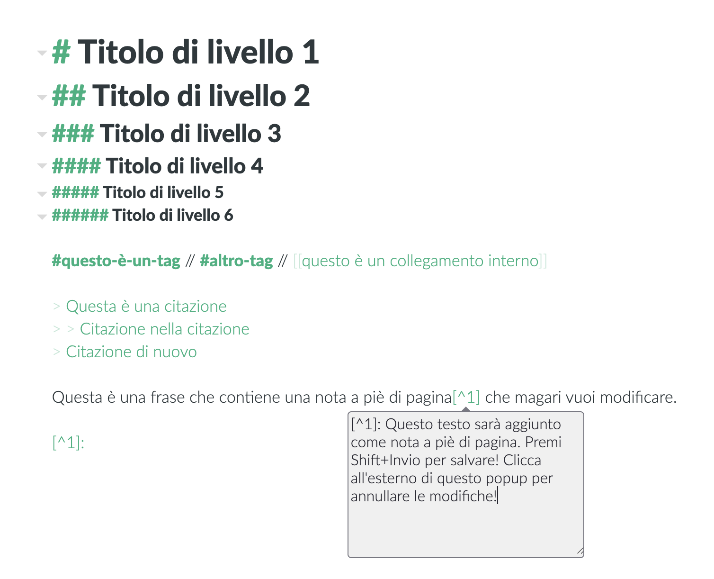

# Zettlr in 5 minuti

Okay, hai scaricato e installato il programma. Hai un cronometro e sei pronto per cominciare? Allora fallo partire e iniziamo!

## 1. Apri cartelle e file

Per aprire cartelle o file, basta trascinarli su qualsiasi parte della finestra del programma. Saranno aperti automaticamente. Puoi anche usare la combinazione di tasti`Cmd/Ctrl+O` per aprire la finestra di selezione della cartella, se risulta più rapido per il percorso che ti interessa.

## 2. Crea file e cartelle

Dopo aver aperto una cartella, avrai bisogno di un file. Usa la combinazione di tasti `Cmd/Ctrl+N` per creare un nuovo file. Digita un nome per il file, premi `Invio` e seleziona l'editor. Hai bisogno di una nuova cartella? Usa `Cmd/Ctrl+Shift+N`.

> Puoi aggiungere anche altri tipi di file, non solo files Markdown! Se non sei tu a digitare un'estensione, Zettlr aggiungerà per te l'estensione `.md`. Ma puoi anche creare files `.txt` e files `.tex`, devi solo digitare quelle estensioni! 

## 3. Scrivi!

Scrivere tocca a te, ma ecco le più importanti combinazioni da tastiera da ricordare:

- `Cmd/Ctrl+I`: rende il testo in _corsivo_. Funziona esattamente come in Word.
- `Cmd/Ctrl+B`: rende il testo in **grassetto**. Anche questo funziona proprio come in Word.
- `Cmd+Alt+R` (macOS), `Ctrl+Alt+F` (Windows/Linux): crea una nota a piè di pagina. Premi `Shift+Invio`per terminare.
- `Cmd/Ctrl+K`: inserisce un collegamento. (fai `Alt/Ctrl+Click` su di esso per aprire il collegamento.)
- `Cmd/Ctrl+J`: abilita la modalità senza-distrazioni
- `Cmd/Ctrl+Alt+L`: cambia il tema tra le modalità chiara e scura

Altre comandi senza combinazioni, ma comunque importanti:

- Usa i simboli `#` per creare titoli. Il numero di simboli `#` equivale al livello di titolo. Il massimo è 6.
- Usa i simboli `>` per creare bloccchi citazione. Puoi anche nidificarli usando più simboli "maggiore di" (es. `> >`).
- Usa i simboli `#` _non_ seguiti da spazio per creare dei tags. Puoi utilizzare questi tag per la ricerca e la navigazione.

## 4. Che altro?
Se usi la barra laterale in modalità sottile (la modalità di default), vedrai o l'elenco di file oppure l'albero delle cartelle. Sposta il cursore sull'angolo in alto a sinistra dell'elenco di file e clicca sulla freccia per mostrare l'albero delle cartelle. Per passare tra la lista dei file e l'albero delle cartelle puoi anche usare la combinazione `Cmd/Ctrl+!`. Scegli nelle Preferenze la modalità estesa della barra laterale per avere sempre visibili sia l'elenco dei file sia l'albero delle cartelle.

Zettlr è basato strettamente sul contesto. Se non altrimenti specificato, i nuovi file e cartelle saranno creati nella cartella in uso in quel momento. Le operazioni sui file (rinominare o cancellare) agiscono di default sul file in uso in un dato momento. Usa il menu contestuale usando il tasto destro su qualunque file o cartella per selezionare file/cartelle specifiche.

Tre regole generali:

1. Il tasto `Alt`(ernativa) abilita azioni alternative su uno stesso elemento
2. Il tasto `Shift`_sposta_ l'obiettivo di un azione da un elemento a un altro (in genere una cartella invece di un file)
3. Tutte le azioni fondamentali sono nella barra degli strumenti. A sinistra le azioni generali, in mezzo le azioni sui file, e a destra le altre azioni.

## 5. Bene, ho finito di scrivere il mio testo. Come faccio a condividerlo?

Tre semplici passaggi:

1. Assicurati che Pandoc e LaTeX (necessario solo per i PDF) siano installati.
2. Clicca il pulsante condividi nella barra degli strumenti (o usa `Cmd/Ctrl+E`) e selezione il formato di destinazione. Il simbolo dell'otturatore rivela le presentazioni (sono create usando reveal.js - capito il gioco di parole?)
3. Subito dopo l'esportazione, Zettlr apre automaticamente il file esportato nel programma predefinito. Da lì, premi `Cmd/Ctrl+Shift+S` (dovrebbe funzionare nella gran parte dei programmi) per salvare il file dove vuoi.

## 6. Ok, sono finiti i 5 minuti, c'è qualcos'altro?

No, sei pronto per cominciare. Se vuoi approfondire, dai un'occhiata alle nostre guide:

- [Zettlr come sistema di appunti](guides/guide-notes.md)
- [Zettlr come Zettelkasten](guides/guide-zettelkasten.md)
- [Zettlr come IDE](guides/guide-ide.md)