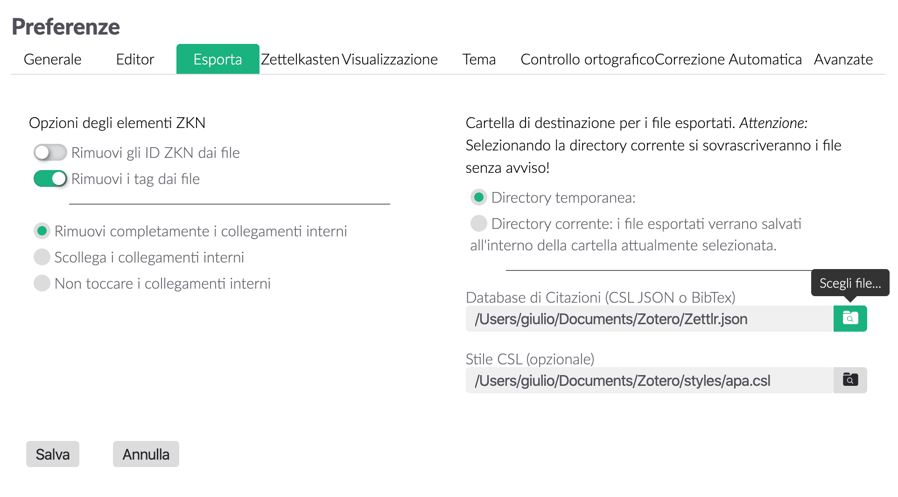
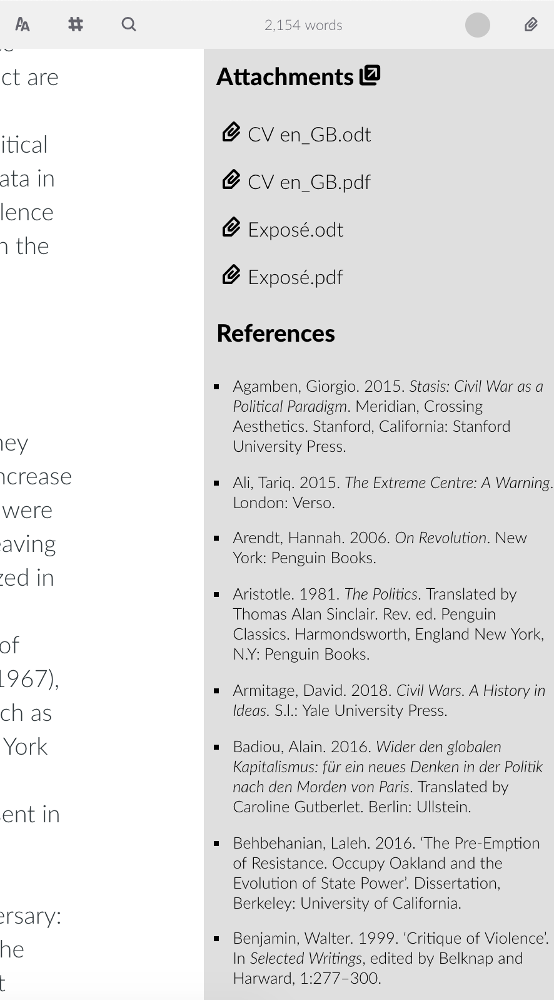

# Bibliografie con Zettlr

A partire dalla versione `1.0.0`, è possibile citare delle fonti direttamente da Zettlr. Questa funzionalità rende molto più facile la scrittura di lavori accademici rispetto al passato, perché non è più necessario aggirare la funzione di esportazione di Zettlr per citare dei lavori accademici!

Citare in Zettlr sfrutta `citeproc-js`, una libreria che funziona esattamente come, per esempio, citeproc-engine di pandoc, o Zotero. Per questo ciò che vedrai in Zettlr corrisponde a ciò che genera il plugin di Zotero per Word o LibreOffice. Il motore di citazioni di Zettlr è costituito di tre componenti: una libreria CSL JSON o BibTex che contiene tutti gli elementi che è possibile citare, facoltativamente un foglio di stile CSL che può cambiare lo stile di citazione di default di Zettlr (che è l'[American Psychological Association's 6th edition](https://www.apastyle.org/manual/index), abbreviato: APA), e un motore di anteprima. Questa guida ti aiuterà ad abilitare le citazioni e produrre dei file ben curati esteticamente (non solo PDF!) che contengono citazioni corrette e coerenti. 

> A partire dalla versione `1.3.0`, puoi usare anche le librerie BibTex per citare.  

## Attivare le citazioni in Zettlr

Ci sono due diversi motori quando si tratta di citare: le anteprime (le citazioni possono essere viste in anteprima esattamente come le immagini o i collegamenti), e il processo vero e proprio di generare le citazioni (che accade solo in esportazione). Entrambe queste funzioni sono innescate dalla selezione di una libreria che contiene dei riferimenti. Senza una tale libreria, Zettlr potrà ancora "creare un'anteprima" delle citazioni (così che si possa evidenziare che cosa faccia innescare citeproc di pandoc), ma Zettlr non potrà sostituire i contenuti della citazione con una citazione prodotta. Inoltre, se non indichi una libreria, Zettlr _non_ farà partire Pandoc e il suo citeproc-engine, e quindi non riconoscerà le citazioni

Pertanto la prima cosa da fare è creare questa libreria. Zotero è l'applicazione raccomandata per gestire la tua libreria, per cui questa guida farà riferimento a Zotero. Se usi un altro programma, ti preghiamo di controllare come esportare dal tuo programma in un formato CSL JSON. 

> Se usi Mendeley, Citavi, o un altro programma di bibliografia che non esporta in CSL JSON, puoi semplicemente usare dei files BibTex. Funzionano esattamente come i CSL JSON.

### Passo 1: Installare BetterBibTex 

Il primo passo è installare [il plugin di Zotero BetterBibTex](https://github.com/retorquere/zotero-better-bibtex/releases/latest). Il principale vantaggio di questo plugin è che mantiene l'identificativo di ogni citazione sempre unico in tutta la libreria. Ogni elemento da citare ha il suo ID unico. Questo è una caratteristica necessaria per quando, per esempio, ti accorgi che la data della pubblicazione è stata registrata con un valore sbagliato, la correggi in Zotero, e citeproc possa dopo usare l'informazione corretta. Se non usi BetterBibTex, potrà sempre succedere che un ID venga usato più volte, il che potrebbe o generare errori (la possibilità migliore, perché ti accorgeresti che c'è qualcosa che non va), oppure usare il primo elemento che trova corrispondente a quell'ID (la possibilità peggiore, perché devi essere fortunato per accorgerti della citazione errata dopo aver esportato).

Dopo aver installato BetterBibTex, ti consigliamo di mettere un po' mano alle impostazioni (per esempio riguardo la generazione degli ID).

> **Consiglio**: BetterBibTex genera automaticamente chiavi uniche usando un algoritmo che puoi personalizzare. In generale, utilizza gli [schemi di JabRef](http://help.jabref.org/en/BibtexKeyPatterns) consolidati, ma li amplifica significativamente. Si assicurerà inoltre che ogni elemento sia unico aggiungendo un suffisso a una pubblicazione nel caso avesse la stessa chiave (per es. ti potranno capitare cose tipo `Harvey2005a`, `Harvey2005b`, `Harvey2005c`, e così via). Puoi trovare [tutte le capacità di BetterBibTex nell'esaustiva documentazione di questo plugin](https://retorque.re/zotero-better-bibtex/citation-keys/). 

### Passo 2: Esporta la tua libreria

Il passo successivo è effettivamente esportare la tua libreria. Il compito di Zotero è gestire i tuoi riferimenti, ma citarli è una funzionalità diversa, svolta da citeproc. E citeproc ha bisogno di un file a parte per funzionare. 

Per esportare una libreria che possa essere usata sia da Zettlr sia da citeproc di pandoc, per prima cosa seleziona la collezione che vuoi esportare dal pannello a sinistra. Per avere sempre a disposizione tutti gli elementi ed evitare di dover esportare multiple librerie diverse, puoi selezionare anche la tua intera libreria (_a questo proposito: abbiamo condotto dei test con una libreria di circa 700 elementi, e non abbiamo rilevato problemi in termini di performance._)


Successivamente, clicca su `File` e seleziona `Esporta libreria...`. Come formato, seleziona `Better CSL JSON` (se hai scelto di non installare BetterBibTex puoi scegliere `CSL JSON`). Se lasci spuntata la casella "Keep updated", BetterBibTex farà in modo che tutti i cambiamenti in Zotero saranno esportati automaticamente nel file, mantenendolo aggiornato con Zotero (e, pertanto, trasferirà automaticamente tutti i cambiamenti a Zettlr, che a sua volta citerà sempre in maniera corretta).

Se hai spuntato la casella, puoi verificare lo stato del file della libreria aprendo le Preferenze di Zotero, selezionando il pannello `BetterBibTex` e poi `Automatic Export`, che ti permette di affinare ulteriormente ciò che viene esportato, e quando.

### Passo 3: Aprire la tua libreria in Zettlr

Adesso è il momento di importare la tua libreria in Zettlr. Per farlo, seleziona le preferenze di Zettlr, vai nel pannello `Esporta` e clicca l'icona della piccola cartella subito a destra del campo di input `Database di Citazioni`. Si aprirà una finestra di dialogo che ti consentirà di navigare fino al tuo file di libreria. Selezionalo, salva le preferenze e Zettlr caricherà automaticamente il database. Adesso sei pronto per citare!



## Citare in Zettlr

Citare in Zettlr è molto semplice. Zettlr supporta la sintassi di citeproc di pandoc per scrivere le citazioni, pertanto hai due opzioni per scrivere una citazione. La prima è semplicemente inserire una chiave di citazione (citation key) da qualche parte nel testo per restitutire la citazione corrispondente. Dovrebbe apparire così: `@Harvey2005a`. Tutte le chiavi di citazione iniziano con una `@` seguita dalla chiave di citazione.

> Zettlr ha una funzione di autocompletamento che mostrerà una selezione di tutte le chiavi di citazione disponibili non appena scrivi il carattere `@`.  Questo è un primo controllo per assicurarti di usare il corretto identificativo: se Zettlr non fa comparire niente, l'identificativo probabilmente non è stato trovato nel file della libreria.

Ma normalmente vorrai essere un po' più specifico, aggiungere un certo intervallo di pagine o qualcosa del genere alla tua citazione. Per fare questo è necessario un modo di citare più esteso con delle parentesi quadre. Una citazione con un cosiddetto prefisso e un intervallo di pagine avrà questo aspetto:

`[Vedi @Harvey2005a, 45-51]`

Per citare autori multipli, basta dividere i blocchi con dei punto e virgola:

`Vedi @Harvey2005a, 45-51; anche @Cipley2007, 8-9]`

Per ulteriori informazioni su come usare le citazioni in linea con il motore citeproc di pandoc, [ti preghiamo di consultare la guida](http://pandoc.org/demo/example19/Extension-citations.html).

> **Nota bene** che il motore citeproc di Zettlr **serve solo per creare anteprime**. Per motivi di semplicità, Zettlr non scompone tutte le citazioni e pertanto sarà meno preciso. Puoi stare certo che all'esportazione citeproc di pandoc farà bene il suo lavoro. Pertanto le citazioni in anteprima servono **solo per controllare che le citazioni vengano rilevate correttamente in modo da non avere citazioni mancanti all'esportazione**.

## Controllare i riferimenti

Dopo che hai finito di citare e vuoi controllare di aver citato tutto quello che volevi, puoi aprire il `pannello degli allegati` (Scorciatoia: `Ctrl/Cmd+3`). Sotto a tutti i file che si trovano nella tua cartella corrente, Zettlr mostrerà un elenco di tutti i riferimenti che ha trovato nel tuo file corrente. Se manca qualcosa, probabilmente non è stato citato nel tuo file.



## Cambiare lo stile di citazione

Al suo interno, Zettlr userà sempre soltanto lo stile APA per generare le citazioni. Pertanto, le tue anteprime di citazioni saranno sempre "in linea", e mai a piè di pagina. Questo è stato pensato come convenienza per te per poter solo vedere che tutto sta funzionando. 

Ma ovviamente puoi usare anche diversi stili di citazione, a seconda o dei requisiti della rivista per la quale stai scrivendo o delle tue preferenze personali. Per cambiare lo stile che citeproc di pandoc restituirà per le tue citazioni, dovrai scaricare il corrispondente file CSL. Un ottimo punto di partenza è il [repository di stili di Zotero](https://www.zotero.org/styles). Lì potrai cercare stili specifici di citazione, visualizzarli in anteprima e scaricarli.

Puoi indirizzare Zettlr a tali file CSL in due facili modi. Il primo è dalle preferenze generali. Nel pannello `Esporta`, sotto il campo per il tuo file di libreria, puoi selezionare il tuo file CSL di stile preferito che sarà usato per tutte le esportazioni di singole pagine usando il pulsante della barra degli strumenti.

Ma ovviamente, per i progetti vorrai usare degli stili CSL differenti. Pertanto, se apri le preferenze di qualunque progetto, puoi selezionare anche un file di sile CSL. Il progetto userà quello al momento dell'esportazione.

## Formattare l'elenco dei riferimenti

Naturalmente, appena citi dei lavori di riferimento nei tuoi file, vorrai che i riferimenti siano formattati accuratamente. Se esporti in Word o LibreOffice, puoi cambiare i rispettivi stili di formattazione mentre lavori sul tuo file prima di inviarlo. Ma quando esporti in PDF, questo non sarà possibile. E poiché `pandoc-citeproc` semplicemente appiccica tutti i riferimenti in fondo al documento senza qualsivoglia formattazione, dovrai affidarti a un piccolo trucchetto per fare sì che il tuo elenco di riferimenti sia esteticamente gradevole.

LaTeX usa delle lunghezze che determinare le misure complessive di un PDF esportato. Queste lunghezze vengono normalmente impostate a livello generale, ma possono essere trasformate attraverso il file sorgente. Una di queste lunghezze è `parindent`, che controlla i rientri sospesi di tutti i paragrafi. Ci sono ulteriori lunghezze, per esempio per quando i paragrafi seguono un titolo, ma al momento non ce ne interessiamo.

La variabile `parindent` può essere impostata dalle preferenze PDF di Zettlr, ma sarà impostata in generale per tutti i paragrafi. Poiché anche i riferimenti sono formattati utilizzando gli stili generali di paragrafo, saranno indentate esattamente come tutti gli altri paragrafi. Ma c'è un piccolo trucco che puoi usare per rendere più belle le bibliografie: basta sovrascrivere le lunghezze di paragrafo _dopo_ il tuo documento, ovvero: dopo il titolo `## Bibliografia` (o in qualunque modo tu l'abbia chiamata nel tuo file).

Re-impostala per come ti sembra meglio. Il seguente frammento di codice è un esempio:

```latex
\setlength{\parindent}{-1cm} % Negative hanging indent
\setlength{\leftskip}{0.5cm} % Overall indentation
\setlength{\parskip}{0.1cm} % Spacing between paragraphs
```

L'esempio qui sopra renderà la bibliografia con un'indentazione negativa di meno un centimetro. In più applicherà un'indentazione complessiva di mezzo centimetro (relativamente ai margini della pagina, per cui se il tuo margine di pagina sinistro è impostato a 3 centimetri, i paragrafi della bibliografia saranno spostati di 3,5 centrimentri al contrario dei normali paragrafi, i quali saranno spostati solo di 3 centimetri). L'ultimo valore (`parskip`) controlla la spaziatura _tra_ paragrafi, per cui ognuno sarà a 10 millimetri dall'altro.

Basta iniziare da lì, magari cerca più lunghezze da modificare e aggiustale a tuo piacere.
