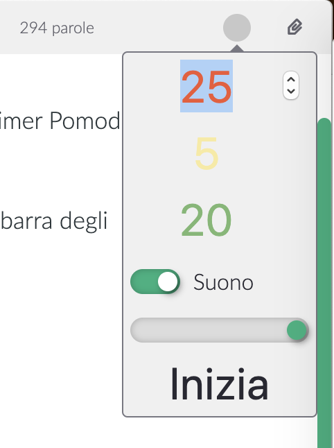
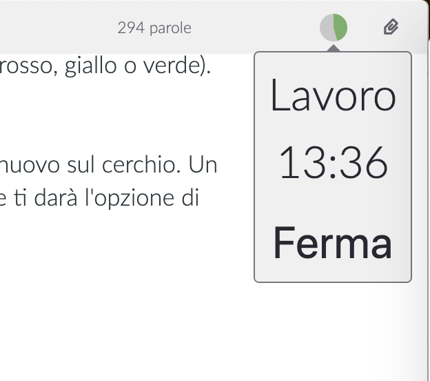

# Timer Pomodoro

Se scrivi molto, potrai arrivare a un punto in cui avrai bisogno di organizzare meglio il tuo tempo. Il timer Pomodoro incluso può aiutarti.

Accedi al Timer Pomodoro cliccando sul cerchio nell'angolo in alto a destra dello schermo, dentro la barra degli strumenti.

Non sai cosa sia un timer pomodoro? Vai sul [sito ufficiale](https://francescocirillo.com/pages/pomodoro-technique)!

## Usare il Timer Pomodoro

Prima di usare il timer pomodoro, puoi adattare alcune impostazioni.

Il numero **rosso** indica i minuti usati per _lavorare_. Di default sono 25 minuti.

Il numero **giallo** indica la durata di una _breve_ pausa tra i periodi di lavoro. Dopo ogni fase di lavoro ci sarà una breve pausa. Di default sono 5 minuti.

Il numero **verde** dice a Zettlr, quanto dovrebbe durare una _lunga_ pausa. Questa lunga pausa avverà ogni quattro lavori. Di default sono 20 minuti.

Sotto, puoi decidere se far emettere un suono ogni volta che una fase ha termine. Il cursore sotto la casella regola il volume. (_Attenzione_: questo non è il volume di sistema, per cui se il tuo volume di sistema è solo al 20 percento, anche un volume del 100 percento dentro Zettlr suonerà solo come 20 percento!)

Clicca su **Inizia** per avviare il timer. Il cerchio si riempirà del colore della fase corrente (rosso, giallo o verde). Quando è pieno, inizia la fase successiva.

Per **fermare** il timer o anche solo controllare lo **status** corrente del timer, clicca di nuovo sul cerchio. Un piccolo popup ti dirà quanto tempo manca per la fase corrente, il tipo della fase corrente, e ti darà l'opzione di fermarlo.

Il **ciclo** di un timer pomodoro è come segue:

1. Lavoro
2. Pausa breve
3. Lavoro
4. Pausa breve
5. Lavoro
6. Pausa breve
7. Lavoro
8. Pausa lunga
9. _Ricomincia dal passo 1_
