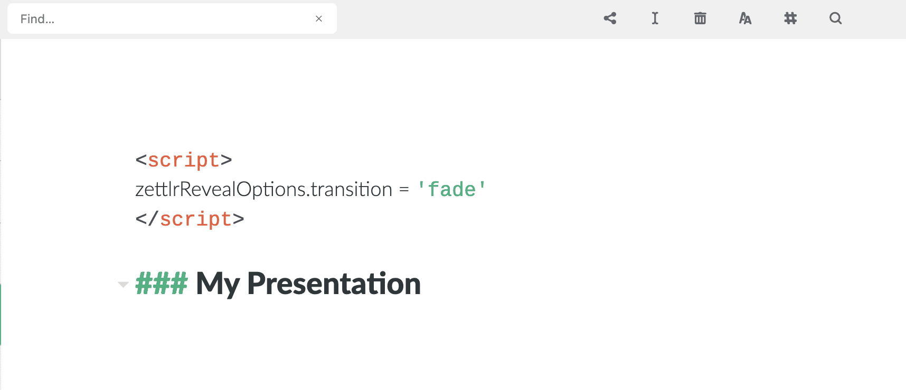

# Presentazioni

A partire dalla versione `0.19.0`, Zettlr può esportare i tuoi file Markdown direttamente come file di presentazione utilizzando il framework [reveal.js](https://revealjs.com/#/). `reveal.js` è una soluzione leggera per creare presentazioni super compatibili utilizzando solo `HTML` e `Javascript`. Dopo, queste presentazioni potranno essere visualizzate su _tutti_ i computer che possiedano un browser - oggigiorno significa che funzionano su _tutti_ i computer.

Per esportare file da Markdown a `reveal.js`, devi avere Pandoc installato sul tuo computer. Consulta la [sezione sull'esportazione](../core/export.md) per vedere come installare pandoc.

Se prima di tutto vuoi rimanere impressionato da un esempio concreto di Zettlr in `reveal.js`, guarda la [presentazione di dimostrazione](https://zettlr.com/slides.revealjs.htm)! Puoi leggere anche [il file sorgente](https://www.zettlr.com/themes/zettlr/assets/slides.md) mentre segui le istruzioni su questa pagina.

## Considerazioni preliminari

Ovviamente, un documento Markdown che debba essere compilato in una presentazione ha una struttura lievemente diversa dagli altri documenti Markdown.

### Creare diapositive

Puoi creare nuove diapositive in due modi. Nel primo, ogni titolo di livello 1 inizierà una nuova diapositiva e farà anche la funzione del titolo della diapositiva. Ma nel caso in cui il titolo di livello 1 sia troppo grande per i tuoi gusti, o semplicemente non vuoi che ci sia un titolo per quella diapositiva, puoi anche separare le diapositive utilizzando i divisori Markdown (o `***` o `---`).

Tutto ciò che segue il titolo o il divisore sarà il contenuto delle diapositive. Non è necessario "terminare" l'ultima diapositiva con un divisore.

### Usare gli elementi di Markdown

All'interno delle diapositive, puoi usare gli elementi di Markdown. Saranno resi così come ti aspetteresti. Puoi persino usare delle note a piè di pagina che saranno poi posizionate in fondo alla propria diapositiva corrispondente!

### Strumenti avanzati

Ovviamente, le presentazioni `reveal.js` hanno anche la stessa versatilità di PowerPoint o Impress quando si tratta di controllare la tua presentazione. Per esempio, puoi usare le classi CSS per dire alla tua presentazione che alcuni elementi richiedano di essere attivati prima di procedere con la presentazione. Questi sono detti "fragments". A causa delle limitazioni del motore di Pandoc, dovrai usare direttamente HTML per questo risultato. Considera ad esempio il codice HTML dalla presentazione di dimostrazione: 

```html
<ul>
    <li class="fragment fade-in">This item will fade in.</li>
    <li class="fragment highlight-blue">This will be highlighted blue.</li>
    <li class="fragment highlight-red">All available transitions are documented [here](https://github.com/hakimel/reveal.js/#fragments).</li>
</ul>
```

Questo creerà un elenco con tre elementi. Tutti gli elementi sono "fragments", il che significa che procedendo alla diapositiva successiva, il primo comparirà (`fade-in`), così come dice la classe. Premendo di nuovo il tasto freccia a destra, il secondo elemento verrà evidenziato in blu. Alla terza pressione del tasto freccia a destra l'ultimo elemento verrà evidenziato in rosso. E alla quarta verrà mostrata la diapositiva successiva.

### Impostazioni della presentazione



Ovviamente, la presentazione stessa ha delle sue impostazioni che puoi sfruttare. Queste sono semplici direttive JavaScript che puoi manipolare inserendo un tag`<script` come si vede in figura. Puoi sovrascriverli impostando gli attributi nell'oggetto `zettlrRevealOptions`. Le seguenti sono le impostazioni che puoi configurare:

```javascript
const zettlrRevealOptions = {
	    // Display controls in the bottom right corner
	    controls: true,
	    // Display a presentation progress bar
    	progress: true,
	    // Display the page number of the current slide
	    slideNumber: true,
	    // Push each slide change to the browser history
    	history: true,
	    // Enable keyboard shortcuts for navigation
	    keyboard: true,
	    // Enable the slide overview mode
    	overview: true,
	    // Vertical centering of slides
	    center: true,
	    // Enables touch navigation on devices with touch input
	    touch: true,
	    // Loop the presentation
    	loop: false,
	    // Change the presentation direction to be RTL
	    rtl: false,
	    // Randomizes the order of slides each time the presentation loads
	    shuffle: false,
	    // Turns fragments on and off globally
	    fragments: true,
	    // Flags if the presentation is running in an embedded mode,
	    // i.e. contained within a limited portion of the screen
	    embedded: false,
	    // Flags if we should show a help overlay when the questionmark
	    // key is pressed
	    help: true,
	    // Flags if speaker notes should be visible to all viewers
	    showNotes: false,
	    // Global override for autolaying embedded media (video/audio/iframe)
	    // - null: Media will only autoplay if data-autoplay is present
	    // - true: All media will autoplay, regardless of individual setting
	    // - false: No media will autoplay, regardless of individual setting
	    autoPlayMedia: null,
	    // Number of milliseconds between automatically proceeding to the
	    // next slide, disabled when set to 0, this value can be overwritten
	    // by using a data-autoslide attribute on your slides
	    autoSlide: 0,
    // Stop auto-sliding after user input
	    autoSlideStoppable: true,
	    // Enable slide navigation via mouse wheel
	    mouseWheel: false,
	    // Hides the address bar on mobile devices
	    hideAddressBar: true,
	    // Opens links in an iframe preview overlay
    	previewLinks: false,
	    // Transition style
	    transition: 'convex', // none/fade/slide/convex/concave/zoom
	    // Transition speed
	    transitionSpeed: 'default', // default/fast/slow
	    // Transition style for full page slide backgrounds
    	backgroundTransition: 'fade', // none/fade/slide/convex/concave/zoom
	    // Number of slides away from the current that are visible
    viewDistance: 3,
    // The display mode that will be used to show slides
    display: 'block'
};
```

### Formattare la presentazione

Se nessuno dei temi disponibili ti piace, o se hai bisogno di aggiungere un po' di CSS extra, puoi farlo semplicemente aggiungendo un tag `<style` da qualche parte nella tua presentazione.

Dovrai saper usare CSS per perfezionare la formattazione, ma l'aspetto stesso della presentazione sarà soddisfacente da solo.


### Immagini

Uno dei grandi svantaggi di queste presentazioni HTML è che le immagini non possono essere contenute nel file finale. (a dire il vero, _possono_ essere incluse, ma questo aggiungerebbe alla dimensione del file le dimensioni di tutte le immagini moltiplicate per 1.3)

Quindi devi decidere dove mettere le immagini. Ci sono essenzialmente tre vie praticabili.

1. Creare una cartella dedicata per le immagini, ad es. `img`, all'interno della cartella dove si trova il tuo file Markdown. Collega tutte le immagini usando percorsi relativi (`img/my-image.jpg`). Quando esporti il tuo file, fai in modo che la presentazione sia rispetto alla cartella delle immagini nello stesso posto del file sorgente.
2. Metti tutte le immagini dentro la stessa cartella del tuo file di presentazione. Dopodiché dovrebbe bastare collegarle usando i loro nomi file.
3. Carica le immagini sul web, per esempio in un servizio di hosting di immagini, e collegale usando i loro URL. Unico svantaggio: avrai bisogno di una connessione a internet affidabile dove presenterai la tua presentazione.

Una regola generale è: se Zettlr visualizza correttamente le tue immagini, anche la presentazione riuscirà a farlo, finché la tua presentazione si trova _esattamente_ nella stessa cartella del tuo file sorgente relativamente alle immagini.

So you need to decide where to put the images. There are basically three feasible methods.
