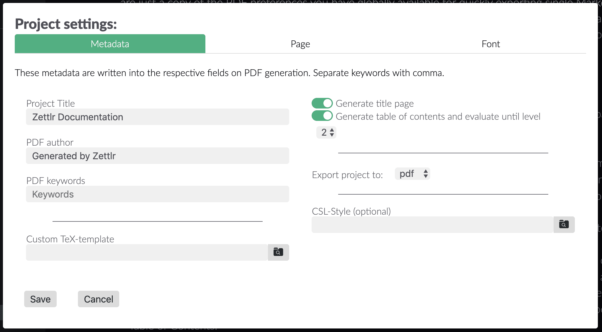

# Progetti

I progetti sono un modo per semplificare la concatenazione e l'esportazione di più di un singolo file. Ti permettono di separare un singolo progetto in diversi file separati su cui lavorare. Puoi dividere il tuo lavoro in diversi file e unirli solo alla fine per esportarli in un singolo file PDF. Inoltre, i progetti di Zettlr ti consentono di perfezionare ulteriormente le tue esportazioni in PDF. Con i progetti puoi, ad esempio, istruire Zettlr di creare anche un titolo pagina o un sommario. 

## Creare un progetto

I progetti di Zettlr sono in fondo soltanto un po' di funzionalità aggiuntive per delle cartelle. Pertanto puoi "trasformare" qualsiasi cartella in un progetto. Basta cliccare con il tasto destro sulla cartella che vuoi trasformare in un progetto e selezionare "Crea progetto". La cartella stessa sarà evidenziata in rosso e apparirà un'icona a forma di matita a sinistra del nome, segnalando che questa cartella ha attivato le funzionalità di progetto. Se adesso clicchi con il tasto destro su una cartella, hai tre opzioni aggiuntive nel menu contestuale: "Impostazioni progetto", "Esporta progetto" e "Rimuovi progetto".

## Lavorare con i progetti

Seleziona "Impostazioni progetto" dal menu contestuale di una cartella progetto per aprire le impostazioni. In generale, queste sono solo una copia delle preferenze PDF che puoi impostare globalmente per esportare velocemente dei file Markdown singoli. Due differenze sono che i progetti ti consentono di perfezionare la generazione di un documento PDF, e che queste impostazioni PDF si applicano solo all'esportazione di quella specifica cartella. Quindi puoi lasciare le tue preferenze PDF globali intatte e usare impostazioni diverse per il tuo progetto.

Adesso vediamo brevemente le impostazioni disponibili per i progetti. Per prima cosa il pannello dei metadata:

- **Titolo Progetto**: Questo titolo sarà usato come nome del file, come titolo (se decidi di creare un frontespizio) e come titolo del PDF del tuo documento. Di default è il nome della cartella.
- **Autore PDF**: Questo sarà inserito nei metadata del PDF per gli autori.
- **Parole chiave PDF**: Queste sono le parole chiave che puoi eventualmente usare quando esporti in PDF.
- **Genera frontespizio**: Se attivi questa opzione, Zettlr dirà al motore di LaTeX di creare un frontespizio. Utilizzerà il titolo progetto e la data corrente oltre al tuo nome autore e li scriverà sulla prima pagina del tuo documento.
- **Genera indice**: Se attivi questa opzione, Zettlr istruirà Pandoc di generare un sommario sulla seconda pagina (o sulla prima, se non desideri un frontespizio)
- **valuta i titoli fino al livello...**: Con questo elenco a cascata puoi scegliere quali titoli saranno inclusi nel tuo sommario. Il "2" di default istruisce Pandoc di generare un sommario usando i titoli sia di primo che di secondo livello (ovvero i titoli `##` e `#`). Un 4 includerebbe i titoli di primo, secondo, terzo e quarto livello (ovvero `#`, `##`,`###`, e`####`). Tutti i restanti titoli saranno inclusi nel file, ma non appariranno nel sommario.

Inoltre, puoi scegliere di usare un template `TeX` personalizzato per questo progetto (cioé per esempio un template fornito dalla rivista alla quale vuoi inviare il tuo articolo, oppure uno personalizzato). Infine, puoi sovrascrivere lo stile CSL di default delle impostazioni generali di esportazione e usarne invece uno personalizzato.

Attualmente, i pannelli Pagina e Carattere sono esattamente identici tra i progetti e le impostazioni generali di esportazione, quindi consulta la [pagina delle impostazioni](../reference/settings.md#pdf-preferences) per conoscere come funzionano.

## Comporre ed esportare progetti

Per comporre ed esportare un progetto, Zettlr seguirà i seguenti passaggi per generare il tuo PDF finale, per cui leggili con attenzione per sapere cosa aspettarti quando decidi di esportare il tuo progetto! 

Prima di tutto, Zettlr prenderà la cartella del progetto e la comprimerà in un vettore a una dimensione. Questo significa che **tutte le sottocartelle e tutti i file in esse inclusi saranno appiattiti in un unico elenco**. Cosa vuol dire? Guarda la lista dei file. Internamente, prima di esportare i tuoi file, Zettlr disporrà i file _esattamente_ come nel pannello di anteprima. Quindi, se controlli la tua lista di anteprima, saprai esattamente quale file verrà prima e quale dopo. Questo è intenzionale, così che tu non possa avere l'incubo di consegnare un lavoro e accorgerti dopo di avere escluso un'intera cartella con tre capitoli.

> Ti preghiamo di notare che Zettlr utilizzerà _tutte_ le sottocartelle! Questo è pensato per la comodità di chi scrive progetti molto grandi e possono usare tutte le sottocartelle che vogliono. Pertanto, la lista di anteprima sarà esportata esattamente così com'è (tutte le cartelle verranno semplicemente omesse). Quindi per favore non creare sottocartelle di secondo livello per poi comprimere tutti i tuoi appunti e chiederti come mai i tuoi appunti siano finiti nel tuo manoscritto. Se vuoi usare file aggiuntivi che non andranno esportati, basta creare altre due cartelle nella tua cartella progetto. In una ci puoi mettere tutti i tuoi file di lavoro, mentre l'altra la converti nel progetto che deve essere esportato.

Dopo che i tuoi file sono stati letti, subiscono delle piccole modifiche (tutti i percorsi sono normalizzati in modo che Pandoc e LaTeX possano trovare tutte le tue immagini) prima di essere concatenati insieme. Dopodiché questo enorme file viene scritto su disco in un file temporaneo.

Successivamente, Zettlr leggerà le impostazioni che hai configurato per il progetto e seguirà fondamentalmente lo stesso processo che usa per generare PDF da documenti singoli: avvia l'esportatore, gli fornisce le tue impostazioni, lo punta al file temporaneo e lascia che Pandoc e LaTeX facciano il loro lavoro.

Quando il tuo progetto sarà stato esportato, viene aperto automaticamente con il tuo lettore PDF di default e viene salvato nella tua cartella progetto.

> Ti preghiamo di notare che specialmente la generazione di un sommario per progetti enormi può richiedere tantissimo tempo. Se desideri creare un sommario, LaTeX deve in realtà costruire due volte il PDF - prima per determinare in quali pagine finiranno i tuoi titoli dopo la conversione in PDF, e poi una seconda volta per aggiungere effettivamente il sommario. In una prova che ho fatto, in un computer nuovo con Windows 10, per la generazione di un'intera cartella di estratti che diventava di circa 150 pagine ci sono voluti circa cinque minuti in cui sembrava che non stesse funzionando. Quindi per favore abbi pazienza - fintanto che Pandoc o LaTeX non si lamentano di nulla, stanno ancora lavorando.

> **Consiglio per esperti**: come forse saprai dalla sezione FAQ, Zettlr e Pandoc non cercheranno di rimuovere i comandi TeX che puoi aver scritto nei tuoi documenti markdown. Tienilo presente quando lavori sui tuoi progetti: puoi aggiungere pagine in più o fare altri magheggi con i tuoi file che saranno poi effettivamente presenti nel tuo documento finale! Puoi anche creare documenti `.tex` fornendone l'estensione quando crei nuovi file. Questi documenti `.tex` supportano l'evidenziatura della sintassi LaTeX e saranno inclusi all'esportazione del tuo progetto! Assicurati che abbiano un nome file che li posizioni esattamente dove li vuoi.

## Rimuovere progetti

Per rimuovere un progetto, basta cliccarci sopra con il tasto destro e selezionare di rimuovere il progetto. Ciò che verrà rimosso non è altro che il file di impostazioni che indica che quella cartella debba essere trattata come progetto (si chiama `.ztr-project`). Quindi, per rimuovere un progetto, in realtà rimuovi solo le impostazioni del progetto. Se ricrei il progetto ci sarà di nuovo il file, ma con le impostazioni di default. Quindi ricorda, eliminare un progetto cancellerà definitivamente le tue impostazioni e dovrai rifarle da capo.