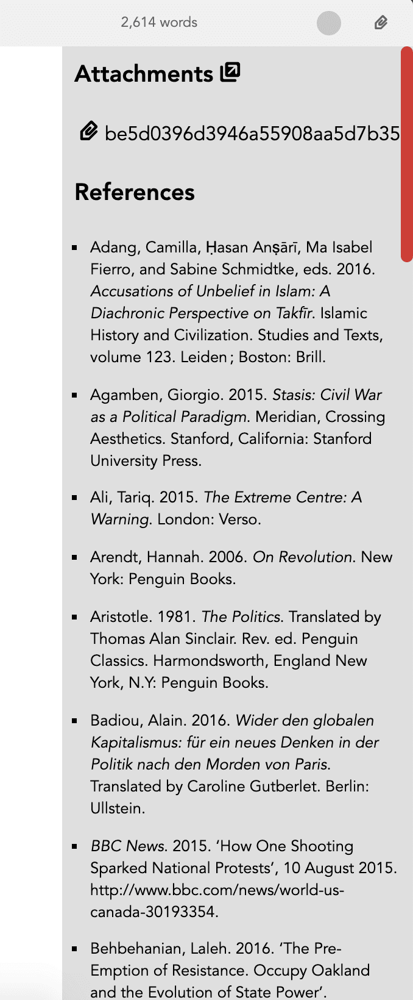
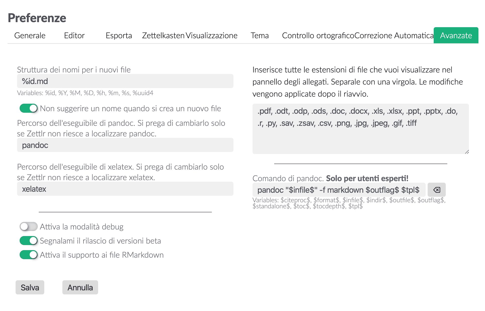
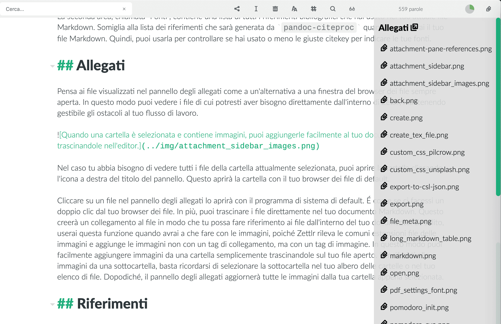

# Il pannello degli allegati

Il pannello degli allegati è un elemento sensibile al contesto che mostra le informazioni aggiuntive rilevanti sulla tua cartella corrente e sul tuo file corrente. Puoi aprirla sia usando l'icona a forma di graffetta nella barra degli strumenti sia premendo `Cmd/Ctrl+?`.

All'interno del pannello, ci sono due aree. La prima è chiamata "Allegati" e contiene un elenco di tutti i file aggiuntivi non-Markdown che si trovano nella tua cartella attualmente selezionata. Possono essere immagini, documenti di Word, file PDF, e letteralmente qualsiasi altro tipo di file. Puoi scegliere quali file vi verranno mostrati aggiungendo l'estensione del tipo di file nelle relative opzioni delle preferenze, che puoi trovare nel pannello "Avanzate". Le estensioni sono case-insensitive, quindi aggiungere `.jpeg` mostrerà i file `.jpeg` così come `.JPEG` e `.JpEg`

La seconda area, chiamata "Fonti", contiene una lista di tutti i riferimenti bibliografici che hai usato nel tuo attuale file Markdown. Somiglia alla lista dei riferimenti che sarà generata da `pandoc-citeproc` quando esporterai il tuo file Markdown. Quindi, puoi usarla per controllare se hai usato o meno le giuste citekey per indicare le tue fonti.

## Allegati

Pensa ai file visualizzati nel pannello degli allegati come a un'alternativa a una finestra del browser dei file sempre aperta. In questo modo puoi vedere i file di cui potresti aver bisogno direttamente dall'interno di Zettlr, mantenendo gestibile gli ostacoli al tuo flusso di lavoro.

Nel caso tu abbia bisogno di vedere tutti i file della cartella attualmente selezionata, puoi aprire la cartella cliccando l'icona a destra del titolo del pannello. Questo aprirà la cartella con il tuo browser dei file di default.

Cliccare su un file nel pannello degli allegati lo aprirà con il programma di sistema di default. É come se ci facessi un doppio clic dal tuo browser dei file. In più, puoi trascinare i file direttamente nel tuo documento Markdown. Questo creerà un collegamento al file in modo che tu possa fare riferimento ai file dall'interno del tuo documento. Di solito, userai questa funzione quando avrai a che fare con le immagini, poiché Zettlr rileva le comuni estensioni file delle immagini e aggiunge le immagini non con un tag di collegamento, ma con un tag di immagine. In questo modo puoi facilmente aggiungere immagini da una cartella semplicemente trascinandole sul tuo file aperto. Per riferirti alle immagini da una sottocartella, basta ricordarsi di selezionare la sottocartella nel tuo albero delle cartelle o nel tuo elenco di file. Dopodiché, il pannello degli allegati aggiornerà tutte le immagini dalla tua cartella appena selezionata.

## Riferimenti

I riferimenti sono una lista di fonti dal tuo file Markdown. La lista non fa granché, eccetto farti vedere le citazioni corrette per queste fonti utilizzando lo stile CSL incorporato. É stato pensato come un modo per darti una rapida visione dell'elenco di tutto ciò che hai citato per vedere se hai fatto riferimento alle fonti corrette, e se ne hai dimenticato o meno qualcuna.

Il pannello degli allegati resterà aperto anche in modalità senza distrazioni, dandoti la possibilità di avere l'elenco dei riferimenti fianco a fianco del tuo documento mentre scrivi.