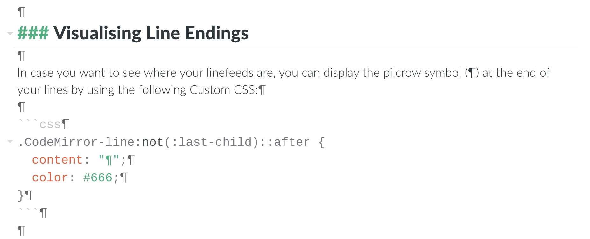

# CSS personalizzati

A partire dalla versione `1.1` di Zettlr è possibile usare CSS ([Cascading Style Sheets](https://en.wikipedia.org/wiki/Cascading_Style_Sheets)) personalizzati per modificare completamente l'aspetto del programma. É stata una funzionalità a lungo richiesta, e aprirà molte possibilità per personalizzare il programma (e magari persino il primo vero contenuto del programma generato dagli utenti?)

Puoi trovare l'editor di CSS personalizzati in `Zettlr->Personalizza CSS...` (macOS) oppure in `File->Personalizza CSS...` (Windows e Linux)

Se non hai dimestichezza con i CSS, ma non vuoi soltanto copiare e incollare le guide su questa pagina, puoi anche seguire un piccolo [tutorial sui CSS](https://developer.mozilla.org/en-US/docs/Learn/CSS/Introduction_to_CSS)! Ce ne sono molti su internet, per cui con una rapida ricerca su Google puoi anche trovare dei tutorial video, se li preferisci!

Di seguito troverai prima un'introduzione generale sulla scrittura di CSS, all'inizio elencherò alcuni esempi che puoi facilmente copiare e incollare per dare un aspetto diverso al tuo programma. Alla fine della pagina potrai trovare un **riferimento completo di classi**.

## Scrivere CSS per Zettlr

Se non vuoi scrivere da solo i CSS e vorresti solo **cambiare il carattere**, passa alla prossima sezione!

Zettlr è preimpostato con molte classi e ID predefiniti. Segue la regola di buon senso generale di non usare i tag `style` per definire le proprietà direttamente. Quindi, puoi usare le classi per praticamente qualsiasi cosa.

Gli stili di Zettlr sono divisi in geometria e nel tema effettivo, quindi vorrai magari limitarti a cambiare il design degli elementi _senza_ cambiare **niente** della geometria. Giocare con la geometria può essere divertente, ma può causare un comportamento completamente casuale, poiché alcune parti del programma dipendono dalle dimensioni corrette degli elementi. Nel caso tu abbia commesso un errore, non preoccuparti: basta eliminare il file `custom.css` dalla tua cartella di Zettlr. Puoi trovare la cartella di Zettlr nel tuo sistema basandoti sui percorsi forniti nella [guida di installazione](../install.md).

Le classi e gli ID in Zettlr sono sempre namespaced ai corrispettivi componenti (a meno che non siano globali), per cui per sovrascrivere una regola dovrai usare il namespace completo (oppure, se non vuoi aggiungere troppe regole e sei pigro, usa la regola di override `!important`).

Tutto è sempre namespaced a `body`, che ha classe `.dark` se il programma è al momento in modalità scura. Per cui per assicurarsi che una certa regola abbia valore solo quando il programma è in modalità scura, ricordati di usare il prefisso `body.dark`!

In fondo alla pagina troverai un riferimento completo a classi e ID così non devi sempre frugare nel programma! (mi scuso in anticipo, è solo un dump generato dai file CSS precompilati di Zettlr.)

## Snippets di codice CSS

### Usare un carattere personalizzato con Zettlr

Nel caso non ti piacesse il font di default di Zettlr, o hai bisogno di modificarlo, basta incollare il codice seguente nell'editor di CSS personalizzati. Sostituisci `your-font-name` con il **nome completo** del font che vuoi usare in Zettlr. Ti preghiamo di sostituire `placeholder` a seconda del font:

- nel caso tu voglia usare un carattere **serif**, come Times New Roman, o Georgia, usa `serif`
- nel caso il tuo sia un carattere **sans serif**, come Arial o Helvetica, usa `sans-serif`
- nel caso tu voglia passare al classico **monospazio**, usa `monospace`

Il placeholder serve nel caso il tuo font non venga trovato, in modo che venga usato un font equivalente. Serve come rimedio.

Zettlr comprende già un carattere serif, uno sans-serif e uno monospazio! Per usare i caratteri già presenti, puoi usare `Crimson` per un carattere serif moderno o `Liberation Mono` per un bel carattere monospazio. (Lato è quello di default, per cui probabilmente non è quello che vuoi inserire qui).

```css
#editor {
    font-family: '<your-font-name here>', <placeholder>;
}
```

### Immagini di sfondo casuali con Unsplash

Con il codice seguente, puoi cambiare l'immagine di sfondo del tuo programma ogni volta che lo avvii. Le immagini sono prese da Unsplash.com, un bel sito con immagini gratuite. Usa `Source API`, che semplicemente tira fuori un'immagine diversa ogni volta che viene visitato l'URL. Puoi provarlo facilmente [visitando la pagina e aggiornandola un po' di volte](https://source.unsplash.com/random)! Ti preghiamo di consultare la [guida a Source API di Unsplash](https://source.unsplash.com/) per più opzioni (per esempio usare un'immagine al giorno).

```css
/* Enter your custom CSS here */

#editor {
    background-color: transparent;
    background-image: url('https://source.unsplash.com/random');
    background-size: cover;
    background-position: center center;
}

body #editor .CodeMirror-sizer, body #editor .CodeMirror-gutter {
    background-color: rgba(255, 255, 255, .8);
    height: 100%;
}

body.dark #editor .CodeMirror-sizer, body.dark #editor .CodeMirror-gutter {
    background-color: rgba(0, 0, 0, .8);
}

#editor .CodeMirror {
    background-color: transparent;
}
```


### Visualizzare il simbolo di fine paragrafo

Nel caso tu voglia vedere dove finiscano i tuoi paragrafi, puoi mostrare il piede di mosca (¶) alla fine dei tuoi paragrafi puoi usare il seguente CSS personalizzato:

```css
.CodeMirror-line:not(:last-child)::after {
  content: "¶";
  color: #666;
}
```



### Nascondere la barra degli strumenti nella modalità senza distrazioni

Alcuni vogliono che la modalità senza distrazioni sia _davvero_ senza distrazioni. Zettlr di default non nasconde la barra degli strumenti, perché la gran parte delle persone vogliono avere accesso a tutti gli strumenti e pulsanti anche quando scrivono senza distrazioni. Comunque, se sei tra quelli che preferiscono che la modalità senza distrazioni sia soltanto l'editor, gioisci! Per nascondere la barra degli strumenti nella modalità senza distrazioni basta una sola linea di CSS!

Basta incollare la seguente linea di CSS nella tua finestra di Personalizza CSS, e poi la barra degli strumenti sarà sempre nascosta:

```css
#editor.fullscreen, .CodeMirror-fullscreen { top: 0px; }
```

### Le tue idee

Hai delle idee su come modificare Zettlr ancora di più? Se hai dei buoni frammenti di CSS che funzionano da subito, sentiti pure libero di [condividerli con noi](mailto:info@zettlr.com) così che possiamo mostrarli qui!

## Riferimento completo di classi e ID CSS

Di seguito troverai la lista completa e non riassunta di *tutte* le classi e ID CSS. Le abbiamo contate, sono più di 300 al momento.

Ti preghiamo di notare che abbiamo usato un pacchetto esterno per estrarre i nomi delle classi. Abbiamo già rimosso gran parte delle non-classi (come i colori e i valori "dot-noted" come `.5%`) ma non guarantiamo di averli trovati tutti.

> **Attenzione: la seguente lista potrebbe cambiare in futuro! Per cui una classe che funzionava in una versione di Zettlr potrebbe smettere di funzionare in un'altra, a causa di cambiamenti sia al DOM sia al nome della classe/ID**

```css
.eot
#iefix
.ttf
.woff2
.otf
.woff
.dragger
.popup
.clearfix
.modal
.dialog
.uuid
.image-preview
#app-lang
.inline
.time
.info
.button
.request-file
.file-select-group
.changelog
.code
.clear
.box-left
.box-right
.paper
.a4paper
.set-target
.bmargin
.lmargin
.rmargin
.tmargin
.image-size
.image
.png
#file-list
#imageWidth
#imageHeight
#preview-image-sizes
.pdf-preview
.error
.projects
#prefs-taglist
.flex
#next-sheet
#prev-sheet
.ui-tabs-nav
.ui-tabs-tab
.dicts-list
.user-dict
.dicts-list-item
.user-dict-item
.dicts-list-search
.selected-dict
.clusterize-scroll
.clusterize-extra-row
.clusterize-keep-parity
.clusterize-content
.clusterize-no-data
.hidden
.list-item
.meta
.date
.directories
.files
.id
.tags
.tex-indicator
.target-progress-indicator
.filename
.taglist
.tag
.tagspacer
.directory
.sorter
.sortName
.sortTime
.empty-directory
.empty-file-list
#file-tree
#directories-dirs-header
#directories-files-header
.collapse-indicator
.collapsed
.dead-directory
.project
.display-search-results
.empty-tree
#editor
#sidebar
#component-container
.expanded
#arrow-button
#sidebar-inner-resizer
#sidebar-resize
.fullscreen
.ui-resizable-handle
.ui-resizable-autohide
.ui-resizable-disabled
.ui-resizable-w
.CodeMirror
.CodeMirror-code
.mute
.CodeMirror-scroll
.CodeMirror-fullscreen
.cm-readability-0
.cm-readability-1
.cm-readability-2
.cm-readability-3
.cm-readability-4
.cm-readability-5
.cm-readability-6
.cm-readability-7
.cm-readability-8
.cm-readability-10
.cm-readability-9
.CodeMirror-vscrollbar
.CodeMirror-sizer
.CodeMirror-empty
.svg
.search-result
.cm-table
.size-header-1
.pomodoro
.CodeMirror-gutter-elt
.size-header-2
.size-header-3
.size-header-4
.size-header-5
.size-header-6
.cm-comment
.cm-fenced-code
.cm-formatting-task
.CodeMirror-cursor
.cm-escape-char
.cm-formatting-code
.cm-formatting-code-block
.cm-formatting-em
.cm-formatting-quote
.cm-formatting-strong
.cm-formatting-list-ol
.cm-formatting-list-ul
.cm-link
.cm-url
.cm-zkn-link
.meta-key
.cm-zkn-tag
.cma
.CodeMirror-gutters
.CodeMirror-foldgutter
.CodeMirror-foldgutter-folded
.CodeMirror-foldgutter-open
.heading-tag
.CodeMirror-foldmarker
.CodeMirror-hints
.CodeMirror-hint
.cm-hint-colour
.sk-circle
.sk-child
.sk-circle2
.sk-circle3
.sk-circle4
.sk-circle5
.sk-circle6
.sk-circle7
.sk-circle8
.sk-circle9
.sk-circle10
.sk-circle11
.sk-circle12
.sk-three-bounce
.sk-bounce1
.sk-bounce2
.print-window
.quicklook-standalone
#init-print
.title
.find
.body
#toolbar
.content
.darwin
.win32
.linux
.file-info
.searchbar
#search-progress-indicator
.menu-popup
.dir-open
.file-new
.stats
.tag-cloud
.preferences
.file-save
.file-delete
.file-rename
.formatting
.readability
.share
.show-toc
.toggle-attachments
.spacer
.separator
.end-search
.notify
.popup-arrow
.down
.up
.left
.right
.toc-link
.small
#header-formatting
.row
.table-generator
.cell
.btn-share
.htm
.pdf
.docx
.odt
.plain
.tex
.revealjs
.revealjs-beige
.revealjs-black
.revealjs-league
.revealjs-moon
.revealjs-serif
.revealjs-sky
.revealjs-solarized
.revealjs-white
.rst
.rtf
.org
.textbundle
.textpack
#reveal-themes
.markdownHeading1
.markdownHeading2
.markdownHeading3
.markdownHeading4
.markdownHeading5
.markdownHeading6
.markdownBlockquote
.markdownLink
.markdownImage
.markdownCode
.markdownComment
.markdownMakeOrderedList
.markdownMakeUnorderedList
.markdownMakeTaskList
.markdownInsertTable
.markdownDivider
.insertFootnote
.markdownBold
.markdownItalic
.removeFootnote
.search
.footnote-edit
.regexp
#searchNext
#replaceNext
#replaceAll
#attachments
#open-dir-external
.csl-bib-body
.csl-entry
.cb-toggle
.radio-toggle
.toggle
.cb-group
.linux-window-controls
.windows-window-controls
.close
.minimise
.resize
.maximise
.theme-container
.theme-container-item
.theme-mockup
.traffic-lights
.traffic-light-close
.traffic-light-full
.traffic-light-min
.toolbar
.file-list
.file-list-item
.editor
#theme-berlin-mockup
#theme-frankfurt-mockup
#theme-bielefeld-mockup
#theme-karl-marx-stadt-mockup
.cm-meta
.cm-def
.sb-annotation
.alert
.success
.warning
.quicklook
.cm-stex-mode
.cm-css-mode
.cm-attribute
.cm-builtin
.cm-string
.cm-string-2
.cm-variable
.cm-variable-2
.cm-keyword
.cm-property
.cm-type
.cm-atom
.cm-number
.CodeMirror-focused
.CodeMirror-selected
.cm-formatting
.cm-tag
.cm-bracket
.cm-formatting-header-1
.cm-formatting-header-2
.cm-formatting-header-3
.cm-formatting-header-4
.cm-formatting-header-5
.cm-formatting-header-6
.cm-quote
.cm-strong
.cm-em
.cm-spell-error
.cm-zkn-id
.citeproc-citation
.cm-hr
.CodeMirror-guttermarker-subtle
.CodeMirror-hint-active
.selected
.alias
.file
.highlight
.dir
.root
.active
#searchWhat
.not-found
#replaceWhat
.pomodoro-task
.pomodoro-short
.pomodoro-long
.pomodoro-meter
.pomodoro-value
.task
.short
.long
.indicator-meter
.indicator-value
.error-info
.has-error
.form-inline-buttons
.prefs-submit-group
.ui-tabs-active
.tippy-popper
.table-helper-align-button-container
.table-helper-remove-button-container
.table-helper-add-button
.table-helper-align-button-line
.table-helper-remove-button-line
.table-helper
.dark
.container
.cm-formatting-escape
.maximise-svg
```
