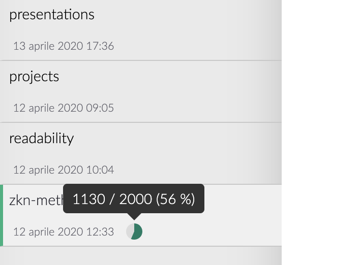
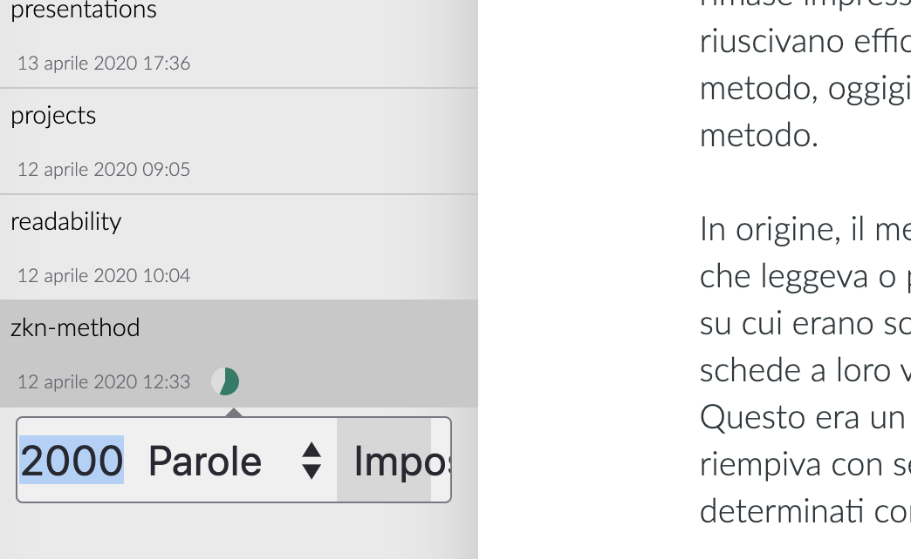

# La lista dei file

Adesso tocca alla lista dei file. La lista dei file è qualcosa di molto speciale perché include potenti funzionalità che facilitano molto il lavorare con numerosi file e cartelle. Per cui diamoci un'occhiata!

## Generale

Nel pannello laterale in modalità estesa sono visibili sia l'albero delle cartelle sia la lista dei file. Usando invece il pannello laterale in modalità sottile, puoi sempre alternare la lista dei file o l'albero delle cartelle usando la combinazione `Cmd/Ctrl+!`.

> **Nota**: si prega di consultare la [guida delle impostazioni](../reference/settings.md) per maggiori informazioni sulla barra laterale.

La lista dei file elenca tutte le cartelle e i file in esse contenuti nell'ambito della cartella selezionata in un dato momento, ma non lo fa come un comune browser dei file: **la lista dei file tratta allo stesso modo tutte le sottocartelle, e te le mostra tutte insieme una dopo l'altra!** Pertanto non devi navigare ulteriormente nell'albero delle cartelle per raggiungere delle cartelle sommerse.

Se hai disabilitato le informazioni dei file, sia le cartelle sia i file occuperanno solo una riga. Se invece abiliti le informazioni dei file vedrai informazioni aggiuntive: delle cartelle è visualizzato il numero di sottoelementi. Dei file invece vengono visualizzate la data e l'ora di ultima modifica. Se contengono un ID o dei tag, queste informazioni vengono visualizzate a destra della data e ora di modifica. Passando con il cursore sul contatore dei tag apparirà una piccola casella di testo di suggerimento che mostrerà tutti i tag presenti in quel file.

> Puoi abilitare le informazioni dei file nel Pannello Generale delle impostazioni oppure usando la combinazione `Cmd/Ctrl+Alt+S`.

### Ulteriori informazioni dei file

Le informazioni aggiuntive dei tuoi file mostrate nella lista dei file possono risultare utili per diverse ragioni. Prima di tutto puoi verificare se l'ID del file è corretto o no. A volte Zettlr può rilevare un ID errato, e questo è il primo dei modi di verificare se Zettlr sta davvero usando il tuo ID o ha solo preso parte di un URL che contiene dei numeri. In più puoi passare con il cursore sul contatore dei tag per mostrarli nel suggerimento.

### Traguardi di scrittura

A partire dalla versione `1.2`, Zettlr supporta i traguardi di scrittura. Per impostare un traguardo, clicca con il tasto destro su un file e seleziona "Imposta traguardo di scrittura". Inserisci il numero di parole o caratteri e clicca "Imposta". Zettlr terrà il conto fino al tuo obiettivo e mostrerà il tuo progresso con un piccolo indicatore se hai attivato gli snippets. Trascinaci sopra il cursore per vedere il numero assoluto di parole o di caratteri che hai scritto.

> Per rimuovere un traguardo di scrittura da un file, è sufficiente azzerare il traguardo.

### Ordinare l'elenco dei file

Se desideri ordinare le cartelle, puoi farlo senza uscire dalla lista dei file. Muovi il mouse sopra qualsiasi cartella e compariranno due indicatori del criterio di ordinamento in uso. Clicca sul primo di essi (con una freccia dalla A alla Z) per abilitare l'ordinamento in senso alfabetico. Il secondo abilita l'ordinamento secondo la data e ora dell'ultima modifica. L'ordinamento non riguarda le sottocartelle — solo i file.

Inoltre puoi navigare all'interno dell'albero delle cartelle cliccando sulle cartelle. Un singolo clic si limita a selezionare la cartella, mentre un `ALT`-clic selezionerà la corrispondente cartella di livello superiore. Questo è utile se devi cambiare cartella spesso, ma preferisci mantenere la barra laterale in modalità sottile e non vuoi continuamente cambiare tra lista dei file e albero dei file.

## Implicazioni strutturali

Ogni volta che si seleziona una cartella nell'albero delle cartelle, la lista dei fila mostrerà _tutti_ i file e le cartelle in quella cartella. In poche parole, appiattisce tutte le diverse sottocartelle e i file della struttura ad albero in una sola lista a una dimensione. La lista cambierà il contenuto ogni volta che selezionerai una diversa cartella nell'albero delle cartelle.

> Nella lista sono riportate _tutte_ le cartelle e i file _all'interno_ della cartella selezionata in un dato momento. Pertanto, funziona un po' come una ricerca molto veloce. Si vedono soltanto i file di una cartella specifica, e ogni volta che si scende di un livello, sono visibili sempre meno file fino a che ci sarà una sola cartella con i suoi file. Se si ha una buona struttura all'interno della propria cartella radice, questo è un metodo potente per avere ogni volta solo la lista dei file che ti servono.

Poiché la lista dei file appiattisce il tuo complesso albero di cartelle, sono necessari alcuni presupposti per _visualizzare_ correttamente i file. Pertanto le seguenti regole ti aiuteranno a riconoscere dove siano effettivamente i file nel tuo archivio:

1. La cartella attualmente selezionata sarà in cima alla lista dei file. Sempre.
2. Tutti i file all'interno di quella cartella sono posizionati subito al di sotto del nome della cartella
3. Tutte le sottocartelle _all'interno_ della cartella saranno sempre in fondo alla lista dei file, ovvero _dopo_ i file contenuti nella cartella selezionata
4. Se le cartelle sono vuote, saranno affiancate l'una all'altra senza file intermedi

Quindi ciò che è importante da ricordare è: tutte le cartelle sono visualizzate come se fossero allo stesso livello; come se non fossero annidate. Per riconoscere quale cartella è contenuta in un'altra cartella, si prega di fare riferimento all'albero delle cartelle.

> Se non ti piace l'ordine "naturale" di Zettlr (per cui 10 viene dopo 2), puoi passare all'ordine "ASCII" nelle impostazioni (per cui 2 viene dopo 10)

## Azioni nella lista dei file

Ci sono molte azioni relative alla lista. Per prima cosa, seleziona una casella per aprire qualunque file e visualizzare il suo contenuto nell'editor. Clicca su una cartella per selezionarla.

Puoi spostare i file in localizzazioni diverse. Bastra trascinare un file dalla lista dei file su una cartella nell'albero delle cartelle. La cartella su cui li trascinerai verrà evidenziata per indicarti dove verrà spostato il file. Rilascia il file lì per spostarlo oppure rilascialo da qualsiasi altra parte per annullare lo spostamento e far ritornare il file nella sua posizione originaria.

Se trascini un file al di fuori del programma, potrai condividerla con altri programmi. Per annullare il trasferimento, basta rilasciare il mouse all'interno del tuo programma.

> Per spostare un file su altri programmi, assicurati di **mantenere premuto il tasto `Ctrl` o  `Alt` prima di trascinare il tuo file!** Questo segnalerà a Zettlr che non vuoi spostare il file all'interno di Zettlr, ma al di fuori del programma. 

## Heatmap di ricerca

Un'altra utile funzionalità della lista dei file è per aiutarti a distinguere i risultati più rilevanti delle tue ricerche. Quando hai avviato una ricerca, la lista cambierà colore come un camaleonte. Dipingerà la lista dei file in 50 sfumature di verde (esatto, abbiamo appena fatto _quella_ battuta). Quanto più verde il file, quanto è più rilevante per la tua ricerca.

Questa funzionalità si potrebbe chiamare "heatmap" per ricerche a tutto testo.

Si prega di ricordare che la lista è altamente adattabile, e si trasformerà molto mentre usi il programma. Per esempio, non mostrerà soltanto tutti i file e tutte le cartelle all'interno della cartella selezionata, ma nasconderà anche i file non presenti tra i risultati della ricerca, quando la lista è in modalità di ricerca.