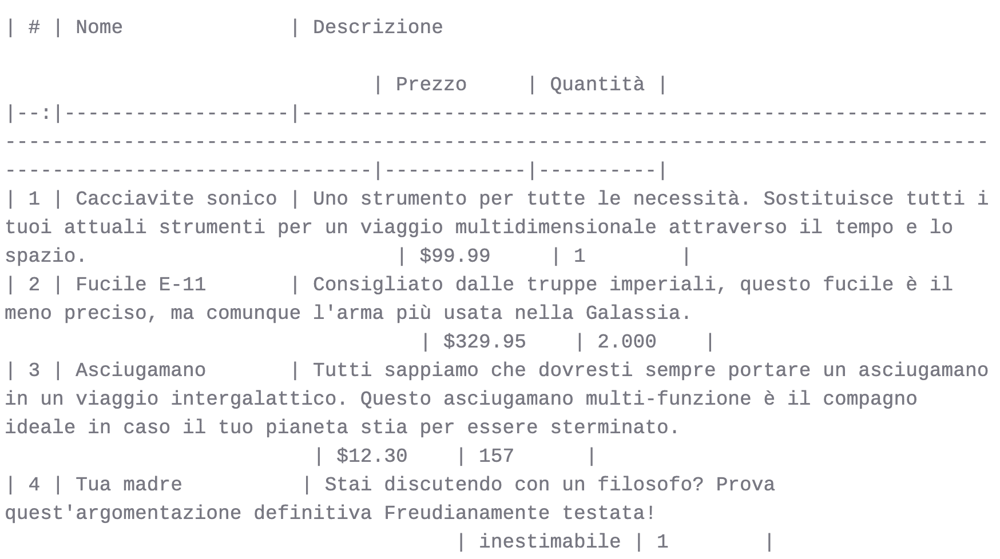
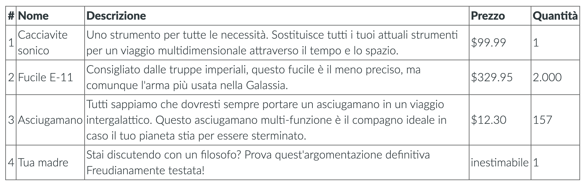
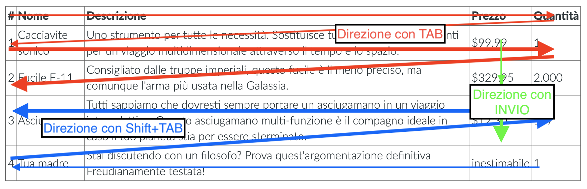
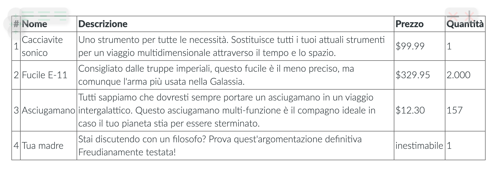
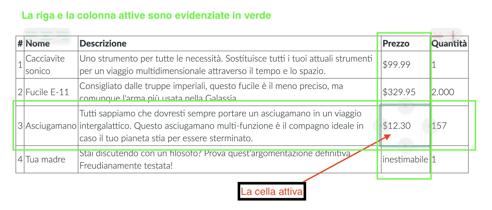

# Tabelle in Zettlr

Le tabelle in Markdown sono notoriamente difficili. Poiché la natura di Markdown è quella di essere il più semplice possibile, la complessità è ciò che ne soffre di più. Markdown è la scelta ideale per scrivere testi e gran parte di ciò che si usa durante la scrittura (es. collegamenti, immagini, titoli, o citazioni) è gestito perfettamente in Markdown. Eppure, di tanto in tanto, vorremmo anche includere qualche dato nei nostri lavori, oppure semplicemente le tabelle sono il modo migliore per visualizzare un'idea.

## Tabelle - Introduzione

Le tabelle sono scritte in Markdown con una sintassi molto elementare – ogni linea è una riga e le celle della tabella sono racchiuse da caratteri di barra verticale:

```
| Cella A:A | Cella A:B |
| Cella B:A | Cella B:B |
```

Volendo, puoi aggiungere anche una riga di intestazione, che può anche indicare l'allineamento usando i due punti (a sinistra, a destra o al centro):

```
| Allineato a sinistra | Allineato al centro | Allineato a destra |
|----------------------|:-------------------:|-------------------:|
| Lorem                | Ipsum               | Dolor              |
```

Nota che non importa quale sia l'allineamento dei contenuti della tabella nei tuoi documenti, fintanto che i due punti sono correttamente posizionati. La tabella sarà poi esportata usando il corretto allineamento.

Ma come puoi vedere, anche con sole tre parole per colonna, le tabelle in Markdown diventano subito piuttosto lunghe. Poiché non puoi usare più righe per una cella, ecco che sei in seria difficoltà quando hai bisogno di inserire un'intera frase in ogni cellula. Prendi l'esempio seguente:

```
| # | Nome              | Descrizione                                                                                                                                                                  | Prezzo     | Quantità |
|--:|-------------------|----------------------------------------------------------------------------------------------------------------------------------------------------------------------------|------------|----------|
| 1 | Cacciavite sonico | Uno strumento per tutte le necessità. Sostituisce tutti i tuoi attuali strumenti per un viaggio multidimensionale attraverso il tempo e lo spazio.                          | $99.99     | 1        |
| 2 | Fucile E-11       | Consigliato dalle truppe imperiali, questo fucile è il meno preciso, ma comunque l'arma più usata nella Galassia.                                                            | $329.95    | 2.000    |
| 3 | Asciugamano       | Tutti sappiamo che dovresti sempre portare un asciugamano in un viaggio intergalattico. Questo asciugamano multi-funzione è il compagno ideale in caso il tuo pianeta stia per essere sterminato.                                                     | $12.30    | 157      |
| 4 | Tua madre          | Stai discutendo con un filosofo? Prova quest'argomentazione definitiva Freudianamente testata!                                                                   | inestimabile | 1        |
```

In Zettlr, dovrebbe avere il seguente aspetto:




Anche se le celle della tabella sono ognuna allineata per riempire la larghezza totale di ogni colonna, non riesci a riconoscere che questa sia effettivamente una tabella Markdown valida, in cui ogni linea va a capo e lo scheletro della tabella non è più visibile. Senza il contatore a sinistra, avremmo difficoltà anche a capire quante righe ci siano.

## L'editor delle tabelle

Ovviamente, scrivere tabelle Markdown è a volte inevitabile, ma sempre irritante. Sarebbe fantastico se potessi modificare la tabella come sei stato abituato a fare da, per esempio, gli editor di Word, vero? Ecco che entra in gioco l'**editor delle tabelle** incorporato (disponibile dalla `1.4`)!

Anche se Zettlr mantiene una rigorosa politica contro il [WYSIWYG](https://en.wikipedia.org/wiki/WYSIWYG) ("What You See Is What You Get", ovvero "ciò che vedi è ciò che ottieni"), poiché in questo caso si tende a perdere la percezione di ciò che stai davvero scrivendo, le tabelle fanno eccezione a questa regola. Perché anche se l'approccio [WYSIWYM](https://en.wikipedia.org/wiki/WYSIWYM) ("What You See Is What You Mean", ovvero "ciò che vedi è ciò che intendi") è superiore a WYSIWYG, qui non c'è modo di usarlo per le tabelle.

Quindi, per aiutarti a scrivere le tabelle, Zettlr è adesso fornito con un potente editor di tabelle che ti fornisce tutto ciò di cui hai bisogno per non impazzire completamente qundo devi creare delle tabelle nei tuoi documenti. Con l'editor delle tabelle, la tabella di cui sopra ha questo aspetto:



Molto meglio, non è vero? L'editor delle tabelle di Zettlr prende tutte le tabelle Markdown che trova nel tuo documento, le converte in una rappresentazione HTML con contenuto delle celle modificabile, e visualizza queste invece del sottostante Markdown. Questo nasconde completamente la sorgente Markdown, ma come abbiamo detto, in questo caso questo approccio è molto più vantaggioso.

Puoi **abilitare la modalità di modifica** semplicemente cliccando dentro qualsiasi cella nella tabella e aggiungendo il tuo contenuto. La cella attiva verrà evidenziata. In più, la navigazione via tastiera che hai imparato dai famosi editor di testo è stata implementata anch'essa così che tu possa usare `Tab`, `Invio`, e i tasti freccia per muoverti nella tabella. Infine, è anche possibile aggiungere e rimuovere colonne e righe con i **pulsanti laterali**. Questi sono i pulsanti che compaiono quando passi con il cursore sulla tabella, e ti consentono di eseguire diverse azioni su di essa. 

> Attenzione! Quando attivi la tabella cliccando su una delle sue celle, stai entrando nella modalità di modifica. Ricordati di **cliccare al di fuori della tabella quando hai finito**, per uscire dalla modalità di modifica! Solo allora i cambiamenti fatti alla tabella saranno applicati alla sottostante tabella Markdown.

## Navigazione via tastiera

Ma parliamo prima della navigazione via tastiera. Hai a disposizione le seguenti scorciatoie:

- `Tab`: Passa alla cella successiva. Se sei nell'ultima colonna, passa alla prima cella della riga successiva. Se sei nell'ultima colonna dell'ultima riga, verrà aggiunta automaticamente una nuova riga.
- `Shift-Tab`: Passa alla cella precedente. Se sei nella prima colonna, passa all'ultima cella della colonna precedente.
- `Invio`: Passa alla riga successiva della stessa colonna. Se il tuo cursore era nell'ultima riga, verrà aggiunta automaticamente una nuova riga.
- `Freccia su/Freccia giù`: Passa nella stessa colonna alla riga precedente/successiva. Non verranno aggiunte nuove righe se ti trovi nella prima o ultima riga.
- `Freccia sinistra/Freccia destra`: Muove il cursore a sinistra/destra. Se il cursore era all'inizio/fine dei contenuti della cella, passa alla cella precedente/successiva.

Con queste scorciatoie, puoi inserire facilmente del contenuto nelle tue tabelle con dei movimenti naturali. Vorrai prima riempire le intestazioni della tabella e aggiungere dopo un gruppo di dati per ogni riga. In questo caso, ti sarà utile `Tab`:



## I pulsanti laterali

Un altro pregio dell'editor di tabelle sono i cosiddetti **pulsanti laterali**. Sono due gruppi di pulsanti e quattro pulsanti direzionali che appaiono quando passi con il cursore su una tabella:



All'inizio sono traslucidi per non coprire il contenuto della tua tabella. Muovi il cursore sopra un pulsante laterale per renderlo opaco. I pulsanti dovrebbero essere abbastanza ovvi. I quattro pulsanti `(+)` a metà dei lati della tabella **aggiungeranno rispettivamente un riga o una colonna** nella posizione indicata. Quindi dovrai cliccare sul pulsante a sinistra per aggiungere una colonna sul lato sinistro della cella corrente, e su quello in basso per aggiungere una riga sotto la cella corrente.

In cima a ogni tabella, ci sono due gruppi aggiuntivi di pulsanti. Il gruppo a sinistra contiene tre pulsanti che **allineano la colonna della tabella attualmente selezionata** a sinistra, al centro o a destra. Clicca uno dei pulsanti per applicare l'allineamento. I cambiamenti saranno immediati per una tua conferma visiva.

Il gruppo di pulsanti a destra contengono due pulsanti per **rimuovere la riga o la colonna attualmente selezionata della tabella**. Posiziona il cursore dentro qualsiasi cella della riga o colonna che vuoi eliminare e clicca su uno di quei pulsanti.

> Ricordati sempre di posizionare il cursore nella cella corretta prima di rimuovere una colonna o una riga, per risparmiarti la noia di uscire dalla modifica della tabella, e di applicare il comando "Annulla".



## Tabelle complesse

Finora abbiamo parlato solo delle tabelle semplici. Ma se avessimo bisogno di visualizzare tabelle più complesse? In tal caso, anche l'editor delle tabelle si arrende. Celle che si estendono per più righe o più colonne sono del tutto impossibili data la sintassi limitata delle tabelle Markdown. Per aggiungere queste tabelle, dovrai usare comandi nativi di HTML o LaTeX. Questi ti daranno la massima libertà per fare quello che vuoi.

Ricorda sempre: le tabelle Markdown sono usate come _aiuto_ per la tua _scrittura_. Ciò significa che se stai lavorando con dataset complicati che devi aggiungere a un articolo, per es. nella sezione Fonti, ci sono in giro ottimi strumenti per [trasformare il tuo RDataset](https://tex.stackexchange.com/questions/364225/export-tables-from-r-to-latex) o datafile di Stata in LaTeX o HTML.

Una possibile idea per inserire dei dataset nei tuoi articoli senza fare troppi copia e incolla è mettere insieme diverse funzioni di Zettlr:

- Crea un progetto per il tuo articolo
- Crea i file necessari per la struttura del tuo articolo (es.`01 - Chapter 1.md`, `02 - Chapter 2.md`, `03 - Chapter 3.md`, `04 - Chapter 4.md`)
- Dentro il tuo R-Project o progetto di Stata, aggiungi un comando per esportare i tuoi dati in un file `05 - Data.md` nella cartella del tuo progetto ogni volta che effettui dei cambiamenti.
- Quando esporti il tuo articolo, il file gestito esternamente `05 - Data.md`sarà aggiunto automaticamente, assicurandoti che i tuoi dati siano inviati insieme al tuo documento.