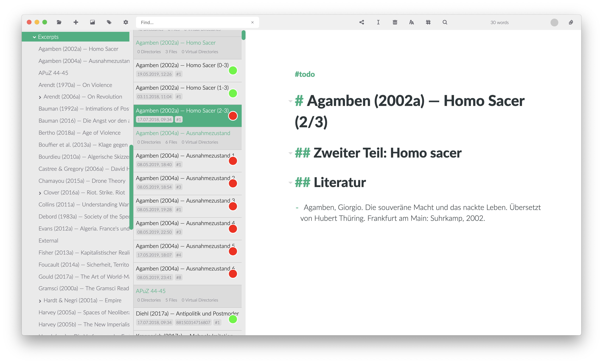

# Guida: Zettlr come Integrated Development Environment (IDE)

Zettlr è pieno di funzioni per aiutare il tuo lavoro. Puoi usarlo come una piccola app per prendere appunti, come una Zettelkasten o, come spiegato in questa guida, come un completo ambiente integrato di sviluppo (cioé: di scrittura). E allora iniziamo!

> Usando questa guida, puoi configurare Zettlr per sostituire programmi come Ulysses, Atom, o Sublime Text.

## Passo 1: Regolare le impostazioni

Il primo passo è regolare alcuni parametri di Zettlr. Quindi usa la combinazione di tasti `Cmd/Ctrl+,`, o fai clic sull'ingranaggio nella barra degli strumenti per aprire la finestra delle impostazioni. Regola le seguenti impostazioni:

- Pannello Generale
    - Informazioni dei file: On
    - Barra laterale: Estesa
- Pannello Controllo ortografico
    - Abilita i dizionari per tutte le lingue in cui scriverai (ad esempio en-UK, de-DE e fr-FR)
- Pannello Esporta
    - Seleziona la directory corrente come cartella di destinazione per i file esportati
    - Rimuovi completamente i collegamenti interni
- Pannello Zettelkasten
    - Regola le impostazioni come indicato nella Guida per la Zettelkasten
- Pannello Avanzate
    - Inserisci tutte le estensioni di file che probabilmente userai. In questo modo i file con tali estensioni verranno visualizzati nel pannello degli allegati a destra

Dopo che avrai terminato di configurare Zettlr, fai clic su "Salva". Adesso Zettlr dovrebbe avere l'aspetto di un vero IDE con tre sezioni (albero delle cartelle, lista dei file, ed editor) e tutte le impostazioni attive.

## Passo 2: Scrivi!

Questa guida è piuttosto breve, perché mostra soltanto come configurare Zettlr come IDE completo. Cosa ci farai a quel punto dipende completamente da te. Un buon punto di partenza è leggere le due guide sulla Zettelkasten e sul sistema di appunti, perché probabilmente ti troverai a usare alcuni concetti da quelle guide.

Di seguito tutte le risorse che potrebbero interessarti:

- [Guida: Zettlr come una Zettelkasten](guide-zettelkasten.md)
- [Guida: Zettlr come un sistema di appunti](guide-notes.md)
- [Progetti in Zettlr](../academic/projects.md)
- [Creare presentazioni con Zettlr](../academic/presentations.md)
- [Markdown per Zettlr](../reference/markdown-basics.md)
- [Esportare in PDF](../core/export.md)
