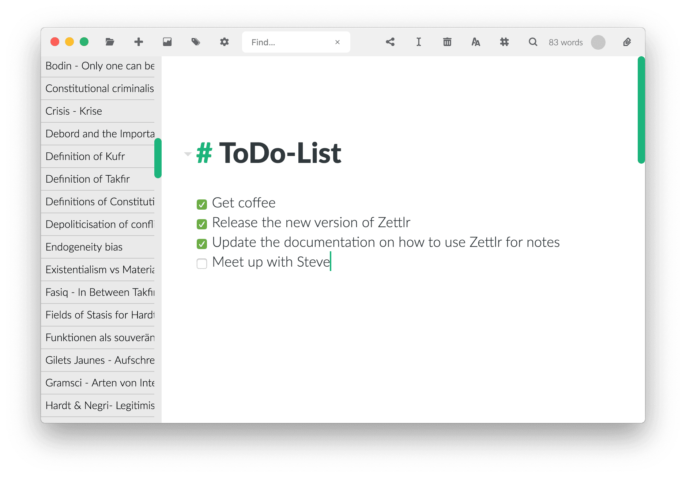

# Guida: Zettlr come sistema di appunti

Vuoi usare Zettlr per prenderci appunti. Anche se Zettlr ha molte più potenzialità, è comunque progettato come un programma snello e minimale, per cui è facile configurare Zettlr come programma per prendere appunti. Questa guida mostra quali impostazioni dovresti utilizzare e come concretamente scrivere appunti.

> Con questa guida, puoi impostare Zettlr per usarlo in sostituzione di altri programmi come OneNote, Evernote, o nvALT.

## Passo 1: Impostare Zettlr per un aspetto il più minimale possibile.

Prima di tutto, apri la finestra delle impostazioni (usa la combinazione di tasti `Cmd/Ctrl+,` oppure fai click sull'ingranaggio nella barra degli strumenti). Nelle impostazioni, sistema tutte le opzioni secondo questa lista:

- Pannello Generale
    - Snippets: Off
    - Barra laterale: Sottile
- Pannello Editor
    - Muta le righe: Off
- Pannello Correttore Ortografico
    - Dizionari: Deselezionali tutti (rallentano l'avvio del programma e non sono necessari per semplici appunti) 
Le altre impostazioni non sono necessarie per un programma per prendere appunti e possono pertanto essere ignorate.

## Passo 2: Creare una cartella per i tuoi appunti

Adesso devi creare una cartella per i tuoi appunti. L'ideale sarebbe di metterli in una cartella sincronizzata via cloud in modo da potervi accedere ovunque, non solo dal tuo attuale computer. Qualunque nome va bene per la tua cartella, ma "Appunti" può essere un semplice buon inizio. Se vuoi usare diverse categorie per i tuoi appunti, puoi creare ulteriori cartelle radice e lasciarle aperte. In questo modo, puoi denominare le tue categorie in base a ciò che ci metti dentro:

- Studenti: "Università", "Lezioni", "Private"
- Insegnanti: "Scuola"/"Università", "Corsi"
- Ricercatori: "Università", "Ricerche", "Il mio progetto di ricerca"
- Giornalisti: "Argomento 1", "Argomento 2", "Argomento 3", "Conferenze stampa"
- Scrittori: "Il mio romanzo", "Pensieri e idee", "Personaggi"
- Impiegato amministrativo: "Da Fare", "Riunioni"
- ecc. ...

Scegli le cartelle in base alle categorie di cui hai bisogno. Non dimenticare che potrai sempre ri-organizzarle e spostare i file se il tuo modo di lavorare dovesse cambiare. Il vantaggio di usare diverse cartelle _radice_ è che ogni cartella è indipendente dall'altra. Pertanto potrai tenere sempre nascosto l'albero delle cartelle e aprirlo solo se hai bisogno di cambiare "quaderno". 

**Alternativa**: invece di usare diverse cartelle radice, puoi anche usare un approccio per sottocartelle. In questo modo l'elenco delle cartelle non sembrerà un assortimento di categorie, o "quaderni", ma ricorderà di più una cartella vera e propria (sto parlando di come ti _sembrerà_, poiché la componente visiva è un aspetto importante per una scrittura efficiente). Ma il vantaggio di questo approccio è che non avrai più bisogno di riaprire la lista delle cartelle, ma piuttosto per cambiare "quaderno" basterà prima fare `ALT`- o `Ctrl`-clic sulla cartella/"quaderno" corrente e poi cliccare su un altro quaderno. A quel punto Zettlr userà quello come cartella corrente in cui poter raccogliere gli appunti.

## Passo 3: Pensa a un sistema per catalogare i tuoi appunti

Con il tempo, i tuoi quaderni diventeranno _sicuramente_ pieni zeppi di appunti. Ogni seminario, ogni riunione e ogni laboratorio contribuiranno al tuo quaderno. E se ti viene in mente improvvisamente un pensiero che vuoi scrivere prima di perderlo, sarà necessario un ulteriore appunto. Quindi come si può fare per non perdere l'ordine nel tuo sistema?

Zettlr offre diversi modi per ordinare, classificare e trovare i tuoi file. Se già conosci il nome del file che stai cercando, è facile ritrovarlo: basta iniziare a scrivere il nome del file nella barra di ricerca globale di Zettlr. Zettlr completerà automaticamente per te il nome del file. Richiamerà il primo file che contenga ciò che tu abbia già scritto, per cui continua a digitare finché Zettlr non abbia completato automaticamente il nome del file corretto. Dopodiché, premi `Invio` e si aprirà il file.

In generale, i nomi dei tuoi file dovrebbero seguire lo stesso sistema. Se per esempio la data e l'ora sono informazioni importanti (come per laboratori, congressi, o lezioni), è meglio usare le date in formato internazionale (AAAA-MM-GG, ad esempio 2018-10-22) come prima parte del nome dei tuoi file. In questo modo Zettlr ordinerà automaticamente i tuoi file secondo la modalità predefinita (2 è maggiore di 1 ecc.), ovvero mettendo in fondo i tuoi file più recenti. Per rimetterli in cima, basta cambiare l'ordinamento da A-Z a Z-A. In questa maniera è più facile ritrovare un appunto di qualche tempo fa, perché normalmente ci si ricorda grossomodo la data in cui è avvenuto un laboratorio o una riunione, e puoi scorrere la lista finché non lo trovi.

Se data e ora non importano, è necessario un altro approccio. Se conservi appunti per diversi concetti, o procedure, o come una sorta di manuale, potrebbe essere consigliabile usare le categorie come prima parte del nome del file. Per esempio, se prendi appunti su come funziona il  software nel tuo lavoro, potrebbe essere una buona idea ordinarli per procedure. A quel punto i nomi dei file somiglierebbero a questi:

- Comefare - Finanza - Excel
- Comefare - Finanza - Database aziendale
- Comefare - Riunioni - Puntatore
- Comefare - Riunioni - Teleconferenza

In questo modo puoi trovare facilmente quello che cerchi cercando prima i file che iniziano con "Comefare" e poi scorrere finché non trovi la procedura che ti interessa (Finanza, Riunioni, Linee guida per le email ecc.).

Puoi anche combinare modi diversi. Il senso è: ricordati sempre che Zettlr riordina secondo il nome dei file, quindi scegli i nomi dei tuoi file in modo da minimizzare il tempo che passi a ritrovarli.

## Passo 4: Scrivi!

Adesso che tutte le tue cartelle sono pronte e hai un'idea generale di come andrebbero nominati i file, puoi creare appunti usando semplicemente la combinazione di tasti `Cmd/Ctrl+N`. Scrivi il nome del tuo nuovo file (non devi aggiungere nessuna estensione) e premi `Invio` per creare il file. Verrà automaticamente aperto. Zettlr creerà sempre il file nel tuo quaderno selezionato in quel momento. Se vuoi spostare un file in un quaderno diverso, basta trascinarlo nel quaderno in cui vuoi spostarlo.

## Prossimo: Guida di Markdown

Adesso potrebbe interessarti come scrivere in maniera veloce ed efficiente con Zettlr. Vai al nostro [tutorial di Markdown](../reference/markdown-basics.md)!