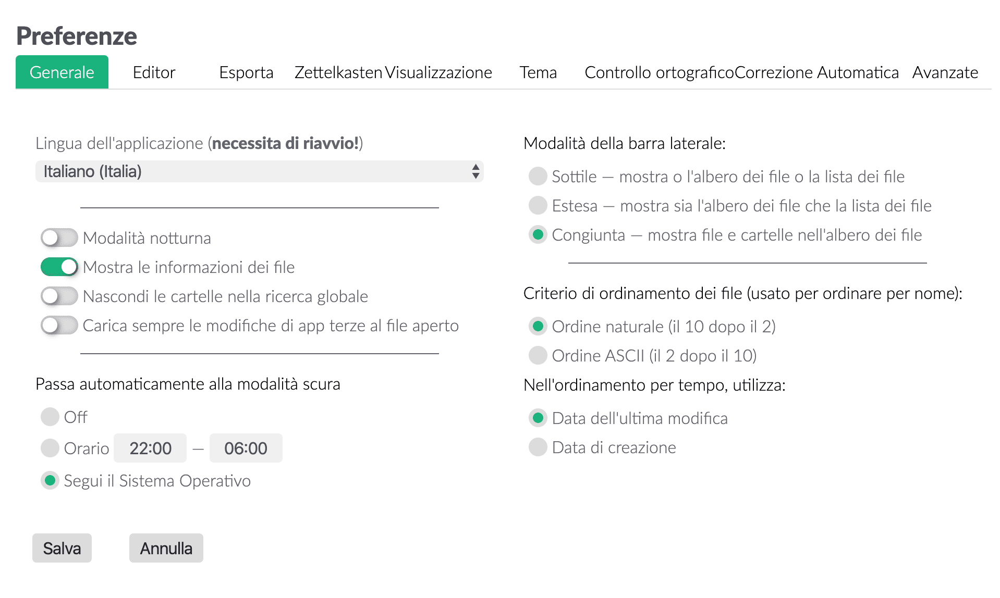
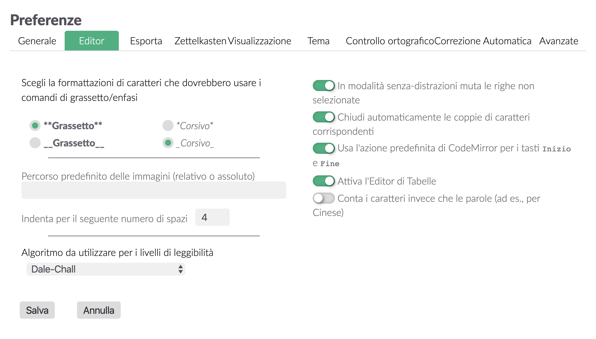
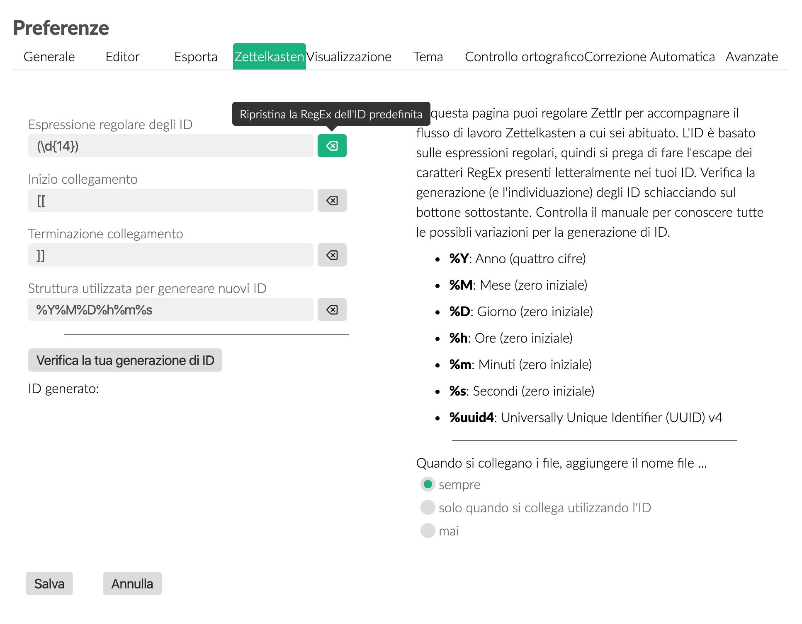
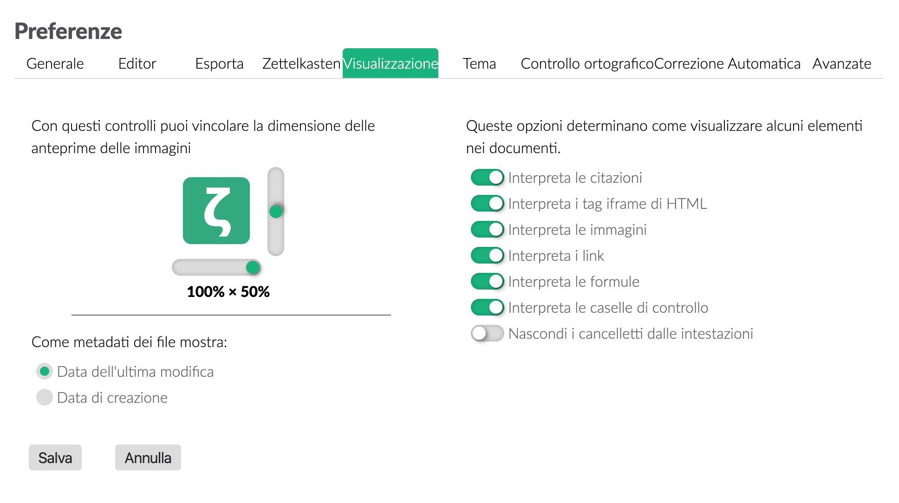
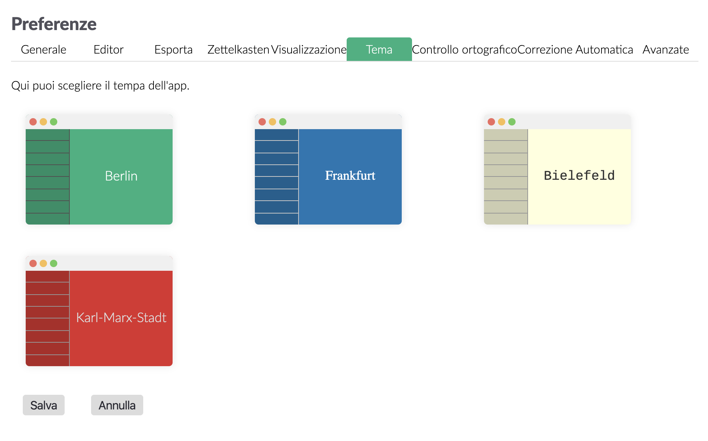
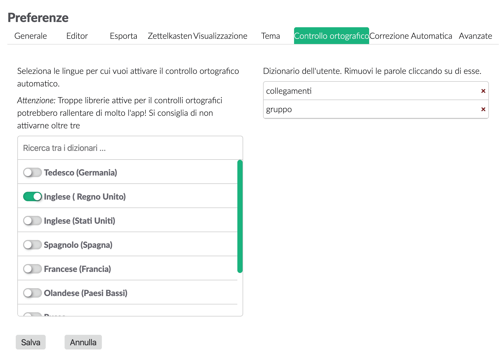
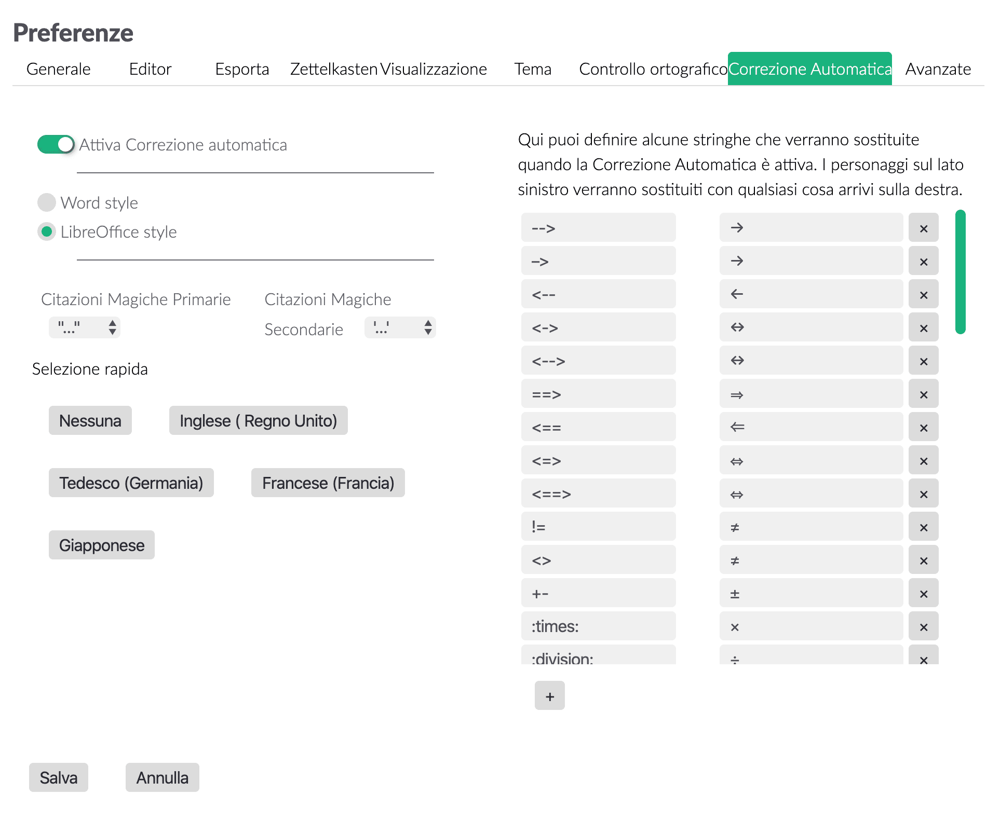
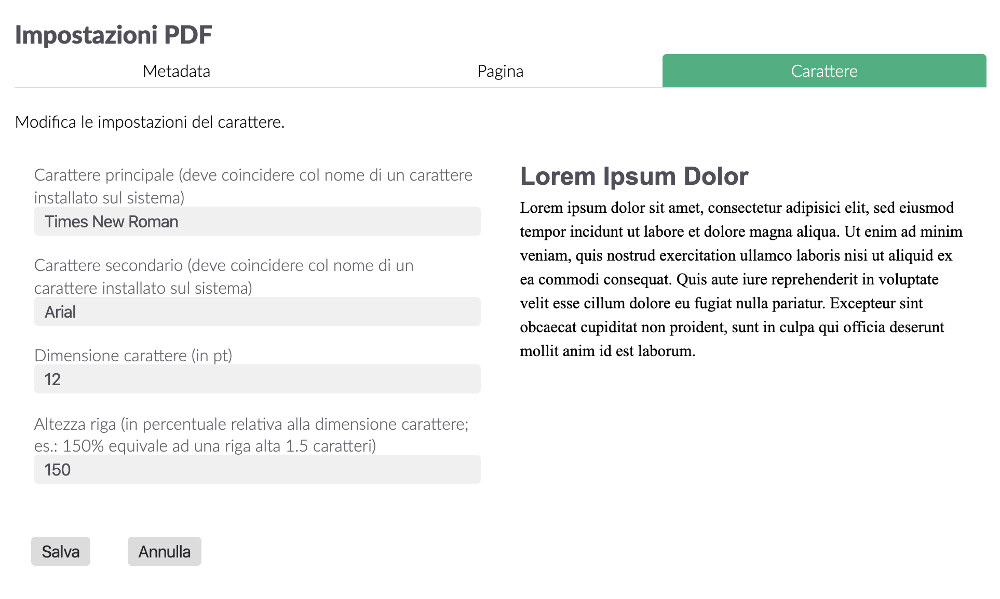

# Impostazioni

Zettlr ti offre una pletora di opzioni per personalizzare la tua esperienza con il programma. Comprende tre diverse finestre di impostazioni che saranno spiegate in dettaglio qui, in modo che tu sappia cosa fa ogni singola opzione.

## Preferenze generali

Puoi visualizzare la finestra delle preferenze generali o usando la scorciatoia `Cmd/Ctrl+,`, o cliccando sul pulsante sulla barra degli strumenti (l'ingranaggio), oppure la corrispondente voce di menu. Verrà visualizzata la finestra che ti presenterà tutte le opzioni di configurazione che puoi personalizzare. Sono ordinate in nove pannelli che puoi vedere in cima alla finestra.

* Generale: Queste opzioni hanno effetto su Zettlr per intero.
* Editor: Queste impostazioni riguardano solo l'editor stesso.
* Export: Cambia come i tuoi file vengono esportati da questo pannello.
* Zettelkasten: Adatta Zettlr per adeguarsi al tuo sistema Zettelkasten.
* Visualizzazione: Controlla come l'editor mostra alcuni elementi, come le immagini o i collegamenti.
* Tema: Seleziona qui il tema del programma.
* Controllo ortografico: Qui trovi sia i dizionari installati sia i tuoi dizionari utente.
* Correzione automatica: Scegli quali testi devono essere sostituiti e anche i segni di citazione che vorresti usare.
* Avanzate: Opzioni per utenti esperti.

### Generale

Nel pannello generale troverai le opzioni che potresti voler regolare se stai iniziando a usare Zettlr per le tue necessità. La casella della lingua dell'applicazione è piuttosto intuitiva.

Le caselle "Modalità notturna" e "Mostra le informazioni dei file" controllano il display. La "Modalità notturna" è solo il tema scuro di cui Zettlr è capace (e per il quale potresti voler usare invece la scorciatoia `Cmd/Ctrl+Alt+L`). Spunta la casella "Mostra le informazioni dei file" per mostrare le meta informazioni nell'elenco dei file (anche se anche questo comportamento lo puoi controllare con la sua scorciatoia `Cmd/Ctrl+Alt+S`).

Se spunti "Nascondi le cartelle nella ricerca globale", Zettlr non mostrerà le cartelle quando effettui una ricerca. Selezionando "Carica sempre le modifiche di app terze al file aperto", Zettlr non ti chiederà se vuoi o meno sovrascrivere il file nell'editor.

Le modalità della barra laterale regolano come ti viene visualizzata la barra laterale. Ci sono due opzioni:

* Sottile: In modalità sottile, la barra laterale mostra _o_ la lista dei file _o_ l'albero delle cartelle. Puoi passare da una all'altra usando la scorciatoia `Cmd/Ctrl+Shift+1`.
* Estesa: La modalità estesa mostra sia l'albero delle cartelle sia la lista dei file, affiancati. In questa modalità, hai sempre a disposizione entrambe le liste.
* Congiunta: Questa opzione fa assomigliare la barra laterale più a un browser dei file tradizionale, perché non separa cartelle e file.

Se vuoi nascondere del tutto la barra laterale, usa la modalità senza distrazioni (`Cmd/Ctrl+J`).

Il criterio di ordinamento determina come Zettlr ordinerà i file al suo interno. Si consiglia l'ordinamento naturale; l'ordine ASCII ignora alcune implicazioni del linguaggio naturale.

Infine, ma non per importanza, Zettlr può passare automaticamente alla modalità chiara oppure scura a seconda del tuo sistema operativo:

* **Off**: passa manualmente tra le due modalità
* **Orario**: Zettlr passerà alla modalità scura nell'intervallo di tempo impostato (formato h24)
* **Segui il Sistema Operativo**: Su macOS e su Windows, Zettlr può ascoltare gli eventi del sistema operativo segnalando alle applicazioni attualmente attive che la modalità generale è cambiata.

### Editor

Il pannello dell'editor controlla gran parte delle funzionalità dell'editor. Poiché Markdown permette sia gli asterischi che i trattini bassi per rendere il testo in grassetto o in corsivo, qui puoi scegliere cosa preferisci. Il **percorso predefinito delle immagini** è il percorso che puoi usare per dire a Zettlr dove deve salvare le immagini quando le copi dagli appunti. Può essere assoluto o relativo. Se inserisci `assets`, Zettlr di default metterà le immagini nella sottocartella `assets` della cartella dove si trova il tuo file. Puoi anche impostare di mettere le immagini in una cartella relativamente alla cartella padre, es. `../assets`. Ricordati che puoi sempre selezionare la cartella di destinazione delle immagini caso per caso.

L'indentazione si riferisce a quanti spazi vuoi che vengano inseriti quando, per esempio, passi a un sottolivello negli elenchi puntati.

L'algoritmo per i livelli di leggibilità che Zettlr dovrebbe usare quando abiliti questa modalità. Per una breve spiegazione dei diversi algoritmi disponibili, consulta la [nostra guida ai livelli di leggibilità](https://www.zettlr.com/readability). 

Inoltre, puoi **attenuare le righe non selezionate** quando sei in modalità senza distrazioni. Ciò significa che Zettlr attenua tutte le righe eccetto quella dove si trova il cursore. L'opzione successiva ti consente di **chiudere automaticamente alcune coppie di caratteri**.

La terza opzione riguarda solo gli utenti che usano una tastiera con i tasti `Inizio` e `Fine`. Quando li usi, il comportamento predefinito di CodeMirror è di spostare il cursore rispettivamente all'inizio o alla fine di un intero paragrafo (cioé: all'inizio o alla fine di una riga _logica_). Se vuoi che CodeMirror si sposti solo all'inizio o alla fine di una riga _visibile_, ricordati di disattivare questa opzione. Se usi  la funzionalità di hard wrap di Markdown, e inserisci un "a capo" alla fine di ogni paragrafo, questa impostazione non avrà effetto. 

### Esporta

Il pannello Esporta ti permette di modificare le preferenze riguardo a come vengono esportati i tuoi file. A sinistra hai delle opzioni che riguardano le funzionalità di Zettelkasten.

Selezionare "Rimuovi gli ID ZKN dai file" fa togliere a Zettlr tutti gli identificativi che trova nei tuoi file prima di esportare. "RImuovi i tag dai file" fa lo stesso con i tag.

> TI raccomandiamo di lasciare disattivata l'opzione di rimuovere gli ID ZKN dai tuoi file, a meno che tu sappia cosa tu stia facendo. Alcuni siti web producono link che contengono 14 cifre consecutive, e Zettlr passerà su tutti i file rimuovendo ogni cosa che venga trovata dalla tua espressione regolare, e potrebbe quindi rompere i link!

Sotto queste opzioni puoi scegliere cosa fare con i collegamenti interni (di default racchiusi tra `[[` e `]]`). La prima opzione li rimuove completamente, la seconda rimuove solo la formattazione del collegamento, mentre l'ultima opzione li lascia stare come sono.

A destra trovi opzioni più generali per l'esportazione. Puoi scegliere di esportare i tuoi file nella cartella temporanea. Questo è il comportamento raccomandato, perché ti consente di non modificare i tuoi file, e saranno cancellati automaticamente.
La seconda opzione salva i file esportati nella cartella corrente, sovrascrivendo file esistenti senza chiederti niente prima. Usa questa opzione se hai bisogno che i file esportati vengano visualizzati nel pannello degli allegati.

Il campo CSL del database JSON può essere usato per aprire un database di letteratura. Zettlr leggerà il file e attiverà l'interpretazione delle citazioni nei tuoi file. Lo stile CSL ti consente di sovrascrivere lo stile di citazione predefinito (APA). Puoi usare qualunque file presente nel [repository degli stili di Zotero](https://www.zotero.org/styles).

> Le opzioni di citazione possono essere sovrascritte per ogni singolo progetto nelle rispettive impostazioni di progetto

### Zettelkasten

In questo pannello puoi personalizzare come Zettlr si comporta con il tuo sistema Zettelkasten. Nella gran parte dei casi non avrai bisogno di modificare queste opzioni, a meno che tu non voglia usare un sistema personalizzato.

Hai quattro opzioni importanti per le Zettelkasten: l'espressione regolare degli ID, l'inizio e la fine collegamento, e la struttura di generazione degli ID.

#### L'ID RegEx

Zettlr usa al suo interno delle espressioni regolari per setacciare l'ID di un file. Cerca uno schema, e se trova una stringa che corrisponde a questo schema, lo considera l'ID di un file. **Ti preghiamo di notare che l'ID di un file sarà sempre quello trovato all'inizio, mai quello alla fine!** Questo significa che se tu decidessi di usare solo quattro cifre come ID, l'espressione regolare riconoscerebbe anche gli anni nei tuoi file. Poiché Zettlr prende il primo ID e basta, ricordati che la primissima cosa nel tuo file sia l'ID di quel file.

L'espressione regolare predefinita (che puoi ripristinare cliccando sul tasto reset a fianco della casella di testo) è `(\d{14})`. Ciò significa che Zettlr cercherà 14 cifre consecutive - esattamente quante ne ottieni se combini un anno, un mese, un giorno, un'ora, dei minuti, e dei secondi; ad esempio: 20181012143724. É estremamente improbabile che un file contenga una seconda stringa che comprenda quattordici (!) cifre, quindi questo è un ottimo sistema di ID. Un altro grande vantaggio è che l'ID è unico per ogni secondo. Quindi ogni secondo puoi creare un ID nuovo e completamente unico. 

Le parentesi graffe intorno a `\d{14}` creano un cosiddetto "gruppo di cattura". Lo scopo di un gruppo di cattura è che l'espressione regolare non solo corrisponda a una certa stringa, ma che inoltre ne estraggano una parte — in questo caso, la corrispondenza intera. In questo modo puoi usare quasi qualsiasi struttura di ID che vuoi

> Nota che puoi omettere le parentesi graffe del gruppo di cattura. Zettlr incapsulerà internamente la tua RegEx, se non trova un gruppo di cattura.

#### I collegamenti interni

I collegamenti interni si spiegano piuttosto velocemente: devi solo scegliere come vuoi scrivere i collegamenti interni. I collegamenti stile Wiki [[il-tuo-collegamento]] sono quelli predefiniti. Potresti usare anche doppie parentesi graffe: {{il-tuo-collegamento}}. O anche punti esclamativi: !il-tuo-collegamento!. Come preferisci!

I collegamenti interni si usano per due cose: la prima è che, se contengono o un nome file o un ID esistente, cliccarci sopra aprirà il file corrispondente (identificato o dal suo nome senza estensione file, o dal suo ID). La seconda è che, se non contengono niente di cui sopra, non apriranno alcun file ma funzioneranno come funzione di ricerca, per cui cliccarci sopra tenendo premuto `ALT` avvierà una ricerca — questo è ottimo per salvare ricerche che fai spesso!

> Nota che i file non assumeranno nessun collegamento come ID. Se un file trova un ID che è formattato come un collegamento interno, non userà quell'ID.

#### Il generatore di ID

L'ultimo campo nel pannello Zettelkasten nella finestra delle preferenze riguarda il modo in cui vengono generati gli ID. É una semplice stringa che può contenere variabili da sostituire quando viene generato un ID. Attualmente, hai a disposizione l'anno corrente, il mese, il giorno, l'ora, i minuti e i secondi. Lo schema predefinito di generazione degli ID è: `%Y%M%D%h%m%s`, che significa che `%Y` verrà sostituito dall'anno corrente (4 cifre), `%M` dal mese corrente (con gli zeri), e così via. Puoi anche aggiungere delle componenti statiche nei tuoi ID, se preferisci. Per esempio con uno schema ID impostato in `%Y-%M-%D_%h:%m:%s` Zettlr genererà un ID come questo: `2018-10-12_12:03:56`. Puoi anche riusare le variabili nel tuo schema, ad es. usare solo i secondi come tuo ID. Potresti usare una cosa tipo `%s%s%s` e ottenere `565656`.

Ricordati sempre di adeguare la tua espressione regolare in modo che corrisponda a ciò che produce il generatore di ID. Per identificare lo schema `%Y-%M-%D_%h:%m:%s`, Zettlr avrà bisogno della seguente espressione regolare: `(\d{4}-\d{2}-\d{2}_\d{2}:\d{2}:\d{2})`. Se usi `%uuid4` puoi usare la seguente RegEx: `[a-fA-F0-9]{8}-[a-fA-F0-9]{4}-4[a-fA-F0-9]{3}-[89aAbB][a-fA-F0-9]{3}-[a-fA-F0-9]{12}`.

Puoi provare sia la generazione degli ID sia il loro rilevamento cliccando sul tasto Verifica la tua generazione di ID sotto le caselle di testo. Zettlr genererà un ID e proverà immediatamente a cercarlo usando la tua espressione regolare personalizzata. Verrà indicato se ci è riuscito.

### Visualizzazione

Questo pannello controlla come alcuni elementi vengono visualizzati nell'editor. Zettlr usa un approccio a Markdown di "semi-anteprima" e interpreterà soltanto alcuni elementi. In questo pannello puoi controllare quali elementi verranno interpretati. 

> l'opzione interpreta i tag iframe di HTML abilita/disabilita l'interpretazione degli iFrames (per esempio, i video di YouTube sono embedded iFrames)

In più puoi limitare le dimensioni delle immagini, che è particolarmente utile quando usi molte immagini orientate verticalmente. La barra di scorrimento orizzontale controlla la larghezza massima che le immagini possono occupare. Impostandolo al 50%, per esempio, manterrà la larghezza delle immagini entro la metà della larghezza del testo. Impostandolo al 100% disattiverà questa funzione (la larghezza delle immagini non supererà mai il 100% della larghezza del testo).

La barra di scorrimento verticale controlla l'altezza massima delle immagini relativamente alle dimensioni della finestra. 50 percento significa che l'altezza delle immagini non supererà mai la metà della dimensione totale della finestra. 100 percento disabilita questo comportamento. A differenza della larghezza, le immagini possono superare anche di molto il 100 percento della visualizzazione in finestra, quando sono grandi e sottili.

Infine puoi scegliere quale data viene visualizzata nelle informazioni dei file nella lista dei file. Questo non influenza l'ordinamento, se ti piace ordinare per data. Per cambiare la data rispetto alla quale Zettlr ordina i tuoi file, consulta il pannello generale. 

### Tema

Questo pannello dovrebbe risultare intuitivo: clicca su una delle anteprime per far passare il programma su quel tema.

### Controllo ortografico

Con l'introduzione dei dizionari utente, il controllo ortografico è stato spostato nel suo pannello dedicato. L'elenco a sinistra contiene tutti i dizionari disponibili che possono essere usati per il correttore ortografico. Seleziona quelli che vuoi usare. Puoi usare dizionari multipli per controllare testi bilingue. Filtra la lista usando la casella di ricerca in cima all'elenco.

> **Consiglio**: per disabilitare il correttore ortografico, disattiva tutti i dizionari. Per installare dizionari aggiuntivi, consulta il [manuale di localizzazione](../core/localisation.md).

Infine, l'elenco a destra nel pannello mostra tutte le parole che hai aggiunto al tuo dizionario personalizzato. Cliccaci sopra per rimuoverle.

### Correzione automatica

Questo pannello controlla la funzione di correzione automatica che puoi usare dalla versione 1.5 in poi e che forse conosci già da LibreOffice o Word. Puoi scegliere di disattivarla completamente o scegliere lo stile che preferisci. La principale differenza tra i due stili è che Word è molto più rapido nella correzione; correggerà non appena digiti l'ultimo carattere, mentre LibreOffice corregge solo quando digiti Spazio o Invio. LibreOffice è meno fastidioso, ma se sei perfettamente a tuo agio con Word, potrai preferire questo stile.

Le "Citazioni Magiche" vogliono dire proprio questo: le citazioni primarie e secondarie che vorresti usare al posto delle citazioni ASCII generiche (`"` e `'`). Abbiamo incluso molte coppie di virgolette usate in tutto il mondo. Se vuoi disattivare questa funzione, scegli la **prima** opzione (le citazioni ASCII), in entrambi i menu a cascata.

L'ultima cosa che puoi modificare è la tabella delle sostituzioni a destra: questi sono semplici caratteri che vorresti sostituire con altri. Abbiamo incluso un abbondante elenco con i simboli più comunemente utilizzati, per cui sentiti libero di dare un'occhiata e anche di aggiungerne o rimuoverne altri!  

### Avanzate

Il pannello avanzate contiene opzioni utili per utenti esperti.

La "struttura dei nomi per i nuovi file" è ciò che verrà usato quando crei un nuovo file. Sarà preriempito con tutto ciò che scrivi qui. Puoi usare le variabili indicate sotto (l'ID segue lo schema che hai selezionato nel pannello Zettelkasten, anno, mese, giorno, ora, minuti, secondi). Se selezioni questa casella, Zettlr non ti chiederà un nome file quando crei un nuovo file, il che potrebbe velocizzare il tuo flusso di lavoro.

Le **caselle di testo pandoc e xelatex** sono usate nel caso Zettlr non riesca a localizzare uno di questi due programmi. Come sai, Zettlr usa entrambi per esportare i tuoi file. Raramente può succedere che Zettlr non riesca a trovarli, anche se li hai installati correttamente. In tal caso, basta digitare in queste caselle di testo il **percorso assoluto completo** per entrambi i programmi per aiutare Zettlr a trovarli.

L'opzione **attiva la modalità debug** è usata se vuoi o meno "ricaricare" l'interfaccia utente grafica (GUI) premendo `F5` e visualizzare così gli strumenti sviluppatore di Chrome per capire cosa stia facendo il programma. Ovviamente, vorrai usarla se sei uno sviluppatore.

Puoi anche aiutare Zettlr **sottoscrivendo i rilasci beta**. Quando attivi questa opzione, Zettlr ti avviserà quando sono disponibili nuovi rilasci. Potrai quindi decidere se vuoi usare o no la versione beta. Attiva il **supporto ai file Rmarkdown** per attivare il rilevamento dei file `.rmd` usati per R-Markdown. Di default è inattiva, poiché altri programmi (quelli di Adobe, per esempio) usano anch'essi questa estensione per salvare dati binari, il che creerebbe problemi.

L'area di testo a destra controlla quali file saranno visualizzati nel pannello degli **allegati**. È solo una lista separata da virgole di tutte le estensioni file che vuoi avere a disposizione. L'elenco iniziale dovrebbe già contenere gran parte delle estensioni che possono servirti.

Il **comando di Pandoc** ti dà il controllo totale sul motore di esportazione. Il comando in questa casella sarà quello eseguito all'esportazione. Hai a disposizione alcune variabili per personalizzare la tua esportazione:

- `$infile$`: L'intero percorso assoluto del file che sarà esportato.
- `$outfile$`: L'intero percorso assoluto del file risultante (compresa l'estensione).
- `$citeproc$`: Contiene direttive per il motore `pandoc-citeproc`.
- `$format$`: Contiene il formato (es `html` o `docx`).
- `$outflag$`: Il flag di formattazione per pandoc (es. `-t docx`).
- `$standalone$`: Sarà `-s` nel caso il file debba essere esportato singolarmente.
- `$toc$`: Se sarà generato o meno un sommario.
- `$tocdepth$`: Un flag che indica fino a che livello debba essere generato il sommario.
- `$tpl$`: Un template directive per pandoc.

> **Attenzione**: Molte di queste variabili sono create su misura per le necessità di pandoc. Certo, puoi anche cambiare completamente il programma sostituendo `pandoc` con il nome del motore di esportazione che desideri, ma ti preghiamo di ricordare che dovrà comunque riuscire a scomporre i flag di pandoc.

## Preferenze PDF

Abbiamo spostato le Preferenze PDF in un'altra finestra perché ce ne sono molte che puoi usare. Queste opzioni controllano il motore LaTeX che interpreterà i tuoi file quando esporti in PDF. Non hanno alcun effetto su tutti gli altri formati di esportazione. Puoi richiamare questa finestra con la scorciatoia `Cmd/Ctrl+Alt+,` oppure usando la rispettiva voce di menu. Anche le impostazioni PDF sono divise in pannelli. Al momento ce ne sono tre

* Metadata: Controlla i campi di metadata dei file PDF.
* Pagina: Regola il layout delle pagine.
* Carattere: Tutte le opzioni che riguardano i caratteri nelle tue esportazioni.

### Metadata

Queste informazioni possono essere mostrate dai lettori PDF usando una voce dedicata dei menu. Normalmente sono nascosti, ma possono essere usati in alcune circostanze. L'unica davvero interessante dovrebbe essere il campo dell'Autore, che è preriempito con l'informazione "Generated by Zettlr". Puoi cambiarlo con il tuo nome (o il nome della tua compagnia). Le parole chiave e il campo "argomento" sono usati di rado.

### Pagina

In questo pannello puoi controllare il layout della pagina. Queste opzioni funzionano esattamente come ti aspetteresti che funzionino in finestre simili usate in LibreOffice o Microsoft Office. Puoi cambiare il formato della carta, regolare i margini attorno al contenuto e dire a Zettlr di usare o meno i numeri di pagina (e quale sistema di numerazione vuoi usare).

### Carattere

Qui puoi controllare come vengono visualizzati i caratteri. Il carattere principale è quello usato per tutto il testo. Il motore LaTeX lo prenderà direttamente, per cui il nome che digiti qui deve essere esattamente lo stesso di un carattere installato sul tuo computer. **Se il motore LaTeX non riesce a trovare il carattere, darà errore. Per sapere se hai fatto un errore che riguarda i caratteri oppure no, basta cercare nel messaggio di errore il nome del carattere che hai digitato qui. Se appare il tuo nome carattere, è altamente probabile che il carattere abbia un nome diverso. Controlla per favore il nome del carattere nelle impostazioni del tuo sistema operativo.**

La dimensione del carattere dovrebbe essere piuttosto ovvia. L'altezza riga specifica l'interlinea (riguarda soltanto i paragrafi). Per esempio un'altezza riga del 150 percento creerebbe uno spazio di una riga e mezzo tra le linee (ogni riga è seguita da uno spazio che è il 50 percento dell'altezza di una riga normale prima della riga successiva).

## Gestione dei Tags

La finestra dei tags non ha una scorciatoia dedicata, per cui dovrai richiamarla usando la rispettiva voce di menu. Qui puoi assegnare colore e descrizione ai tags.

Per aggiungere una nuova coppia tag-colore, clicca sul pulsante `+` in fondo alla finestra. Nel primo campo, scrivi il tuo tag senza il cancelletto (es. se vuoi assegnare un colore all'hashtag `#todo`, scrivi semplicemente `todo`). Poi, scegli il colore da associare al tag. Se clicchi la seconda barra a lato del nome del tag, dovrebbe aprirsi un selettore di colori per farti scegliere il colore. Nel terzo campo, puoi scrivere una descrizione breve del tag. La descrizione sarà mostrata se passi il cursore sopra il tag nella lista dei file. 

Se vuoi rimuovere un'associazione tag-colore, basta cliccare sul pulsante `-` alla fine della tag-line.
