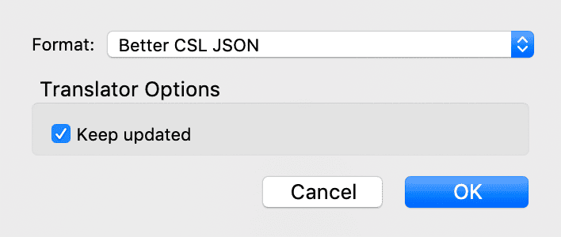

# Zettlrにおける引用

Zettlrの引用機能は`citeproc-js`を使用しています。これは、Pandocのciteproc-engineやZoteroと同じように機能するライブラリです。つまり、ZoteroのワードプラグインやLibreOfficeプラグインが生成するのと同等のものがZettlrに表示されます。Zettlrの引用エンジンは3つの部品からなっています。一つは、引用されるすべての項目を含んだCSL JSONもしくはBibTexライブラリ、そしてZettlrのデフォルト引用スタイル([Chicago Manual of Style, 17th edition](http://www.chicagomanualofstyle.org/tools_citationguide.html))を置き換えるCSLスタイルシート、最後に、プレビューエンジンです。以下のガイドでは引用を使えるようにし、正しく一貫性のある引用を含んだ、美しい見た目のファイル(PDFに限りません)を生成できるように解説します。

## Zettlrの引用機能を有効化する

引用には2つのエンジンがあり、それぞれ異なる引用の体系に属しています。プレビュー(引用は画像として、もしくはリンクとしてプレビュー可能です)と、実際の引用を生成するプロセス(これはエクスポート時のみ実行されます)です。いずれの機能も、参照先を含んだ引用ライブラリを選択することで実行されます。このようなライブラリがなくても、Zettlrでは引用のプレビューは行えます(何がPandocのciteprocのトリガーとなるかを確認することができます)。しかし、引用の中身が実際に生成されて置換されることはありません。また、ライブラリを指定しないと、Pandocのciteprocエンジンが実行されず、引用の解析が行われなくなります。

そこで、まず最初のステップとしてファイルを作成します。ライブラリを管理するアプリケーションはZoteroを推奨します。以下のチュートリアルではZoteroを使うものとして説明します。その他のプログラムを使用する場合は、そのアプリケーションでCSL JSON形式でエクスポートする方法を確認してください。

> Mendeley、Citavi、その他のCSL JSON形式で出力する機能を持たない管理ソフトウェアを使用する場合は、BibTexファイルを使用することができます。BibTexファイルはCSL JSONファイルと同じように使えます。

### ステップ1: BetterBibTexをインストールする

最初のステップは[ZoteroのBetterBibTexプラグイン](https://github.com/retorquere/zotero-better-bibtex/releases/latest)のインストールです。このプラグインの主な利点は、ライブラリ全体で引用IDを一意にしてくれることです。各引用項目には、それぞれ一意のIDが振られます。これは、例えば発行日が間違って保存されていたことに気づいた時に、Zoteroで修正するだけで、その後citeprocが正しい情報を使用できるようにするために必要です。BetterBibTexを使わない場合、同じIDが複数回発行される可能性があります。この場合、エラーを発生させるか(これは何か悪いことが起きていると分かるので良い方法です)、もしくは最初にIDに一致したものを採用します(これはエクスポート後に間違った引用を発見できるかどうか運任せになってしまうので悪い方法です)。

BetterBibTexをインストールしたら、IDの生成方法などの設定項目を触ってみても良いでしょう。

> **ヒント**: BetterBibTexが一意なIDを自動生成するアルゴリズムはカスタマイズすることができます。ほとんどの場合、良く知られた[JabRefパターン](http://help.jabref.org/en/BibtexKeyPatterns)が使われますが、このパターンに大きな拡張が加えられています。同じキーを生成する複数のエントリーがある場合、それぞれが一意となるように接尾辞が追加されます(例えば、`Harvey2005a`, `Harvey2005b`, `Harvey2005c`のようなIDが得られます。)[BetterBibTexの全機能についてはプラグインのドキュメンテーション](https://retorque.re/zotero-better-bibtex/citation-keys/)に書かれています。

### ステップ2: ライブラリをエクスポートする

次のステップでは実際にライブラリをエクスポートします。Zoteroの役割は引用先の管理を行うことであり、引用を作成するのはciteprocの役割です。そして、citeprocを使うには別のファイルが必要となります。

ZettlrとPandocのciteprocで使えるライブラリファイルをエクスポートするには、まず左側のサイドバーでエクスポートしたいコレクションを選択します。ライブラリ全体を選択することもでき、そうすれば、すべての項目が自由に使えて複数のライブラリを作る必要もありません。(参考までに：700項目を含むライブラリで確認しましたが、パフォーマンス上の問題はありませんでした。)



次に、`File`をクリックし`Export library...`を選択します。フォーマットとして`Better CSL JSON`を選択します。(BetterBibTexをインストールしない場合は、ここで`CSL JSON`を選択してもかまいません。)"Keep updated"というチェックボックスをオンにすると、BetterBibTexはZoteroで変更があるたびに自動的にファイルのエクスポートを行い、Zoteroと同期を行います。(そうすれば、変更点が自動的にZettlrに連携され、常に正しい引用を行うことができるようになります。)

そのチェックボックスをオンにした場合、Zoteroの設定画面の`BetterBibTex`タブで`Automatic Export`を選択すると、ライブラリファイルの状態を確認することができます。また、エクスポートの内容とタイミングの細かい設定を行うこともできます。

### ステップ3: ライブラリをZettlrで開く

ここで、Zettlrにライブラリをインポートします。そのためには、Zettlrの設定ダイアログで`エクスポート`タブを選択し、`参考文献データベース`入力欄の右側にある小さなフォルダアイコンをクリックします。データベースファイルを選択するためのダイアログが表示されます。ファイルを選択し、設定を保存すると、自動的にデータベースが読み込まれます。これで、引用を行う準備ができました。


### ステップ4: *参考文献を表示*を有効化する

引用機能を実際にエディタで利用するためには、設定の「表示」タブにある「参考文献を表示」を有効化する必要があります。この設定を一旦有効化すれば、通常はZettlrがアップデートしても有効化されたままとなります。

## Zettlrにおける引用

Zettlrで引用を使用する方法は簡単です。ZettlrではPandocのciteproc-syntaxをサポートして、引用を書く方法は2種類あります。一つ目は文章中に識別子を一つ置き、このキーに対応した引用を出力する方法です。この場合、`@Harvey2005a`のような形式になります。引用キーの前には必ず`@`が付きます。

> Zettlrには補完機能があるので、`@`を入力すると利用可能な引用キーを表示してくれます。これで、正しいIDを使用できているか最初に確認することができます。何も補完候補が表示されない場合は、そのIDはおそらくライブラリファイル中に存在しません。

しかし通常は引用に対して、ページ範囲などを加えていくらか限定した形にしたいと思います。そのためには、角括弧を使った拡張形式を使用します。この方法では、角括弧の中にプレフィックス、引用キー、ページ範囲を書きます。

`[See @Harvey2005a, 45-51]`

著者が複数の場合、それぞれのブロックをセミコロンで区切ります。

`[See @Harvey2005a, 45-51; also @Ciepley2007, 8-9]`

Pandocのciteprocエンジンにおける引用についての詳しい説明は、[ガイドを参照](http://pandoc.org/demo/example19/Extension-citations.html)してください。

> **注意** Zettlrのciteprocエンジンは、**プレビューのみを目的としています**。簡潔さのため、Zettlrはすべての引用を完全に解析することはせず、正確性をいくらか犠牲にしています。エクスポート時にPandocのciteprocが完全に正確に動作することは、疑う余地もありませんが、引用のプレビューについては、**引用が正しく認識されていて、エクスポートする引用に漏れがないかを確認すること**にとどめてください。

## 参考文献を確認する

引用を作成し終わって、引用するつもりのものがすべて入っているかどうかをするには、`添付ファイルサイドバー`(`Ctrl/Cmd+3`のショートカット)を開きます。選択中ディレクトリにあるファイル一覧の下に、ファイル中に見つかったすべての参考文献の一覧が表示されます。ここで足りていないものがある場合は、おそらくファイル中で引用していないはずです。


## 引用のスタイルを変更する

Zettlrは内部的には常にChicagoスタイルを使って引用を作成します。つまり、プレビューで表示される引用は、脚注スタイルではなく文書中に表示されるスタイルとなります。Zettlrでは、すべてが正しく動作していることを確認しやすくするために、このようにしています。

しかし、もちろんこれ以外にも、投稿先のジャーナルの要求や、個人的な好みに合わせた引用スタイルを使うこともできます。Pandocのciteprocが引用を出力するスタイルを変更するには、それに応じたCSLファイルをダウンロードする必要があります。まずは、[Zotero style repository](https://www.zotero.org/styles)を見てみてください。特定のスタイルを検索し、プレビューしダウンロードすることができます。

Zettlrが使用するCSLファイルの設定は2か所あります。一つは、設定ダイアログです。`エクスポート`タブの参考文献データベース欄の下に、使いたいCSLスタイルを選択する設定があります。ツールバーのボタンからファイルを個別にエクスポートする際に、ここで選択したスタイルが使用されます。

しかし当然プロジェクトごとに異なるCSLスタイルを使いたいと思います。そこで、それぞれのプロジェクトの設定でもCSLファイルを選択することができます。そのプロジェクト内では設定したスタイルでエクスポートを行うようになります。

## 参考文献一覧のフォーマット

もちろん、ファイル中に引用を書いたら、きちんとフォーマットされた参考文献一覧も必要だと思います。WordまたはLibreOfficeにエクスポートする場合は、ファイルを送る前にそれぞれのファイルを編集してスタイルを設定することができます。しかし、PDFにエクスポートしてしまうと、それも不可能です。`pandoc-citeproc`では、単に参考文献をまとめて、何の書式も設定しないで文書の最後に出力します。参考文献一覧の見た目をよくするには、ちょっとしたトリックが必要となります。

LaTeXでは長さを基準にして、エクスポートするPDF全体にわたる位置を決定しています。普通、この長さの設定はグローバルなものですが、ソースファイルによって変更できます。設定項目の一つに`parindent`があり、これは段落のぶらさがりインデントをコントロールします。見出しに続く段落では長さが追加されますが、それはここでは考えないことにします。

`parindent`変数はZettlrのPDF設定で変更することができます。しかしそれでは、すべての段落に対するグローバルな設定となってしまいます。参考文献も普通の段落のスタイルでフォーマットされるので、インデントも他の段落と同じようになってしまいます。しかし、参考文献の見た目を良くするちょっとしたトリックがあります。文書の後に`## References`(他の名前でも構いません)の見出しを書き、その後で段落の長さを上書きしてしまいましょう。

見た目が良くなるように再設定するだけです。たとえば次のコードスニペットのようにします。

```latex
\setlength{\parindent}{-1cm} % Negative hanging indent
\setlength{\leftskip}{0.5cm} % Overall indentation
\setlength{\parskip}{0.1cm} % Spacing between paragraphs
```

上の例だと、参考文献は負のインデント(-1cm)で出力されます。加えて、0.5cmの全体のインデントが適用されます(ページ余白からの相対値なので、左余白を3cmに設定したなら、普通の段落のオフセットが3.0cmに対して参考文献の段落は3.5cmのオフセットとなります)。最後の値(`parskip`)は段落間の間隔をコントロールします。つまり、各項目の間が0.1cm空くことになります。

この設定から始めて、他の長さの設定も検索して、好みに合うように調整してみてください。

## YAML frontmatterによってPandoc Citeprocを制御する

Pandoc Citeprocのいくつかの機能は、YAML frontmatterの変数を使って制御できます。[説明のページ](../core/yaml-frontmatter.md)に、参考文献一覧の言語を変更する方法などが書かれています。
