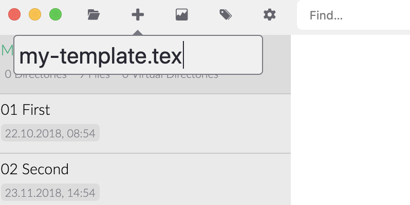

# カスタムテンプレート

[カスタムCSS](../core/custom-css.md)は、Zettlrの見た目をカスタマイズするには良いのですが、出力された論文を思いのままにするものではありません。文書を書いたなら見た目も内容と同じくらい重要です。アイディア自体がとても価値のあるものであっても、読みたいと思わせるような優れたデザインとタイポグラフィが無くては、あなたのアイディアにとっての損失です。

好みのフォント、行間のスペース、もしかすると色も使いたいかもしれません。[PDF設定](../reference/settings.md)では、いくつかの一般的な設定をプロジェクト単位や単一のファイルのエクスポートに対して行うことができますが、LaTeXの組版機能のすべてを利用できるわけではありません。そして、なんということでしょう、[非常に良い例がここにあります](https://tex.stackexchange.com/questions/1319/showcase-of-beautiful-typography-done-in-tex-friends)。

幸いにもZettlrでは、pandocやLaTeXなどのツールを自由に使えるようにするだけでなく、より良く使えるようにすることを、基本方針の一つとしています。このページを読めば、カスタムLaTeXテンプレートを素早く使い始めることができ、あなたの作る最終成果物が素晴らしい見た目になります。

## 事前の考慮事項

カスタムLaTeXテンプレートを書き始める前に、エクスポート時に何が起きるかについて説明します。Zettlrのエクスポートエンジンは、文書をpandocに受け渡す最終ステップの前に様々なタスクを実行する強力なソフトウェア部品です。Zettlrが文書に対して実行する処理について知っておけば、特に複雑なテンプレートを使用するようになったときに、一貫した出力を得ることと、ちょっとした問題を防止するのに役に立ちます。この章では、Zettlrがpandocに受け渡す前にプロジェクトとファイルエクスポートに対して行うすべてのステップについて説明します。


### 1. すべての入力ファイルを結合する（プロジェクトの場合のみ）

プロジェクトをエクスポートする場合、Zettlrは最初にすべてのファイルをファイルリストで表示されている順で結合し、単一の一時ファイルを出力します。そのために、ファイルリストと同じ方法で(順序を保って)プロジェクトディレクトリを走査し、ファイルを読み込みます。このステップでは**Markdownソースに対して2つの操作が行われます**。

1. すべての画像のパスを絶対パスに置き換えます。これは、セキュリティのためです。LaTeXは画像が絶対パスでない場合にエクスポートに失敗することがあります。(LaTeXのCWDがMarkdowファイルと異なるため。)これにより、LaTeXのことを気にせずに、好きな場所で相対パスを使用することができます。
2. すべての脚注を一意にします。章ごとに脚注番号は1から始まります。そうすると多くの場合、脚注番号が重複しエクスポートが失敗したり、最悪、重複したものの内一つが使われて、残りは無視されてしまいます。Zettlrではファイルの内部ハッシュ値を加えて脚注番号を一意にします。例えば、`[^1]`が、`[^1934976181]`のようになります。このようにして、すべての脚注が一意になるようにします。

その後、結果ファイルを一時フォルダに出力してエクスポート処理を起動します。ここでステップ2に移ります。

### 2. ソースファイルを読み込む

次にZettlrは、ソースファイルを読み込みます。対象となるのは、`共有`機能によってエクスポートされたファイル、またはプロジェクトから生成された結合済みファイル(ステップ1を参照)です。ファイルを読み込む際に、すべての画像のパスが絶対パスに変換されます（これは、プロジェクトからのエクスポート時には発生しません。何故ならステップ1で既に絶対パスになっているからです）。

次に、設定ダイアログでの設定に従って、すべてのタグが置換されます。Zettelkastenリンクも、処理対象の場合はこのステップで処理されます。リンクのフォーマット用文字(デフォルトは`[[`と`]]`)が取り除かれるか、もしくはすべて削除されます。この機能をオフに設定した場合、リンクはそのまま残ります。さらに、設定によってはすべてのIDが取り除かれます。

> 「IDを取り除く」がデフォルトでオフになっている理由は、デフォルトのIDが数字だけで構成されているため、ある種のwebリンクが利用できなくなってしまうためです。

ファイルの準備が完了したら、一時ディレクトリに保存します。

### 3. テンプレートを準備する

ファイルが準備できたら、テンプレートを読み込んで一時ファイルに出力します。このステップではテンプレート中の変数が置換されます。変数には以下の種類があります。

- `$PAGE_NUMBERING$`: PDF設定で選択したページ番号（例えばアラビア数字）
- `$PAPER_TYPE$`: 選択した用紙種別（例えば`a4paper`）
- `$TOP_MARGIN$`: 設定したページ上余白（例えば 3cm）
- `$RIGHT_MARGIN$`: 設定したページ右余白（例えば 3cm）
- `$BOTTOM_MARGIN$`: 設定したページ下余白（例えば 3cm）
- `$LEFT_MARGIN$`: 設定したページ左余白（例えば 3cm）
- `$MAIN_FONT$`: 設定したメインフォント（ほとんどのテキストに適用されます）（例えばTimes New Roman）
- `$SANS_FONT$`: 設定した二次フォント（主に見出し用）（例えばArial）
- `$LINE_SPACING$`: 設定した行間隔（例えば150 %）
- `$FONT_SIZE$`: 設定したフォントサイズ（例えば12pt）
- `$PDF_TITLE$`: PDFタイトル（ファイル名、またはプロジェクトのエクスポート時は設定値）
- `$PDF_SUBJECT$`: PDFサブジェクト
- `$PDF_AUTHOR$`: PDF作成者情報
- `$PDF_KEYWORDS$`: PDFファイルのキーワード
- `$TITLEPAGE$`: 空文字列か、プロジェクト設定でタイトルページを出力する設定の場合は`\\maketitle\n\\pagebreak\n`
- `\$GENERATE_TOC$`: 空文字列か、プロジェクト設定で目次を生成する設定の場合は`\\setcounter{tocdepth}{<number>}\n\\tableofcontents\n\\pagebreak\n`（`<number>`は1～6のレベル）

これらの変数はすべて置換されます。つまり、例えば`\$PDF_AUTHOR$`という変数がテンプレート中に複数回使われていれば、見つかるごとに置換されていきます。

### 4. PDFエクスポートの準備を行う

これで、ファイルが準備できたので、pandocエンジンに受け渡すコマンドライン変数の準備を行います。このステップでは、用意されたLaTeXテンプレートがコマンドフラグに渡されます。カスタムテンプレートがない場合は、[デフォルトのテンプレート](https://github.com/Zettlr/Zettlr/blob/master/source/main/assets/export.tex)が使用されます。Zettlrのデフォルトテンプレートは、[pandocのデフォルトテンプレート](https://github.com/jgm/pandoc/blob/master/data/templates/default.latex)を適合させてあります。また、最大限の互換性を保つために余分なものは取り除いてあります。

> pandocのデフォルトテンプレートに含まれる多くのコマンドは、追加のLaTeXパッケージを必要とします。ZettlrのPDFテンプレートでは、完璧なPDFではなく、最大限の互換性を得ることを目標とし、基本的な機能のみを必要としているユーザーを混乱させないようにしています。

### 5. コマンドを実行する

事前準備が終わったので、ついにpandocコマンドを実行します。pandocの入力ファイルとテンプレートファイルには、いずれも一時ファイルが渡されます。目次を作るように設定していた場合は、目次を生成するようにpandocに指示します。これは、内部的にpandocはXeLaTeXコマンドを2回実行することを意味します。なぜなら、XeLaTeXコマンドはPDFを生成するのに、すべてのスペーシングが適用された状態で、見出しの実際の位置を把握する必要があるからです。それからもう一度ビルドすると、目次を含めた状態で出力することができます。

> pandocコマンドのToCフラグを保持しておくことは非常に重要です。（設定ダイアログの高度な設定タブでコマンドを編集することができます。）なぜなら、もしこれを取り除いてしまうと、プロジェクトの設定に関わらず目次が出力されなくなってしまいます。

コマンドが正常に実行されると、ファイルを開くようにOSに要求します。つまり、出力されたファイルをダブルクリックするのと同じことです。デフォルトのPDFリーダー（もしくはWordにエクスポートしたならWord文書のエディタ）でファイルが開かれます。pandocがエラー終了した場合はエラーダイアログが出力されます。そこからエラー内容をコピーしてGoogleで検索することができます。

>**注意**: LaTeXがエラーメッセージを返した場合、すべてのコンソール出力が表示されます。それは、多くの場合とても冗長で腹立たしいほど役に立たないものです。例えば、LaTeXパッケージが不足しているだけの場合でも、非常に長いエラーメッセージが表示され、その中から`File <package-name>.sty is missing`というメッセージを探す必要があります。カスタムテンプレートを使っているけれども、Markdownファイル中に他には何もLaTeXを使っていない場合に、それでもエラーが発生するなら、おそらくデフォルトテンプレートに問題があると思われます。そのような場合は、ご報告ください。それ以外のケースは、LaTeXかpandocのヘルプフォーラムで相談してみてください。

## テンプレートを使い始める

いまこそ、テンプレートを作りましょう！LaTeXテンプレートを作るには外部のエディタを使用することもできます。しかし、ZettlrからLaTeXテンプレートを編集することができれば素晴らしいと思いませんか？



いい知らせがあります。新しいファイルを作成して、**.tex**の拡張子を付けると、MarkdownではなくLaTeXファイルが作成されます。このようなファイルはファイルリストで（メタデータの表示がオンの場合）、小さな`TeX`マークが表示され、Zettlrで編集することができます。


Zettlrは自動的に、LaTeXファイルであることを検出して、シンタックスハイライトをMarkdownからLaTeXのものに変更します。

## 必須の内容

通常のLaTeXファイルとは異なり、いくつかの内容が必ず書かれている必要があります。ファイルはZettlrからCiteproc、次にpandoc、その後LaTeXエンジンに受け渡されていくことを思い出してください。つまり、Zettlr固有の変数は全く使わないという場合でも、常に書くべきものが一つあります。

```
$body$
```

この変数はpandocでMarkdownファイルの中身を解析した結果に置換されます。もしこれを書かなければ文書の内容は捨てられてしまうので、文書の中身を出力したい場所に、この変数を書くことを忘れないようにしてください。

> Zettlrのデフォルトテンプレートではpandocのデフォルトテンプレートから多くの変数を取り除いていますが、これらを自分自身で自由に含めることができます。pandocの変数とZettlrの変数をすべて使うことも、または取り除いてしまうことも可能です。これは、テンプレート機能の非常に強力な点です。

## テンプレートをハックする

ここからが楽しい部分です。Zettlrではエクスポートプロセスを細かく制御するためのオプションを、だんだんと増やしてきました。これは、Zettlrを使って面白いことができるということを意味します。例えば、設定ダイアログでpandocコマンドを固定のものに変更するだけで、エクスポートエンジンがファイルに対して行うすべてのこと（ソースファイルの解析を除く）を迂回することが可能です。

また、Zettlr変数の中でpandoc変数を使うこともできます。例えば、PDF作成者の設定にpandoc変数を含めることができます。すると、まずZettlrがファイルを処理しZettlr変数が置換され、次にpandocがその中にあるpandoc変数を置換します。

それから、本当にすべてをハックしたい場合は、もう一度pandocコマンドを見てみてください。よく見てみるとコマンドの先頭には`pandoc`と書かれています。この意味が分かるでしょうか？お分かりのように、pandocコマンドはpandocを実行するためだけのものではありません。**コンソールコマンドは何でも実行できます。**つまり、自作のスクリプトとロジックを実際のpandocコマンドの前後に実行することが可能です。

Markdownの一時ファイルをカスタムスクリプトに渡して何らかの処理を行い、そして後でファイルを他の場所に移動したいとしましょう。設定ダイアログでpandocコマンドを次のように変更します。

```shell
pandoc "$infile$" -f markdown $outflag$ $tpl$ $toc$ $tocdepth$ $citeproc$ $standalone$ --pdf-engine=xelatex -o "$outfile$" && cp "$outfile$" /Users/zettlr/Desktop/Final.pdf
```

このコマンドは出力されたファイルを、架空のユーザー"zettlr"のデスクトップに移動し、"Final.pdf"にリネームします。(macOSでの実行を仮定しています)`cp`のような単純なシェルコマンドの代わりに、スクリプトを後から実行することもできます。本当に制限なく何でも可能です。

## 最後に

Zettlrは、ファイルを使ってできるすべてのことの制御権をユーザーに渡せるように努力しています。このページで説明したことは始まりに過ぎません。私たち自身は挑戦していませんが、本当に素晴らしいことができるはずです。Zettlrの可能性を使って何か変わったことができるでしょうか？[Twitter](https://www.twitter.com/Zettlr)、[フォーラム](https://forum.zettlr.com/)、[Reddit](https://www.reddit.com/r/Zettlr)で私たちに教えてください。
