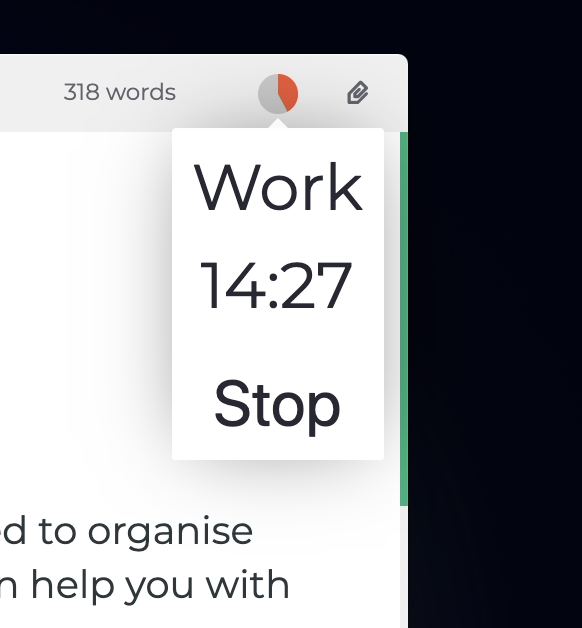

# ポモドーロタイマー

たくさん書く人には、より良い時間の管理方法が必要となるかもしれません。Zettlrに搭載されたポモドーロタイマーが、あなたの助けとなります。

画面右上、ツールバー内にある丸いアイコンをクリックすると、ポモドーロタイマーを使用できます。

ポモドーロタイマーとは何かを知らない人は、[公式サイト](https://francescocirillo.com/pages/pomodoro-technique)を参照してください。

## ポモドーロタイマーを使用する

ポモドーロタイマーを開始する前に、いくつか設定できる項目があります。

赤い数字は、何分間**作業**するかを示しています。デフォルトは25分です。

黄色の数字は、作業と作業の間にある**短い休憩**の長さを表しています。デフォルトは5分です。

緑の数字は、作業を4つ行うごとにある**長い休憩**の長さを表しています。デフォルトは20分です。

次に、それぞれのフェーズの終了時にサウンドを再生するかどうかを選択できます。スライダーで音量を調節してください(0%に設定するとサウンドが再生されなくなります)。

> これはシステムの音量ではありません。つまり、システム音量が20%であれば、Zettlr内で音量を100%に設定しても、20%の音量で再生されます。

**開始**ボタンをクリックするとタイマーが開始します。それから、丸いアイコンが現在のフェーズの色(赤、黄、緑)で塗りつぶされていきます。全体が塗りつぶされると、次のフェーズが開始します。

タイマーを**停止**する、もしくは現在の**状態**を確認するには、丸いアイコンをもう一度クリックします。小さなポップアップが表示され、残り時間、現在のフェーズ、停止ボタンが表示されます。

ポモドーロタイマーは以下のようなサイクルで実行されます:

1. 作業
2. 短い休憩
3. 作業
4. 短い休憩
5. 作業
6. 短い休憩
7. 作業
8. 長い休憩
9. _ステップ1に戻る_
