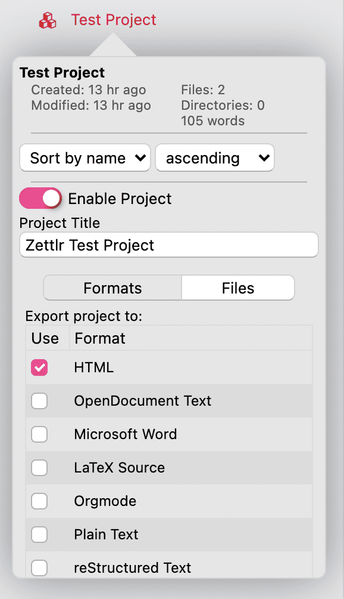

# プロジェクト

プロジェクトは複数ファイルの結合とエクスポートを簡単に行うための機能です。これにより、一つのプロジェクトを複数のファイルに分けて作業することが可能になります。複数のファイルに分けて作業し、最後に結合して一つのPDFファイルにエクスポートします。さらに、プロジェクトは同時に複数のフォーマットにエクスポートすることができます。

## プロジェクトを作成する

Zettlrのプロジェクトは、基本的にはディレクトリに対する追加の設定項目です。つまり、任意のディレクトリをプロジェクトに「変換」することができます。プロジェクトにしたいディレクトリを右クリックして「プロパティ」を選択します。表示されたポップアップでスイッチを切り替えるとプロジェクトが有効化されます。そうすると、ディレクトリが赤色に変わって、名前の左にプロジェクト機能が有効になっていることを表すアイコンが表示されます。次にディレクトリを右クリックすると、コンテキストメニューにプロジェクトをエクスポートするための項目が追加されています。

## プロジェクトでの作業

After you have activated the project switch in the directory's properties, a few additional options will appear in that dialog. The first tab of the newly appearing panel allows you to select the formats into which the project will be exported. Select as many as you like. The options are the same as for single page exports.

On the second tab, you can define glob patterns to filter which files will be included in the export. A glob pattern is simply a pattern that allows you to match only specific files. For instance, the pattern `**/*.md` will match all Markdown files, the two asterisks at the beginning mean to apply this filter recursively. If you would define `*.md`, then the project will not include files from subdirectories. You can also specify multiple file extensions, e.g. `**/*.{md,tex}`. Lastly, you can also match only files that have a specific name, e.g. `**/{Introduction,Conclusion,Chapter-1}.md`.

> To learn more about glob patterns, a good starting point is the [corresponding Wikipedia article](https://en.wikipedia.org/wiki/Glob_(programming)).

We chose to implement glob patterns instead of an actual list of files since that was not just easier to implement, but it also allows you to specify beforehand what types of files you will create, and thus make it easier for you to add or remove files without having to worry about which ones will be included, and which ones won't.

## プロジェクトをビルドする

Building projects in general works similar to single page exports, with two crucial differences: Projects can generate multiple files with one click, and they bundle multiple Markdown documents into a single output document. Zettlr will follow the following steps in collecting the information necessary to build a project:

最初に、プロジェクトディレクトリを走査して、すべての内容を1次元の配列にします。つまり、**すべてのサブフォルダと、そこに含まれるファイルを、平坦化して単なるリストにします。**それは何のためでしょうか？ファイルリストを見てみてください。内部的には、ファイルをエクスポートする前に、Zettlrはファイルをファイルリストと同一の順番に並べます。なので、ファイルリストを確認すれば、ファイルの順番を正確に把握することができます。意図的にこのようにしてあるので、論文の提出後に3つの章が抜けていることに気づくという悪夢のようなことは発生しません。

> Zettlrは**すべての**サブディレクトリを使用することに注意してください。これは、巨大なプロジェクトで好きなだけ多くのサブディレクトリを使える利便性のためです。そして、プレビューリストがそのまま出力されます。（すべてのディレクトリ構造は単に無視されます。）そのため、2階層目のサブディレクトリにメモを詰め込んで、それらを最終原稿にどうやって取り込むか考えるような使い方はしないでください。エクスポート対象外のファイルを追加したい場合は、単にプロジェクトディレクトリ内に2つフォルダを作って、片方に作業用ファイルを入れてください。そして、もう一方をエクスポートするためのプロジェクトに変換します。

Second, Zettlr will read the settings you have given the project itself and basically follow the same process as generating single-document-PDFs: Start up the exporter, provide it with your settings, and let Pandoc and LaTeX do their work.

エクスポートが完了すると、ファイルは自動的にプロジェクトディレクトリ内に保存されます。

> 特に巨大なプロジェクトでの目次の生成は、非常に時間が掛かる可能性があることに注意してください。目次を生成する場合、実際にはLaTeXは2回PDFをビルドします。1回目はPDFに変換後、どのページに見出しが現れるかを調べるため、そして2回目は実際に目次を含めてビルドが行われます。私が行ったテストでは、新しいWindows 10のコンピュータで、約150ページを出力するのにおよそ5分を要し、その間何も動作していないように見えました。したがって、pandocやLaTeXが文句を言わない間は動作し続けていますので、辛抱強くお待ちください。

> **上級者向けヒント**: FAQなどで知っているかもしれませんが、ZettlrとpandocはMarkdownドキュメント中のTeXコマンドを取り除きません。プロジェクトで作業する間、このことを覚えておいてください。追加のページを作ったり、その他の面白いことをファイルに対して実行して最終出力に残すことができます。また、新しいファイルを作成するときに拡張子を指定することで、`.tex`ファイルを作ることもできます。`.tex`ドキュメントではLaTeXのシンタックスハイライトがサポートされ、プロジェクトのエクスポート時にも含まれます。ファイル名を付ける際には、ファイルを出力したい位置に並ぶように注意してください。

## プロジェクトを取り除く

プロジェクトを取り除くには、ディレクトリのプロパティでプロジェクトのスイッチをオフにします。
