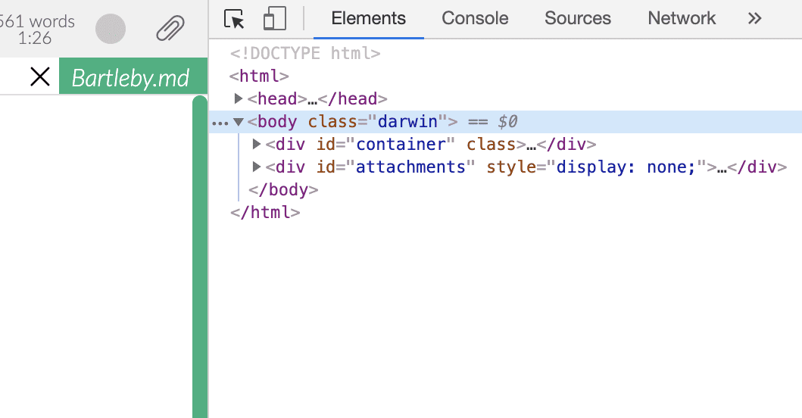
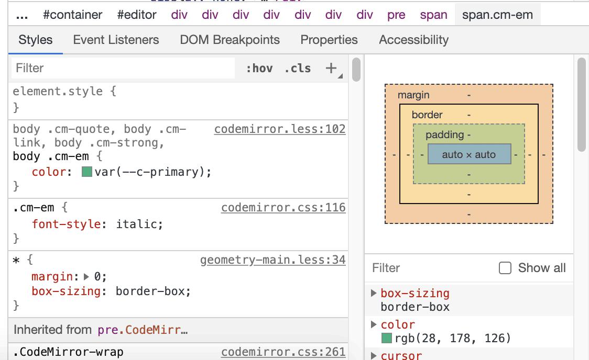

# カスタムCSS

> カスタムCSSは上級者向けの機能です。カスタマイズについては、公式にサポートしているわけではなく、すべて自己責任となります。何か問題が起きたら、Zettlrのデータディレクトリから`custom.css`を削除して、カスタムCSSをリセットしてください。

CSS([Cascading Style Sheets](https://en.wikipedia.org/wiki/Cascading_Style_Sheets))を利用して、アプリケーションの見た目を変更することができます。カスタムCSSエディタは、[アセットマネージャ](./assets-manager.md)の中にあります。

CSSはよくわからないけれど、このページのガイドをただコピー＆ペーストするだけでは嫌だという場合は、簡単な[CSSチュートリアル](https://developer.mozilla.org/en-US/docs/Learn/CSS/Introduction_to_CSS)を見てみるという選択肢もあります。インターネット上には多くのチュートリアルがあり、ちょっとGoogleで検索すればチュートリアル動画なども見つかります。

<iframe width="560" height="315" src="https://www.youtube-nocookie.com/embed/QcJGI_3adhc" frameborder="0" allow="accelerometer; autoplay; encrypted-media; gyroscope; picture-in-picture" allowfullscreen></iframe>

## Zettlr向けにCSSを書く

Zettlrのスタイルは、形状と実際のテーマの2つに分けられます。変更する場合は、要素のデザインのみを変更し、**決して**形状を変更**しないで**ください。形をいじりまわすのは楽しいかもしれませんが、予想できない振る舞いをもたらす可能性があります。これは、アプリケーションの一部で、要素のサイズが正しいことに依存しているためです。もし間違えてしまった場合も安心してください。Zettlrのデータディレクトリから`custom.css`を取り除くだけです。[インストール手順のドキュメント](../install.md)に書かれているパスを調べると、お使いのシステムでのデータディレクトリを見つけることができます。

ZettlrにおけるすべてのclassとIDは、それぞれのコンポーネントごとに名前空間が付けられています(グローバルのものを除く)。なので、実際にルールを上書きするには、完全な名前空間を使う必要があります。(もしくは、多くのルールを追加していて面倒な場合は、`!important`を使ってルールを上書きしてください。)

すべての要素が常に`body`の名前空間に属していて、アプリケーションがダークモードの場合には、`.dark`のクラスが付きます。なので、ダークモードの時のみに適用したいルールがある場合は、`body.dark`のプレフィックスを付けるようにしてください。

## セレクタを見つけるヒント

Zettlrのスタイルは常に変化にさらされています。かなり安定しているはずですが、バージョンアップ時に変更が加えられる可能性があります。そのため、ここでは既成の例を示すのではなく、目的のセレクタを簡単に見つける方法を示します。

まず最初に、[高度な設定](../reference/settings.md)でデバッグモードを有効化し、開発メニューを表示します。次に、開発メニューから開発者ツールを表示して、「Element」タブを選択します。



それから、開発者ツールの左上の矢印をクリックします。そして、アプリケーション上の要素をクリックすると、その要素を開発者ツール上でフォーカスすることができます。要素に指定されているすべてのCSSスタイルが、開発者ツールの下部に表示されます。



上に表示されたルールは下に表示されたものよりも常に優先されます。つまり、注目すべきなのは次の個所です:

```css
body .cm-quote, body .cm-link, body .cm-strong, body .cm-em {
    color: var(--c-primary);
}
```

このようなセレクタをカスタムCSSダイアログにコピーして、お好みのスタイルを設定します。この設定は見ての通り、ブロック引用、リンク、太字、斜体のテキストの色をテーマのプライマリカラーに設定しています。

## CSSコードスニペット

### Zettlrでカスタムフォントを使う

Zettlrのデフォルトフォントが気に入らない、もしくは変更の必要がある場合は、カスタムCSSエディタに以下のスニペットをペーストしてください。`your-font-name`はZettlrで使いたいフォントの**完全な名称**に置き換えてください。`placeholder`は、使用したいフォントによって変えてください:

- New Roman、Georgiaなどの**セリフ体**フォントを使いたい場合は、`serif`を使います。
- Arial、Helveticaなどの**サンセリフ体**フォントを使いたい場合は、`sans-serif`を使います。
- クラシックな**等幅フォント**を使いたい場合は、`monospace`を使います。

placeholderは、設定したフォントが見つからない場合に、同等のフォントを表示する、フォールバックとして機能します。また、フォント名にスペースが含まれている場合は`"Times New Roman"`のようにクォーテーションマークで囲ってください。

```css
#editor {
    font-family: '<your-font-name here>', <placeholder>;
}
```

### カスタム背景画像

以下のコードにしたがうと、起動するたびに異なる画像をエディタの背景にすることができます。画像は、素晴らしいフリー写真サイトであるUnsplash.comから取ってきます。これには、URLにアクセスするたびに異なる画像を返す`Source API`を使用します。[ページを表示して、何回かリロードする](https://source.unsplash.com/random)と試すことができます。追加のオプション(例えば、本日の画像を表示するなど)については、[Unsplash Source API reference](https://source.unsplash.com/)を参照してください。

> You can also use a local image as a background image by replacing the corresponding line by `background-image: url('file:////absolute/path/to/your/file.jpg');`

```css
/* Enter your custom CSS here */

#editor {
    background-color: transparent;
    background-image: url('https://source.unsplash.com/random');
    background-size: cover;
    background-position: center center;
}

body #editor .CodeMirror-sizer, body #editor .CodeMirror-gutter {
    background-color: rgba(255, 255, 255, .8);
    height: 100%;
}

body.dark #editor .CodeMirror-sizer, body.dark #editor .CodeMirror-gutter {
    background-color: rgba(0, 0, 0, .8);
}

#editor .CodeMirror {
    background-color: transparent;
}
```


### 改行を可視化する

改行がどこにあるのか見えるようにしたい場合は、次のカスタムCSSを使えば、行末に段落記号(¶)を表示することができます。

```css
.CodeMirror-line:not(:last-child)::after {
  content: "¶";
  color: #666;
}
```


### テキストの最大幅を設定する

大きなディスプレイを使うと、一行がとても長く表示されてしまいます。
エディタ内の行を短くしたい場合、次のCSSのように両側にマージンを設定します。

```css
#editor {
  --side-margin: calc( 50vw - 30em );
}

#editor .CodeMirror {
  margin-left: var(--side-margin);
}

#editor .CodeMirror-scroll {
  padding-right: var(--side-margin);
}
```


For the distraction free mode, the CSS snippet needs to be modified as follows:

```css
#editor.fullscreen {
  --side-margin-fullscreen: calc( 50vw - 30em ); 
}
  
#editor.fullscreen .CodeMirror-fullscreen {
  margin-left: var(--side-margin-fullscreen) !important;
}
    
#editor.fullscreen .CodeMirror-fullscreen .CodeMirror-scroll { 
  padding-right: var(--side-margin-fullscreen) !important; 
}
```

By adjusting the calc functions for the two different modes, the same line width can be achieved with and without the file manager/sidebar. 

### Change the Active Line Styling in Typewriter Mode

You can change the styling of the active line in Typewriter mode. Replace `top-border-hex-code`, `bottom-border-hex-code` and `background-hex-code` in the CSS snippets below with your preferred Hex colour codes, which you can choose from a website such as [HTML Color Codes](https://htmlcolorcodes.com/). You may want to have different colour styling for light and dark mode.

*Light mode*

```css
body #editor .CodeMirror .CodeMirror-linebackground.typewriter-active-line, body .quicklook .body .CodeMirror .CodeMirror-linebackground.typewriter-active-line, body .dialog .CodeMirror .CodeMirror-linebackground.typewriter-active-line {
  border-top: 1px solid <top-border-hex-code>;
  border-bottom: 1px solid <bottom-border-hex-code>;
  background-color: <background-hex-code>;
}
```

*Dark mode*

```css
body.dark #editor .CodeMirror .CodeMirror-linebackground.typewriter-active-line, body.dark .quicklook .body .CodeMirror .CodeMirror-linebackground.typewriter-active-line, body.dark .dialog .CodeMirror .CodeMirror-linebackground.typewriter-active-line {
  border-top: 1px solid <top-border-hex-code>;
  border-bottom: 1px solid <bottom-border-hex-code>;
  background-color: <background-hex-code>;
}
```
