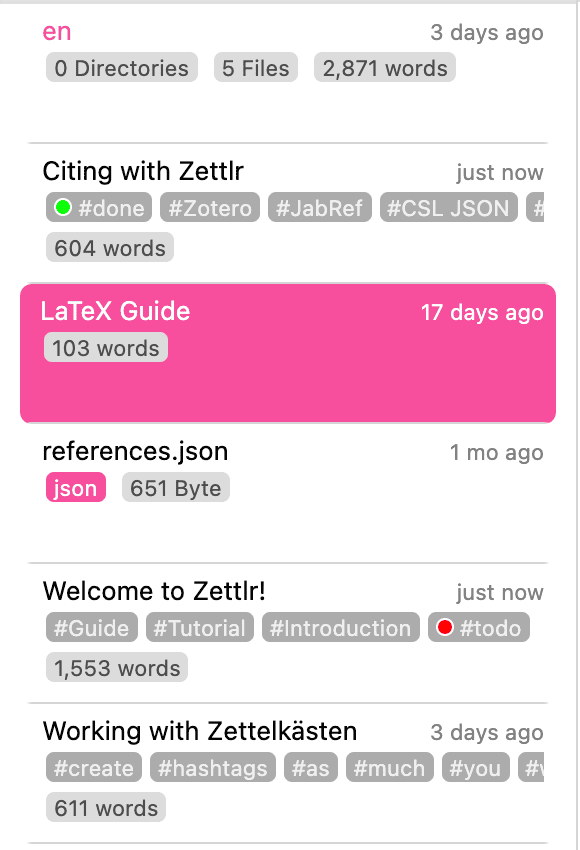
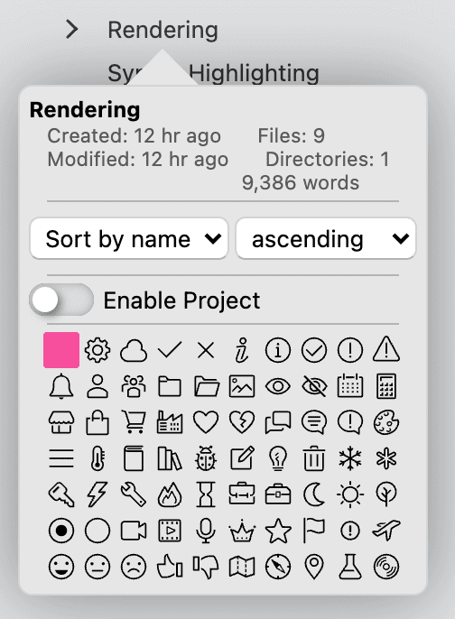
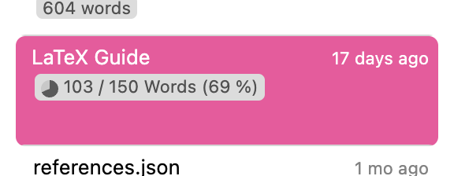

# ファイルマネージャ

The file manager is basically a built-in Explorer (or Finder, if you are on a Mac) tuned to the needs of Zettlr. It is one of the core components of the app.

## 概要

In the preferences, you can choose the file manager mode:

* **Extended**: In the extended mode, both the file _tree_ and the file _list_ will be visible. The file tree does not show individual files (except standalone files).
* **Combined**: In the combined mode, you will only see the file tree which then will also include files.
* **Thin**: In the thin mode, you have access to both the file tree and the file list, but only one will be shown at a time.

The thin mode allows several ways to switch between your file tree and the file list. If you currently see the file tree, but want to see the file list, simply click any directory. Zettlr will then switch to the file list, showing you all files within that directory. If you currently see the file list, simply move your mouse over the top area of the file list. An arrow will appear that you can click to move back to the file tree.

If you have a trackpad or a mouse that supports horizontal scrolling, you can also make use of horizontal scrolling to switch back and forth, which in many cases is much faster than clicking somewhere.

> **注意**: ファイルマネージャーのモードについての詳細は、[設定のマニュアル](../reference/settings.md)をご覧ください。

## ファイルリスト

ファイルリストは、ツリービューで選択中のディレクトリ内にあるすべてのディレクトリとファイルを表示します。しかし、通常のファイルブラウザとは異なり、**ファイルリストは、すべてのサブディレクトリを同列に扱い、一列に並べて表示します。**そのため、深い階層を探すためにディレクトリツリーをたどる必要がありません。

ファイル情報を非表示に設定した場合、ディレクトリもファイルも、それぞれ1行で表示されます。ファイル情報を表示するように設定すると、追加の情報が表示されます。ディレクトリの場合は、含まれるファイルとフォルダの数、ファイルの場合は、最終更新日時が表示されます。また、ファイルの最終更新日時、タグ、IDなどが表示されます。

> ファイル情報の表示/非表示は、「表示」メニューから選択するか、`Cmd/Ctrl+Alt+S`を押下するか、または、設定ダイアログの「一般」タブから切り替えることができます。

Additionally, you can traverse the directory tree within the file list by clicking on the directories. A simple click will select the directory and move further down the tree, while `Alt+Click` will select its parent directory. This is useful if you have to switch directories often, but prefer the thin mode of the sidebar and don't want to switch to the tree view repeatedly.

> Within the file manager, you can perform most actions that you can also perform in your Explorer/Finder/file browser as you would expect it, such as opening, duplicating, creating, and removing files, dragging them around, and more.

### File and Folder Properties

Each file and each folder also has properties. You can view them by right-clicking any file or folder, and choosing the corresponding menu item.

Each folder can be turned into a [Project](../academic/projects.md) by clicking the switch in its property popover. Afterwards you can fine-tune its project settings. Also, you can select a directory icon which makes it easier to identify the directory visually. Lastly, you can sort directories in their property popovers. Files, on the other hand, show you their tags, ID, and other useful information. You can also set writing targets in the properties of a file.

> To remove the writing target from a file, simply set the writing counter to zero.

Both file and folder property popovers show you some general information, like the last modification time, their creation time, and their size.

## ファイルリストの構造的な意味合い

ツリービューでディレクトリを選択すると、そのディレクトリに含まれる**すべての**ファイルとフォルダがファイルリストに表示されます。簡単に言えば、サブディレクトリとファイルを平坦化して、ファイルツリーのようなツリー状の構造から、一次元のリストに変換します。そのリストの内容は、ツリービューで異なるディレクトリを選択するたびに更新されます。

> リストに表示されるのは、現在選択しているディレクトリに*含まれる*、すべてのディレクトリとファイルです。つまりそれは、高速な検索機能のように機能します。表示されるのは、特定のディレクトリに含まれるファイルのみです。そして、深い階層のディレクトリを選択していくごとに、表示されるファイルが少なくなっていきます。ルート以下に適切な構造を用意すれば、これは、実際に必要なファイルのみをリストに表示させるための有力な方法となります。

ファイルリストは、複雑なディレクトリツリーを平坦化するため、ファイルを適切に*表示する*方法について、いくつかの仮定をしています。そのため、ファイルの実際のディスク上での場所を特定するのに、以下のルールが役立つでしょう:

1. 現在選択しているディレクトリは常に一番上に表示されます。
2. ディレクトリ内のファイルは、ディレクトリ名のすぐ下に表示されます。
3. ディレクトリ内のサブディレクトリは、ファイルリストの一番下に表示されます。つまり、現在選択しているディレクトリのファイルの後です。
4. ディレクトリが空の場合、それらは、間にファイルを置かずに、すぐ後に並べて表示されます。

覚えておくべき重要なことは、すべてのディレクトリが入れ子にならず、まったく同じ階層に置かれているように表示されるということです。どのディレクトリがどこに含まれるかを区別したい場合は、ツリービューを参照してください。

> Zettlrの「自然な」並べ替え(2の後に10が来る)が気に入らない場合は、設定ダイアログの一般タブで、「ASCII」順の並べ替え(10の後に2が来る)に設定することもできます。
