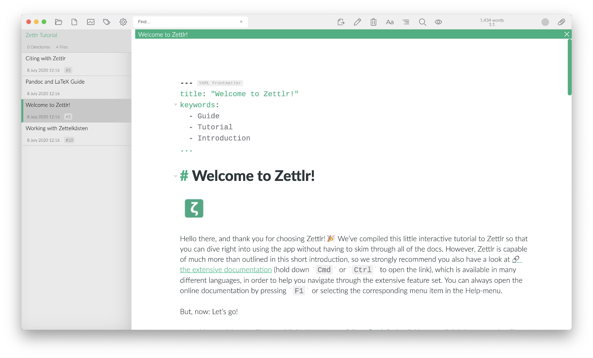

## 最初の一歩

Zettlrのセットアップが終わったら、すぐに使い始めたいことでしょう。Zettlrの初回起動時には、特別なフォルダがDocumentsフォルダーにコピーされます。そこには、対話的なチュートリアルが入っていて、アプリケーションを使い始める最初のステップへと導いてくれます。指示に従っていけば、このドキュメント中の特定のセクションへのリンクもあり、アプリケーションの詳細を学ぶことができます。

このドキュメンテーションを読んでも解決しない疑問がある場合は、[よくある質問](faq.md)を確認した後、[Reddit](https://www.reddit.com/r/Zettlr/)、[Discord](https://discord.com/invite/PcfS3DM9Xj)、[GitHub Discussions](https://github.com/Zettlr/Zettlr/discussions)のコミュニティで質問してください。また、アプリケーションの使い方や関連ツールについての動画を、[YouTubeチャンネル](https://www.youtube.com/c/Zettlr/)に時々アップロードしています。

[こちらのリンクからZettlr HowToプレイリストを開くと](https://www.youtube.com/playlist?list=PL2ydvDwV-1u5ncnkxQWZhbHQdwpY2fx5f)、解説動画を見ることができます。

> 付属の対話的チュートリアルでは、コンピュータにLaTeXをインストールすることを勧めています。LaTeXは、Zettlrで高度なPDFファイル出力を行うために必要です。LaTeXが無い場合、基本的なPDFファイルのエクスポートしか行うことができません。高度なPDF出力を行うつもりがないならLaTeXは不要です。後で必要になったときに、いつでもインストールすることができます。

このチュートリアルで使われている機能は、すべてこのドキュメンテーションにも書かれているので、詳細を知りたい場合はここで探してください。アプリケーションを使い始める際にはチュートリアルに従って操作し、サイドバー、ファイルツリー、内部リンク、ドキュメントタブなどのコンセプトに慣れることをおすすめします。

チュートリアルが完了したら、そのディレクトリは閉じるか、もしくは完全に削除してしまってもかまいません。それから別のフォルダを開いて作業を開始してください。
