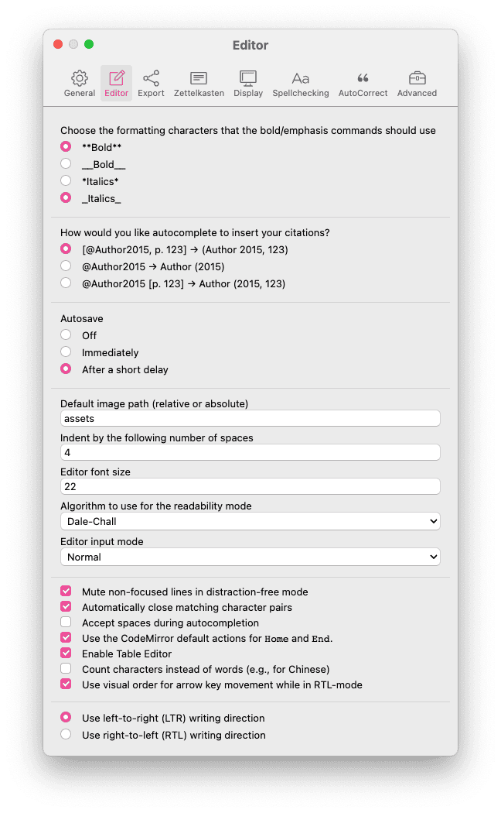
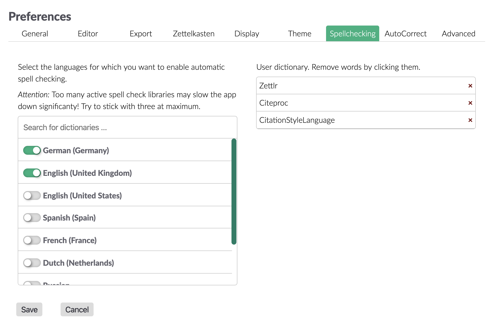
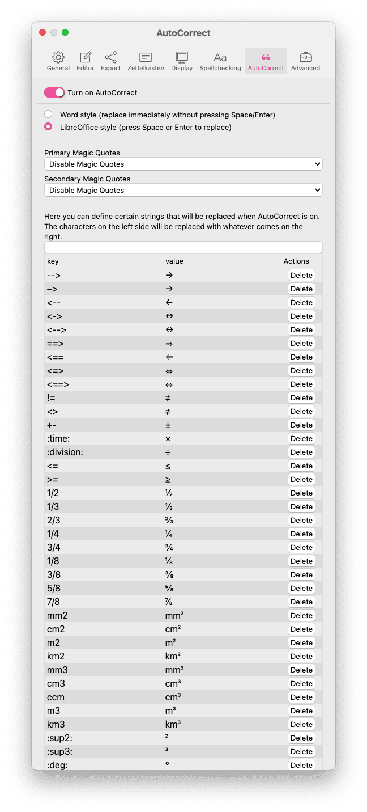
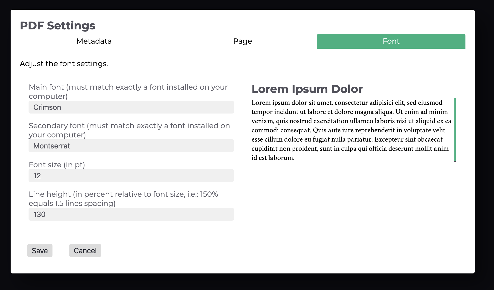

# 設定

Zettlrは、アプリケーションをカスタマイズするための多くの設定項目を持っています。設定は3つの設定ダイアログに分かれていて、ここではそれぞれについて、どの項目が何の設定であるかを説明します。

## 一般設定

一般設定ダイアログは`Cmd/Ctrl+,`のショートカットか、ツールバーのボタン(歯車)、メニュー内の対応する項目から開くことができます。ダイアログが表示され、カスタマイズ可能な設定項目が表示されます。設定項目は上部に表示された9つのタブに分かれています。

* 一般: Zettlr全体に影響する設定です。
* エディタ: エディタ自体にのみ関係する設定です。
* エクスポート: ファイルをエクスポートする方法についての設定です。
* Zettelkasten: ZettlrをZettelkastenシステムに適用するための設定です。
* 表示: 画像やリンクなどの要素をどのようにエディタに表示するかの設定です。
* テーマ: アプリケーションのテーマを選択します。
* スペルチェック: インストール済みの辞書およびユーザ辞書を選択します。
* オートコレクト: 自動的に置換する文字列と、使用するクォーテーションの種類を選択します。
* 高度な設定: 上級者向けの設定です。

### 一般

一般タブには、Zettlrを使い始めるときにニーズに合わせて設定する可能性のある項目が並んでいます。アプリケーションの言語は、見た通りの意味です。

「ナイトモード」と「ファイル情報を表示」のチェックボックスは表示に関する設定です。「ナイトモード」は、ただ単にZettlrにダークテーマを適用します。これは`Cmd/Ctrl+Alt+L`のショートカットでも切り替え可能です。「ファイル情報を表示」のチェックボックスは、ファイルリストにファイルのメタ情報を表示します。これは、`Cmd/Ctrl+Alt+S`のショートカットで切り替え可能です。

「グローバル検索時にディレクトリを非表示」をオンにすると、検索実行中にディレクトリが非表示になります。「現在のファイルに対する外部での変更を常に読み込む」をオンにすると、Zettlrは確認メッセージを表示することなくエディタの内容を置き換えます。

サイドバーモードは、サイドバーの表示内容を設定します。3つの選択肢があります。

* Thin: サイドバーは、ファイルリストとツリービューのどちらかを表示します。`Cmd/Ctrl+Shift+1`のショートカットで、それぞれを切り替えることができます。
* Expanded: ツリービューとファイルを横に並べて表示します。このモードでは、2つのリストを常に見ることができます。
* Combined: このモードでは、サイドバーの見た目が昔ながらのファイルブラウザーのようになります。フォルダとファイルを分けずに表示します。

サイドバーを完全に隠したい場合、集中モード(`Cmd/Ctrl+J`)を使ってください。

ファイルの並び順は、Zettlrが内部でファイルを並び替える方法を指定します。ASCII順だと自然言語的な意味を無視してしまうため、数値順をおすすめします。

Zettlrは、システムに応じて自動的にライトモードとダークモードを切り替えることができます。

* **オフ**: モードの切り替えは手動で行います。
* **スケジュール**: 設定した時間の間のみダークモードに切り替えます。
* **OSの設定に従う**: macOSとWindowsにおいて、モード切替を通知するシステムイベントを受信することができます。

### エディタ

エディタタブはエディタの機能をコントロールします。Markdownではアスタリスクとアンダースコアのどちらを使っても、テキストを太字や斜体にすることができますが、どちらを使用するかをここで選択できます。「既定の画像パス」は、クリップボードから画像を貼り付けた際に保存するデフォルトのパスを設定します。絶対パスでも相対パスでも設定可能です。`assets`と設定したなら、ファイルの置かれたディレクトリ内の`assets`というサブディレクトリに画像が保存されます。例えば、`../assets`のように、親ディレクトリからの相対パスを設定することもできます。画像を保存するディレクトリは、そのたびに指定することも可能であることに注意してください。

インデントに使用する空白の数は、例えばリストのレベルを増やす場合などに使用されます。

可読性モードで使用するアルゴリズムは、Zettlrの可読性モードをオンにした場合に使用されます。それぞれのアルゴリズムの違いに関する説明は、[可読性モードに関する資料](https://www.zettlr.com/readability)をご覧ください。

「集中モード時にフォーカスされていない行の表示を薄くする」をオンにすると、現在カーソルの置かれた行以外が暗くなります。「対応する括弧を自動的に入力する」は、そのままの意味です。

次の設定は、キーボードに`Home`と`End`のキーがある場合にのみ適用されます。これらを押したときに、CodeMirrorのデフォルト動作では段落の最初と最後(つまり、論理的な行頭/行末)に移動します。この設定をオフにすると、表示上の行頭/行末に移動するようになります。Markdownのhard-wrap機能を使って常に手動で段落を折り返している場合、この設定は何の意味もありません。

### エクスポート

エクスポートタブでは、ファイルをエクスポートする方法について設定します。左側にはZettelkastenについての設定があります。

「ファイルからZKN IDを取り除く」を選択すると、Zettlrはエクスポート前にすべてのIDを見つけてファイルから取り除きます。「ファイルからタグを取り除く」は同様にタグを取り除きます。

> 意図的にIDを消したいのでなければ、ファイルからZKN IDを取り除く設定をオフのままにしておくことを推奨します。14桁の連続した数字を含むリンクを生成するウェブサイトが存在しますが、ZettlrはIDの正規表現に一致するものをファイルからすべて検索して削除します。つまり、リンクが壊れてしまう可能性があるのです。

次に、内部リンク(デフォルトでは`[[`と`]]`に囲まれています)の扱いに関する設定です。1つ目の選択肢は、すべて取り除いてしまいます。2つ目はリンクの書式を解除します。3つ目はそのまま残します。

右側にはエクスポートについての一般的な設定項目があります。ファイルのエクスポート先として「一時ディレクトリ」を選択できます。ファイルを出力しっぱなしにしても自動的に削除されるため、こちらの設定を推奨します。2つ目の選択肢は、現在のディレクトリに保存します。既にファイルが存在する場合には、確認することなく上書きします。出力結果を添付ファイルサイドバーに表示したい場合は、こちらを選択してください。

参考文献データベースの欄では、使用するデータベースを開くことができます。ファイルが読み込まれ、ファイル中に引用を表示することができるようになります。CSLスタイルを選択すると、デフォルトのスタイル(APA)を上書きすることができます。[Zoteroスタイルリポジトリ](https://www.zotero.org/styles)にある任意のファイルを使用することができます。

> 参考文献の設定はプロジェクトごとの設定で上書きすることができます。

### Zettelkasten

このタブではZettelkastenシステムを取り扱う方法について設定することができます。カスタムシステムを使用したい場合を除き、ほとんどの場合これらの設定をいじる必要はありません。

Zettelkastenにとって重要な4つの設定項目があります。IDの正規表現、リンクの開始と終了、生成用のパターンです。

#### IDの正規表現

Zettlrはファイル中のIDを探すために正規表現を内部で利用しています。このパターンを検索してマッチする文字列が見つかった場合、それがファイルのIDであるとみなします。**ファイルの中で最初に見つかったものをIDとみなします。**もし、IDとして4桁の数字を使うように設定したなら、正規表現はファイル中の年の表記にも一致してしまいます。Zettlrでは最初に見つかったIDを採用するので、ファイルの一番最初にそのファイルのIDを記述するようにしてください。

デフォルトの正規表現は`(\d{14})`です。(入力欄の右側のリセットボタンを押すと、デフォルトに戻すことができます。)つまり、Zettlrはちょうど年月日時分秒を合わせた桁数である14桁の数字(例えば、20181012143724)を探します。ファイル中に他にも14桁の数字が含まれていることは非常にまれなので、これはIDとしては優れた方法と言えます。さらに素晴らしいことに、IDは毎秒ごとに異なるため、毎秒新しいファイルを作っても一意なIDが割り振られます。

`\d{14}`の前後にある括弧は「キャプチャグループ」と呼ばれるものです。キャプチャグループは、正規表現を特定の文字列にマッチさせるだけでなく、その中から一部分のみを取り出すためのものです。ここでは、マッチした全体を取り出します。このようにして、ほとんどどのような構造のIDでも使用することができます。

> キャプチャグループのIDを省略することも可能であることに注意してください。キャプチャグループがない場合は、Zettlrが内部的に入力された正規表現を括弧で囲みます。

#### 内部リンク

内部リンクの設定は、内部リンクをどのように記述するかを選択します。デフォルトはWikiスタイルのリンク`[[your-link]]`です。代わりに波括弧`{{your-link}}`や、エクスクラメーションマーク`!your-link!`を使うこともできます。お好きなように設定してください。

内部リンクは2つの使い方があります。一つは、既存のファイル名かIDを使用して、それらをクリックすることで対応するファイルを直接開くことができます。(それぞれのファイルは、拡張子を除くファイル名かIDにより識別されます。)二つ目は、ファイル名やIDを含まない場合で、それらは検索機能の働きをします。つまり、内部リンクを`ALT`を押しながらクリックすることで、検索を開始することができます。これで、何度も行うような検索を保存しておくことができます。

> リンクはファイルのIDとはみなされないことに注意してください。もし、内部リンクの開始終了の間にIDが見つかったとしても、それはファイルのIDとしては使用されません。

#### ID生成

設定ダイアログのZettelkastenタブの最後の項目は、IDを生成する方法を設定します。それは、変数を含む文字列で、変数はIDの生成時に置換されます。今のところ、年、月、日、時、分、秒の変数が利用可能です。デフォルトのID生成パターンは`%Y%M%D%h%m%s`です。`%Y`は現在の年(4桁)に、`%M`は現在の月(先頭ゼロ埋め)に、以下同様に置換されます。IDに固定の文字列を含めることもできます。例えば、`%Y-%M-%D_%h:%m:%s`というパターンを設定すると、`2018-10-12_12:03:56`のようなIDが生成されます。同じ変数を複数回使用することもできます。例えば、秒だけを使用して`%s%s%s`とすると、`565656`のようなIDが生成されます。

生成されたIDが、必ず「IDの正規表現」にマッチするように設定してください。`%Y-%M-%D_%h:%m:%s`というパターンで生成されたパターンを認識するには、`(\d{4}-\d{2}-\d{2}_\d{2}:\d{2}:\d{2})`という正規表現を設定する必要があります。`%uuid4`を使用する場合は、`[a-fA-F0-9]{8}-[a-fA-F0-9]{4}-4[a-fA-F0-9]{3}-[89aAbB][a-fA-F0-9]{3}-[a-fA-F0-9]{12}`という正規表現を使用することができます。

入力欄の下のボタンを使って、IDの生成と認識をテストすることができます。ボタンを押すとIDが生成され、設定した正規表現にマッチするかどうかが確認されます。ZettlrがIDを認識できたかどうかが表示されます。

### 表示

このタブでは、特定の要素のエディタ内での表示方法を制御します。ZettlrはMarkdownに対してセミプレビュー方式を採っているため、一部の要素のみを描画します。このタブでは、どの要素を表示するかを選択します。

> iframeの設定は、例えばYouTubeの動画などをiframeとして埋め込んだものを表示するかどうかを設定します。

さらに、画像のサイズ制限も設定できます。これは特に、縦長の画像を多く使用する場合に有効です。横方向のスライダーは画像の占有する最大幅の設定です。例えば50%に設定すると、画像の幅はテキスト領域の半分に制限されます。100%にすると制限がなくなります。(画像の最大幅はテキスト領域の幅となります。)

縦方向のスライダーはウィンドウサイズに対する画像の最大高さを設定します。50%にすると画像は、ウィンドウの高さの半分までに制限されます。100%にすると制限がなくなります。幅の場合とは異なり、非常に縦に細長い画像は画面のビューポートを大きく超えることがあります。

最後になりましたが、ファイルリストのメタデータとして表示する日付の選択があります。これは、ファイルを日付順に並べる際の並び順には影響を及ぼしません。ファイル並べ替えに使用する日付は、一般タブを参照してください。

### テーマ

このタブは説明不要だと思います。プレビューのいずれかをクリックすると、そのテーマがアプリケーションに適用されます。

### スペルチェック

ユーザ辞書の導入に合わせて、スペルチェック機能は専用のタブに移動しました。左側は利用できるスペルチェック用辞書の一覧です。使いたいものを選択してください。複数選択すれば複数言語のチェックを行うことができます。一覧の上にある検索ボックスでリストを絞り込むことができます。

> **ヒント**: スペルチェック機能を無効化するには、すべての辞書をオフにしてください。辞書の追加方法は[ローカライゼーションの説明](../core/localisation.md)を参照してください。

最後に、タブの右側のリストにはカスタム辞書に追加した単語の一覧が表示されます。単語をクリックすると辞書から削除することができます。

### オートコレクト

このタブでは、バージョン1.5以降で使えるようになったオートコレクト機能の設定を行います。LibreOfficeやWordで知っている機能かもしれません。有効化のチェックを外すと、機能を完全に無効化することができます。また、スタイルを選択することができます。2つのスタイルの主な違いは、Wordの方が置換のタイミングが早いということです。Wordスタイルでは最後の文字を入力した瞬間に置換されますが、LibreOfficeスタイルではスペースまたはEnterを押してから置換が行われます。LibreOfficeスタイルの方がお節介と感じることは少ないですが、Wordに慣れている人にとってはWordスタイルの方が簡単かもしれません。

「マジッククォート」とは、普通のASCIIのクォート(`"`と`'`)の代わりに使用する、一次クォートと二次クォートの設定です。世界中で使われている多くの種類の記号を用意してあります。この機能を無効化したい場合は、いずれのドロップダウンも1番目の設定(ASCIIのクォート)を選択してください。

右側のテーブルは置換の表です。これは、単純に置換したい文字列と置換後の文字列を設定します。よく使われるトークンの包括的なリストを用意していますので、一覧を眺めて、自由に追加削除を行ってください。

### 高度な設定

高度な設定タブには上級者向けの設定項目があります。

「新規ファイル名のパターン」は、新規のファイルを作成時にテキスト欄に表示される値です。ここに入力した値が自動入力されます。下に書かれた変数を使用することもできます(IDはZettelkastenタブの設定に従います。それから、年月日時分秒が使用可能です。)「新規ファイル作成時にファイル名を確認しない」設定も可能です。これによりワークフローを高速化できるかもしれません。

pandocとxelatexの入力欄は、Zettlrがこれらのプログラムの場所を特定できない場合に使用します。ご存じのようにZettlrはファイルをエクスポートするためにこれらを使用します。まれに、正しくインストールしているにもかかわらず、Zettlrがプログラムを発見できない場合があります。その場合、2つのプログラムの**絶対パス**を入力すれば、Zettlrがプログラムを見つけられるようになります。

**デバッグ モード**をオンにすると、F5でGUIをリロードできるようになり、アプリケーションの動作を調べるためにChrome developper toolsを表示できるようになります。当然ながら、開発者としてはこれが必要となります。

また、**ベータ版のリリースを通知する**ことで、Zettlrを支援することもできます。この設定をオンにすると、Zettlrはベータ版のリリースも通知するようになります。その後、ベータ版を使用するかどうかを決めることができます。**RMarkdownファイルを有効化**すると、`.rmd`ファイルをR-Markdownとして認識するようになります。他のプログラム(例えばAdobeなど)がバイナリデータを保存するために、これと同じ拡張子を使用しており、問題を避けるためにデフォルトではこの機能はオフになっています。

右側のテキストエリアは**添付ファイル**サイドバーに表示するファイルの種類を設定します。使いたいファイル拡張子をカンマ区切りで設定します。よく使われるであろう拡張子の一覧が初期状態で設定されています。

**pandocコマンド**を設定すると、エクスポートエンジンに対するあらゆる制御を行うことができます。ここで設定したコマンドがエクスポート時に実行されます。エクスポートをカスタマイズするためにいくつかの変数を使用することができます。

- `$infile$`: エクスポートしようとするファイルの絶対パス。
- `$outfile$`: エクスポートされるファイルの絶対パス(正しい拡張子を含む)
- `$citeproc$`: `pandoc-citeproc`エンジンのディレクティブ。
- `$format$`: 形式(例えば`html`や`docx`).
- `$outflag$`: pandocの出力形式フラグ(例えば`-t docx`).
- `$standalone$`: ファイルがスタンドアローンモードで出力される場合に`-s`が設定されます。
- `$toc$`: 目次を生成するかどうか。
- `$tocdepth$`: 目次に含める項目レベルを表すフラグ。
- `$tpl$`: pandocのテンプレートディレクティブ。

> **注意**: 多くの変数がpandocに合わせたものになっています。もちろん、`pandoc`を他のエクスポートエンジンの名前に置き換えることで、まったく他のプログラムに乗り換えることも可能ですが、そのプログラムはpandocのフラグの扱い方を知っている必要があるということに注意してください。

## PDF設定

PDF設定は多くの項目があるため、別のダイアログに移動しました。これらの項目は、LaTeXエンジンがファイルをPDFにエクスポートする際の描画方法に関する設定です。他の形式のエクスポートには何の影響も及ぼしません。`Cmd/Ctrl+Alt+,`のショートカットか、メニュー内の項目からダイアログを開くことができます。PDF設定も複数のタブに分かれています。次の3つのタブがあります。

* メタデータ: PDFファイルのメタデータフィールドを制御します。
* ページ: ページレイアウトを調整します。
* フォント: エクスポートで使用するフォントに関する設定項目です。

### メタデータ

このデータはPDFリーダーのメニュー項目から表示することができます。普通は見えないように隠されていますが、いくつかの状況では使用されます。たった一つ、本当に気を付ける必要があるのは作成者の欄だけです。"Generated by Zettlr"という情報が事前に入力されています。これは、自分の名前(または会社の名前)に変更することができます。キーワードの項目はめったに使われることはありません。

### ページ

このタブではページレイアウトを設定します。各項目は、LibreOfficeやMicrosoft Officeの同様のダイアログの項目と同じような働きをします。用紙サイズ、コンテンツ周りの余白、ページ番号を振るかどうか(そして使用する番号体系)を設定します。

### フォント

ここではフォントの見た目を設定することができます。メインフォントはすべてのテキストに使用されるフォントです。LaTeXエンジンが、この設定を直接使用するため、コンピューターにインストールされているフォント名に完全に一致する名前を入力する必要があります。**LeTeXエンジンがフォントを見つけられなかった場合はエラーを吐きます。エラー発生時にエラーメッセージを検索してみて、ここで設定した名前が見つかったなら、非常に高い確率でフォント名の設定が間違っています。OSのフォント設定を開いて名前を確認してください。**

フォントサイズはそのままの意味です。行の高さは行間のスペースの設定です。(これは段落に対してのみ適用されます。)例えば、行の高さを150パーセントと指定すると、行間に行の高さの半分のスペースが空きます。(つまり、各行の下に普通の行の高さの50%の空白があり、その下に次の行が来ます。)

## タグの管理

タグの管理ダイアログにはショートカットが設定されていないので、メニューの対応する項目から開く必要があります。ここでは、タグの色と説明文を設定できます。

タグの色設定を新規に作成するには、ダイアログ下部の`+`ボタンを押します。最初の欄にはタグ名からハッシュタグ記号を除いたものを入力します。(例えば`#todo`に色を設定する場合、単に`todo`と入力します。)次に、タグに割り当てる色を選択します。タグ名欄の隣のボタンをクリックすると、カラーピッカーが表示されて色を選択することができます。3つ目の欄にはタグに対する短い説明を入力することができます。この説明はファイルリストのタグマークにマウスカーソルを合わせたときに表示されます。

タグの色設定を削除するには、各行の最後にある`-`ボタンをクリックします。
