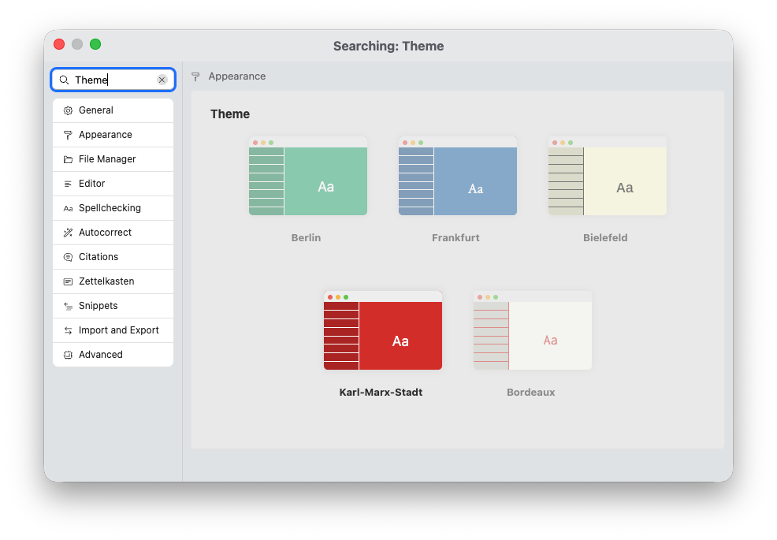
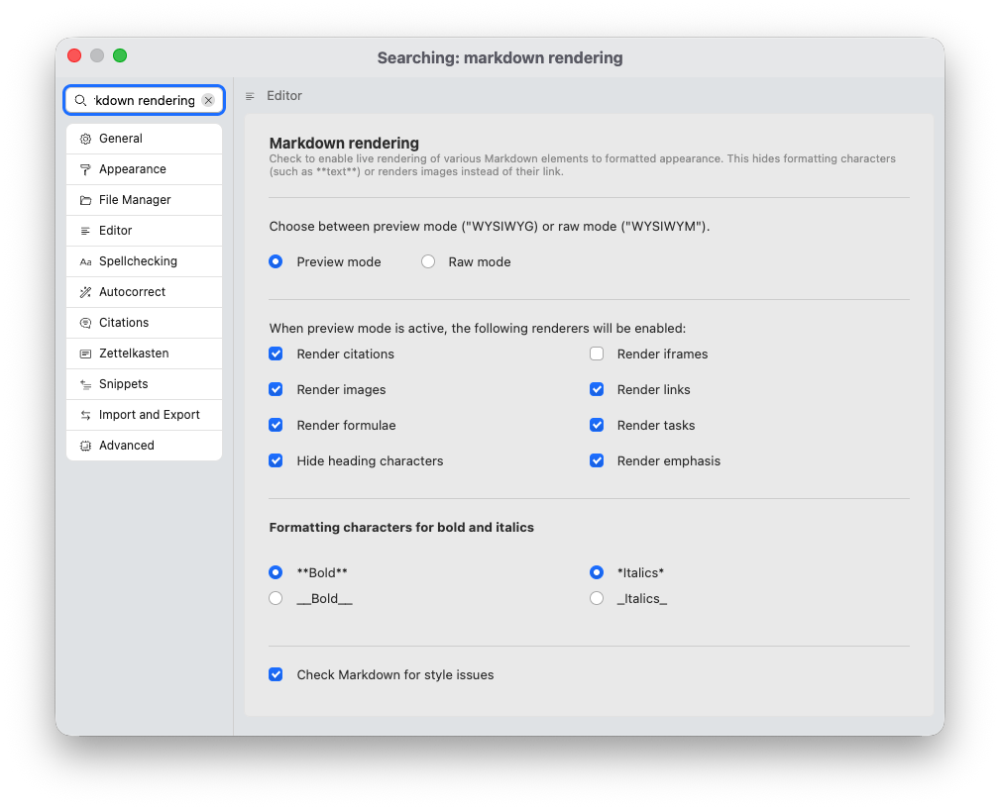
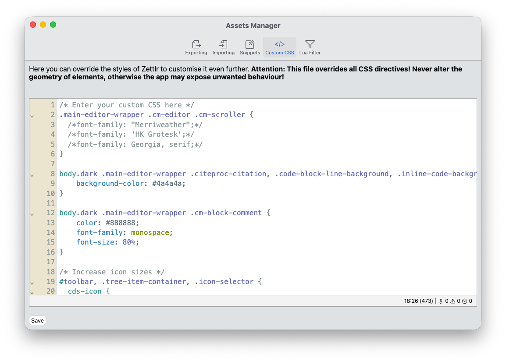

# Aparência

Como componente mais poderoso, o editor oferece uma variedade de opções de aparência. Nesta seção, nós os descrevemos:

- [Aparência](#aparência)
  - [Tema do Editor](#tema-do-editor)
  - [Modos de visualização e Raw](#modos-de-visualização-e-raw)
  - [CSS personalizado](#css-personalizado)

## Tema do Editor

A maneira mais simples de alterar a aparência do editor é selecionar um tema de editor diferente.

Para selecionar o tema, abra as preferências e navegue até “Aparência” → “Tema”. Atualmente, o Zettlr vem com cinco temas que mudam a aparência do editor:

* **Berlim**: Este é o tema padrão. Ele usa um cor de destaque verde e possui fonte sem serifa.
* **Frankfurt**: Este tema apresenta um cor de destaque azul e uma fonte serifada.
* **Bielefeld**: Este tema apresenta um cor de destaque amarela e uma fonte monoespaçada.
* **Karl-Marx-Stadt**: Este tema se parece com o tema de Berlim, mas usa uma cor vermelha.
* **Bordéus**: Este tema é semelhante ao de Bielefeld. No entanto, ele usa cores de destaque vermelho e ciano e uma fonte monoespaçada diferente.

Cada tema vem com uma paleta de cores claras e escuras e alterna de acordo com as configurações de aparência do aplicativo.

## Modos de visualização e Raw

O próximo nível de personalização diz respeito a *como* o Markdown é exibido para você. O próprio Markdown é uma forma de “código-fonte” que precisa ser convertida antes que você possa distribuir qualquer texto escrito nele.

No início da escrita do Markdown, todos os aplicativos exibiram apenas a fonte real do Markdown em seu estado bruto. No entanto, logo, as pessoas exigiram uma maneira mais fácil de visualizar documentos Markdown. E isso é razoável: por exemplo, há uma enorme diferença na legibilidade se você vir apenas a sintaxe que declara uma imagem ou se uma imagem real aparecer. Este último torna a compreensão do seu documento muito mais simples. Além disso, embora a sintaxe do Markdown tenha sido projetada para ficar fora do seu caminho durante a escrita, ocultar completamente a sintaxe pode melhorar a legibilidade de seus documentos à medida que você os cria.

Hoje, existem duas maneiras de pré-renderizar ou Markdown para fins de visualização. Muitos aplicativos fornecem um painel separado no qual seu Markdown é exibido em um estado renderizado próximo ao código-fonte do Markdown. Alguns aplicativos, no entanto, renderizarão o Markdown no local. Zettlr faz o último.

Para configurar se e quais elementos serão substituídos pelas versões renderizadas para facilitar a leitura, você pode usar a configuração “Renderização Markdown” na seção “Editor” das preferências.

Esta seção oferece muitas opções de como o Markdown é renderizado. Primeiro, você pode escolher entre **WYSIWYG** (o que você vê é o que você obtém) e **WYSIWYM** (o que você vê é o que você quer dizer). O primeiro é chamado de “visualização” e o último é chamado de “bruto”.

Esta configuração determina se a renderização do Markdown está habilitada. Se você selecionar o “modo de visualização”, poderá então, em uma próxima etapa, especificar quais elementos serão pré-renderizados. Algumas pessoas, por exemplo, podem preferir renderizar apenas imagens e links, mas não há restrições. Para obter a experiência de rich text “completa”, marque todas as caixas.

**Dica:**

    Você não precisa usar as preferências para alternar entre o modo de visualização e o modo bruto. Se você ativar a barra de status do editor, poderá clicar no item "Renderização" da barra de status para alternar entre os dois modos imediatamente.

**Observação:**

    Até mesmo o modo de renderização de visualização é apenas uma aproximação da aparência do seu documento quando você o exporta para Word, HTML ou PDF. Isto tem duas razões. Primeiro, cada formato de exportação tem seus próprios estilos que serão aplicados. Os títulos de um documento do Word *serão* diferentes dos títulos de um arquivo PDF. E isso se torna ainda mais verdadeiro se você utilizar perfis de exportação com seus próprios modelos personalizados. A segunda razão é que você ainda precisa editar o arquivo. Se produzíssemos uma representação verdadeira do documento Markdown em um estado exportado, também precisaríamos, às vezes, inserir quebras de linha, mover elementos e assim por diante. Não podemos fazer isso sem introduzir o risco de potencial perda de dados ou outras falhas.

## CSS personalizado

A etapa final da personalização do seu editor é usar CSS personalizado. CSS, ou Cascading Style Sheets, é uma linguagem de layout que pode ser usada para estilizar sites. E, como o Zettlr é baseado em tecnologias da web, você também pode usar CSS para personalizar a aparência do editor.

Muitos de nossos usuários estão usando CSS personalizado para individualizar sua experiência. Isso começa com a seleção de fontes personalizadas e vai para a implementação de algumas mudanças avançadas de estilo.

**Aviso:**

CSS personalizado é muito poderoso, mas isso também significa que você pode literalmente quebrar o aplicativo, se não tomar cuidado. Recomendamos que você implemente apenas alterações sutis e evite alterar margens, tamanhos ou posições. Caso você acidentalmente quebre o aplicativo, você pode reabrir o fechamento do aplicativo e remover o arquivo `custom.css` do diretório de dados do aplicativo. Consulte o [guia de solução de problemas](../getting-started/troubleshooting.md) para obter mais informações.