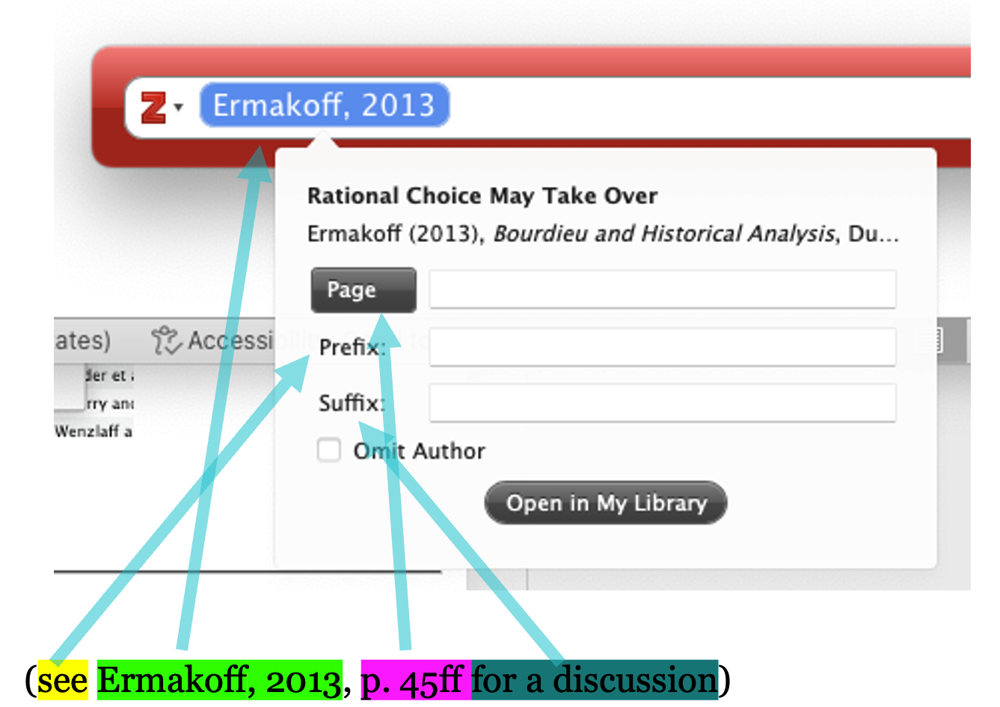
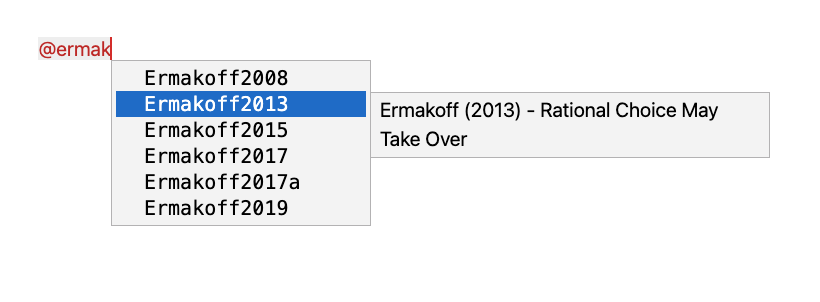
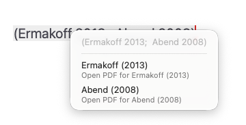

# Citações

Uma característica central do Zettlr é seu forte integração com implicações. O Zettlr integra-se diretamente ao seu gerenciador de referências favoritas. Os gerenciadores de referência suportados incluem, por exemplo, Zotero, JabRef, Juris-M e arquivos de biblioteca simples BibTeX ou BibLaTeX.

## Integração com gerenciadores de referência

Antes que o Zettlr possa acessar suas referências, você precisará exportar sua biblioteca para um arquivo que o Zettlr possa ler. Para saber como isso funciona, [compilamos um guia completo sobre como fazer isso com Zotero](../guides/reference-manager-integration.md).

**Dica:**

    Se você já estiver usando bibliotecas de referência BibTeX ou BibLaTeX, não precisará fazer nada além de carregar o arquivo no Zettlr. Se você usa Zotero, EndNote ou um gerenciador de referências que não funciona diretamente com arquivos, você precisará exportá-lo primeiro.

## Habilitando protetores

Depois de ter um arquivo com sua biblioteca em mãos, você pode ativar conforme desejar. Fazer isso é tão simples quanto apontar o Zettlr para o arquivo de sua biblioteca.

Para isso, abra as preferências do Zettlr, navegue até “Citações” e localize o arquivo de sua biblioteca.


**Dica:**

    Se você precisar usar arquivos de biblioteca por arquivo, em vez de globalmente, poderá especificar o arquivo com a palavra-chave `bibliography` no frontmatter YAML. Incluímos instruções [mais abaixo nesta página](#using-a-file-specific-library).

### Habilitar a configuração “Renderizar configurações”

De agora em diante, o Zettlr preencherá automaticamente qualquer citação que você digitar. No entanto, para garantir que as instruções também sejam pré-renderizadas dentro do seu editor, comprove-se que o Zettlr renderiza as especificações para começar. Para isso, você precisa estar no modo de renderização “Preview”, e ter o renderizador “citações” ativo. Para saber mais, consulte [o guia sobre a aparência do editor](./appearance.md#preview-and-raw-modes).

## Anatomia de uma citação

Cada citação consiste em **quatro partes**, das quais apenas uma é obrigatória:

* um **prefixo** que precede uma citação
* uma **citekey** que especifica o trabalho que deve ser relatado. Esta chave é obrigatória.
* um **localizador** que especifica a localização exata na obra citada
* um **sufixo** que inclui mais informações



A captura de tela demonstra isso com o seletor Zotero com o qual você deve estar familiarizado se já usou o Zotero junto com o Word ou LibreOffice para criar instruções.

Você pode ver o prefixo em amarelo, a citação real em verde, o localizador em rosa e o sufixo em verde-azulado.

**Dica:**

    Apenas o citekey é necessário para criar uma citação. Todas as outras peças são opcionais.

    A primeira coisa a considerar é que **Zettlr não usa o seletor de restrições do Zotero**. Em vez disso, utilize a sintaxe de citação do Pandoc. A sintaxe de citação do Pandoc é equivalente ao seletor de instruções, mas em vez de usar uma interface gráfica para modificar sua citação, você escreve todas as partes de sua citação diretamente. Isso pode ser muito mais rápido quando você estiver sintonizado com a sintaxe.

A sintaxe para escrever uma citação usando a sintaxe Pandoc é quase a mesma que será quando renderizada:

```markdown
This is some text [see @Ermakoff2013, p. 45ff for a discussion].
```

Como você pode ver, a sintaxe de citação reflete exatamente como as periodicidades regulares no texto são escritas. O benefício? Zettlr e Pandoc são inteligentes o suficiente para pegar essas informações e formatá-las **independentemente do estilo de citação que você usa**!

**Dica:**

    Embora o seletor Zotero ofereça uma caixa de seleção para "omitir o autor" de uma obra (ou seja, exibir apenas o ano), você pode obter a mesma funcionalidade acrescentando um hifen à chave de citação (`-`).

Exemplo: A citação `[-@Ermakoff2013]` seria renderizada como `(2013)` sem o autor.

## Tipos de Citação

Além desta anatomia geral de como funcionam as obrigações, você tem três maneiras de citar um trabalho:

1. `[@Author2015, p. 123]` será renderizado como `(Author 2015, 123)`
2. `@Author2015` será renderizado como `Author (2015)`
3. `@Author2015 [p. 123]` será renderizado como `Author (2015, 123)`

A **primeira opção** é o padrão e é recomendado. No entanto, às vezes você inclui uma citação em sua frase. Por exemplo, você pode querer escrever algo assim:

```markdown
… and as Ermakoff (2013, p. 45ff) has pointed out …
```

Isso não funcionará com a opção um, pois colocará o sobrenome do autor entre colchetes. Felizmente, você não precisa implementar nenhum hack. Em vez disso, se você colocar uma chave de citação em algum lugar do seu texto **sem colchetes**, isso permitirá que você envie automaticamente:

```markdown
… and as @Ermakoff2013 has pointed out …
```

Isso será renderizado imediatamente como `Ermakoff (2013)`. No entanto, temos um número de páginas que gostaria de incluir. É aqui que a **terceira opção** entra no jogo. Escrevendo o seguinte:

```markdown

… and as @Ermakoff2013 [p. 45ff] has pointed out …
```

…nós conseguimos tudo.

Para tornar esse processo mais fácil para você, o Zettlr permite que você especifique como deseja inserir citações se preencher automaticamente uma citação.

## Inserindo Citações

Desde que você tenha apontado ao Zettlr um arquivo que contém suas restrições, você pode inserir instruções facilmente com a ajuda do questionário automático. Comece a escrever um símbolo `@` em uma posição válida. Uma “posição válida” significa: `@` está no início de uma linha, precedida por um espaço em branco ou diretamente após um colchete de abertura.

Nesse caso, o Zettlr irá sugerir automaticamente citekeys da sua biblioteca para preenchimento automático. Basta começar a digitar as letras da chave de citação (ou seja, do nome do autor ou do ano) para que o Zettlr remova as chaves de citação não correspondentes até que a chave que você precisa seja visível. Em seguida, navegue com as teclas de seta pela lista até que a entrada correta seja destacada e pressione <kbd>Enter</kbd>.



Como você pode ver na captura de tela, conforme você percorre as entradas, o Zettlr mostra as informações bibliográficas em uma tip adicional ao lado da entrada. Isso ajuda a verificar se você tem uma entrada correta, especialmente em casos (como você pode ver na captura de tela) em que você tem várias publicações por ano.

**Observação:**

    Se não for fornecer uma lista de referências possíveis, pode haver um problema com o arquivo de banco de dados que você configurou anteriormente.

    Assim que o preenchimento automático completar o citekey, ele usará sua sintaxe preferida para inserir a citação. Isso insira um colchete de fechamento, se necessário, ou adicione colchetes atrás da citekey, dependendo de sua configuração.


Você pode alterar o formato como o Zettlr preencher automaticamente as teclas de navegação até a seção Preferências → “Citações”. Aqui você pode escolher um dos três tipos de instruções acima. Isso é útil especialmente se você costuma usar referências no texto.

**Dica:**

    Observe que os *estilos* de citação às vezes podem personalizar ainda mais a forma como as especificações são realmente renderizadas. Por exemplo, alguns estilos de citação nas ciências naturais exigem que as instruções sejam referidas apenas por número. Este requisito específico será aplicado assim que você exportar um arquivo. **O próprio Zettlr sempre usará um estilo de citação no texto padrão para visualizar seus arquivos. Portanto, suas exportações podem ser diferentes.**

**Dica:**

    O recurso de sugestão automática do Zettlr para inserir citekeys é extremamente útil. Dito isto, pode haver momentos em que você queira recortar e colar uma chave de citação diretamente do seu gerenciador de referências. Se você estiver usando Zotero com o plugin BetterBibTeX, o plugin vem com recursos para agilizar esse processo, que requer uma configuração única. No Zotero, vá ao menu `Settings` e selecione `Better BibTeX` na barra lateral para abrir as configurações do plugin. Role até a seção chamada `Quick-Copy` e escolha `Pandoc citation` no menu `Quick-Copy format`. Em seguida, selecione `Export` na barra lateral `Settings`. No menu suspenso denominado `Item Format`, selecione a opção denominada `Better BibTeX Citation Key Quick Copy`. Isso conclui a configuração necessária.

A partir de agora, você pode selecionar um ou vários itens no Zotero e arrastá-los para o painel do editor Zettlr para inserir instruções. Se preferir copiar e colar citekeys, você pode fazer isso selecionando uma entrada no Zotero e usando uma combinação de teclas <kbd>Cmd/Ctrl</kbd>+<kbd>Shift</kbd>+<kbd>C</kbd> para copiar ou citekey para a área de transferência.

Para obter mais informações sobre como usar as restrições de acordo com o mecanismo citeproc do Pandoc, [consulte o guia](https://pandoc.org/MANUAL.html#citations).

## Bibliografia

Conforme você cita, o Zettlr irá gerar automaticamente uma bibliografia de visualização na [barra lateral](../sidebar/index.md). Você pode abrir a barra lateral com o botão mais à direita da barra de ferramentas e navegar até o guia bibliografia. Esta bibliografia será automaticamente anexada ao seu documento quando você exportá-lo.

**Observação:**

    Apenas com permissão no texto, a bibliografia será renderizada com um estilo simples na barra lateral. Sempre que você exportar seu arquivo, a bibliografia também será formatada corretamente usando o estilo de citação de sua escolha.

## Usando uma biblioteca específica de arquivo

Às vezes, você pode querer adicionar algumas chaves de citação por arquivo. Para fazer isso, você deve adicionar o arquivo da bibliografia ao [frontmatter YAML](./yaml-frontmatter.md) do seu arquivo. Se o Zettlr detectar a propriedade `bibliography` no cabeçalho de um arquivo, ele carregará automaticamente esse arquivo e oferecerá itens desse arquivo em vez de sua biblioteca principal.

Exemplo:

```yaml
---
title: "My document"
tags: tag1, tag2, tag3
bibliography: ./assets/references.json
---
```

**Observação:**

    Observe que, embora você possa adicionar vários arquivos de biblioteca a esta propriedade, o Zettlr só pode manipular um e, portanto, selecionará apenas o primeiro arquivo de bibliografia.

## Alterando o estilo de citação

Internamente, o Zettlr sempre usará o estilo Chicago para renderizar as preferências. Portanto, suas instruções visualizadas serão sempre “no texto” e nunca no estilo de nota de rodapé. Isso é uma conveniência e uma confirmação de que tudo está funcionando.

Mas é claro que você pode usar diferentes estilos de citação, dependendo dos requisitos do diário para que você se adapte ou escreva de suas preferências pessoais. Para alterar o estilo de citação, você precisa baixar o arquivo CSL correspondente. Um bom ponto de partida é o [repositório estilo Zotero](https://www.zotero.org/styles). Lá você pode pesquisar estilos de especificações específicas, visualizá-los e baixá-los. Outra boa opção é o [repositório de estilos de linguagem de estilo de citação](https://github.com/citation-style-language/styles)

Você pode apontar o Zettlr para um arquivo CSL de três maneiras. Primeiras nas escolhas gerais. Na guia `Export`, abaixo do campo do arquivo de banco de dados de transações, você pode selecionar seu estilo CSL preferido. Isso será usado para todas as exportações.

Em segundo lugar, você pode definir um estilo CSL para um projeto específico. Com a pasta do seu projeto visível no gerenciador de arquivos, clique com o botão direito na pasta do projeto e selecione “Propriedades” → “Configurações do projeto….” Na aba “Arquivos” você pode especificar o arquivo CSL a ser usado na exportação do seu projeto.

Terceiro, você pode especificar um estilo CSL apenas para um arquivo específico, fornecido no cabeçalho YAML do arquivo. Por exemplo:

```yaml
csl: ./styles/acta-philosophica.csl
```

## Personalizando a lista de referências

Por padrão, o Pandoc simplesmente anexará uma lista de referências ao final de seus documentos, sem qualquer decoração. Isso geralmente não é inconveniente, especialmente porque as listas de referências devem ter pelo menos um título.

### Adicionando um cabeçalho de seção

A maneira mais fácil de adicionar um cabeçalho de seção à sua lista de referências é anexar um título chamado “Referências”, “Bibliografia” ou semelhante ao final do documento. Embora isso possa parecer um pouco estranho ao visualizar o documento no Zettlr, isso garantirá que a bibliografia tenha um título apropriado na exportação. Como o Pandoc simplesmente anexará a bibliografia renderizada ao seu documento, esse título “solitário” se tornará o cabeçalho de sua lista de referências na exportação.

No entanto, isso pode rapidamente se tornar complicado à medida que você cria mais e mais arquivos. Seria ótimo se você pudesse automatizar esse processo. Felizmente, você pode fazer isso.

Em vez de especificar sempre a seção de título, você pode fornecer um nome padrão para cada perfil de exportação. Para fazer isso, acesse o [Gerenciador de Ativos](../export/assets-manager.md), por exemplo, pressionando <kbd>Cmd/Ctrl</kbd>+<kbd>Alt</kbd>+<kbd>,</kbd>. Na guia “Exportar”, selecione o perfil para o qual deseja fornecer uma seção de referência padrão e adicione o seguinte código:

```yaml
metadata:
  reference-section-title: "References"
```

Personalize “Referências” de acordo com sua preferência (por exemplo, “Bibliografia” ou uma tradução dela). Se o perfil já possui a propriedade `metadata`, coloque `reference-section-title` lá em vez de duplicar a propriedade. Garanta a proteção adequada.

### Personalizando `reference-section-title` por arquivo

Especificar `reference-section-title` em um perfil de exportação aplicará este título a todos os arquivos. Mas e se você quiser que alguns arquivos tenham um cabeçalho de seção diferente? Pandoc permite que você também forneça esse rótulo usando o [frontmatter YAML](./yaml-frontmatter.md). Para fazer isso, basta colocar `reference-section-title` em sua própria linha (não recuperada) no frontal YAML de um arquivo.

**Aviso:**

O perfil de exportação substitui `reference-section-title` do frontmatter. Isso significa que, se você especificar `reference-section-title: Bibliography` em seu frontmatter, mas tiver colocado um `reference-section-title: References` na propriedade `metadata` de seu perfil de exportação, o Pandoc usará o último, e não o primeiro. É por isso que os perfis integrados do Zettlr não são fornecidos com um padrão para `reference-section-title` integrado. Para alguns casos de uso, pode ser mais fácil omitir `reference-section-title` totalmente do perfil de exportação e especificá-lo manualmente para cada arquivo. Você também pode usar [Snippets](./snippets.md) para fornecer modelos para vários tipos de relatórios que vêm com o `reference-section-title` correto.

### Especificando a localização da lista de referências

Por padrão, o Pandoc anexará uma seção de referência renderizada ao seu documento, o que em quase todos os casos é suficiente. No entanto, em algumas situações raras, isto não é o ideal. Por exemplo, imagine que você está escrevendo um relatório com alguns apêndices. Normalmente, você deseja que uma lista de referências seja aplicada após o corpo principal do relatório, mas antes de qualquer um dos apêndices.

Para fazer isso, você pode informar explicitamente ao Pandoc onde colocar a lista de referências. Você faz isso criando um contêiner com o ID `#refs`. Pandoc confirmará isso e colocará a bibliografia neste contêiner, em vez de apenas anexar a lista. Por exemplo:

```markdown
## Conclusion

Some concluding thoughts ...

## References

::: {#refs}
:::

## Appendix A

Some appendix information...
```

Pandoc substituirá a construção de colchetes de três pontos por sua lista de referências.

**Aviso:**

Se você especificar especificamente a localização de suas referências colocando um contêiner `#refs`, o Pandoc irá ignorar seu `reference-section-title`. Neste caso, você deve especificar o título manualmente (conforme mostrado no exemplo).

**Dica:**

Isso também implica que você possa fornecer uma lista de referências de várias partes. Pandoc colocará uma lista de referências em qualquer contêiner com o ID `#refs`. Você pode ler mais sobre como colocar a bibliografia no [manual Pandoc](https://pandoc.org/MANUAL.html#placement-of-the-bibliography).

### Formatando a lista de referências

A maior parte da formatação da lista de referências será derivada do estilo de citação específico que você usa. Esses estilos de citação especificam, por exemplo, que uma lista de referências deve ser usada retirada deslocada, quanto espaçamento as entradas devem ser e muito mais. No entanto, muitas vezes, essas regras de formatação fornecidas são muito amplas e, às vezes, é necessário tornar o layout da seção de referência mais restrita. Para fazer isso, você tem duas rotas comuns disponíveis.

A primeira é substituir o estilo básico da lista. Você faz isso fornecido certos atributos ao contêiner `#refs` (o que significa que para formatar a lista de referências, você terá que especificar explicitamente o local da lista de referências). Isso é pouco documentado pelo Pandoc e o suporte é um tanto fraco, mas você pode fornecer os seguintes atributos:

```md
:::{#refs .hanging-indent entry-spacing="0" line-spacing="2"}
:::
```

A classe `hanging-indent` ativará forçosamente um recuo deslocado mesmo para estilos de citação que não o prescrevem. Ele é adicionado automaticamente quando o estilo de citação exige.

Os atributos `entry-spacing` e `line-spacing` respectivamente determinam quanto espaço deve haver entre entradas individuais e linhas. Eles são fornecidos em pontos percentuais, onde `1` é igual a 100%. Portanto, um espaçamento de entrada de `0` garantirá que as entradas individuais sejam consecutivas, enquanto um espaçamento de entrada de `2` significará que há duas linhas de distância entre cada entrada.

**Observação:**

    O suporte para estas regras de formatação não é totalmente claro. Alguns estilos de citação e alguns perfis de exportação parecem imunes à alteração do espaçamento entre linhas. Use-os com cautela. Para controlar melhor a formatação, continue lendo.

A segunda rota para ajustar a formatação da lista de referências é sobrescrever diretamente os estilos. Isso lhe dá mais controle sobre a lista de referências, mas dependendo de como você faz isso, você pode se restringir a apenas um único destino de exportação. Por exemplo, para alterar a forma como as referências são exibidas em HTML, você precisará usar CSS. Para alterar como eles são desejados em arquivos PDF, você precisará usar as disposições do LaTeX (ou cláusulas Typst ou tectônicas, dependendo de qual mecanismo você utiliza).

Ao usar CSS, você pode direcionar algumas classes CSS:

* `.references`, `.csl-bib-body`: Essas classes são aplicadas ao contêiner ao redor de cada lista de referências.
* `.hanging-indent`: Esta classe também é anexada ao contêiner, se o estilo CSL exigido ou se você for específico ou explicitamente.
* `.csl-entry`: Esta classe é aplicada a uma entrada individual e permite alterar as propriedades das entradas individuais.

***

O LaTeX, por outro lado, usa comprimentos para determinar as medidas gerais do PDF exportado. Esses comprimentos normalmente são definidos globalmente, mas podem ser alterados para diferentes partes do documento. Um desses comprimentos é `parindent`, que controla o recuo deslocado de todos os parágrafos.

Sempre que você usar o comando `\setlength`, o LaTeX irá sobrescrever o comprimento especificado de onde quer que você encontre este comando até que você use `\setlength` novamente. Como a seção de referências é formatada usando parágrafos como o restante do documento, eles serão formatados neste estilo padrão. Para reformatar a lista de referências, você deve substituir o logotipo antes da lista de referências.

O trecho de código a seguir fornece um exemplo:

```latex
\setlength{\parindent}{-1cm} % Negative hanging indent
\setlength{\leftskip}{0.5cm} % Overall indentation
\setlength{\parskip}{0.1cm}  % Spacing between paragraphs
```

O exemplo acima renderizaria uma lista de referências com um recuo negativo de menos um centímetro. Além disso, aplicará um recuo geral de meio centímetro em relação às margens da página. Por exemplo, se a margem esquerda da página estiver definida como três centímetros, os parágrafos da lista de referências serão deslocados em 3,5 centímetros. O último valor (`parskip`) controla o espaçamento _entre_ parágrafos, portanto há um intervalo de dez milímetros entre os parágrafos.

O exemplo acima é um bom lugar para começar. Você pode pesquisar mais comprimentos para ajustá-los e ajustá-los ao seu gosto.

**Dica:**

Se você estiver enviando, por exemplo, para um jornal STEM que fornece seu próprio modelo LaTeX, você pode usar esse modelo diretamente para exportar seu arquivo, garantindo que tudo já funcione conforme o esperado.

## Acessando o PDF de uma referência do Zettlr

Acontecerá de vez em quando você ler algo que escreveu e desejar verificar novamente uma obra referenciada. Você pode fazer isso simplesmente clicando no botão direito em uma citação e abrindo o arquivo PDF correspondente.



Ao trabalhar com BibLaTeX ou BibTeX, os caminhos para os arquivos PDF precisam ser incorporados ao arquivo. Ao exportar CSL JSON do Zotero, esses caminhos não serão incorporados ao arquivo. Se você usar um banco de dados CSL JSON, o Zotero precisará ser executado em segundo plano para que o Zettlr possa consultar o Zotero pelo caminho correto do PDF e abri-lo para você.