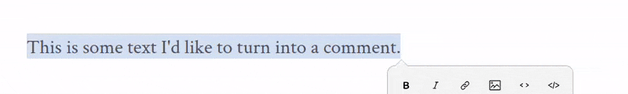

# Trabalhando com comentários

Ao escrever ou editar seu trabalho – ou deixar outras pessoas – você pode querer comentários em um documento. Para deixar um comentário no Markdown, precede o texto do seu comentário com `<!--` e termina com `-->`. Se você estiver familiarizado com HTML, notará que esta é a mesma marcação usada para comentários HTML – como regra, o markdown oferece suporte à sintaxe HTML.

Para um comentário de linha única, a marcação do comentário pode ficar na mesma linha do próprio comentário:

```html
<!-- This is a single-line comment -->
```

Para um comentário que abrange várias linhas, é mais simples colocar a marcação do comentário de abertura e a marcação de fechamento em suas próprias linhas, colocando o texto do seu comentário entre elas:

```html
<!--
Lorem ipsum dolor sit amet, consectetur adipiscing elit.

Nunc et lobortis enim. Suspendisse ac sagittis lectus, eget consequat odio.

Aliquam congue molestie justo in ullamcorper.

Nulla blandit dignissim erat, sit amet luctus odio luctus et.

Etiam euismod libero et lectus finibus, ac euismod metus iaculis.
-->
```

Para simplificar a inserção de comentários, o Zettlr inclui um atalho de teclado para comentários. Digitar <kbd>Ctrl/Cmd</kbd>+<kbd>Shift</kbd>+<kbd>c</kbd> completará automaticamente a sintaxe básica do comentário, colocando o cursor no centro, entre os colchetes angulares de abertura e fechamento, para que você possa começar a digitar imediatamente:


Se você já escreveu um bloco de texto que gostaria de transformar em um comentário, você pode simplesmente destacá-lo com o cursor e _depois_ pressionar o atalho <kbd>Ctrl/Cmd</kbd>+<kbd>Shift</kbd>+<kbd>c</kbd> para converter a passagem pesquisada em um comentário:



**Observação:**

Como editor Markdown, o Zettlr não oferece suporte nativo a comentários de margem como aqueles usados ​​no Google Docs ou no Microsoft Word. Se você estiver [colaborando com editores ou coautores nessas plataformas](https://docs.zettlr.com/en/core/import/#working-with-co-workers), poderá usar o recurso de exportação do Zettlr para gerar um documento `.docx` ou `.odt` para eles comentarem. Depois de revisar e incorporar os comentários do seu colaborador em um processador de texto, você pode reimportar o documento resultante para o Zettlr para continuar trabalhando nele no aplicativo.

## Fazendo mais com comentários

Embora o Zettlr seja uma ferramenta de escrita detipda, ele empresta recursos úteis aos poderosos editores de texto que os desenvolvedores utilizam para escrever código. Os desenvolvedores não têm um, mas _dois_ usos importantes para comentários. A primeira é, como seria de esperar, deixar comentários úteis no código que está escrevendo. Quando chega a hora de executar o código, esses comentários — agrupados em sua marcação de comentário especial — não são tratados como parte do programa.

Isso sugere a segunda maneira porque os desenvolvedores costumam usar comentários, que é “comentar” trechos de seu código que desejam remover de um programa, mas hesitam em excluir totalmente. Em outras palavras, eles pegarão um pedaço do código que escreveram e o envolverão em uma marcação que diz ao navegador — ou ao que quer que esteja executando o programa — para ignorá-lo, tratando-o como um comentário em vez de parte do programa.

Os escritores também têm muitos casos de uso para os quais comentar é uma funcionalidade útil. Podemos querer deixar notas para nós mesmos em nossos documentos. Podemos escrever frases, parágrafos ou trechos inteiros de artigos que não temos certeza se devemos manter ou sabemos que precisamos reescrever, mas hesitamos em excluí-los imediatamente. Usar comentários no Zettlr é uma maneira interessante de resolver esses problemas.

Se você está pensando em excluir um parágrafo do seu artigo, tente comentá-lo. Ao fazer isso, o texto que você envolver na marcação de comentário visível para você no editor, mas será omitido das visualizações e versões exportadas do seu texto. Da mesma forma, você pode fazer obrigações das mesmas transcrições de fontes ou notas de leitura para sua revisão literária diretamente no documento que está escrevendo para referência. Se você não quiser que essas notas sejam aplicadas ao exportar o artigo finalizado, basta comentá-las.

**Observação:**

    É importante notar aqui que, embora passagens de comentários evitem que elas possam ser exportadas de sua escrita – ou seja, PDFs ou documentos do Word – se você compartilhar seu arquivo markdown original com um colega, ele poderá ver todos os comentários que você deixou. Isso é útil se você deseja anotar ou deixar perguntas em um documento no qual está colaborando, mas também é algo que você deve estar ciente de deixar comentários em sua marcação que possa ser fornecida (por exemplo, dados de assuntos humanos ou instruções não registradas).

### Dobrando seus comentários

Embora a capacidade de colocar um monte de notas no meio do documento ou comentar vários parágrafos em algum lugar do ensaio possa ser útil durante o processo de redação, também pode dificultar a leitura do seu trabalho no editor. Felizmente, o Zettlr tem uma resposta para esse problema: dobramento de linhas.

Para ocultar temporariamente o texto de um comentário no editor, basta passar o mouse na margem esquerda adjacente ao texto comentado. Você verá um símbolo de divisão (`⌄`) aparecendo na margem. Clique nele e o texto do seu comentário será recolhido, em estilo sanfonado, permitindo que você leia o texto normal acima e abaixo sem interrupção. Zettlr deixa um símbolo de reticências no editor onde você dobrou o comentário (`…`) como um lembrete de que existe um comentário oculto ali.

Para expandir um comentário novamente, basta passar o mouse sobre a margem esquerda do editor e você verá o mesmo símbolo de divisa de antes, só que estará voltado para a direita, em vez de para baixo. Clique nele novamente para revelar (expandir) seu comentário mais uma vez.
