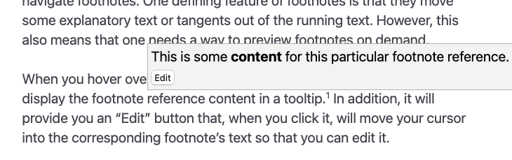

# Notas de rodapé

As notas de rodapé são uma parte crucial de qualquer fluxo de trabalho de escrita séria. Zettlr utiliza a sintaxe do Pandoc para habilitar suporte a notas de rodapé. Além disso, o Zettlr oferece alguns recursos convenientes para facilitar o trabalho com notas de rodapé.

## Anatomia de uma nota de rodapé

A menos que você use notas de rodapé embutidas, cada nota de rodapé consiste em dois elementos: uma nota de rodapé e um texto de referência. Normalmente, você coloca a própria nota de rodapé na posição do texto em qual deseja fixação. A referência da nota de rodapé geralmente fica na parte inferior do documento Markdown.

Veja o exemplo a seguir:

```markdown
This is some text.[^1]

This is some more text afterward.

[^1]: This is a footnote reference text.
```

Para obter mais informações, consulte o [compêndio Markdown](./markdown-compendium.md#footnotes) sobre como escrever notas de rodapé.

## Inserindo notas de rodapé

Como você está trabalhando com Markdown, da maneira mais simples é simplesmente escrever a sintaxe para primeiro definir a nota de rodapé e depois fornecer o texto de referência da nota de rodapé.

No entanto, isso pode rapidamente se tornar complicado, especialmente se você estiver em uma área que vive de notas de rodapé. Portanto, o primeiro recurso de qualidade de vida que o Zettlr oferece é uma forma automatizada de inserir notas de rodapé.

Para inserir uma nota de rodapé, basta iniciar <kbd>Cmd</kbd>+<kbd>Alt</kbd>+<kbd>R</kbd> (macOS) ou <kbd>Ctrl</kbd>+<kbd>Alt</kbd>+<kbd>F</kbd> (Windows/Linux).

Isso direcionará o Zettlr para criar uma nota de rodapé na posição atual do cursor e, ao mesmo tempo, inserir uma referência correspondente na parte inferior do documento atual. Ao mesmo tempo, colocará o cursor no início da referência da nota de rodapé para que você possa começar imediatamente a escrever o corpo da nota de rodapé.

## Visualizando e navegando nas notas de rodapé

O próximo recurso de qualidade de vida que o Zettlr oferece é uma maneira de ler e navegar rapidamente nas notas de rodapé. Uma característica definida nas notas de rodapé é que elas movem algum texto explicativo ou tangentes para fora do texto corrido. No entanto, isso também significa que é necessário visualizar as notas de rodapé sob demanda.

Quando você passa o mouse sobre uma nota de rodapé, o Zettlr exibirá automaticamente o conteúdo de referência da nota de rodapé em uma tip de ferramenta. Além disso, fornecerá um botão “Editar” que, ao clicar nele, moverá o cursor sobre o texto da nota de rodapé correspondente para que você possa editá-lo.



Ao mesmo tempo, quando estiver na parte inferior do documento, você pode voltar para a definição da nota de rodapé clicando no ícone de seta redonda próximo à referência da nota de rodapé na medianiz.


## Tipos de rótulos de notas de rodapé

Algumas palavras finais sobre os tipos de rótulos de notas de rodapé disponíveis. Ao criar uma nota de rodapé usando o atalho do Zettlr, ele sempre usará notas de rodapé numéricas, começando em 1 e contando progressivamente.

O Zettlr também garantirá que, se você inserir notas de rodapé entre duas notas de rodapé existentes, o novo número da nota de rodapé será maior que o primeiro e que a segunda nota de rodapé será aumentada automaticamente para você. Além disso, o Zettlr também garante que uma referência da nota de rodapé recém-criada será colocada entre as referências corretas existentes.

No entanto, você não precisa usar números. O único requisito difícil para um rótulo de nota de rodapé é que ele seja único. Isso significa que você também pode fornecer palavras-chave às suas notas de rodapé. O Zettlr deixará essas notas de rodapé não numéricas de lado quando você inserir uma nova nota de rodapé numérica com o atalho.

**Observação:**

    Sempre que você exportar seu(s) documento(s), independentemente das notas de rodapé, use caracteres ou rótulos numéricos, essas notas de rodapé serão exportadas usando rótulos numéricos.

**Aviso:**

Especialmente para projetos onde você tem vários documentos independentes que são exportados juntos, você acabará em uma situação em que os rótulos das notas de rodapé serão duplicados após a concatenação dos documentos. Pandoc suporta uma opção chamada `file-scope` que garante que todas as notas de rodapé sejam exclusivas antes que os documentos sejam concatenados.