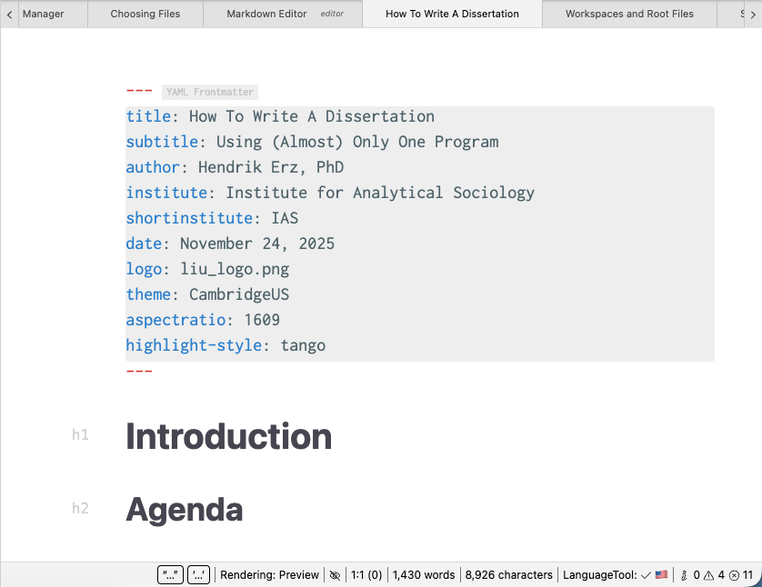

# Editor de redução

No coração do Zettlr é seu componente mais poderoso: o editor Markdown.

O editor Markdown permite que você escreva artigos inteiros ou até livros dentro do aplicativo. Ele vem com uma série de recursos que se concentram em tornar a experiência de escrita o mais perfeita possível.

Nesta seção da documentação, apresentamos todos esses recursos e explicamos como você pode usá-los a seu favor.