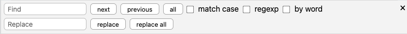
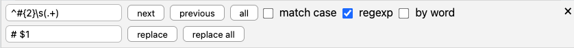

# Procurar

Você pode consultar rapidamente o conteúdo do seu documento atual enviado <kbd>Cmd/Ctrl</kbd>+<kbd>F</kbd>. Isso abrirá o painel de pesquisa do editor.

**Dica:**

Se você precisar pesquisar vários arquivos simultaneamente, use a [pesquisa de texto completo](../file-manager/search.md) global.

## Pesquisando termos

Para iniciar uma pesquisa, basta começar a digitar. O editor iniciará imediatamente a pesquisa e destacará todas as correspondências para você. Pressione <kbd>Enter</kbd> para selecionar a primeira correspondência após a posição do cursor. Continue enviando <kbd>Enter</kbd> para percorrer os resultados da pesquisa. Pressione <kbd>Shift</kbd>+<kbd>Enter</kbd> para retroceder pelos resultados. Você também pode usar os botões “próximo” e “anterior”.

Clique em “todos” para selecionar todas as correspondências de uma vez.

**Observação:**

    Há uma diferença entre “destacar” e “selecionar” os resultados da pesquisa. Por padrão, os resultados de sua pesquisa são apenas destacados, o que significa que o editor mostra onde eles estão. Mas se você começar a digitar, nada mudará. Porém, depois de selecionar um resultado, você o substituirá. Selecionar "todas" como correspondências significa efetivamente que você pode começar a escrever para substituir todas as correspondências ao mesmo tempo.

Por padrão, a pesquisa não diferenciais de minúsculas (de modo que o termo “pesquisa” destaca qualquer ocorrência de “pesquisa”, “Pesquisa” ou “SeArCh”). Para garantir que corresponda apenas ao termo exato, ative “maiúsculas e minúsculas”.

Além disso, a pesquisa também responderá a palavras parciais, portanto, uma pesquisa por “correspondência” destacará tanta “correspondência” quanto a primeira parte de “correspondências”. Ativar “por palavra” garante que apenas as correspondências exatas sejam destacadas (“correspondência”, mas não “correspondências”).

## Substituindo os resultados da pesquisa

Além de destacar os resultados da pesquisa, você também pode usar o painel para substituir os resultados da pesquisa por outra coisa. Foque o campo de texto “Substituir” para começar a substituir. Você pode deixar o campo vazio para remover todos os resultados. Depois de iniciar <kbd>Enter</kbd>, isso selecionará a próxima correspondência. Somente quando você pressionar <kbd>Enter</kbd> enquanto uma correspondência estiver selecionada, a substituição será realizada.

Você também pode clicar no botão “substituir”. Se você clicar em “substituir tudo”, substituirá imediatamente todas as correspondências pelo que estiver no campo de texto “Substituir”.

## Expressões regulares (regexp)

Por padrão, todas as suas pesquisas são bastante literárias. O editor funciona como o que literalmente se parece com o seu termo de pesquisa. No entanto, você também pode examinar expressões regulares para pesquisar e substituir.

A pesquisa do editor oferece suporte à sintaxe de expressão JavaScript regular. [Saiba mais sobre expressões regulares JavaScript aqui](https://codeburst.io/javascript-learn-regular-expressions-for-beginners-bb6107015d91).

Para fazer o editor interpretar sua consulta não literalmente, mas como uma expressão regular, marque a caixa de seleção “regexp”. Agora, ele executará a correspondência regular de padrões em vez da correspondência exata. Isso significa que, ao pesquisar ocorrências de indivíduos, você pode pesquisar padrões (por exemplo, você pode pesquisar quatro dígitos ao longo de anos de indivíduos).

**Aviso:**

Se você já está familiarizado com expressões regulares JavaScript, deve saber que elas geralmente são escritas entre barras, por exemplo: `/\d{4}/`. Para usar a pesquisa de expressões regulares no editor, deixe essas barras, caso contrário você produzirá resultados inesperados.

Alguns exemplos de expressões regulares para você ter uma ideia de como funcionam:

* `\d{4}`: Pesquisa de quatro dígitos consecutivos
* `^#{2}\s(.+)`: Corresponde ao nível 2 dos títulos. Além disso, contém um “grupo de captura” que corresponde ao conteúdo do título.

## Substituindo por Expressões Regulares

Este último exemplo já sugere o poder das pesquisas regexp. Ele contém um grupo de “captura”.

Ao realizar substituições por expressões regulares, você pode substituir exatamente como viu em pesquisas simples (por exemplo, você pode substituir todas as sequências de quatro dígitos por “AAAA”). Mas quando você ativa Expressões Regulares, você também pode *usar grupos de captura dentro do campo Substituir*! Para fazer isso, basta fornecer o número do grupo de captura com um cifrão à esquerda (o primeiro grupo de captura é `$1`, o segundo é `$2` e assim por diante).

Um exemplo concreto: para converter todos os títulos de nível 2 no documento atual em títulos de nível 1, você pode usar as seguintes strings de pesquisa e substituições enquanto a opção “regexp” estiver habilitada (veja também a captura de tela):

* Calculado por: `^#{2}\s(.+)`
* Substituição por: `# $1`

