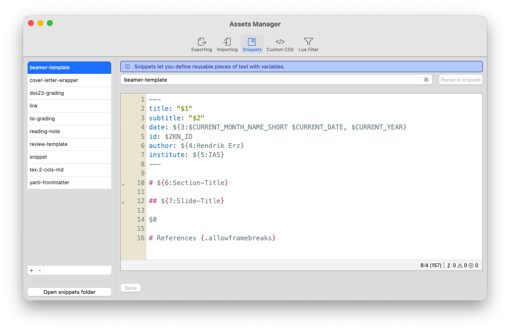
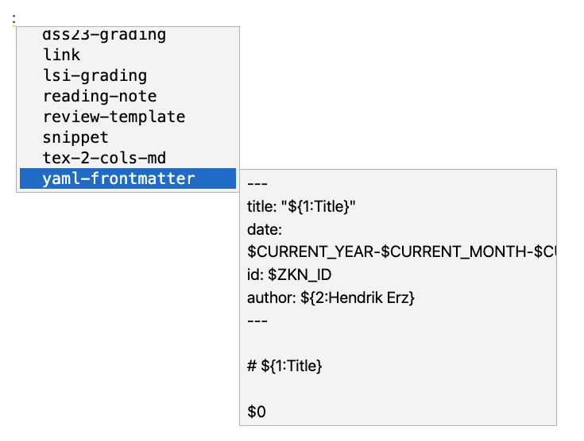
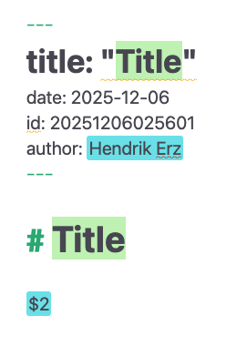
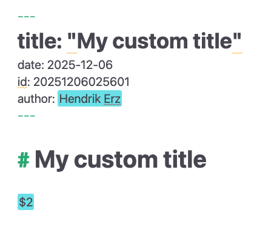
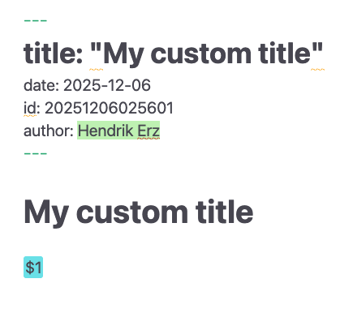
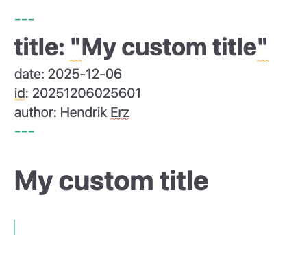

# Snippets

Snippets são pedaços reutilizáveis ​​de código Markdown de comprimentos variados. Eles permitem que os autores definam blocos de texto que precisam inserir com frequência. Mover esses blocos de texto repetidos para o sistema de snippets do Zettlr garante uma aparência e estrutura consistente. Ao definir trechos, os autores podem automatizar a produção de documentos formais e garantir que informações relevantes sejam sempre incluídas.

Os snippets suportam variáveis, o que significa que você pode definir locais nos snippets cujo conteúdo muda com base no contexto. Dessa forma, você pode inserir automaticamente uma estrutura de documento e preencher seu conteúdo nos locais corretos.

Mas os casos de uso de snippets vão além disso. Snippets podem ser definidos para acompanhar um modelo LaTeX, garantindo que os usuários de um modelo sejam capazes de ler as variáveis ​​corretas e utilizar sintaxe válida. Consulte a seção correspondente abaixo para obter alguma inspiração. Além disso, nosso guia sobre como configurar um modelo LaTeX personalizado inclui uma descrição detalhada da configuração de um snippet para acompanhar seu modelo personalizado.

**Dica:**

    O sistema de trechos do Zettlr é baseado na sintaxe TextMate e, como tal, até certo ponto, interoperável com trechos de outros aplicativos de suporte, como o Visual Studio Code.

## Gerenciando seus trechos

Você pode gerenciar seus snippets no [gerenciador de ativos](../export/assets-manager.md). Abra o gerenciador de ativos selecionando “Arquivo” → “Preferências” → “Gerenciador de Ativos” (macOS: “Zettlr” → “Gerenciador de Ativos”) ou pressionando <kbd>Cmd/Ctrl</kbd>+<kbd>Alt</kbd>+<kbd>,</kbd>.

**Dica:**

Veja abaixo uma explicação da sintaxe do snippet compatível.



A aba de snippets é construída de forma análoga a outras abas disponíveis no gerenciador de ativos: À esquerda, você tem uma lista de seus snippets definidas; à direita você pode editar o trecho atual.

Você pode adicionar ou remover trechos do Zettlr usando os botões “+” e “-“ na parte inferior da lista. Ao pressionar “+”, o Zettlr solicitará um nome de trecho. Forneça um nome utilizável e pressione <kbd>Enter</kbd> para criar seu snippet.

**Observação:**

    Os nomes dos trechos só podem conter letras de A a Z, números, hifens e sublinhados. A razão é que o nome do snippet é usado para preenchimento automático no editor. Se você digitar outras letras, elas serão substituídas por um hifen.

Assim como os perfis de importação e exportação, os snippets são simplesmente arquivos Markdown. Esses arquivos devem ter a extensão do nome do arquivo `.tpl.md` para serem reconhecidos pelo Zettlr como modelos. Você não precisa editar esses arquivos no Zettlr, embora o uso do Zettlr tenha a vantagem de suportar o realce de sintaxe correto para a sintaxe do snippet.

**Dica:**

    Na parte inferior da lista de trechos, você encontra um botão que abre diretamente a pasta dos trechos. Isso permite copiar e colar trechos em massa.

Depois de fazer alterações no snippet, clique em “Salvar” ou pressione <kbd>Cmd/Ctrl</kbd>+<kbd>S</kbd> para persistir suas alterações. Para renomear um snippet, basta digitar o novo nome no campo de texto do nome acima do editor de snippet e clicar no botão.

## Usando trechos

Os snippets podem ser inseridos em qualquer documento Markdown a qualquer momento, acionando o recurso de preenchimento automático. Para fazer isso, insira dois pontos (`:`). Os dois pontos devem ser precedidos de um espaço ou inseridos no início de uma linha. Isso invocará o preenchimento automático do snippet.



Você pode usar as teclas <kbd>ArrowDown</kbd> e <kbd>ArrowUp</kbd> para navegar pela lista. Para limitar os trechos disponíveis, você pode começar a escrever o nome do trecho que está procurando.

**Dica:**

A lista fornecerá uma prévia do conteúdo dos snippets para ajudá-lo a identificar o snippet correto a ser inserido.

Para inserir o snippet e iniciar o processo de preenchimento do modelo, confirme sua seleção com <kbd>Tab</kbd>.

Isso iniciará o processo de “preenchimento” dos trechos. Depois de inserir um snippet, o Zettlra irá digitalizá-lo para determinar onde colocar as paradas de tabulação. As paradas de tabulação são variáveis ​​definidas nesses trechos pelos quais você pode navegar e preencher com conteúdo.

**Observação:**

Enquanto um processo de inserção de snippet estiver ativo, <kbd>Tab</kbd> sempre navegará para o próximo snippet, em vez de executar seu comportamento padrão (como recuperar um item da lista).

Você pode cancelar o processo de inserção do snippet a qualquer momento pressionando <kbd>Esc</kbd>.

## Preenchendo um trecho

A seguir, descrevemos um processo exemplar de preenchimento de um snippet que define uma estrutura de documento Markdown padrão com um front mate YAML. O trecho toma algumas decisões que você não precisa seguir; este exemplo serve apenas para fins ilustrativos.

O exemplo a seguir usa um snippet chamado “yaml-frontmatter” com o seguinte conteúdo:

```
---
title: "${1:Title}"
date: $CURRENT_YEAR-$CURRENT_MONTH-$CURRENT_DATE
id: $ZKN_ID
author: ${2:Hendrik Erz}
---

# ${1:Title}

$0
```

Quando você insere o snippet selecionando-o na lista de preenchimento automático e pressionando <kbd>Tab</kbd>, o Zettlr irá verificar o snippet em busca de todas as ocorrências de variáveis (veja abaixo uma explicação da sintaxe) e substituí-las por elementos interativos especiais, chamados de tabulações.

Após a inserção, ele encontrará a primeira parada de tabulação e posicionará o cursor lá:



Observe algumas coisas:

* A primeira parada de tabulação a ser selecionada é aquela com o número `1`.
* O trecho neste exemplo define esta parada de tabulação duas vezes, o que instrui o Zettlr a selecionar todas as ocorrências dela ao mesmo tempo. Isso permite inserir conteúdo repetido apenas uma vez.
* O snippet continha algumas variações sem tabulações. Estes foram simplesmente interpolados pelo Zettlr e substituídos pelos valores corretos. Por exemplo, a sequência `$CURRENT_YEAR-$CURRENT_MONTH-$CURRENT_DATE` foi retirada por `2025-12-06`. A variável `$ZKN_ID` foi retirada por um Zettelkasten-ID recém-gerado.
* Você pode ver as próximas paradas de tabulação destacadas em ciano.
*As paradas de tabulação com conteúdo padrão visualização do conteúdo padrão.

Agora você pode começar a digitar um título. Observe como o título será inserido em dois locais ao mesmo tempo.



Depois de inserir o título, pressione <kbd>Tab</kbd> para passar para a próxima parada de tabulação.



Novamente, algumas coisas que podemos observar:

* Como a próxima parada de tabulação continha texto padrão, o Zettlr inseriu o texto padrão na posição da parada de tabulação, mas o selecionado para você. Dessa forma, você pode substituir rapidamente o texto padrão se não for adequado.
* A parada de tabulação final, que tinha o número `2` na primeira etapa agora tem o número `1`. Zettlr atualiza automaticamente os números das paradas de tabulação. Uma parada de tabulação com o número `1` será sempre a próxima parada de tabulação que será ativada quando você reiniciar <kbd>Tab</kbd>.

Pressione <kbd>Tab</kbd> mais uma vez para mover o cursor para a parada de tabulação final:



Como esta foi a última parada de tabulação, o processo de inserção do snippet terminou. A tecla <kbd>Tab</kbd> agora funciona normalmente.

**Dica:**

Você pode cancelar o processo de inserção do snippet a qualquer momento pressionando <kbd>Esc</kbd>. O Zettlr removerá todas as paradas de tabulação restantes e restaurará o comportamento padrão da tecla <kbd>Tab</kbd>.

## Sintaxe do trecho

Os trechos seguem uma sintaxe simples:

* Os snippets estão nos arquivos Markdown, portanto a sintaxe do Markdown é totalmente válida.
* `$[1-9]`: Defina uma nova parada de tabulação colocando um cifrão seguido de um ou mais dígitos.
* `$0`: O zero é uma parada de tabulação especial. Por padrão, o Zettlr colocará o cursor após a posição final do snippet assim que você terminar de percorrer as paradas de tabulação. Ao colocar a parada de tabulação `$0` em qualquer lugar dentro do seu snippet, você controla essa posição final.
* `${[0-9]:[.]}`: Ao colocar a parada de tabulação entre chaves e adicionar dois pontos, você pode definir o texto padrão que será colocado nesta posição. Assim que você chegar à parada de tabulação especificada, este texto será inserido na posição e selecionado.
* `$[A-Z_]`: Se você usar letras latinas reservadas em vez de números após o cifrão, você definirá uma variável que pode ser substituída ao inserir um snippet. As variáveis ​​consistem apenas em caracteres maiúsculos e sublinhados.
* `${[A-Z_]:[.]}`: Assim como nas paradas de tabulação, você pode definir um texto padrão para variáveis, que será inserido se uma variável não puder ser inserida (por exemplo, a variável `CLIPBOARD` pode estar vazia se não houver texto na área de transferência). Isso se aplica apenas a variáveis ​​que podem estar vazias. O Zettlr irá ignorar o texto padrão para variáveis ​​que não podem estar vazias, como data ou ano.

## Variáveis ​​suportadas

As seguintes variáveis ​​são atualmente suportadas pelo sistema de snippet do Zettlr:

* `CURRENT_YEAR`: O ano atual (4 dígitos)
* `CURRENT_YEAR_SHORT`: O ano atual (2 dígitos)
* `CURRENT_MONTH`: O mês atual (2 dígitos)
* `CURRENT_MONTH_NAME`: O nome completo do mês (localizado de acordo com as configurações do seu aplicativo)
* `CURRENT_MONTH_NAME_SHORT`: O nome abreviado do mês (localizado de acordo com as configurações do seu aplicativo)
* `CURRENT_DATE`: O dia atual do mês (2 dígitos)
* `CURRENT_HOUR` A hora atual (formato de 24 horas; 2 dígitos)
* `CURRENT_MINUTE`: O minuto atual (2 dígitos)
* `CURRENT_SECOND` O segundo atual (2 dígitos)
* `CURRENT_SECONDS_UNIX`: O carimbo de dados/hora UNIX atual em segundos
* `UUID`: Um UUID versão 4
* `CLIPBOARD`: O conteúdo da sua área de transferência (somente texto)
* `ZKN_ID`: Gere um ID Zettelkasten (de acordo com seu padrão)
* `CURRENT_ID`: Mantém o ID Zettelkasten atualmente atribuído ao arquivo
* `FILENAME`: Contém o nome do arquivo atual
* `DIRECTORY`: Contém o caminho do diretório para o arquivo atual
* `EXTENSION`: Contém a extensão do arquivo atual

## Exemplos de uso

Com o passar dos anos, mais e mais exemplos de uso de trechos foram descobertos. Aqui segue uma visão geral incompleta de alguns exemplos nos quais você pode se inspirar.

### YAML Front Matters para modelos

O caso padrão e possivelmente mais útil para snippets é a proteção da inserção de objetos frontais YAML que contém as variáveis​​corretas no formato correto para vários modelos Pandoc. Este exemplo construiu um novo documento Markdown para uma apresentação do Beamer. Observe que ele inclui algumas variações definidas apenas no modelo padrão para slides do Beamer fornecido pela Pandoc, como “instituto” e “instituto curto”. Ele também fornece alguns padrões, por exemplo, para o “tema” ou a “aspectração”.

Esse tipo de snippet pode ser rapidamente adaptado para muitos modelos para simplificar a criação de um documento para uso com esse modelo.

```
---
title: $1
subtitle: $2
author: $3
institute: $4
shortinstitute: $5
date: ${6:\today}
logo: my_logo.png
theme: ${7:CambridgeUS}
aspectratio: ${8:1609}
highlight-style: ${9:tango}
---

# $1

$0
```

###Colunas dos slides

Ao usar o Zettlr para criar slides de apresentação com revelado.js ou LaTeX Beamer, você pode achar necessário inserir o conteúdo lado a lado em vez de um abaixo do outro. Para criar esses layouts de duas colunas, você pode usar os divs nativos do Pandoc, que serão interpretados corretamente quando você exportar os slides.

No entanto, a sintaxe é muito complexa e digitá-la corretamente sempre pode ser complicada. O trecho a seguir insere a sintaxe correta para duas colunas e permite inserir primeiro o conteúdo na coluna forst e depois o conteúdo na segunda. Este exemplo pode ser facilmente expandido para incorporar três ou mais colunas.

```
::: {.columns .onlytextwidth align=center}
:::: {.column width=50%}

${1:Col 1}

::::
:::: {.column width=50%}

${2:Col 2}

::::
:::
```

### Avaliação de avaliação

Outro caso de uso (acadêmico) comum é avaliar rubricas de cursos. Por exemplo, alguns podem desejar fornecer aos alunos feedback por escrito sobre como eles saem, e fazem-lo de maneira padronizada.

Este exemplo usa uma tabela para avaliar um aluno em várias dimensões. As paradas de tabulação incluem as notas possíveis para cada dimensão, tornando o trecho autodocumentado.

```
## ${1:Student Name}

Essay title: $2

| Dimension     | Score           |
|---------------|-----------------|
| Writing Style | ${3:1, 2, or 3} |
| Form          | ${4:1, 2, or 3} |
| Argumentation | ${5:1, 2, or 3} |
| Length        | ${6:1, 2, or 3} |
| Comments      | $7              |
| Final Grade   | ${8:A-F}        |
```
