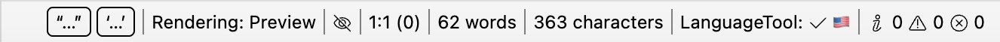
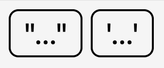
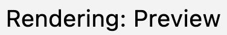
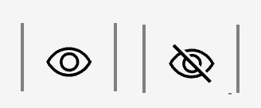
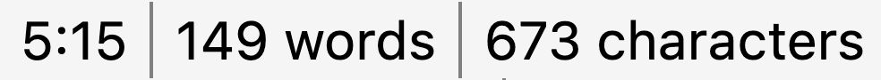
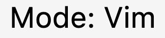
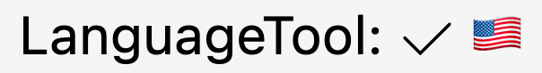
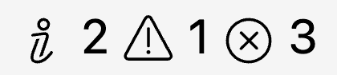
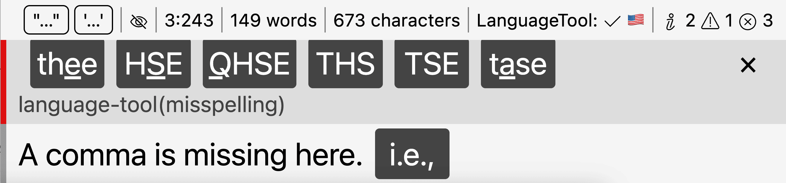

# Barra de status

A barra de status é um componente que exibe informações contextuais do documento aberto no momento e permite alterar rapidamente determinadas configurações que fazem sentido arquivo por arquivo.

Para ativar a barra de status, vá para preferências → “Aparência” → “Barra de status”. A barra de status está disponível em todos os documentos de texto editáveis, incluindo Markdown, LaTeX e vários editores de código no aplicativo.

**Observação:**

    A quantidade de itens disponíveis na barra de status varia de acordo com o tipo de arquivo e depende do contexto.

## Visão geral

A barra de status fica na parte inferior da visualização do editor. Permite acesso rápido a algumas ações úteis e mostra informações contextuais. Alguns elementos permitem alterar rapidamente certas configurações, tanto locais quanto globais.

Alguns elementos são exibidos condicionalmente (por exemplo, o item LanguageTool só é exibido se você ativar o serviço), alguns são puramente informativos, outros são interativos.

## Citações Mágicas

Magic Quotes é uma configuração que controla quais aspas o editor deve inserir quando você digita a tecla `"` ou `'` no teclado. Você pode alterar essa configuração de acordo com suas preferências. No entanto, especialmente para escritores bilíngues, faz sentido ter essas configurações disponíveis mais rapidamente.

O controle da barra de status para suas Citações Mágicas não é tão flexível quanto à configuração de preferências, pois só permite selecionar símbolos de cotação predefinidos, mas permite alterá-los rapidamente durante uma sessão de escrita.

**Observação:**

    Dependendo do idioma selecionado, o menu de contexto terá mais de uma entrada marcada. Muitos países utilizam o mesmo conjunto de cotações primárias e secundárias.

Exibições

: Sempre

Interação

: Clique com o botão esquerdo para alterar suas mágicas.

## Modo de renderização

Este controle permite alternar o modo de renderização entre “visualização” (WYSIWYG) e “bruto” (WYSIWYM). Isso permite que você alterne rapidamente entre a sintaxe pura do Markdown e a visualização de elementos pré-renderizados.

Exibições

: Sempre

Interação

: clique com o botão esquerdo para alternar entre visualização e bruto.

## Modo de legibilidade

O ícone “olho” permite ativar o modo de legibilidade. O ícone alternará entre um olho cruzado (modo de legibilidade desativado) e um olho (modo de legibilidade ativado).

Mantenha o cursor do mouse sobre o ícone para visualizar o modo de legibilidade atualmente ativo.

Exibições

: Sempre

Interação

: Clique com o botão esquerdo para alternar o modo de legibilidade.

## Posição do cursor, contadores de palavras e caracteres

Esses elementos mostram algumas informações contextuais do arquivo. Para cada arquivo (arquivos de código e Markdown), ele mostra a posição atual do cursor (linha e coluna), bem como a posição absoluta do documento.

Para arquivos Markdown, os elementos também incluem a contagem de palavras e caracteres do arquivo atual.

Exibições

: Sempre

Interação

: este elemento não é interativo.

## Modo de entrada

O controle do modo de entrada informa qual modo de entrada do editor está ativo no momento. Não aparece enquanto você está no modo normal, apenas nos modos Emacs e Vim.

Exibições

: Quando você usa o modo de entrada vim ou emacs.

Interação

: este elemento não é interativo.

## Status da ferramenta de idioma

Este controle mostra o status atual do linter do LanguageTool. Ele só mostra quando a integração do LanguageTool está ativa e examina os vários status que ela pode ter:

* Quando o LanguageTool estiver ocioso, ele mostrará uma marca de seleção para indicar que concluiu a verificação do seu texto e, ao lado, o idioma atual.
* Quando o LanguageTool estiver verificando seu texto, o ícone mudará para uma ampulheta para indicar que ele processou seu texto no momento.
* Se tiver ocorrido um erro, o ícone mudará para um símbolo de erro e uma breve mensagem de erro explicará o que está errado.

Quando você abre um arquivo, o LanguageTool inicia com o status inativo e exibe “auto” como idioma. Isso indica que o LanguageTool primeiro precisa detectar o idioma do seu texto. Após a primeira verificação, não aparecerá mais “auto”, mas apenas o idioma que está verificando.

Para alterar manualmente o idioma usado pelo LanguageTool, clique no ícone. Isso substituirá o idioma detectado automaticamente.

Exibições

: Quando a integração do LanguageTool está ativa.

Interação

: Clique para abrir um menu para selecionar o idioma do documento.

##Diagnóstico

Este controle exibe uma lista de mensagens de diagnóstico. Conforme descrevemos na seção [Idioma e estilo](../language-style/index.md), o Zettlr executa uma variedade de linters diferentes que podem sinalizar possíveis problemas, problemas de estilo e sugestões. O contador de diagnóstico oferece uma visão geral abrangente sobre como você está saindo.

O contador exibe o total de todos os três tipos de problemas: mensagens informativas (o ícone “i”), avisos (o triângulo com ponto de exclamação) e erros (o “x” circulado).

Você pode alternar o painel de diagnóstico clicando no controle. Isso abrirá o painel de diagnóstico abaixo da barra de status.

Este painel de diagnóstico lista todas as mensagens de diagnóstico cronologicamente. Você pode usar o teclado para navegar pelo painel de diagnóstico.

Exibições

: Sempre

Interação

: clique para alternar o painel de diagnóstico.