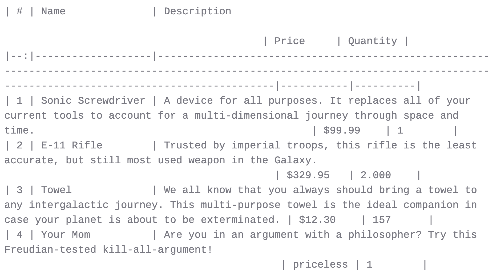
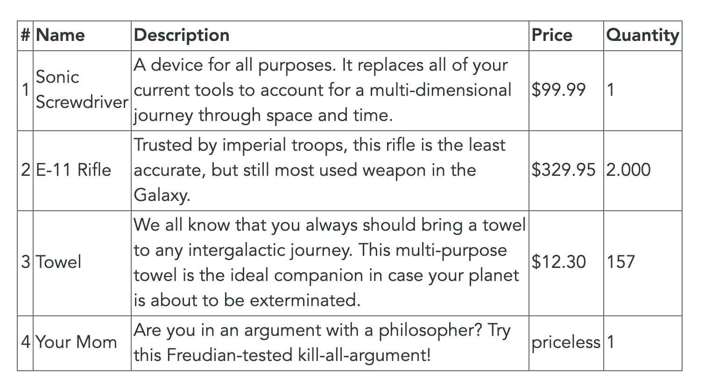
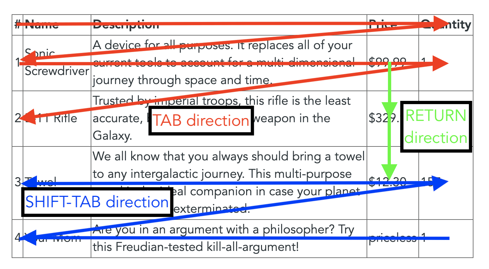
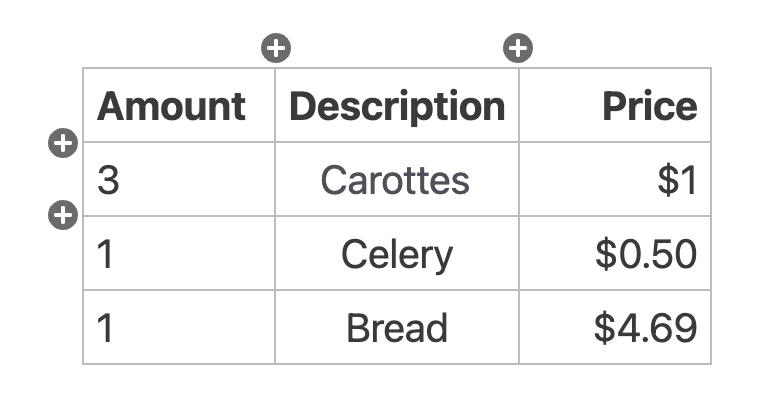
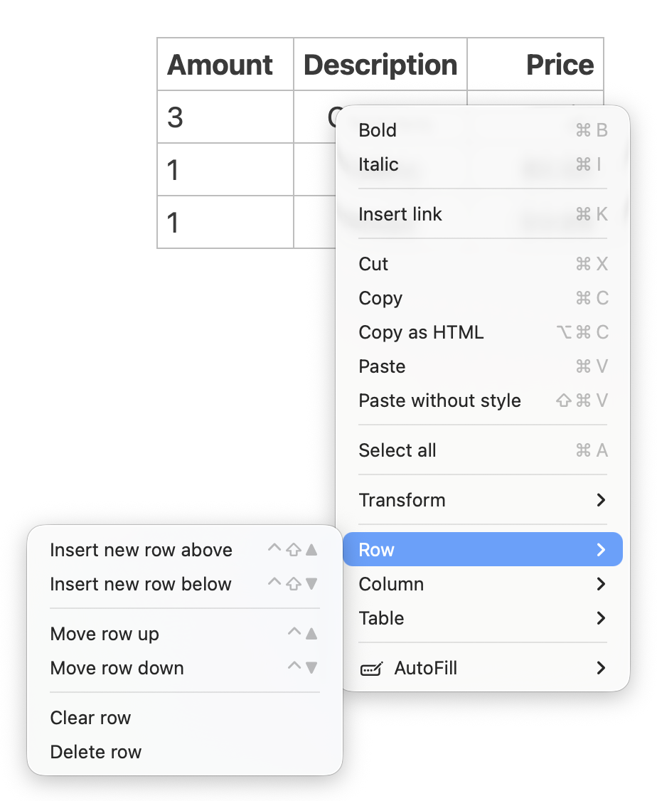

# Editor de tabela

Nesta página, apresentamos primeiro a anatomia das tabelas e, em seguida, a principal ferramenta para trabalhar com tabelas Markdown: o Editor de Tabelas.

## Introdução às tabelas

As tabelas no Markdown podem ser escritas em um de dois estilos: existem tabelas **grid** e existem tabelas **pipe**. Esses nomes referem-se à aparência da tabela.

Uma tabela de notas se parece com isto:

```markdown
+----------+----------+
| Cell A:A | Cell A:B |
+==========+==========+
| Cell B:A | Cell B:B |
+----------+----------+
```

Resultado:

<!-- NOTA: MkDocs não suporta tabelas de notas -->

| Célula A:A | Célula A:B |
|----------|----------|
| Célula B:A | Célula B:B |

A mesma tabela pode ser produzida com caracteres verticais:

```markdown
| Cell A:A | Cell A:B |
|----------|----------|
| Cell B:A | Cell B:B |
```

Resultado:

| Célula A:A | Célula A:B |
|----------|----------|
| Célula B:A | Célula B:B |

**Observação:**

A sintaxe completa para tabelas de notas pode ser encontrada no [manual Pandoc](https://pandoc.org/MANUAL.html#extension-grid_tables). A sintaxe para tabelas de tubos está localizada [aqui](https://pandoc.org/MANUAL.html#extension-pipe_tables).

Especifique o alinhamento das colunas da tabela com dois pontos (`:`). Dois pontos à esquerda ou nenhum especificam o alinhamento à esquerda padrão, enquanto dois pontos à direita especificam o alinhamento à direita e dois dois pontos especificam o alinhamento centralizado:

```markdown
| Amount | Description | Price |
|:-------|:-----------:|------:|
| 3      | Carottes    | $1    |
| 1      | Celery      | $0.50 |
| 1      | Bread       | $4.69 |
```

Resultado:

| Montante | Descrição | Preço |
|:-------|:-----------:|------:|
| 3 | Carotas | US$ 1 |
| 1 | Aipó | US$ 0,50 |
| 1 | Pão | US$ 4,69 |

Não importa como você alinha o conteúdo da tabela em seus documentos, já que os dois pontos colocados sejam de acordo. A tabela será exportada usando o alinhamento correto posteriormente.

As tabelas Markdown tendem a ficar bastante amplas devido aos muitos caracteres envolvidos e ao fato de que as tabelas pipe não suportam múltiplas linhas por células. Tomemos por exemplo o seguinte exemplo:

```markdown
| # | Name              | Description                                                                                                                                                                     | Price     | Quantity |
|--:|-------------------|---------------------------------------------------------------------------------------------------------------------------------------------------------------------------------|-----------|----------|
| 1 | Sonic Screwdriver | A device for all purposes. It replaces all of your current tools to account for a multi-dimensional journey through space and time.                                             | $99.99    | 1        |
| 2 | E-11 Rifle        | Trusted by imperial troops, this rifle is the least accurate, but still most used weapon in the Galaxy.                                                                         | $329.95   | 2.000    |
| 3 | Towel             | We all know that you always should bring a towel to any intergalactic journey. This multi-purpose towel is the ideal companion in case your planet is about to be exterminated. | $12.30    | 157      |
| 4 | Your Mom          | Are you in an argument with a philosopher? Try this Freudian-tested kill-all-argument!                                                                                          | priceless | 1        |
```

No Zettlr, seria parecido com o seguinte:



Embora cada célula da tabela esteja alinhada para se ajustar à largura total de cada coluna, é difícil trabalhar com tal tabela.

## Inserindo Tabelas

Como criar a estrutura básica de uma tabela pode ser complicado, o Zettlr inclui um recurso que pode gerar a sintaxe correta. Para inserir uma tabela em seu documento, clique no botão correspondente à barra de ferramentas que se parece com uma tabela.

Um pop-up será aberto mostrando uma nota. Quando você move o mouse sobre uma série, as células superiores esquerdas desta série serão destacadas. Mova o cursor do mouse até que a quantidade correta de colunas e linhas seja destacada e clique. O Zettlra irá então inserir o andaime básico para uma mesa de tubos desse tamanho.

## O Editor de Tabela

Para facilitar a criação de tabelas, o Zettlr vem com um editor de tabelas. O editor de tabelas detectará tabelas de tubos Markdown em seu documento e renderizará como tabelas reais que suportam quebra de linha e contêm bordas menos confusas.

Com o editor de tabelas, a tabela mencionada acima fica assim:



**Observação:**

    Devido à complexidade das tabelas de grau e, especialmente, à capacidade de produção de layouts muito complexos, o editor de tabelas oferece suporte apenas a tabelas de tubos.

### Editando Tabelas

Para editar tabelas com o editor de tabelas, clique em qualquer uma das células da tabela e comece a escrever. A sintaxe Markdown regular é suportada.

Sempre que uma célula estiver ativa, você verá a fonte Markdown da célula. Cada célula que não estiver ativa será renderizada como HTML para tornar a exibição menos confusa.

## Navegação pelo teclado

Ao editar uma tabela, os seguintes atalhos de teclado estão disponíveis:

- <kbd>Tab</kbd>: Move para a próxima célula. Se a última coluna estiver ativa, vá para a primeira célula da próxima linha. Se o cursor estiver na última coluna da última linha, uma nova linha será adicionada automaticamente.
- <kbd>Shift</kbd>+<kbd>Tab</kbd>: Move para a célula anterior. Se o cursor estava na primeira coluna, vá para a última célula da coluna anterior.
- <kbd>Return</kbd>: Move para a mesma coluna na próxima linha.
- <kbd>Shift</kbd>+<kbd>Enter</kbd>: Move para a mesma coluna na linha anterior.
- <kbd>Seta para cima</kbd>/<kbd>Seta para baixo</kbd>: Move para a mesma coluna na linha anterior/seguinte. Nenhuma nova linha será adicionada se você estiver na primeira ou na última linha.
- <kbd>Seta para a esquerda</kbd>/<kbd>Seta para a direita</kbd>: Mova o cursor para a esquerda/direita. Se o cursor estiver no início/fim do conteúdo da célula, vá para a célula anterior/seguinte.

Com esses atalhos, você pode inserir conteúdo facilmente em suas tabelas usando movimentos naturais. Você primeiro deseja preencher o cabeçalho da tabela e depois adicionar um conjunto de dados por linha. Portanto, <kbd>Tab</kbd> é seu amigo aqui:



## Adicionando linhas e colunas

O editor de tabelas também possui um conjunto de botões na borda da tabela. Isso permite adicionar uma nova linha ou coluna no local especificado.



Esses botões sempre aparecem na borda da célula atualmente ativa. Clique em qualquer célula da linha ou coluna à qual deseja adicionar uma nova linha ou coluna para mover esses botões para lá.

## Removendo linhas e colunas

Para remover uma linha ou coluna, basta clicar com o botão direito em qualquer célula da linha ou coluna que deseja remover. Em seguida, selecione o item correto do menu de contexto.



Através deste menu de contexto, você pode adicionar ou remover linhas e colunas, trocar linhas e colunas ou limpá-las (remover seu conteúdo). Você também pode limpar ou excluir a tabela inteira.

## Atalhos de teclado

Você tem vários atalhos de teclado disponíveis que facilitam o trabalho com tabelas e permitem evitar a abertura do menu de contexto em vários casos:

| Atalho de teclado | Função |
|-|-|
| <kbd>Guia</kbd> | Mover para a próxima célula (<kbd>Shift</kbd> para a célula anterior) |
| <kbd>Entrar</kbd> | Mover para a próxima linha (<kbd>Shift</kbd> para a linha anterior) |
| <kbd>Alt</kbd>+<kbd>Shift</kbd>+<kbd>ArrowUp</kbd><br>(macOS: <kbd>Ctrl</kbd>+<kbd>Shift</kbd>+<kbd>ArrowUp</kbd>) | Adicione uma linha antes da atual |
| <kbd>Alt</kbd>+<kbd>ArrowUp</kbd><br>(macOS: <kbd>Ctrl</kbd>+<kbd>ArrowUp</kbd>) | Troque a linha atual pela anterior |
| <kbd>Alt</kbd>+<kbd>Shift</kbd>+<kbd>ArrowDown</kbd> <br>(macOS: <kbd>Ctrl</kbd>+<kbd>Shift</kbd>+<kbd>ArrowDown</kbd>) | Adicione uma linha após a atual |
| <kbd>Alt</kbd>+<kbd>ArrowDown</kbd> <br>(macOS: <kbd>Ctrl</kbd>+<kbd>ArrowDown</kbd>) | Troque a linha atual pela próxima |
| <kbd>Alt</kbd>+<kbd>Shift</kbd>+<kbd>ArrowRight</kbd><br>(macOS: <kbd>Ctrl</kbd>+<kbd>Shift</kbd>+<kbd>ArrowRight</kbd>) | Adicione uma nova coluna à direita da atual |
| <kbd>Alt</kbd>+<kbd>ArrowRight</kbd><br>(macOS: <kbd>Ctrl</kbd>+<kbd>ArrowRight</kbd>) | Troque a coluna atual pela próxima |
| <kbd>Alt</kbd>+<kbd>Shift</kbd>+<kbd>SetaEsquerda</kbd><br>(macOS: <kbd>Ctrl</kbd>+<kbd>Shift</kbd>+<kbd>SetaEsquerda</kbd>) | Adicione uma nova coluna à esquerda da atual |
| <kbd>Alt</kbd>+<kbd>Seta para Esquerda</kbd><br>(macOS: <kbd>Ctrl</kbd>+<kbd>Seta para Esquerda</kbd>) | Troque a coluna atual pela anterior |
| <kbd>Shift</kbd>+<kbd>Cmd/Ctrl</kbd>+<kbd>K</kbd> | Exclua a coluna atual |
| <kbd>Cmd/Ctrl</kbd>+<kbd>Backspace</kbd> | Limpa a coluna atual (ou seja, insira espaços em branco) |
| <kbd>Shift</kbd>+<kbd>Cmd/Ctrl</kbd>+<kbd>Backspace</kbd> | Limpa a linha atual (ou seja, insira espaços em branco) |
| <kbd>Alt</kbd>+<kbd>Shift</kbd>+<kbd>Cmd/Ctrl</kbd>+<kbd>Backspace</kbd> | Limpar a tabela inteira |
| <kbd>Ctrl</kbd>+<kbd>C</kbd> | Alinha o centro da coluna atual |
| <kbd>Ctrl</kbd>+<kbd>L</kbd> | Alinha a coluna atual à esquerda |
| <kbd>Ctrl</kbd>+<kbd>R</kbd> | Alinha a coluna atual à direita |
| <kbd>Cmd/Ctrl</kbd>+<kbd>Shift</kbd>+<kbd>A</kbd> | Alinha a tabela no cabeçalho de seleção principal (não à esquerda/direita/centro, mas adicione a cobertura adequada para que seja bem formatada. Solicite uma fonte monoespaçada para visuais adequados.) |

## Tabelas complexas

Às vezes, você encontrará a necessidade de inserir tabelas mais complexas com células abrangendo várias colunas e/ou linhas. Neste caso, o editor de tabelas não está disponível.

Você pode usar tabelas de notas. Zettlr oferece suporte ao realce de sintaxe deles, mesmo que o editor de tabelas não consiga lidar com eles. Alguns atalhos de teclado ainda funcionarão, mesmo em tabelas de grau.

Se as tabelas de notas forem insuficientes, você pode inserir tabelas também em outra linguagem, como HTML ou LaTeX, dependendo de onde deseja exportar o documento.

O que você pode fazer neste caso é incluir tabelas como código-fonte LaTeX bruto ou HTML. Existem ótimas ferramentas para [transformar seu RDataset](https://tex.stackexchange.com/questions/364225/export-tables-from-r-to-latex) ou arquivo de dados STATA em LaTeX ou HTML e incluir tabelas de regressão complexas por meio de sintaxe de marcação bruta.

Para incluir esse arquivo em um projeto de pesquisa maior, você pode usar o [recurso de projeto](../file-manager/projects.md) do Zettlr.