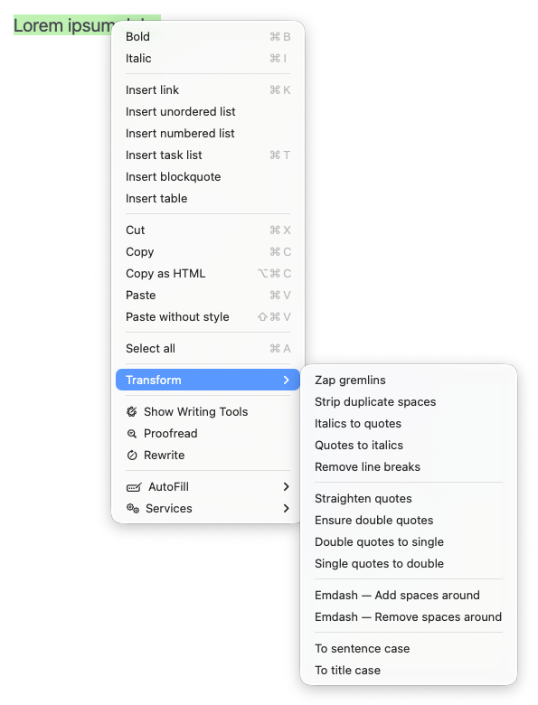

# Transformações de texto

Uma parte frequente do fluxo de trabalho de redação acadêmica é recortar e colar textos citados de sites ou de PDFs de artigos e capítulos de livros nos documentos que você está escrevendo. Você sem dúvida está familiarizado com um aborrecimento comum que surge com isso – o texto colado geralmente inclui formatação indesejada. Uma passagem colada de um PDF com colunas estreitas de texto, por exemplo, pode conter inúmeras quebras de linha. Alguns designers de documentos substituem aspas duplas por pares de aspas simples. E assim por diante.

Outro problema frequente é que elementos do texto colado – ou mesmo do texto que você mesmo escreveu – podem precisar ser alterados para ajustes ou guia de estilo no qual você está escrevendo. Um título que aparece entre aspas pode precisar ser alterado para itálico. Os títulos das frases podem precisar ser capitalizados. Ou vice-versa.

Esses são os tipos de tarefas manuais - e muitas vezes repetitivas - que clamam por automação, e é aí que ambos os recursos de transformação do Zettlr. Para usá-los, basta selecionar uma região do texto no editor e clicar com o botão direito para abrir um menu de contexto. Lá você encontrará um submenu chamado “Transformar”, que contém inúmeras operações comuns para limpar texto colado.

## Zap Gremlins

Um poderoso recurso de editores de texto de programação, “Zap gremlins” remove formatação oculta, como espaços inseparáveis​​e codificações de caracteres problemáticos do texto. São caracteres invisíveis que às vezes são inseridos intencionalmente pelos designers de páginas para ajustar a aparência de um documento; outras vezes, eles são introduzidos acidentalmente quando um arquivo é convertido ou salvo incorretamente. Quando colados em seu documento Zettlr, os gremlins podem interferir na aparência e na exportação do seu texto.

O termo “[gremlins](https://fluffyandflakey.blog/2024/03/21/rooting-out-gremlins/)” refere-se ao fato de que esses caracteres de formatação ocultos não são óbvios – talvez você não consiga saber que eles estão lá apenas olhando o documento. Mas se uma passagem colada em seu documento estiver se comportando ou exportando de maneira estranha, tente aplicar “Zap gremlins” ao texto problemático para ver se isso resolve o problema.

## Remove espaços duplicados

Existem vários cenários em que o texto pode conter espaços extras indesejados. Alguns visualizadores de PDF substituem quebras de linha por espaços duplicados quando você copia o texto deles para a área de transferência. Documentos de texto simples, como arquivos `README`, podem adicionar espaços repetidos para ajustar a aparência do texto. Os autores da era da máquina de escrever podem colocar dois espaços após cada ponto final. “Remover espaços duplicados” remove esses espaços indesejados.

## Itálico para aspas e aspas para itálico

Algumas guias de estilo colocam os títulos das principais obras, como livros ou filmes, em itálico, enquanto outros pedem que você os coloque entre aspas. Essas transformações permitem alternar facilmente entre os dois.

## Remover quebras de linha

O texto colado de PDFs geralmente contém quebras de linha que precisam ser removidas quando uma passagem acima é inserida no documento que você está escrevendo. Isto é particularmente cansativo quando o PDF contém colunas estreitas de texto e, portanto, quebras de linha frequentes. E, claro, o texto colado de outros documentos também pode conter quebras de roda indesejadas. “Remover quebras de linha” elimina-as, ao mesmo tempo que preserva as quebras intencionais entre os parágrafos.

## Endireitar orientações

Muitos documentos contêm aspas inteligentes (também conhecidas como aspas curvas) que, na melhor das hipóteses, são inúteis no Zettlr e, na pior das hipóteses, podem interferir na formatação preferida durante a exportação. Essa transformação substitui aspas curvas por aspas retas.

## Garanta aspas duplas

Alguns designers de páginas substituem aspas duplas por um par de aspas simples para efeito visual. Se você estiver recortando e colando um PDF de um livro ou artigo de jornal com este problema, você pode transformar esses pares de aspas simples novamente em aspas duplas com `Ensure double quotes`. Essa transformação também funciona para texto colado de documentos LaTeX, nos quais a direção das aspas duplas é geralmente especificada usando um par de crases (\`\`) ou aspas simples ('').

## Aspas duplas para simples e aspas simples para duplas

Se você estiver citando uma passagem em seu documento que contém o texto citado, poderá ser necessário transformar as aspas duplas do original em aspas simples. Por exemplo, a passagem…

> Durante este período, os significados de “vivacidade” e “presença” eram indistinguíveis dos discursos ocidentais de modernização.

…torna-se…

> Lisa Parks argumenta que “durante este período, os significados de ‘vivacidade’ e ‘presença’ eram indistinguíveis dos discursos ocidentais de modernização”.

Certos guias de estilo também podem especificar uma preferência por aspas simples ou duplas. Essas duas transformações ajudam você a alternar facilmente entre esses cenários.

## Adicione ou remova espaços ao redor dos traços

Acadêmicos e, ocasionais, outros escritores, podem ser prolíficos no uso de hífens ao longo de conhecidos como travessões (`—`), mas as guias de estilo interessantes sobre como esses caracteres devem ser acompanhados por um espaço em cada lado. A maioria dos livros não prefere espaços em torno de travessões (por exemplo, “…ele argumentou – em uma curiosa mistura de metáforas…”), enquanto alguns artigos e muitos sites proeminentes, o _New York Times_ entre eles, usam espaços (por exemplo, “Não é um filme sobre monstros – é um filme sobre nós.”). Essas transformações permitem alternar facilmente entre os dois cenários ao adaptar seu texto para publicação.

## Para autoridades e minuciosas da frase e para autoridades e subsidiárias do título

Dependendo do editor para o qual você está escrevendo, os títulos dos documentos ou outras passagens em seu texto podem precisar ser alterados de autoridades e subsidiárias (por exemplo, “Resultados e análise”) para níveis secretos e básicos de título (por exemplo, “Resultados e Análise”) ou vice-versa. Essas transformações permitem alternar facilmente entre os dois.

Observe que diferentes guias de estilo têm diferentes regras de capitalização para títulos com guardas. Desta forma, você deve verificar se um título foi alterado para os guardiões usando uma transformação compatível com o estilo usado pelo seu editor. Para consistência com outras ferramentas de software comuns, essas duas transformações usam as mesmas regras de capitalização para alternar entre autoridades e empregadas domésticas pelo Zotero.