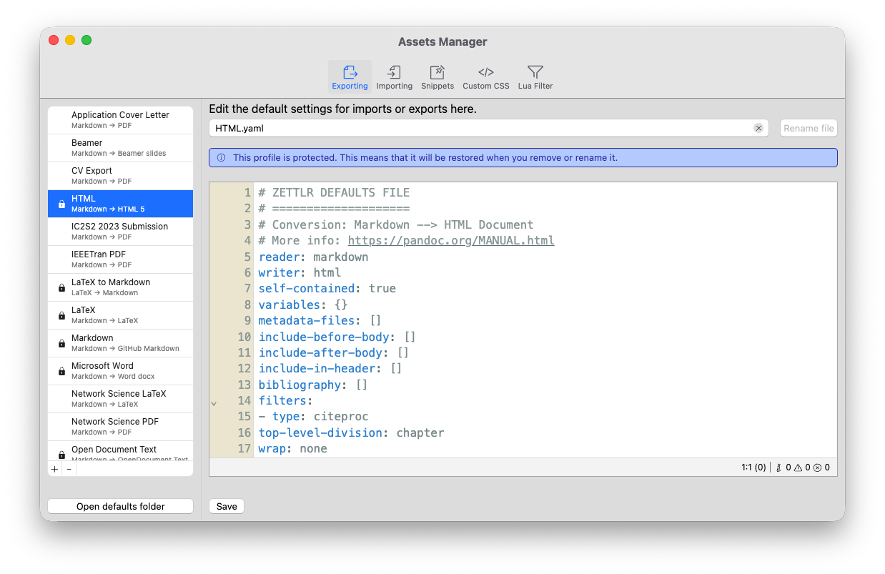

# Gerente de Ativos

O gerenciador de ativos permite editar diretamente muitos dos arquivos necessários para importar e exportar arquivos. Ele pode ser aberto via “Arquivo” → “Preferências” → “Gerenciador de Ativos” (macOS: “Zettlr” → “Gerenciador de Ativos”) ou pressionando <kbd>Cmd/Ctrl</kbd>+<kbd>Alt</kbd>+<kbd>,</kbd>.

O gerenciador de ativos oferece cinco guias que permitem editar vários tipos de arquivos:

1. Exportação e importação de perfis ([veja nosso guia](./defaults-files.md))
2. Snippets ([veja nosso guia](../editor/snippets.md))
3. Seu CSS personalizado ([consulte nosso guia](../guides/custom-css.md))
4. Filtros Lua ([veja nosso guia](./lua-filters.md))

## Usando o Gerenciador de Ativos

Exceto pela visualização CSS personalizada, todas as guias apresentam a mesma estrutura básica. À esquerda, você sempre verá uma lista de todos os arquivos relevantes. Abaixo desta lista você encontrará um botão que abrirá a pasta correspondente, se aplicável. No lado direito, você verá primeiro um campo de texto que permite renomear um arquivo. Abaixo disso, você verá um editor de código que permite editar diretamente este arquivo, usando o realce de sintaxe adequado e um linter para verificar se há erros em seu código.
