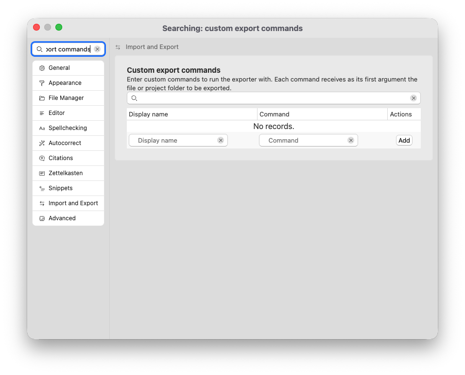

# Comandos personalizados

Para alguns fluxos de trabalho, é necessário tratar seus arquivos de maneira diferente daquela em que o mecanismo de exportação integrado é capaz. Para isso, você pode especificar comandos personalizados.

Para adicionar comandos personalizados à lista disponível de opções de exportação, abra as opções → “Importar e Exportar” → “Comandos de exportação personalizados”.

Escolha um “Nome de exibição” que será exibido na exportação de arquivo exclusivo e nas propriedades do projeto e definição de um comando. Este comando deve estar em seu PATH ou ser especificado com um caminho absoluto. Este caminho não deve conter espaços.

## Como funcionam os comandos de exportação personalizados

Quando você seleciona um comando de exportação personalizado para exportar seus documentos Markdown, o Zettlr não iniciará seu próprio mecanismo de exportação. Em vez disso, ele chamará seu comando e percorrerá o caminho absoluto para os arquivos que devem ser selecionados. Seu comando é responsável por tratar os arquivos relevantes, realizar a exportação e quaisquer outras ações necessárias.