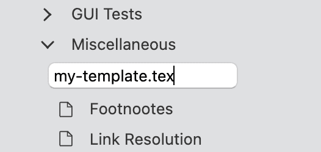
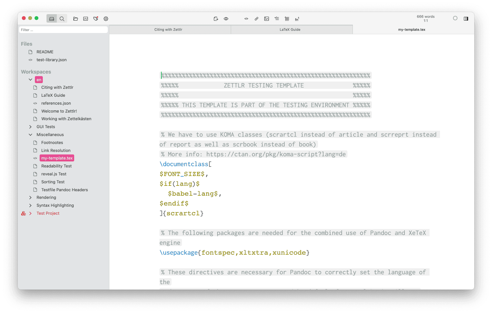
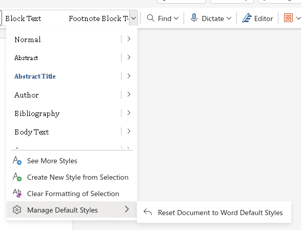

# Modelos personalizados e documentos de referência

Embora os perfis fornecidos pelo Zettlr sejam suficientes para muitos casos de uso, você pode querer ou precisar implementar modelos personalizados. Isso pode significar adaptar um dos [muitos ótimos modelos LaTeX que outras realizações](https://tex.stackexchange.com/questions/1319/showcase-of-beautiful-typography-done-in-tex-friends) às suas necessidades e usá-lo. Ou pode significar que você deseja adaptar um modelo existente para uma conferência ou jornal para preparar seu artigo para submissão.

Independentemente de qual seja o seu caso de uso, você precisará adotar um modelo existente para funcionar como o Pandoc.

**Observação:**

  Usaremos dois termos nesta seção: “modelo” e “documento de referência”. Um modelo é um arquivo que contém a sintaxe do modelo do Pandoc para permitir que o Pandoc insira seus documentos Markdown nesse modelo. Um documento de referência é apenas isso: uma *referência* da qual o Pandoc pode *copiar* estilos para preencher um novo arquivo.

Quase todos os formatos de exportação usam modelos, com exceção dos formatos binários complexos. Atualmente, isso inclui arquivos do Word, arquivos do LibreOffice e apresentações do Powerpoint. Leia mais na [documentação do modelo](https://pandoc.org/MANUAL.html#templates) do Pandoc.

## Sobre modelos personalizados e documentos de referência

Modelos e documentos de referência são o que impulsionam o mecanismo de exportação do Pandoc. Os modelos permitem que você crie estilos complexos e individuais que transformam seus documentos Markdown em algo bonito. Os documentos de referência funcionam de forma semelhante, com mais algumas limitações, pois suportam apenas a alteração dos estilos do seu conteúdo, não sendo necessária a alteração de todo o layout.

Um **modelo** é qualquer arquivo fonte de texto simples que contenha convenções de estilo e layout, além de algumas cláusulas de modelo. Pandoc pegará esse modelo, converterá seu arquivo para a sintaxe de destino correta, incorporará-lo no modelo e gravará o arquivo inteiro no disco. Para ver a aparência desse modelo, [consulte o diretório de modelos do Pandoc](https://github.com/jgm/pandoc/tree/main/data/templates).

Um **documento de referência** funciona de maneira um pouco diferente dos modelos. Um modelo permite que você especifique diretamente onde deseja que o conteúdo do seu documento Markdown vá; um documento de referência não. Em vez disso, um documento de referência especifica algumas regras de composição e estilo, que o Pandoc copiará para um novo documento que forma o arquivo real que você exportará.

Nascemos a seguir, descrevemos primeiro os princípios básicos da modelagem, a sintaxe do modelo do Pandoc e, finalmente, como funcionam os documentos de referência. Usaremos LaTeX como exemplo de como funciona a modelagem, mas os mesmos princípios se aplicam a todos os outros modelos, como HTML.

## Criando um modelo personalizado

Cada modelo personalizado consiste aproximadamente em pelo menos dois, às vezes três arquivos, que você precisa criar:

1. O próprio modelo. Abaixo, apresentaremos amplamente os fundamentos da modelagem.
2. Um perfil que usa este modelo.
3. Opcional: especialmente se você definir muitas variáveis ​​personalizadas para um modelo, é uma boa ideia criar um snippet para acompanhar o modelo.

**Dica:**

Para obter um guia completo sobre como pegar um modelo existente e adaptá-lo para uso no Zettlr, consulte nosso [guia de modelos para envio de periódicos](../guides/journal-latex-template.md).

Vamos escrever seu primeiro modelo LaTeX, que pode ser feito diretamente no Zettlr. Quando concluído, seu arquivo de modelo será passado para Zettlr, Citeproc (se aplicável), Pandoc e, finalmente, LaTeX.

Primeiro, crie um novo arquivo TeX (“Arquivo” -> “Novo Arquivo” ou clicando com o botão direito em uma pasta). -se usar a extensão do nome do arquivo `.tex`. Comece a escrever seu modelo LaTeX e salve seu arquivo.



O Zettlr mudará automaticamente o destaque do código de Markdown para LaTeX, e um pequeno indicador `TeX` aparecerá abaixo do nome do arquivo na lista de arquivos.



### Noções básicas de modelagem Pandoc

Você pode usar muitas variações diferentes nos modelos Pandoc, dependendo de suas necessidades. Os modelos padrão do Pandoc já contêm muitas variações de russas que estão documentadas lá. No entanto, você é livre para não usar variáveis ​​que considere não importantes, e pode até introduzir suas próprias variáveis ​​usando o mecanismo de templates do Pandoc. Por exemplo, suponhamos que você queira adicionar informações adicionais a algumas, mas não a todas as suas exportações. Então você poderia definir uma variável `my-variable` e definir se em todos os fronts YAML onde os arquivos exportados devem conter essa informação:

```markdown
---
title: "My file title"
date: 2021-10-18
my-variable: "Some additional piece of information"
---
```

Dentro do seu modelo, você precisaria fazer algo com esta variável:

```
$if(my-variable)$
This is some text that will only be contained if "my-variable" has been defined.

You can even insert the contents of the variable by typing $my-variable$.
$endif$
```

**Observação:**

Observe que isto é apenas um exemplo. Um exemplo mais completo que sem dúvida leva o princípio das variáveis ​​ao máximo, consulte [este modelo de curriculum vitae](https://github.com/nathanlesage/cv).

Embora muitas variáveis ​​sejam independentes, há uma variável Pandoc que precisa estar presente o tempo todo:

```
$body$
```

Pandoc substituirá esta variável pelo conteúdo do(s) seu(s) arquivo(s) Markdown. Se você omitir, seu conteúdo não aparecerá no arquivo de saída.

### Garantindo compatibilidade com Pandoc

Um problema com modelos e dados é que o Pandoc às vezes precisa fazer suposições sobre como representar os dados na sintaxe de destino. Para garantir que tudo funcione bem, você precisa incluir o seguinte em qualquer um de seus modelos LaTeX:

```latex
$common.latex()$
```

Esta cláusula diz ao Pandoc para incluir algum código que garanta que seu conteúdo será exportado sem erros.

**Aviso:**

Com as novas atualizações do Pandoc, as etapas necessárias para garantir que seu modelo funcione com o Pandoc podem mudar. Sempre consulte o [modelo Pandoc LaTeX padrão atual](https://github.com/jgm/pandoc/blob/main/data/templates/default.latex) se algo parecer errado.

### Crie um perfil para seu modelo

Depois de adaptar seu modelo para funcionar com o Pandoc, você precisará criar um perfil para que ele funcione. Para fazer isso, abra o gerenciador de ações com o atalho do teclado <kbd>/Cmd/Ctrl</kbd>+<kbd>Alt</kbd>+<kbd>,</kbd> ou a entrada de menu correspondente. -se de estar nos perfis de “exportação” e adquirir o perfil de exportação XeLaTeX padrão.

Concentre-se no campo de texto do nome do arquivo, altere o nome para um novo nome reconhecível e clique em “Renomear”. Isso criará uma cópia do perfil que você pode adaptar agora. A única configuração que você definitivamente precisa adaptar é definir a chave `template`. Por exemplo:

```yaml
# ... some settings
reader: markdown
writer: pdf
pdf-engine: xelatex
template: "/path/to/your/template.tex" # <-- new
# ... other settings
```

Coloque o caminho para o seu modelo entre aspas, apenas para garantir. Claro, dependendo do necessário para que o modelo funcione bem, você pode querer adaptar outras configurações.

**Alerta**

Assim que você especificar `template` em um perfil, não especifique um modelo nas propriedades do seu projeto e não use esse perfil com um projeto que requer um modelo personalizado! Se você especificar um modelo de projeto personalizado nas propriedades do projeto, isso substituirá o modelo definido em seu perfil. Isso significa que o Zettlr usará as configurações do seu perfil personalizado, mas sem o modelo que o acompanha, ou que trará resultados inesperados.

### Opcional: Defina um novo snippet para este modelo

Esta etapa é opcional para a maioria dos modelos, mas será útil se você tiver um modelo que defina muitas variáveis, não padrão, úteis que você pode usar. Ao criar um novo snippet que defina todas as novas variáveis ​​possíveis e forneça alguns valores padrão, você não precisa se lembrar de todas as variáveis ​​que pode usar ao exportar com seu modelo personalizado.

Por exemplo, se você criar um modelo para uma carta de apresentação de aplicativo que permite especificar um endereço, uma linha de assunto e vários tipos de informações, você pode querer criar um snippet semelhante ao seguinte:

```yaml
---
fontsize: 12pt # Sets the font size
sans_style: ${1:true} # Allows switching between sans and serif style
author:
  # You may want to hard-code these variables
  firstname: ${2:First name}
  lastname: ${3:Last name}
  email: "${4:john.doe@example.com}"
subject: "$5"
to_address:
  - "${6:Name}"
  - "${7:Department}"
  - "${8:Institution/University}"
  - "${9:Street}"
  - "${10:Country}"
---
```

Isso permite que você use todas as variáveis personalizadas do seu modelo. Idealmente, você nomearia o snippet com algo semelhante ao seu perfil (e ao seu arquivo de modelo!).

## Criando um documento de referência personalizado

Depois de introduzir os modelos, agora é hora de apresentar o conceito de **documentos de referência** do Pandoc.

### Criando um documento de referência

Se você estiver exportando para um formato que requer um documento de referência em vez de um modelo personalizado, como o Microsoft Word (`.docx`), você poderá fazer isso especificando um documento de referência. Este é simplesmente um documento do Word existente que usa suas predefinições de estilo preferido (por exemplo, as fontes ou outros atributos de estilo que você atribuiu a elementos diferentes, como `Title`, `Heading 1`, `Body Text`, etc.). Quando o Zettlr exporta seu documento para um arquivo `.docx`, ele examinará este documento de referência para determinar quais estilos usar.

Se você não tiver certeza de como definir estilos em seu processador de texto, aqui estão alguns guias úteis para fazer isso:

- [Microsoft Word](https://support.microsoft.com/en-us/office/customize-or-create-new-styles-d38d6e47-f6fc-48eb-a607-1eb120dec563)
- [Páginas da Apple](https://support.apple.com/guide/pages/intro-to-paragraph-styles-tanaa39b0aa3/mac)
- [Escritor do LibreOffice](https://help.libreoffice.org/latest/en-US/text/shared/01/styles.html?&DbPAR=SHARED&System=UNIX)
- [Somente Editor de Documentos do Office](https://helpcenter.onlyoffice.com/docs/userguides/document_editor/formattingpresets.aspx)
- [Documentos Google](https://it.umn.edu/services-technologies/how-tos/google-docs-apply-modify-heading-styles)

Se o seu processador de texto salvar na nuvem – ou se salvar por padrão em um formato diferente de `.docx` – lembre-se de que depois de definir seus estilos, você precisará exportar/salvar uma cópia _local_ do seu documento no formato `.docx`.

### Personalizando o documento de referência padrão do Pandoc

O conteúdo do seu documento de referência não é importante, pois contém exemplos de estilos que você usará nos documentos de sua autoria no Zettlr. Se precisar de um ponto de partida, você pode começar a usar o documento de referência personalizado do Pandoc. Pandoc permite exportar seu documento de referência (veja abaixo). Este documento de referência contém uma amostra dos diferentes elementos de texto – títulos, corpo do texto, legendas, etc. – que o Zettlr pode exportar. Abra o documento no Microsoft Word ou em seu processador de texto favorito, reformate cada elemento conforme necessário e atualize os estilos do documento de acordo. Lembre-se de salvar o documento como um arquivo `.docx` quando terminar.

Para exportar um documento de referência personalizado para qualquer um dos formatos disponíveis, você pode executar um dos comandos a seguir. Uma “referência personalizada” tornará o novo nome do arquivo.

```bash
# Exportar o documento de referência do Word
pandoc -o custom-reference.docx --print-default-data-file reference.docx
# Exportar o documento de referência do OpenOffice/LibreOffice
pandoc -o custom-reference.odt --print-default-data-file reference.odt
# Exportar o documento de referência do PowerPoint
pandoc -o custom-reference.pptx --print-default-data-file reference.pptx
```

Então, você pode abrir esses arquivos e adaptar os estilos conforme explicado acima.

**Dica:**

Se você estiver usando o Microsoft Word como processador de texto e quiser exportar usando a folha de estilos padrão do Word, você pode abrir o arquivo `custom-reference.docx` no Word e selecionar a divisa apontando para baixo (⌄) que aparece ao lado da paleta de estilos. Isso gerará um menu suspenso que inclui um submenu intitulado “Gerenciar estilos padrão”. Navegue até este submenu e escolha “Redefinir documento para estilos padrão do Word”. Isso aplicará todos os estilos padrão do Microsoft Word ao seu documento de referência.



### Criando um perfil de exportação personalizado

Depois de criar e salvar seu documento de referência (ou decidir sobre um arquivo `docx` existente que você gostaria de usar para esse específico), você precisará apontar o Zettlr para ele. No Zettlr, abra o Gerenciador de ativos. Na guia “Exportar”, você verá um perfil de exportação “Microsoft Word”.

Selecione e clique no campo de texto do nome do arquivo. Mude o nome para outro nome reconhecível e clique em “Renomear”. Isso criará uma cópia deste perfil que você pode adaptar.

A única configuração que você deve ajustar é a configuração “reference-doc”:

```yaml
reference-doc: /path/to/your/custom-reference.docx
```

Você pode alterar quaisquer configurações adicionais conforme desejar e conforme necessário para sua exportação personalizada.

**Observação:**

Os usuários do Windows precisam ter certeza de duas coisas. Primeiro, certifique-se de usar barras (`/`) em vez de barras invertidas (`\`) ao especificar o local do seu documento de referência. Os usuários do Windows também devem colocar o arquivo local entre aspas, assim:
    
```
	reference-doc: "C:/Users/user/Documents/Custom Templates/custom-reference.docx"
	```

## Usando seu modelo personalizado

Para usar seu modelo personalizado, basta selecionar o perfil correspondente que você criou ao exportar um arquivo individual ou selecionar o perfil nas propriedades do seu projeto. Lembre-se de que para projetos você não deve especificar um modelo personalizado se planeja usar um perfil de exportação especial que vem com seu próprio modelo.