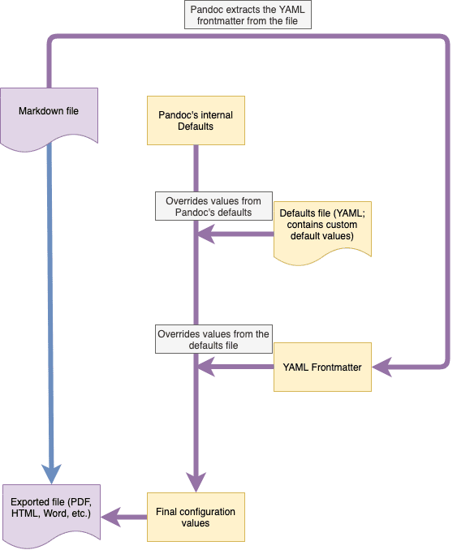

# Arquivos padrão (perfis)

Arquivos padrão (que também chamamos de “perfis”) são uma forma de definir valores padrão para muitas das variáveis ​​que o Pandoc usa internamente para facilitar suas e exportações. Os arquivos padrão se assemelham aos [assuntos iniciais do YAML](../editor/yaml-frontmatter.md), mas são mais poderosos e se aplicam a todos os seus arquivos em vez de apenas um único.

Você pode visualizar e modificar todos os arquivos padrão no [gerenciador de ativos](./assets-manager.md).

**Dica:**

    Os perfis padrão do Zettlr funcionam imediatamente e devem ser suficientes para a maioria dos casos de uso. Se você sentir necessidade de editá-los, exporte um arquivo de teste várias vezes antes de terminar.

## O que são arquivos padrão?

Arquivos padrão, ou perfis, são arquivos YAML que contêm configurações que controlam como o Pandoc exportará seus arquivos. Eles residem na sua pasta de dados do usuário e podem ser editados no [gerenciador de ativos](./assets-manager.md).

O Zettlr requer um determinado conjunto de arquivos padrão para permitir que os usuários exportem arquivos imediatamente sem precisar configurar nada primeiro. Ao abrir o gerenciador de ativos, você pode identificar esses arquivos pelo ícone de cadeado que indica seu status como “protegido”.

Sempre que você renomear um perfil protegido, o Zettlr irá recriá-lo imediatamente. Você pode aproveitar esse comportamento para fazer uma cópia eficaz de um desses arquivos padrão. Da mesma forma, quando você exclui um arquivo protegido, o Zettlr irá recria-lo, o que permite uma atualização eficiente do arquivo para o padrão.

Além desses arquivos protegidos, você pode adicionar quantos perfis adicionais desejar. Dê-lhes nomes notáveis ​​para que você possa encontrá-los na lista suspensa de formatos de exportação mais tarde.

**Observação:**

A documentação completa sobre o que você pode fazer com arquivos padrão pode ser encontrada no [manual Pandoc](https://pandoc.org/MANUAL.html#default-files). -se de consultar esse manual ao editar arquivos padrão.

## Requisitos para arquivos padrão

Os arquivos padrão (também chamados de “perfis”) usados ​​pelo Zettlr têm um requisito simples que você deve ter em mente ao editá-los: Eles devem possuir uma propriedade válida `reader` e `writer`.

Normalmente, o Pandoc pode inferir o leitor e gravador correto a partir das extensões de nome de arquivo, mas o Zettlr precisa saber para qual conversão um perfil está sendo usado para oferecer as opções corretas nos locais corretos. Essas propriedades (a) tornam a conversão específica e transparente e (b) ajudam o Zettlr a determinar se o perfil pode ser usado para *importar* arquivos ou se é usado para *exportar* arquivos.

Se a propriedade `writer` for um gravador compatível com Markdown, isso significa que o perfil será considerado um perfil de importação, pois o resultado da conversão é um documento Markdown. Da mesma forma, se a propriedade `reader` para um leitor compatível com Markdown, isso significa que o perfil é considerado um perfil de exportação.

Se essas propriedades estiverem faltando, o Zettlr indicará que o perfil é inválido e você precisará corrigi-lo antes de poder usá-lo.

**Observação:**

    Zettlr inclui um linter que verifica se há erros nos perfis. Quando você salva um perfil e o Zettlr não recupera, isso geralmente significa que o arquivo pode ser usado. No entanto, o Zettlr não pode verificar se, por exemplo, todos os seus caminhos estão corretos, portanto, esta é apenas uma condição e não suficiente para a integridade de um perfil.

Pandoc suporta extensões Markdown (ou seja, para definições inteligentes, emojis, etc.). Eles são especificados adicionando-os após as propriedades `reader` ou `writer` usando sinais `+`. Se precisar de extensões para o leitor Markdown padrão, você pode adicionar as propriedades `reader` ou `writer`. Da mesma forma, se uma extensão estiver habilitada por padrão, você pode usar um sinal `-` para desativá-la.

Por exemplo, uma string de leitor completa que permite algumas extensões poderia ser `reader: markdown+definition_lists+mmd_title_block+bracketed_spans+fenced_divs`. Isso usará o leitor Markdown e o configurará para oferecer suporte a listas de definição, blocos de título multi-markdown, intervalos entre colchetes e divs protegidos. As diversas extensões são descritas [na documentação do Pandoc](https://pandoc.org/MANUAL.html#extensions).

## Qual variável substitui qual?

Um problema que você pode encontrar ao exportar arquivos é que às vezes as variáveis ​​que você define no front-assunto YAML são ignoradas, enquanto a mesma variável funciona em arquivos padrão e vice-versa.

É fundamental entender como o Pandoc determina o conjunto final e eficaz de parâmetros que utilizará para facilitar sua importação ou exportação. No gráfico abaixo você pode ver como o Pandoc resolve a configuração final para executar uma transformação de formato de documento.

Primeiro, o Pandoc carregará seus próprios padrões internos que estão codificados no binário. Qualquer variável que você não definir será definida com algum padrão definido pelo Pandoc.

Em seguida, o Pandoc carregará o arquivo padrão fornecido pela Zettlr. Cada variável definida lá substituirá o padrão na configuração do Pandoc.

Por último, Pandoc analisará o(s) assunto(s) YAML do(s) arquivo(s) que você está tentando importar ou exportar no momento. Essas variáveis ​​podem substituir aquelas definidas pelos arquivos padrão, mas geralmente não todas. Você pode notar que os arquivos padrão podem conter um campo de metadados e qualquer valor nele geralmente pode ser substituído por uma propriedade YAML de front-matéria. Consulte a documentação sobre [assuntos frontais do YAML](../editor/yaml-frontmatter.md) para obter mais informações.

**Exemplo**: Suponhamos que você tenha definido um `title` para todas as suas exportações do Word no arquivo padrão do gravador `docx`. Caso você não utilize nenhuma matéria frontal, esta variável será utilizada para todos e qualquer exportação para Word. Mas se você especificar a propriedade `title` dentro de um YAML frontal, este arquivo – quando exportado para Word – terá seu próprio conjunto de títulos.

**Dica:**

Um caso de uso comum para definir variáveis​​dentro de um arquivo padrão que você também pode definir no nível de frontmatters YAML seria a propriedade `lang`. Por padrão, o Pandoc define o idioma de cada importação e de cada exportação como `en-US`, gerando delimitadores de números e aspas norte-americanos. Se você exporta regularmente para, além, francês, pode fazer sentido definir a propriedade `lang` diretamente em seus arquivos padrão para `fr` para que os arquivos sejam exportados usando esse código de idioma por padrão. Então você ainda pode substituir a propriedade por algo diferente em arquivos individuais, definindo a variável frontmatter YAML correspondente.