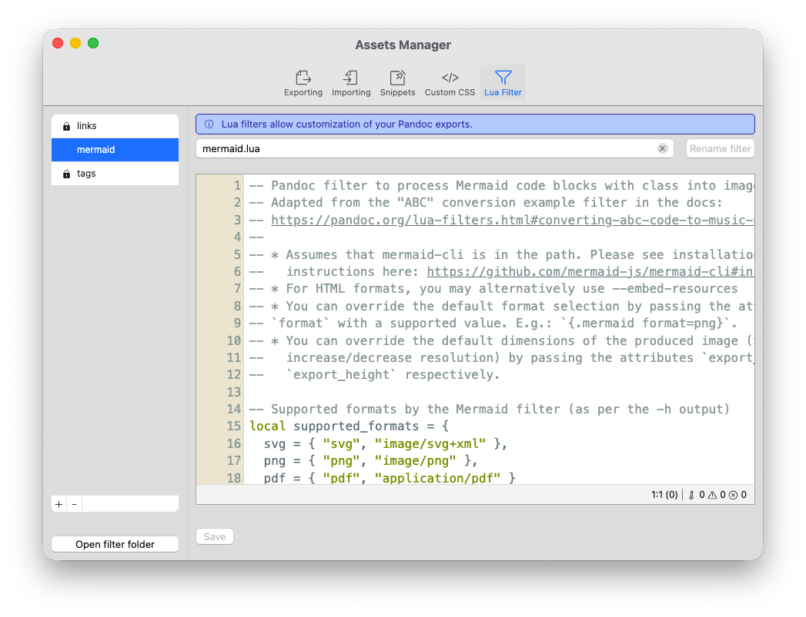

# Filtros Lua

O componente final que pode ajudá-lo a personalizar sua experiência com Zettlr são os Filtros Lua personalizados. Você pode visualizar e modificar filtros Lua no [gerenciador de ativos](./assets-manager.md).



## O que é um filtro Lua?

Um Lua Filter é um pequeno programa que você pode escrever para personalizar como o Pandoc exporta seus documentos. Eles são escritos usando a linguagem de script Lua e o Pandoc os suportam nativamente.

Na verdade, o Zettlr já vem com dois filtros integrados – um para links de wiki e outro para tags!

Os filtros Lua são executados durante o estágio de exportação e podem modificar qualquer documento antes que o Pandoc seja realmente grave o conteúdo do arquivo no disco. Isso pode permitir que você personalize como seus documentos são transformados, desde simples alterações (por exemplo, remoção de tags) até grandes alterações na árvore de sintaxe (por exemplo, transformação de blocos de código Mermaid em diagramas Mermaid reais).

Lua é uma linguagem poderosa e a integração do Pandoc com ela é profunda. Esta documentação não é o lugar certo para explicar tudo sobre Lua para você.

Em vez disso, recomendamos que você consulte a [extensa documentação sobre como escrever seus próprios filtros Lua] do Pandoc (https://pandoc.org/lua-filters.html).

## Filtros Lua para Zettlr: Melhores Práticas

Embora Zettlr esteja satisfeito com qualquer filtro Lua escrito para Pandoc, há alguns ressalvas a serem consideradas. Primeiro, o Zettlr sempre executará *todos* os filtros em seu diretório de filtros. Assim, todos os filtros que você pode ver no gerenciador de ativos sempre serão executados para cada exportação.

Isso significa que, em vez de assumir uma determinada estrutura de documento, os filtros Lua do Zettlr devem ser executados condicionalmente.

Na verdade, o [guia de fluxo de trabalho](./workflow.md) já dá uma tip de como isso funciona: Após a exportação, o Zettlr escreverá nos metadados do seu perfil algumas configurações que os dois filtros integrados para links e tags leem.

Sempre que os metadados de algum documento incluírem a opção `zettlr.strip_links`, por exemplo, o filtro irá ler esta configuração, e transformar o documento conforme aplicável.

No filtro de links, por exemplo, fica assim:

```lua
Meta = function (meta)
  -- Retrieve the option required for this filter if they exist.
  if meta.zettlr then
    if meta.zettlr.strip_links then
      strip_links = meta.zettlr.strip_links
    end
  end
  return meta
end
```

O filtro verificará cada link e não fará nada (se você definir sua preferência para deixar os links do wiki como estão em suas configurações) ou ajustará o link de acordo com sua preferência. Dessa forma, o filtro pode ser executado sempre, mas depende de suas configurações.

Você pode fazer algo semelhante para seus filtros: Defina uma opção de configuração que deve ser definida para que o filtro seja executado. Dessa forma, seu programa pode decidir se precisa ser executado com base em uma entrada em seu front-assunto YAML.

Se você definir manualmente os links da faixa de opções em seu front mate, poderia ser o seguinte:

```yaml
---
zettlr:
  strip_links: "no"
---
```