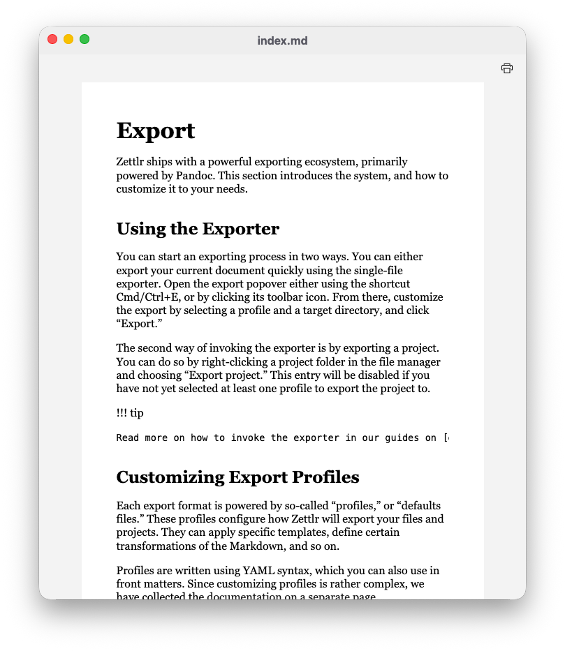

# Impressão e visualização

Embora a maioria das exportações deva acabar como arquivos no seu computador, às vezes você pode querer visualizar ou até mesmo imprimir um documento. Isso pode ajudá-lo a visualizar a aparência do documento depois de exportado e pode permitir que você imprima rapidamente um rascunho para lê-lo no papel, em vez de no computador.

Você pode abrir uma visualização de impressão de qualquer documento pressionando <kbd>Cmd/Ctrl</kbd>+<kbd>P</kbd>.

Isso exportará internamente seu documento para HTML e exibirá os resultados em uma nova janela.

**Observação:**

    A visualização da impressão na verdade não usa o Pandoc. Em vez disso, ele usa a representação interna da árvore de sintaxe abstrata do Zettlr do seu documento. Isso significa que pode haver algumas diferenças em como o Pandoc e o Zettlr exportarão um documento. No entanto, o Zettlr se alinha tanto quanto possível com os estilos padrão do Pandoc para uma exportação HTML.

Clique no ícone de impressão para imprimir o arquivo HTML. Isso abrirá uma caixa de diálogo de impressão integrada do Chrome e permitirá que você imprima o documento diretamente do Zettlr.

Se você deseja um layout mais personalizável do seu documento, exporte o arquivo primeiro para, além, PDF e depois imprima a partir desse aplicativo é o caminho certo a seguir.