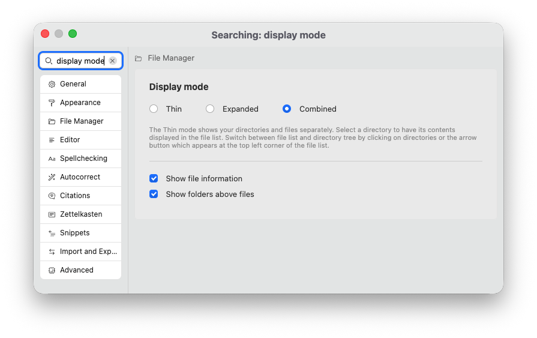
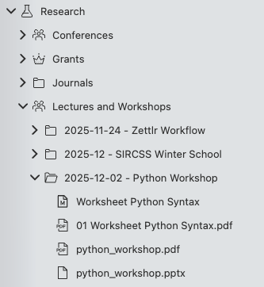
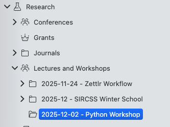
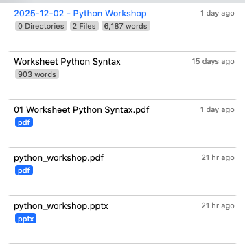
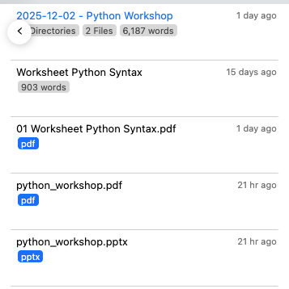

# Aparência do gerenciador de arquivos (modos)

Você também pode controlar a aparência do gerenciador de arquivos Zettlr para adaptá-lo ao seu formato de trabalho. Existem três modos de exibição disponíveis que alteram sua aparência.

Nas opções, a configuração “modo gerenciador de arquivos” controla como o gerenciador de arquivos exibe seus arquivos:

Você tem três configurações, ou modos, que controlam o funcionamento do seu gerenciador de arquivos:

* **Combinado**: Esta é a configuração padrão. No modo combinado, o gerenciador de arquivos parece essencialmente com uma árvore de todos os seus arquivos e pastas, e tanto os arquivos quanto as pastas são desejados juntos em uma visualização. Recomendamos esta configuração.
* **Fino**: O modo fino separa seus arquivos de suas pastas. Neste modo, ainda há uma visualização em árvore, mas inclui apenas suas pastas. Assim que você selecionar uma pasta aqui, o gerenciador de arquivos mudará para uma lista que mostra todos os seus arquivos dentro desta pasta.
* **Expandido**: O modo expandido funciona como uma visualização reduzida. A diferença é que o modo fino se move entre a visualização de pastas e a lista de arquivos, enquanto no modo expandido ambos são mostrados lado a lado.

### O modo combinado

O modo combinado é o modo mais próximo de como seu computador exibirá todos os seus arquivos. Ele contém todos os arquivos e pastas em uma visualização unificada. Veja a captura de tela para ver um exemplo:

Neste exemplo, você pode ver uma área de trabalho, “Pesquisa” e uma série de subpastas. Na pasta “Palestras e Workshops” → “2025-12-02 - Python Workshop” você pode ver um conjunto de arquivos pertencentes a essa pasta; como uma apresentação em PowerPoint, uma exportação em PDF da apresentação referida e uma planilha, tanto como Markdown quanto como PDF exportado.

### Os modos finos e expandidos

Os modos fino e expandido separam pastas e arquivos uns dos outros.  Algumas pessoas acham mais simples trabalhar com uma lista de arquivos em vez de uma estrutura de pastas. Se você ativar o modo “fino” do gerenciador de arquivos, seus arquivos desaparecerão da árvore de arquivos.

A captura de tela mostra a mesma pasta acima, mas desta vez com o modo “fino” de gerenciador de arquivos ativos.

Como você pode ver, todas as pastas ainda estão lá, mas os arquivos sumiram.

Para ver os arquivos, você precisa clicar na pasta que deseja visualizar. Depois de fazer isso, o gerenciador de arquivos passará desta visualização em árvore para uma nova visualização, a lista de arquivos:

Como você pode ver, a pasta que contém – “2025-12-02 - Python Workshop” é mostrada em núcleos na parte superior, e todos os arquivos contidos nesta pasta estão listados abaixo.

No modo “expandido”, ambas as visualizações são mostradas ao mesmo tempo. No modo fino, você pode avançar e retroceder entre as duas visualizações rolando horizontalmente. Se você não conseguir rolar horizontalmente, também poderá navegar entre os dois modos clicando. Ao ver a árvore de pastas, clique em qualquer pasta da lista de arquivos. Ao ver a lista de arquivos, mova o mouse para o canto superior esquerdo. Ao encontrá-lo, um botão de seta aparecerá que permite voltar para a árvore de pastas.

Veja a captura de tela para ver a aparência desta seta:

