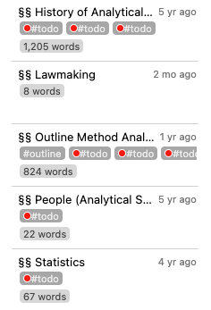
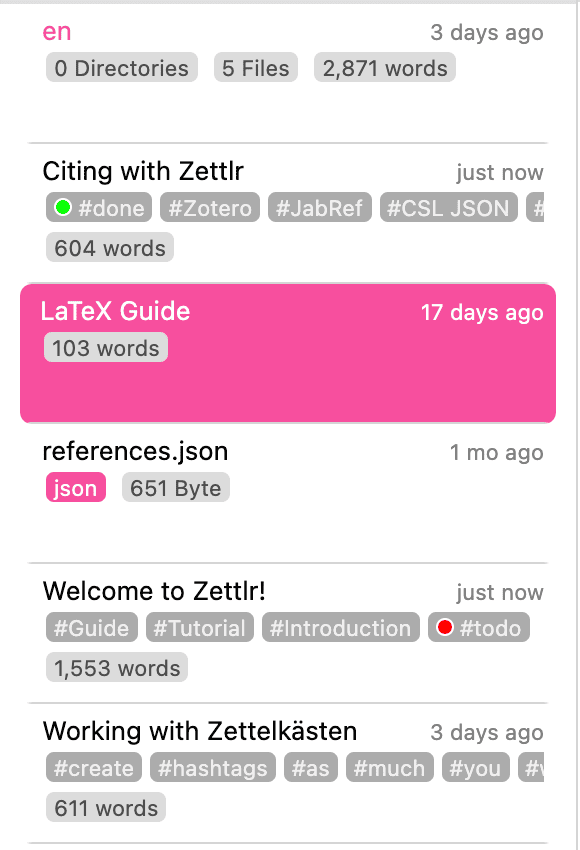
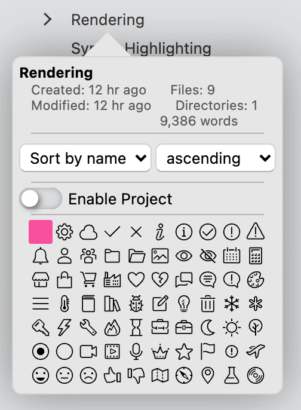

# A lista de arquivos

A lista de arquivos é uma visualização especial de seus espaços de trabalho que permite navegar por todos os seus arquivos como uma lista, em vez de uma árvore.

Você pode controlar o conteúdo da visualização da lista de arquivos selecionando uma pasta na visualização em árvore. Isso dirá à lista de arquivos para exibir o conteúdo dessa pasta, mas como uma lista. Para algumas pessoas, isso pode ser mais fácil de navegar do que uma visualização em árvore.

Além disso, como a lista de arquivos tem mais espaço para exibir informações do arquivo, a lista de arquivos permite visualizar mais metadados para cada arquivo e fazer rapidamente a visualização em árvore.

## Informações na lista de arquivos

A lista de arquivos pode mostrar informações adicionais sobre seus arquivos. Por exemplo, você pode incluir informações sobre a contagem de palavras de um arquivo, como palavras-chave contidas nele ou seu ID Zettelkasten.

Você pode decidir visualizar metadados adicionais ou não clicar em “Visualizar” → “Informações Adicionais” ou clicar em <kbd>Cmd/Ctrl</kbd>+<kbd>Alt</kbd>+<kbd>S</kbd>. Se você desativar a exibição de informações adicionais, a lista de arquivos exibirá cada item em uma única linha, tornando a visualização muito compacta.

Como você pode ver na captura de tela acima, a lista de arquivos pode exibir vários metadados extraídos de seus arquivos. Cada “bloco” ou “cartão” consiste em três linhas quando os metadados são mostrados.

A primeira linha sempre mostra o título do arquivo e os dados da última modificação ou quando o arquivo foi criado. (Você pode determinar qual carimbo de data/hora será exibido aqui nas preferências.)

Na segunda linha, a lista de arquivos mostra todas as palavras-chave contidas no arquivo. Você pode definir palavras-chave usando a sintaxe comum nas mídias sociais (`#this-is-a-tag`) ou adicionando-as ao frontmatter YAML na propriedade `keywords` ou `tags`.

Algumas palavras-chave aqui possuem círculos coloridos. Você pode definir quais de suas palavras-chave têm um significado especial e fornecer um cor no gerenciador de tags.

Na terceira linha (a segunda linha se o arquivo não contém nenhuma palavra-chave), a lista de arquivos exibe uma contagem de palavras, revelando o tamanho do arquivo. Se você definir um objetivo de gravação para este arquivo, ele mostrará o progresso na direção desse objetivo, além da contagem atual de palavras.

## Como a lista de arquivos exibe o conteúdo da pasta

Em vez de usar uma aparência de árvore para exibir seus arquivos, a lista de arquivos cria uma longa lista de tudo ou conteúdo de uma pasta. Você pode imaginar o processo da seguinte maneira.

Imagine que você tem a seguinte estrutura de pastas:

* Artigos
    *Trabalho do primeiro semestre
        * Introdução.md
        * Plano de fundo.md
        * Resultados.md
        * Conclusão.md
        * Notas.md
    *Trabalho do segundo semestre
        * Notas.md
    * Trabalho de terceiro semestre
        * Notas.md
*Cursos
    *Ciência Política 101
        * Notas da aula.md
        * Lista de Literatura.md
    * Sociologia 201
        * Notas da aula.md
        * Lista de Literatura.md

A lista de arquivos basicamente **exibe esta mesma estrutura, mas como uma lista**. Isso significa que as subpastas (como os trabalhos de conclusão de curso e as pastas do curso) serão realizadas uma após a outra no mesmo nível:

* Artigos
*Trabalho do primeiro semestre
* Introdução.md
* Plano de fundo.md
* Resultados.md
* Conclusão.md
* Notas.md
*Trabalho do segundo semestre
* Notas.md
* Trabalho de terceiro semestre
* Notas.md
*Cursos
*Ciência Política 101
* Notas da aula.md
* Lista de Literatura.md
* Sociologia 201
* Notas da aula.md
* Lista de Literatura.md

## Navegando na lista de arquivos

Isso pode ser difícil de navegar. É por isso que você pode **restringir cada vez mais a lista de arquivos, clicando nas pastas dela**. Quando você clica com o mouse em uma pasta (não em um arquivo), isso informa a lista de arquivos que você deseja mover para aquela pasta, ou seja, você move “para baixo” na árvore de pastas.

Se você, além disso, clicar na pasta “Primeiro trabalho final” em sua lista de arquivos, isso instruirá a lista de arquivos a exibir apenas o conteúdo dessa pasta, que se parece com isto:

*Trabalho do primeiro semestre
* Introdução.md
* Plano de fundo.md
* Resultados.md
* Conclusão.md
* Notas.md

Se agora você quiser exibir **todos** seus documentos, você pode **manter os botões <kbd>Alt</kbd> para navegar para cima, em vez de para baixo** ao clicar em uma pasta. Então, clique com <kbd>Alt</kbd> no nome da pasta “Primeiro trabalho final” sobe um nível e exibe o conteúdo da pasta “Papers”:

* Artigos
*Trabalho do primeiro semestre
* Introdução.md
* Plano de fundo.md
* Resultados.md
* Conclusão.md
* Notas.md
*Trabalho do segundo semestre
* Notas.md
* Trabalho de terceiro semestre
* Notas.md

**Dica:**

    Como você pode ver, navegar na lista de arquivos se assemelha a uma forma de “filtragem”. Se precisar se concentrar em um tipo específico de trabalho, você pode navegar "para baixo" na lista de arquivos até que apenas os arquivos de seu interesse sejam exibidos. Ao mesmo tempo, se precisar de uma visão geral mais ampla de seus projetos, você pode navegar "para cima" até ver todos os arquivos necessários.

## Como a lista de arquivos é complexa

Um aspecto importante na lista de arquivos é como ela decide a ordem de classificação dos seus arquivos. Isso é relevante porque há algumas suposições que a lista de arquivos deve fazer.

1. Qualquer pasta que você selecionar para visualizar sempre será exibida na parte superior. Clicar nesta pasta não fará nada, mas clicar com <kbd>Alt</kbd> permite que você mova “para cima” para a pasta pai.
2. Se houver algum arquivo na pasta atual, ele sempre será classificado diretamente abaixo desta pasta.
3. Todas as pastas dentro da pasta atual são definições após os arquivos.
4. Os arquivos dentro das próprias pastas serão classificados de acordo com a forma como você deseja classificá-los.

***

A lista de arquivos mostra todos os diretórios e arquivos dentro do diretório atualmente selecionados na visualização em árvore, mas não como um navegador de arquivos normal: **a lista de arquivos trata todos os subdiretórios como iguais e mostra todos eles, um após o outro!** Portanto, você não precisa percorrer mais a árvore de diretórios para chegar aos diretórios ocultos.

Se você desejar as metainformações, os diretórios e os arquivos serão mostrados como linhas únicas. Se você exibir as *informações do arquivo*, verá informações adicionais: os diretórios mostrarão a quantidade de arquivos e pastas que eles contêm. Os arquivos, por outro lado, mostram os dados da última modificação, quaisquer tags, um ID e muito mais.

**Dica:**

Você pode alternar as informações do arquivo através do menu "Exibir", pressionando `Cmd/Ctrl+Alt+S`, ou a configuração relevante na caixa de diálogo de preferências no guia Geral

Além disso, você pode navegar pela árvore de diretórios na lista de arquivos clicando em nossos diretórios. Basta clicar para selecionar o diretório e avançar na árvore, enquanto `Alt+Click` selecionará seu diretório pai. Isso é útil se você precisar alternar de diretório com frequência, mas o modo preferir até a barra lateral e não deseja alternar para visualização em árvore repetidamente.

**Observação:**

    Dentro do gerenciador de arquivos, você pode executar a maioria das ações que também podem ser realizadas no Explorer/Finder/navegador de arquivos conforme esperado, como abrir, duplicar, criar e remover arquivos, arrastá-los e muito mais.

### Propriedades de arquivos e pastas

Cada arquivo e cada pasta também possuem propriedades. Você pode visualizá-los clicando com o botão direito em qualquer arquivo ou pasta e escolhendo o item de menu correspondente.

Cada pasta pode ser transformada em um [Projeto](./projects.md) clicando no botão em seu popover de propriedade. Depois você pode ajustar as configurações do projeto. 

Além disso, você pode selecionar um ícone de diretório que facilita a identificação visual do diretório. Por último, você pode classificar os diretórios em suas janelas de propriedades. Os arquivos, por outro lado, mostram suas tags, ID e outras informações úteis. Você também pode definir destinos de gravação nas propriedades de um arquivo.

**Nota:**

    Para remover o alvo de gravação de um arquivo, basta definir o contador de gravação como zero.

Os popovers de propriedades de arquivos e pastas mostram algumas informações gerais, como a hora da última modificação, a hora de criação e o tamanho.

## Implicações estruturais para a lista de arquivos

Cada vez que você selecionar um diretório, uma lista de arquivos exibirá _todos_ os arquivos e pastas neste diretório. Simplificando, ele nivela todos os seus diferentes subdiretórios e arquivos da estrutura em forma de árvore que são semelhantes à árvore de arquivos em uma lista unidimensional. A lista sempre mudará seu conteúdo sempre que você selecionar um diretório diferente na visualização em árvore.

**Dica:**

A lista exibe apenas todos os diretórios e arquivos _dentro_ do diretório atualmente selecionado. Portanto, funciona um pouco como uma função de pesquisa muito rápida. Você só vê os arquivos em um diretório específico e, quando você desce nível por nível, cada vez menos arquivos ficam visíveis até que apenas um diretório e seus arquivos ficam visíveis. Dada uma boa estrutura dentro de sua raiz, esta é uma maneira poderosa de ter na lista apenas os arquivos que você realmente precisa.

À medida que a lista de arquivos nivela sua complexa árvore de diretórios, é necessário fazer algumas suposições sobre como _exibir_ os arquivos relevantes. Portanto, as regras a seguir ajudam a distinguir onde os arquivos estão realmente presentes no disco:

1. O diretório atualmente selecionado estará no topo da lista de arquivos. Sempre.
2. Todos os arquivos que estão dentro deste diretório são colocados diretamente abaixo do nome do diretório.
3. Todos os subdiretórios que estão _dentro_ deste diretório sempre estarão no final da lista de arquivos, ou seja, _após_ os arquivos do diretório selecionado.
4. Se os diretórios estiverem vazios, eles serão colocados imediatamente um após o outro, sem arquivos entre eles.

Então o que é importante lembrar é: Todos os diretórios serão listados como se residissem no mesmo nível; como se não estivessem aninhados. Para identificar quais diretórios contêm quais, consulte a visualização em árvore.

**Dica:**

    Se você não gosta da classificação "natural" do Zettlr (para que 10 venha depois de 2), você pode mudar para a classificação "ASCII" na guia Geral da caixa de diálogo de configurações (para que 2 venha depois de 10).