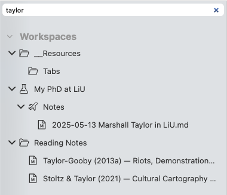

# Filtragem

Ao contrário do navegador de arquivos do seu computador, o Zettlr oferece uma maneira muito rápida de pesquisar itens em seus espaços de trabalho. Na parte superior do navegador de arquivos, você encontra um campo de texto que permite filtrar os itens exibidos no gerenciador de arquivos.

Por exemplo, se você nomear notas de leitura de forma consistente usando os nomes dos autores e quiser pesquisar uma nota de leitura de um autor específico, poderá começar a digitar o nome dele neste campo de filtro. O Zettlr ocultará imediatamente todos os arquivos que não correspondam a esta consulta.

## Usando o filtro

Usar a função de filtro é uma maneira rápida de localizar arquivos sem ter que navegar manualmente na estrutura de pastas.

Você também pode focar no campo de filtro usando o atalho <kbd>Cmd/Ctrl</kbd>+<kbd>Shift</kbd>+<kbd>T</kbd>.

A captura de tela mostra um exemplo: O campo de filtro contém o texto “taylor” e o gerenciador de arquivos mostra apenas os arquivos que pertencem a esta consulta de filtro.

## Navegando no gerenciador de arquivos com o teclado

Outro benefício que você obtém ao focar no campo de filtro é que você pode navegar no gerenciador de arquivos usando apenas o teclado.

Assim que o campo de filtro estiver em foco – clicando nele ou usando o atalho – você pode começar a usar as teclas de seta do teclado para mover-se entre os itens exibidos.

Use como teclas <kbd>Seta para cima</kbd> e <kbd>Seta para baixo</kbd> para mover um item para outro.

Quando você estiver em uma pasta, você pode usar a tecla <kbd>Seta para a esquerda</kbd> para colocar a pasta (ocultar seu conteúdo) ou a tecla <kbd>Seta para a direita</kbd> para expandir a pasta (mostrar seu conteúdo). Isso não funciona quando você está filtrando ativamente, somente quando você deixa o campo de filtro vazio.

Quando estiver em um arquivo, você pode pressionar <kbd>Enter</kbd> para abri-lo.