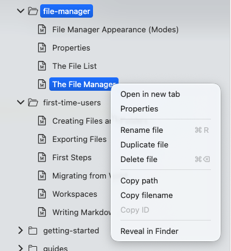

# O gerenciador de arquivos

O gerenciador de arquivos é basicamente um navegador de arquivos integrado (como Explorer ou Finder) ajustado às necessidades do Zettlr. É um dos componentes principais do aplicativo.

O gerenciador de arquivos sempre fica à esquerda da janela. Você pode mostrá-lo e ocultá-lo com o primeiro botão da barra de ferramentas.

## Em geral

O gerenciador de arquivos consiste em dois anexos. Primeiro, há uma seção “Arquivos” que mostra o que chamamos de arquivos “autônomos” ou “raiz”. Estes são arquivos Markdown que você abriu no Zettlr e que não residem em nenhum de seus espaços de trabalho. Esta seção ficará oculta se você não tiver nenhum desses arquivos abertos.

A segunda seção é chamada “Espaços de trabalho” e lista todos os seus espaços de trabalho abertos. Quando você abrir uma nova pasta como área de trabalho, ela será mostrada aqui.

Você pode instalar qualquer seção clicando no pequeno cursor à esquerda do título da seção para reduzir a confusão, se você tiver muitos arquivos e/ou áreas de trabalho abertas.

Dentro do gerenciador de arquivos, você pode realizar todas as ações usuais que também podem ser realizadas no navegador de arquivos do seu computador, mas o Zettlr inclui algumas ações adicionais que são úteis para gerenciar uma grande quantidade de documentos Markdown.

## Diferenças entre o gerenciador de arquivos do Zettlr e o gerenciador de arquivos do seu computador

Apesar do navegador de arquivos do Zettlr parecer e funcionar de maneira semelhante ao navegador de arquivos do seu computador, existem algumas diferenças cruciais entre os dois:

* Zettlr mostra apenas um subconjunto de arquivos, e não todos.
* O Zettlr pode usar informações dos arquivos para exibir um título mais protegido no navegador de arquivos (como o primeiro título do arquivo).
* Você pode configurar a aparência das pastas e alterar, por exemplo, seu ícone, ou transformar qualquer pasta em um projeto.
* Você pode filtrar arquivos e pastas rapidamente usando o campo de filtro na parte superior do gerenciador de arquivos. Comece a digitar para restringir rapidamente a visualização apenas dos arquivos e pastas que você precisa nesta consulta de filtro.

É importante ressaltar que o navegador de arquivos do Zettlr é intencionalmente limitado e, às vezes, você pode ter que usar o navegador de arquivos do seu computador para realizar alguma ação.

## Comportamento

O gerenciador de arquivos permite que você faça muitas coisas que você já conhece no navegador de arquivos do seu computador. A maioria dessas ações pode ser acessada através do menu de contexto.

O menu de contexto oferece uma variedade de ações dependendo se você clicar em um arquivo ou pasta.

A entrada mais útil no menu de contexto é a entrada “Propriedades”. Isso permite que você visualize as propriedades do arquivo ou pasta. Saiba mais em [documentação de propriedades](./properties.md).

A seguir, assim como no navegador de arquivos do seu computador, você pode criar, renomear ou excluir arquivos e pastas.

Além disso, você pode copiar o nome e o caminho completo de um arquivo ou pasta. Isso é importante especialmente para você, um usuário avançado e que trabalha com ferramentas de linha de comando. No entanto, quando você cria um modelo, isso também é útil, pois permite copiar o caminho do modelo para a área de transferência e usá-lo em um perfil padrão. Consulte a documentação sobre perfis para saber mais.

Finalmente, o menu de contexto permite exibir o arquivo ou pasta no navegador de arquivos do seu computador. Isso é útil se você precisar fazer algo que o Zettlr não pode fazer. Escolha esta opção (o texto depende do seu computador; no macOS a opção é chamada “Revelar no Finder”) abrirá o navegador de arquivos e mostrará o arquivo.