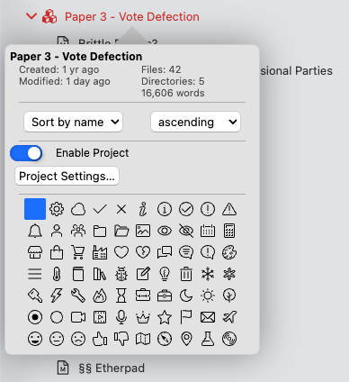
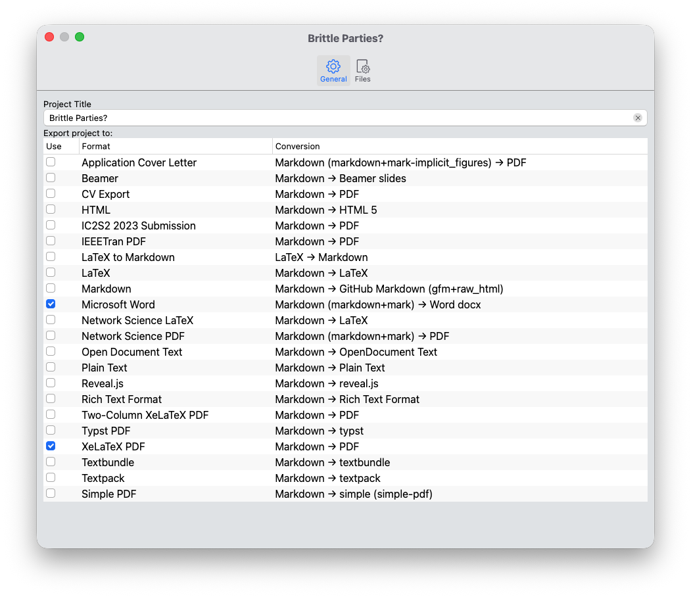
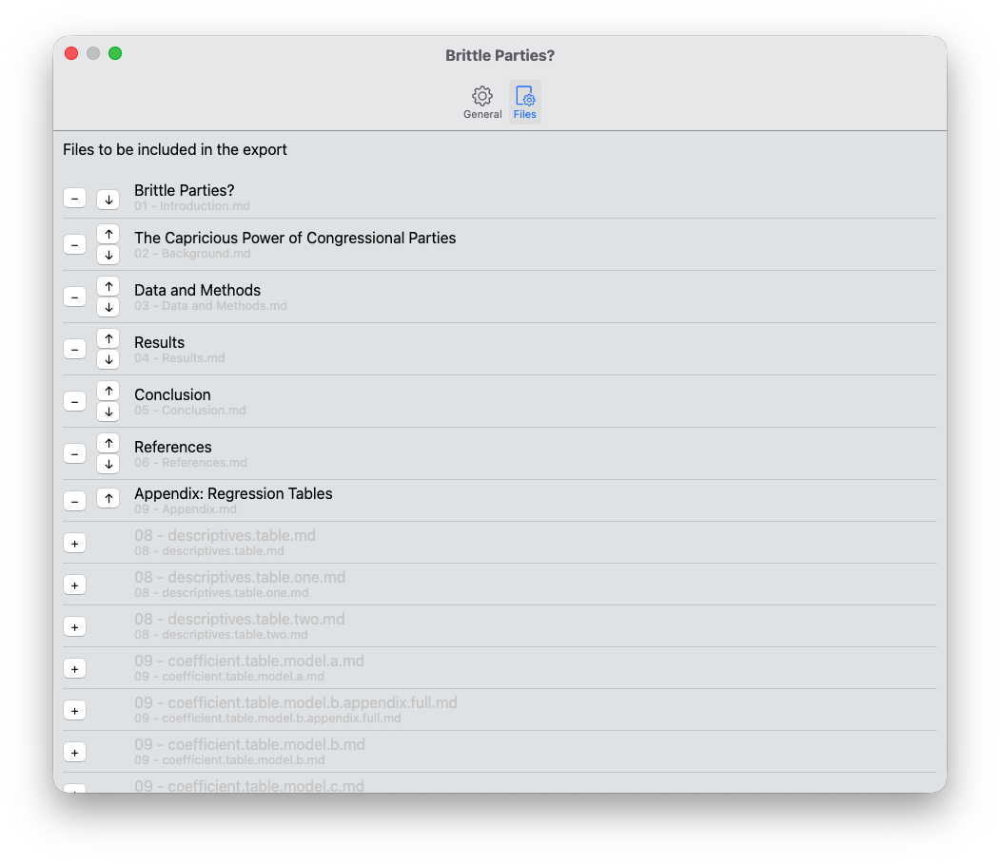
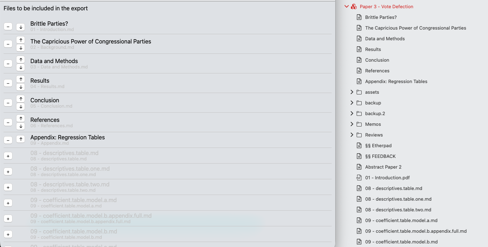

# Projetos

Os projetos são uma forma de agrupar documentos Markdown de forma que você possa dividir trabalhos mais longos em partes menores. Isto é especialmente relevante para projetos em papel ou até mesmo para livros inteiros. Portanto, esta é uma ferramenta perfeita especialmente para acadêmicos e autores.

Os projetos são construídos com base na noção de agregar trabalho para um projeto dentro de sua própria pasta de projeto. Assim, os projetos são essencialmente uma propriedade de uma pasta – você pode “ativar” e “desativar” recursos do projeto por pasta.

## Iniciando um novo projeto

Como os projetos são basicamente apenas pastas, iniciar um novo projeto é tão simples quanto criar uma nova pasta para ele.

Digamos que você queira começar um novo artigo e dar-lhe um nome preliminar, vamos “Vote Deserção”. Então você poderia criar uma pasta e dar esse nome a ela.

**Dica:**

Os exemplos nesta seção não são arbitrários: Eles foram retirados do projeto de doutorado do mantenedor, Hendrik Erz. Portanto, eles dão uma ideia de como esse recurso pode ser usado no mundo real.

Então, você pode começar a criar arquivos nesta pasta. Para um artigo normal, você pode querer criar um arquivo para cada seção do artigo, bem como um arquivo geral de “Notas” para anotar algumas idéias:

*Introdução
* Plano de fundo
* Dados e Métodos
* Resultados
* Discussão
*Conclusão
*Notas

## Ativando o recurso Projetos

Depois de criar o scaffold para o seu projeto, você desejará ativar o recurso de projeto para esta pasta. Para fazer isso, clique com o botão direito na pasta e selecione “Propriedades”. Sem popover de propriedades, ativo os projetos.

Depois de implementar projetos para esta massa, algumas coisas mudarão:

1. O nome da pasta fica vermelho no gerenciador de arquivos, facilitando a localização de seus projetos.
2. A pasta receberá um ícone de “projetos” em vez do ícone de pasta padrão.
3. O menu de contexto mostrará agora uma entrada adicional, permitindo “exportar” o projeto.

## Configurando seu projeto

A próxima etapa é configurar seu projeto. Para fazer isso, selecione “Configurações do projeto…” no popover de propriedades da pasta.

Fazer isso abrirá as configurações do projeto para este projeto. Você pode configurar tudo o que for necessário nesta janela.

### Opções Gerais

A primeira guia, “Geral”, mostra duas configurações. Na parte superior você pode definir um “título” para o seu projeto. Isso é necessário para exportar o projeto posteriormente, pois ele se tornará o nome do arquivo e também preencherá a propriedade `title` do seu projeto.

**Observação:**

O "Título do Projeto" cumpre essencialmente a mesma função que a propriedade YAML frontmatter `title`. Se você definir um `title` manualmente em algum lugar dos arquivos do seu projeto, isso deverá substituí-lo.

Abaixo do título, você verá uma longa lista com todos os seus perfis de exportação. Isso permite determinar os formatos de exportação para os quais seu projeto deve ser exportado. Você pode selecionar quantos quiser e o Zettlr exportará todos eles de uma vez.

A tabela possui três colunas. O primeiro contém uma caixa de seleção que permite ativar ou desativar o perfil de exportação para este projeto. A segunda coluna contém o nome do perfil. E a terceira coluna informa o caminho de conversão. Como você pode ver, a maioria dos perfis irá ler documentos Markdown e exportá-los para vários formatos. Algumas também permitem que você use o código-fonte LaTeX diretamente, se desejar.

Finalmente, se o perfil tiver um leitor ou gravador especificamente configurado, quaisquer extensões serão exibidas entre colchetes atrás do leitor ou gravador de propriedade. 

Por exemplo, se um perfil definir como formato de saída “GitHub Markdown”, ele poderá exibir “gfm+raw_html” entre colchetes posteriormente, indicando que ele usa o leitor GitHub Formatted Markdown com a extensão “raw_html” habilitada.

Para obter mais informações sobre os vários leitores, gravadores e suas extensões, consulte a página de documentação correspondente para perfis.

### Opções de arquivo

A segunda aba permite especificar os arquivos que serão incluídos no projeto. Basicamente, isso permite que você mantenha quantos arquivos desejar dentro da pasta do projeto, já que apenas os arquivos que você adicionar explicitamente aqui serão incluídos na exportação final do projeto.

A lista de arquivos mostra algumas opções. Primeiro, você pode ver o nome real dos vários arquivos. Abaixo disso, você pode ver o caminho relativo da raiz do projeto até o arquivo. Isso é especialmente importante se você decidir categorizar ainda mais seus arquivos em subpastas neste projeto e ajudar a identificar os corretos.

Para adicionar um arquivo ao seu projeto, clique no ícone “+” próximo ao seu nome. Isso moverá imediatamente o arquivo para cima e alterará o ícone “+” para um ícone “-“. O Zettlr sempre mostrará os arquivos incluídos no seu projeto acima dos outros arquivos.

Para ajustar a ordem dos arquivos, use os botões de seta para mover os arquivos para cima ou para baixo.

**Dica:**

    Esta configuração também influencia a exibição do seu projeto no gerenciador de arquivos. Assim que você modificar a lista de arquivos incluídos, o gerenciador de arquivos exibirá esses arquivos também no topo da pasta do seu projeto. Todos os outros arquivos e pastas ainda obedecerão à ordem de classificação definida, mas os arquivos do projeto substituirão essa configuração e serão listados diretamente abaixo do nome da pasta, na ordem definida aqui.

A captura de tela a seguir destaca o que isso significa: À esquerda você pode ver a caixa de diálogo de configurações do projeto e quais arquivos estão incluídos na exportação.

À direita, você pode ver como isso é organizado no gerenciador de arquivos: Os arquivos de projeto incluídos estão na parte superior, na ordem correta, enquanto todos os outros arquivos são classificados usando a ordem normal abaixo.

## Outras opções

Abaixo da lista de arquivos incluídos na exportação do projeto, você encontrará três configurações adicionais que permitem fornecer arquivos personalizados adicionais que determinarão como seu projeto será exportado.

* **Folha de estilo CSL**: Isso permite que você especifique uma folha de estilo CSL personalizada para modificação como o Zettlr formatará suas obrigações. Isso é útil se você tiver que enviar um artigo para um jornal que usa um estilo de citação diferente daquele que você costuma usar.
* **Modelo LaTeX**: Este arquivo substituirá qualquer convenção `template` de qualquer perfil de exportação que exporte para PDF por meio do mecanismo LaTeX.
* **Modelo HTML**: semelhante à opção do modelo LaTeX, mas se aplica às exportações HTML.

## Exportando um projeto

A etapa final de cada projeto é a exportação. Para fazer isso, basta clicar com o botão direito na pasta do projeto e clicar na entrada “Exportar projeto”. Isso direcionará o Zettlr para iniciar uma exportação completa do projeto.

Durante cada exportação de projeto, o Zettlr seguirá o mesmo processo de exportação de arquivo único, mas com algumas diferenças importantes:

1. Antes da exportação, o Zettlr coletará os arquivos que você especificar e os fornecerá na ordem correta ao exportar.
2. Ele substituirá qualquer `title` usando o “Título do Projeto” fornecido.
3. Ele usará uma folha de estilo CSL personalizada em vez da definição global, se aplicável.
4. Ele substituirá os modelos especificados no seu perfil de exportação, se aplicável.
5. Os arquivos exportados serão sempre colocados no “diretório atual”, independentemente de suas configurações.
6. Os arquivos não serão abertos automaticamente após uma exportação bem sucedida.

**Aviso:**

    Se você adicionar, renomear ou remover arquivos enquanto estiver trabalhando no projeto, a lista de arquivos incluídos ficará desatualizada. 
    
    O Zettlr não observa automaticamente se você faz seu projeto e ajusta a lista de arquivos incluídos. Ele verifica apenas a existência de arquivos incluídos quando você exporta. Se você detectar que um arquivo que você selecionou para inclusão não existe mais, ele avisará para que você possa verificar a lista de arquivos.
    
    Da mesma forma, você precisa se lembrar de adicionar manualmente qualquer arquivo adicional que você criar e desejar incluir na exportação nas propriedades do projeto.

## Removendo Projetos

Para remover um projeto, simplesmente desmarque a opção de projeto nas propriedades do diretório. Observe que isso removerá imediatamente as configurações do projeto e é uma ação irreversível. Se você optar por reativar o recurso do projeto, terá que reaplicar todas as configurações.