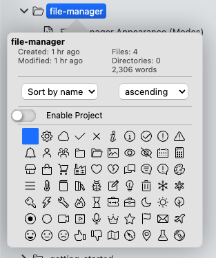
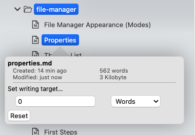

# Propriedades

Tanto a visualização em árvore quanto a visualização em lista permitem clicar com o botão direito em um arquivo ou pasta para visualizar um conjunto de propriedades. 

As propriedades são mostradas em um popover próximo ao arquivo ou pasta e contêm informações variadas com base no arquivo ou pasta selecionado.

## Propriedades da massa

Quando você mostra as propriedades de uma massa, o popover contém informações sobre essa massa.

O popover é dividido em quatro seções.

A seção superior mostra o nome da pasta e um conjunto de metadados básicos. Por exemplo, mostra quando a pasta foi criada e quando foi modificada pela última vez. Além disso, conte o número de arquivos e pastas nesta pasta.

Por último, mostra uma contagem cumulativa de palavras de todos os documentos Markdown contidos nesta pasta.

A segunda seção permite determinar como os arquivos serão classificados nesta pasta. O padrão é classificar os arquivos por nome crescente. Você pode escolher entre classificar os arquivos por nome ou por hora e desejar classificar em ordem crescente ou decrescente. Para classificação por nome e hora, você pode ajustar ainda mais o comportamento nas configurações (consulte a seção “Ajustando a classificação” abaixo).

A terceira seção é reservada para configurações do projeto. Você pode transformar cada pasta em um projeto, ou que desbloqueie algumas funcionalidades especiais para gerenciar projetos inteiros que consistem em vários arquivos. Ao transformar uma pasta em um projeto, aparecerá um botão que permite editar as configurações do projeto. Saiba mais na documentação do projeto.

A última seção do popover permite modificar a aparência da pasta. Você pode escolher entre uma seleção de ícones que serão exibidos no gerenciador de arquivos em vez do ícone de pasta padrão. Você pode usar isso para, por exemplo, fazer com que uma pasta cheia de papéis se destaque mais ou selecionar ícones mais protegidos com base específicas para quem você usa a pasta.

## Propriedades do arquivo

O popover de propriedades do arquivo é semelhante ao popover de propriedades da pasta, mas exibe informações mais adequadas para arquivos.

Novamente, a primeira seção exibe o nome do arquivo acima do local de criação e modificação do arquivo. Além disso, mostra uma contagem de palavras do arquivo mais seu tamanho real no seu computador.

Espera-se que as configurações de classificação e projeto estejam ausentes, mas em vez disso você tem a opção de definir um destino de gravação para este arquivo. Se este alvo de escrita for maior que 0, isso ativará o alvo de escrita. Você pode determinar quantas palavras deseja. Você sempre pode adaptar ou redefinir essa meta.

Quando um destino de gravação é definido para seu arquivo, esse alvo será exibido com um indicador de progresso na árvore de arquivos e na lista de arquivos, dependendo do modo de gerenciador de arquivos que você usa.

## Ajustando preferências de classificação

Se você navegar até opções → “Gerenciador de arquivos”, esta seção contém duas configurações que controlam como o Zettlr classifica os arquivos. Essas configurações influenciam o comportamento da configuração de classificação de pastas.

O primeiro é “Exibição de tempo”. Isso determina – em todo o aplicativo – se o Zettlr mostra a hora de criação de um arquivo ou pasta (quando foi criado pela primeira vez em seu computador) ou a hora da última modificação (quando você altera algo pela última vez). Essa configuração também influencia a propriedade de classificação por tempo de uma pasta que utiliza dados de criação ou modificação para classificar seu conteúdo.

A segunda é a configuração “Classificação”. Aqui você pode determinar como o Zettlr classifica o conteúdo de sua pasta. Você pode escolher entre ASCII e classificação natural. A maioria das pessoas provavelmente prefere “natural” a ASCII.

Quando você seleciona ASCII, o Zettlr compara dois itens letra por letra e a classificação com base na primeira diferença. “Natural”, por outro lado, examinará grupos lógicos inteiros.

Por exemplo, se você iniciar nomes de arquivos em alguma pasta com números com a intenção de classificá-los em ordem crescente, o arquivo que começa com o número “10” seria classificado não depois do arquivo que começa com “9”, mas antes do arquivo que começa com “2”, já que a primeira letra do nome do arquivo – “1” – é menor que “2”. Porém, quando você classifica naturalmente, ele analisa o número inteiro e regularmente que “10” é provavelmente um único grupo lógico. Como “10” é maior que “9”, ele apareceria depois desse arquivo.