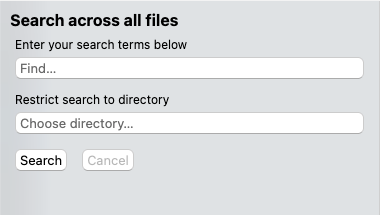
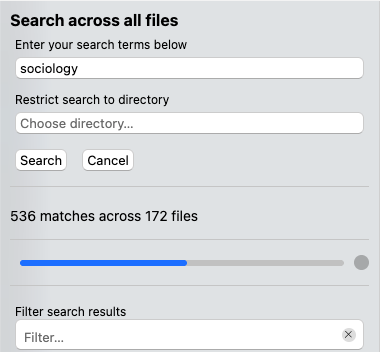
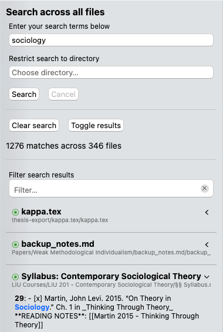

# Pesquisa Global

O gerenciador de arquivos não permite apenas que você navegue em seus espaços de trabalho; ele também contém uma poderosa pesquisa global de texto completo que permite pesquisar coisas profundamente aninhadas em seus espaços de trabalho.

Ao contrário do campo de filtro do gerenciador de arquivos ou da pesquisa dentro dos arquivos, a pesquisa global pode verificar todos os arquivos que você abriu no Zettlr de uma só vez.

Você pode abrir as instruções <kbd>Cmd/Ctrl</kbd>+<kbd>Shift</kbd>+<kbd>F</kbd> ou clicar no segundo botão da esquerda na barra de ferramentas. A pesquisa de texto completo está contida no mesmo painel do gerenciador de arquivos.

## Iniciando uma pesquisa

Para iniciar uma pesquisa, insira os termos de pesquisa no campo de consulta. A seção “Compondo uma Consulta” abaixo demonstra como você pode otimizar sua pesquisa. Opcionalmente, você pode restringir a procura a qualquer diretório contido em suas áreas de trabalho. Ao terminar, clique em “Pesquisar” para iniciar a pesquisa.

A pesquisa será realizada em algum momento, pois o Zettlr examinará todo o conteúdo do arquivo. Durante a pesquisa, o Zettlr mostra o progresso e inúmeras descobertas até o momento.

Você sempre pode interromper uma pesquisa clicando no botão “x” próximo ao progresso da pesquisa.

A captura da tela acima mostra um exemplo dessa pesquisa de texto completo. No topo você pode ver o termo de pesquisa “sociologia”. Abaixo dos controles, você pode ver que o Zettlr encontrou 1.276 correspondências em 346 arquivos em todos os espaços de trabalho.

Finalmente, na parte inferior, você pode ver alguns dos resultados da pesquisa. Os resultados da pesquisa serão sempre classificados por relevância.

##Os resultados da pesquisa

À medida que o Zettlr encontra mais correspondências em seus arquivos, ele preenche a lista de resultados da pesquisa abaixo dos controles. Cada arquivo no qual o Zettlr encontrou uma correspondência é um resultado.

**Dica:**

    Muitos resultados? Você pode alternar a exibição de todos os resultados usando o botão correspondente e, em seguida, expandir apenas aqueles que merecem uma segunda olhada.

Cada resultado tem dois depósitos. Na parte superior você pode ver o nome do arquivo. a propriedade `title` ou o primeiro título do nível 1, dependendo de suas configurações. Abaixo dele você verá, em cinza, o **caminho relativo** da raiz do espaço de trabalho para este arquivo. O Zettlr não mostra o caminho completo para o arquivo em seu computador para remover a desordem desnecessária e tornar esses caminhos curtos, mas mantém os longos o suficiente para saber onde o arquivo está localizado em espaços de trabalho carregados.

Além disso, o cabeçalho de cada resultado contém um círculo colorido e um sinal de intercalação. O círculo colorido é um indicador de relevância, medido em relação a todos os outros resultados da pesquisa. Verde indica um resultado altamente relevante, azul indica um resultado relevante e cinza indica um resultado de pesquisa menos relevante. A relevância é calculada com base em quantas e onde o Zettlr encontrou uma correspondência no arquivo e com base na quantidade de correspondências.

O cursor à direita do resultado permite mostrar e ocultar correspondências individuais no arquivo. Quando o cursor aponta para a esquerda, o resultado é recolhido e quando o cursor aponta para baixo, os resultados da pesquisa ficam visíveis.

Abaixo deste cabeçalho, um item de resultado contém uma enumeração de cada correspondência individual. Cada correspondência começa com o número da linha em que a correspondência foi encontrada, seguida pelo conteúdo da linha. A correspondência real será destacada.

Se o próprio nome do arquivo tiver sido correspondido, ele será mostrado como a primeira correspondência sem um número de linha e destacado por completo.

## Navegando nos resultados da pesquisa

Para continuar trabalhando com os resultados da pesquisa, você pode fazer várias coisas.

Primeiro, você pode filtrar os próprios resultados da pesquisa. Isso pode ser útil se você quiser limitar rapidamente a exibição dos resultados da pesquisa a alguns dos arquivos mais relevantes para você.

Segundo, você pode clicar em qualquer partida individual. Isso abrirá o arquivo correspondente e navegará automaticamente para a linha correta para você. Desta forma você pode verificar o contexto do resultado da pesquisa.

Por último, você também pode clicar com o botão direito na correspondência do resultado da pesquisa. Isso permite copiar os resultados para a área de transferência, por exemplo, para colá-los em outro lugar.

## Compondo uma consulta

Zettlr utiliza uma pesquisa booleana. Você pode usar vários operadores para especificar exatamente o que está procurando:

* **Operador AND:** Digite `Boat Ship` para exibir apenas os arquivos que contêm *ambos* o termo “barco” e o termo “navio”. Cada espaço é interpretado como “AND”.
* **Operador OR:** Digite `Barco | Navio` (`|` é o caractere vertical que você pode digitar com <kbd>Shift</kbd>+<kbd>\`</kbd> em teclados US-ANSI, <kbd>Alt</kbd>+<kbd>7</kbd> em teclados macOS no padrão ISO, ou <kbd>AltGr</kbd>+<kbd><</kbd> em outros sistemas no padrão ISO) para selecionar todos os arquivos que contenham *ou* a palavra “boat” *ou* a palavra “ship”.
* **Operador de correspondência exata:** Coloque sua consulta entre aspas (por exemplo, `“Barco Navio”`) para pesquisar essa frase exata nos seus arquivos.
* **Operador NOT:** Digite `!Barco` para pesquisar apenas arquivos que *não* contenham esse termo. Também funciona com correspondências exatas: `!“Barco Navio”` excluiria todos os arquivos que contivessem a frase exata “Barco Navio”.

**Aviso:**

    Enquanto os operadores `AND`, `OR` e `Correspondência exata` funcionam atribuindo pesos (um arquivo que atenda a todos os critérios de pesquisa será considerado muito relevante, enquanto arquivos que não correspondam a todos os termos de pesquisa são considerados menos relevantes), o operador `NOT` exclui definitivamente os arquivos. Assim, enquanto uma pesquisa por `barco navio` também incluiria arquivos contendo apenas um dos dois termos (embora com uma pontuação de relevância muito menor), uma pesquisa por `!barco navio` excluirá definitivamente todos os arquivos que contenham a palavra barco.

É claro que você pode encadear todos esses operadores. Assim, você poderia pesquisar por `“Barco Navio” |

Não se preocupe se você não se lembrar da palavra completa que está procurando: o Zettlr tentará combinar seus termos de pesquisa também com palavras parciais, de modo que a palavra “soldado” corresponderia a “Stormtrooper” e também a “Troopership”, e a frase “Boat Ship” corresponderia a “Steamboat Ship”. **As pesquisas também não diferenciam as autoridades de minúsculas**. Assim, você não precisa se preocupar com pequenos erros de digitação que podem ocorrer em alguns arquivos.

## Relevância dos resultados da pesquisa

Para obter os melhores resultados, o Zettlr pesará diferentes tipos de partidas de maneiras diferentes. Por exemplo, uma correspondência exata no título pode ser um sinal de que o arquivo é altamente relevante para você. Portanto, Zettlr terá um peso mais pesado do que outras partidas. Além disso, se um termo de pesquisa tiver correspondência com distinção entre autoridades e minúsculas, essa correspondência receberá uma pontuação mais alta do que se o termo correspondente apenas com distinção entre autoridades e minúsculas (ou seja, houve uma diferença na capitalização).