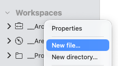
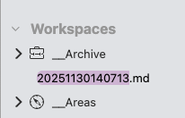
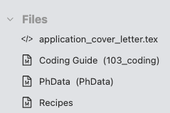
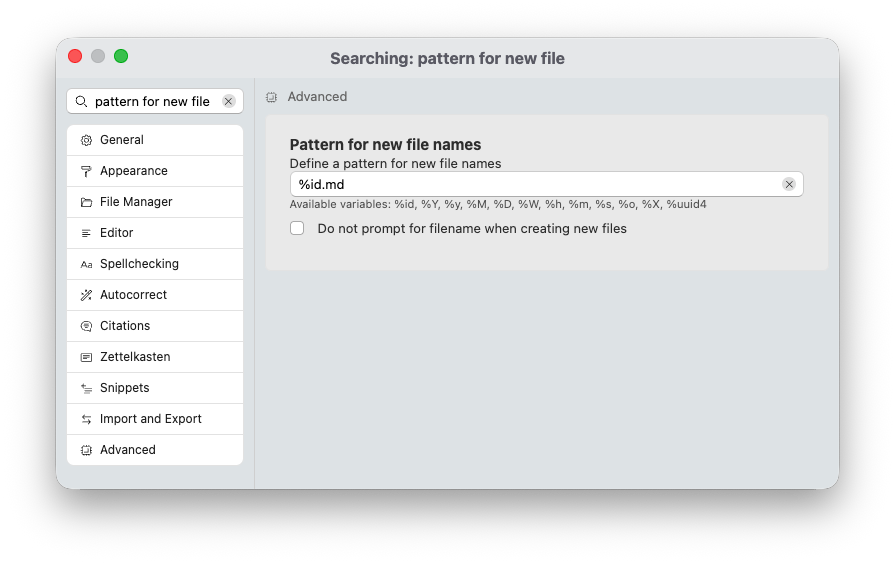

# Criando arquivos e pastas

Com seus espaços de trabalho configurados, você pode finalmente começar a adicionar arquivos e começar a digitar.

Zettlr oferece suporte a três maneiras de criar arquivos:

1. Clique com o botão direito na pasta na qual deseja criar um arquivo
2. Utilize o item de menu “Arquivo” → “Novo Arquivo…” ou o atalho <kbd>Cmd/Ctrl</kbd>+<kbd>N</kbd>
3. Vinculação automática

## 1. Através do gerenciador de arquivos

O método mais simples e direto para criar novos arquivos é clicar com o botão direito em um dos espaços de trabalho recém-adicionados e selecionar “Novo arquivo…”. Isso mostrará uma pequena entrada de texto com texto pré-selecionado. Aceite o nome do arquivo sugerido usando <kbd>Enter</kbd> ou substitua a sugestão por um nome de arquivo personalizado. Zettlr criará o arquivo e o abrirá imediatamente para você começar a trabalhar diretamente.

Clique com o botão direito na pasta ou espaço de trabalho:

E então aceite ou altere o nome do arquivo sugerido:

**Dica:**

    Novas massas podem ser criadas exatamente da mesma maneira e recomendamos fazê-lo desta forma.

## 2. Através do menu ou atalho

Criar um arquivo escolhendo o item de menu “Arquivo” → “Novo arquivo…” ou através do atalho <kbd>Cmd/Ctrl</kbd>+<kbd>N</kbd> é a próxima melhor opção. Desta vez, o Zettlr abrirá uma caixa de diálogo que permitirá escolher o local e o nome do arquivo.

Com este método, você também pode criar um arquivo fora dos espaços de trabalho carregados. Isso pode ser útil se você precisar de algum arquivo que não deseja em seus espaços de trabalho. Nesse caso, o arquivo aberto estará na parte superior de seus espaços de trabalho em uma seção detipda “Arquivos” no gerenciador de arquivos.

## 3. Via vinculação automática

O último método é criar arquivos automaticamente ao vinculá-los. Este é um recurso que faz parte do PKMS (Personal Knowledge Management System), ou funcionalidade “Zettelkasten” do Zettlr. Para que isso funcione, você precisa ter um espaço de trabalho “Zettelkasten” detipdo e vincular o arquivo.

Este fluxo de trabalho será apresentado na seção correspondente.

## Criando Massas

A criação de pastas funciona de forma quase análoga à criação de arquivos. Você pode escolher o atalho de menu correspondente “Arquivo” → “Novo diretório…”, que solicitará que você insira um novo nome de pasta, ou, o que recomendamos, clicar com o botão direito em uma pasta na qual deseja criar uma nova pasta. O processo é exatamente igual à criação de arquivos através do gerenciador de arquivos (veja acima).

## Alterando o nome do arquivo padrão

Nas abordagens 1 e 2 para criar novos arquivos, o Zettlr irá sugerir automaticamente um nome de arquivo para você. Este nome de arquivo consiste apenas em números e, se você olhar com atenção, consiste na data e hora atual no formato “ano, mês, dia, hora, minuto, segundo”.

Isso ocorre por design: esse nome de arquivo é o que o Zettlr considera um ID. Os IDs são especialmente úteis para implementar a funcionalidade PKMS ou Zettelkasten, mas também são úteis para garantir que nenhum nome de arquivo seja igual.

Se você não quiser que os arquivos sejam nomeados automaticamente dessa forma, você também pode alterar a sugestão do nome do arquivo padrão. Para fazer isso, abra as configurações (<kbd>Cmd/Ctrl</kbd>+<kbd>,</kbd> ou através do menu) e navegue até a seção “Avançado”.

Procure uma configuração “Padrão para novos nomes de arquivo”. Esta configuração oferece uma entrada de texto, na qual você pode escolher como o Zettlr gera nomes de arquivos. Você pode inserir uma string estática, como “my-awesome-file.md” ou usar um determinado conjunto de variáveis. Essas variáveis ​​são as seguintes:

* `%id`: Insira um novo ID, seguindo outro padrão que você pode definir na seção Zettelkasten das preferências. Por padrão, é apenas o dado atual.
* `%Y`: O ano, quatro dígitos (por exemplo, 2025).
* `%y`: O ano, dois dígitos (por exemplo, 25)
* `%M`: O mês, dois dígitos (por exemplo, 11)
* `%D`: O dia, dois dígitos (por exemplo, 30)
* `%W`: O número da semana, dois dígitos (por exemplo, 48)
* `%h`: A hora, formato 24 horas, dois dígitos (por exemplo, 14)
* `%m`: O minuto, dois dígitos (por exemplo, 19)
* `%s`: O segundo, dois dígitos (por exemplo, 04)
* `%o`: O dia do ano (por exemplo, 331)
* `%X`: O carimbo de dados/hora UNIX (por exemplo, 1764508829)
* `%uuid4`: Um UUID v4 (por exemplo, 5b6d9b2f-e2f5-4847-a368-4cf5da1e51ae)

## Criando arquivos diferentes do Markdown

Zettlr é um editor Markdown e, como tal, criará arquivos Markdown por padrão. No entanto, de tempos em tempos você pode precisar de outros arquivos. Ao trabalhar com Markdown, às vezes você precisará de arquivos de código para configuração ou modelos. Como iniciante, você geralmente não precisa deles e, mesmo se para um usuário avançado, eles serão relatados explicitamente. Mas se você fizer isso, poderá alterar o tipo de arquivo para uma das seguintes extensões de nome de arquivo:

* `.tex`: Isso criará um arquivo fonte LaTeX (útil, por exemplo, para modelos)
* `.json`: Isso criará um arquivo de dados JSON (eles serão usados para bibliografias se você conectar seu gerenciador de referências; eles serão introduzidos posteriormente)
* `.yaml`: Isso criará um arquivo de dados YAML (usado, por exemplo, para configurar como o Zettlr exporta seus arquivos)

**Dica:**

Você também pode criar arquivos Markdown usando outras extensões de nome de arquivo além de `.md`. Por exemplo, você pode criar arquivos `.Rmd`, arquivos `.qmd` ou arquivos `.txt`. Você viu isso corretamente: o Zettlr pode abrir e exibir facilmente os arquivos RMarkdown e Quarto. Além disso, se você tiver arquivos de texto simples, eles serão, por definição, interpretados como Markdown.