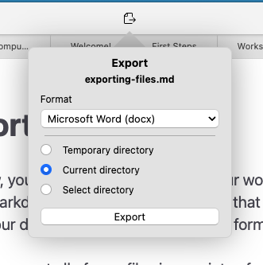

# Exportando arquivos

Até agora, você viu como configurar seus fluxos de trabalho, criar arquivos e migrar seus arquivos existentes para Markdown. A etapa final e comum que você pode realizar ao usar o Zettlr é exportar seus documentos para vários formatos de exportação.

O Zettlr pode exportar todos os seus arquivos de várias maneiras, muitas das quais são integradas e totalmente personalizáveis.

## Exportando um único arquivo

O caso de uso mais comum é exportar um único arquivo. Por exemplo, você pode escrever uma carta de apresentação de inscrição, algum documento de reflexão para a aula ou atas de reunião que precisa enviar aos seus colegas de trabalho.

Antes de exportar um arquivo, certifique-se de que o arquivo correto esteja em foco. Isto é especialmente importante se você usar uma visualização dividida e tiver vários documentos visíveis. Para fazer isso, clique no documento correto. Isso irá focar e garantir que este seja o arquivo que você está prestes a exportar.

Exportar um único arquivo é simples e pode ser feito de três maneiras:

1. Pressione <kbd>Cmd/Ctrl</kbd>+<kbd>E</kbd> para abrir o popover de exportação
2. Clique no ícone da barra de ferramentas de exportação
3. Selecione “Arquivo” → “Exportar…”

Qualquer um desses métodos abrirá o popover de exportação, uma pequena janela flutuante abaixo do botão da barra de ferramentas de exportação que permite configurar sua exportação.

O popover mostra o nome do arquivo atual acima, o que ajuda a confirmar se o arquivo correto será exportado.

A primeira configuração que você pode escolher é o perfil de exportação a ser usado. O menu suspenso “Formato” mostra uma lista de todos os perfis atualmente instalados para Zettlr. Ele mostra primeiro o nome do perfil e depois entre colchetes mostra o formato de destino.

Em seguida, você pode selecionar onde o arquivo exportado irá. Você pode escolher entre três opções:

1. **Diretório temporário**: Isso exportará o arquivo para o diretório temporário. Isso é ótimo se você não deseja manter o arquivo exportado e simplesmente deseja dar uma olhada rápida em sua aparência.
2. **Diretório atual**: Isso exportará o arquivo para a mesma pasta onde o arquivo Markdown está. Portanto, se você deseja exportar “meu-arquivo.md” e decidir exportar para PDF, será criado um novo arquivo “meu-arquivo.pdf” na mesma pasta.
3. **Selecionar diretório**: Isso solicitará que você escolha uma pasta depois de clicar em “Exportar”

**Dica:**

Tanto o último perfil de exportação usado quanto a configuração do seu diretório são lembrados, portanto, na próxima vez que você quiser exportar um arquivo usando as mesmas configurações, basta clicar em "Exportar".

## Formatos Especiais de Exportação

Além de permitir exportar para uma grande variedade de formatos, o Zettlr também permite exportar para um conjunto de formatos especiais. Aqui explicamos o que são e quais advertências se aplicar.

### PDF

Exportar como PDF é provavelmente o caso de uso mais comum. No entanto, o PDF também é o formato de destino mais complexo. Para exportar arquivos PDF regulares e completos, você precisa de uma instalação do LaTeX em seu computador. Se você ainda não possui LaTeX em seu computador, [siga nosso guia para fazer isso](../getting-started/installing-latex.md).

Se você não deseja configurar o LaTeX ou não pode usá-lo por qualquer outro motivo, você também pode usar a exportação **Simple PDF**. Este perfil também cria um PDF, mas evita o LaTeX. O que o Zettlr fará neste caso é exportar seu arquivo para HTML e, em seguida, usar o método “Imprimir site” do Chrome para exportar esse arquivo HTML para PDF.

**Observação:**

    O Zettlr pode “imprimir” arquivos HTML porque é construído no Electron, que consiste essencialmente no navegador Google Chrome.

### TextBundle e TextPack

Outro formato especial compatível com Zettlr é TextBundle e TextPack. [TextBundle](https://textbundle.org/) é um formato personalizado para compartilhar arquivos Markdown. Ele cria uma pasta que contém seu arquivo Markdown, bem como quaisquer imagens às quais você faz referência no arquivo Markdown. Você pode usar esse formato para criar pastas independentes que contenham tudo o que alguém precisa para visualizar seu arquivo.

TextPack é igual ao TextBundle, mas em um contêiner ZIP, para que seja mais fácil fazê-lo via e-mail, por exemplo.