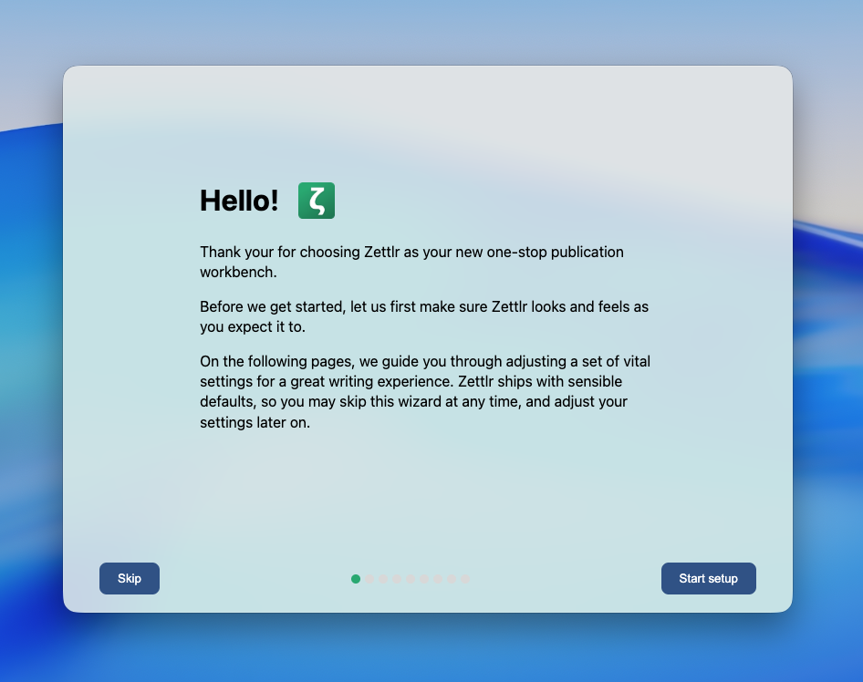

# Primeiros Passos

Depois de [instalar o Zettlr](../getting-started/setup.md) e iniciar o aplicativo, ele fornecerá um guia de configuração rápida. Este guia de configuração permite que você ajuste rapidamente as configurações mais importantes com apenas alguns cliques. É uma pena que você percorra esta caixa de diálogo com muito cuidado para garantir que, ao terminar, o Zettlr tenha a aparência que você deseja. Além disso, este guia de configuração destacará alguns recursos centrais que o aplicativo oferece.

Você também pode optar por pular este assistente de configuração e alterar qualquer configuração posteriormente.

**Observação:**

    Você não pode cometer nenhum erro aqui. Este guia de configuração simplesmente altera as configurações de preferência que você mesmo pode alterar posteriormente na caixa de diálogo de seleção, se não estiver satisfeito com algumas de suas escolhas no guia de configuração.

## Uma primeira olhada no Zettlr

Depois de concluir o assistente de configuração, uma janela principal do Zettlr será exibida. A interface está dividida em **três detalhes principais**.

* Na frente e no centro está a **área do editor** onde você pode ler e editar seus arquivos. Como você pode ver, o Zettlr suporta **visão dividida**. Para demonstrar esse recurso, o aplicativo abriu um pequeno documento tutorial à esquerda e dois documentos com algumas informações úteis à direita.
* À esquerda, você pode ver o **gerenciador de arquivos** do Zettlr. O gerenciador de arquivos é onde você pode visualizar, pesquisar e gerenciar todos os seus documentos, áreas de trabalho e quaisquer arquivos adicionais dentro deles. Notavelmente, o gerenciador de arquivos é apenas uma visualização dos arquivos já existentes no seu computador. Todos os seus dados permanecem em arquivos legíveis no seu dispositivo e **não há dependência de fornecedor**.
* No topo desses dois títulos você encontra a **barra de ferramentas**, uma forma de acesso rápido a muitas das funções principais do aplicativo. A maior parte dessa funcionalidade também pode ser acionada por meio de atalhos de teclado, se preferir.

**Observação:**

    Há também uma quarta seção, uma barra lateral, à direita. Não é mostrado por padrão. Você pode clicar no ícone da barra lateral à direita da barra de ferramentas para fazê-lo aparecer. Esta barra lateral inclui comentários para um índice, referências, arquivos relacionados e ativos relacionados a qualquer arquivo que você esteja visualizando atualmente.

## A importância dos espaços de trabalho

Como um novo usuário, é importante entender que **Zettlr foi criado em torno da noção de espaços de trabalho**. Os espaços de trabalho são simplesmente pastas em algum lugar do seu computador que contém todos os seus documentos Markdown. A ideia do Zettlr é que você crie uma ou mais pastas em seu computador e coloque os documentos Markdown criados no Zettlr dentro dessas pastas. Em seguida, basta carregar essas pastas no Zettlr como áreas de trabalho.

O Zettlr também permite que você abra arquivos arbitrários, porque às vezes você recebe um arquivo de um colega, coloca-o na pasta Downloads, fornece feedback sobre ele, envia o arquivo de volta e depois o exclui novamente. Esses arquivos aparecem em uma seção detipda “Arquivos” no gerenciador de arquivos, não como um espaço de trabalho. Esses arquivos “autônomos” ou “raiz”, como os chamamos, têm menos recursos disponíveis do que os espaços de trabalho.

Assim, para aproveitar ao máximo o Zettlr, recomendamos fortemente que você designe uma ou mais pastas em algum lugar do seu computador como áreas de trabalho onde você trabalha principalmente. Para se inspirar sobre quais pastas você pode querer criar, a [próxima seção explicada as áreas de trabalho em profundidade](./workspaces.md).

**Aviso:**

**Recomendamos fortemente** que você faça backup regularmente de seus espaços de trabalho. O método mais simples é usar um provedor de armazenamento em nuvem (como Dropbox, Google Drive, OneDrive ou iCloud) e criar os espaços de trabalho nele. Dessa forma, todos os seus arquivos serão copiados automaticamente. Além disso, você também deve fazer backup dos arquivos em um dispositivo de armazenamento externo.

## Trabalhando no tutorial

Antes de se aprofundar, recomendamos que você siga o tutorial. Primeiro, leia o arquivo intitulado “Bem-vindo ao Zettlr” e siga as instruções contidas neles. Na parte inferior, você verá um link para um segundo documento do tutorial. No total, existem três desses documentos e, ao trabalhar com eles, você pode obter alguma experiência prática com o aplicativo.

Depois de terminar de trabalhar no tutorial, volte aqui e continue lendo a documentação. Clique em “Avançar” para ir para a introdução dos espaços de trabalho.