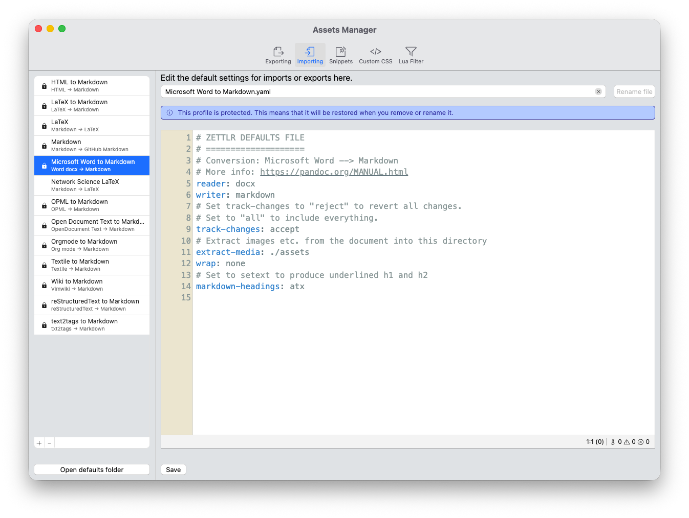

# Migrando do Word

A maioria dos novos usuários do Zettlr usa principalmente Word, LibreOffice ou algum outro processador de texto para escrever. No entanto, o Zettlr não pode abrir diretamente arquivos Word ou OpenDocument. Mas o que você pode fazer é importante. Aqui explicamos como fazer isso.

Primeiro, clique em “Arquivo” → “Importar arquivos”. Isso abrirá uma caixa de diálogo que permite selecionar o **destino de importação**. Selecione a pasta para qual deseja importar seus arquivos. Confirme sua seleção.

Agora, outra caixa de diálogo será aberta permitindo que você selecione **quais arquivos que deseja importar**. Navegue até a pasta onde estão localizados seus documentos do Word ou outros arquivos e selecione todos os que deseja importar.

Repita esse processo para cada destino e conjunto de arquivos a serem importados.

## Tipos de arquivos suportados

Zettlr utiliza Pandoc para baixar arquivos e, portanto, podemos oferecer uma ampla variedade de arquivos diferentes. O principal requisito para importar um arquivo é que o Pandoc suporte o formato do arquivo e que ele possa ser convertido em um arquivo Markdown.

**Observação:**

    Pode ser que seu computador não mostre algumas ou todas essas extensões de arquivo. Você pode adaptar as configurações do navegador de arquivos do seu computador (como Explorer ou Finder) para visualizar todas as extensões do arquivo.

Zettlr examinará a extensão do arquivo para determinar o tipo de documento e selecionar o fluxo de trabalho de seleção adequado. Aqui está uma lista de extensões de tipos de arquivos atualmente suportados:

| Extensões de arquivo | Descrição |
|--------------------------------|------------------------------------------------|
| `*.md`, `*.markdown` | Documentos de redução |
| `*.rmd` | Arquivos RMarkdown |
| `*.mdx` | Arquivos Markdown com JSX |
| `*.docx`, `*.doc` | Documentos do Microsoft Word |
| `*.odt` | Arquivos OpenDocument |
| `*.rtf` | Documentos em formato Rich-Text |
| `*.html`, `*.htm` | Documentos HTML |
| `*.tex`, `*.latex` | Documentos LaTeX |
| `*.epub`, `*.fb2` | Arquivos de e-books |
| `*.wiki` | Vários formatos Wiki (MediaWiki, etc.) |
| `*.org` | Documentos em modo ORG |
| `*.rst` | Documentos de texto reestruturados |
| `*.docbook` | Arquivos DocBook |
| `*.textile` | Documentos têxteis |
| `*.t2t` | documentos txt2tags |
| `*.muse` | Documentos da musa |
| `*.opml` | Documentos gerais do OPML |
| `*.haddock`, `*.hs` | Documentação do código-fonte Haskell |
| `*.roff`, `*.ms` | Vários formatos de "páginas de manual" |
| `*.csv` | Listas separadas por vírgula |
| `*.ipynb` | Documentos do Jupyter Notebook |
| `*.jira` | Problemas de Jira |

**Observação:**

    O Zettlr usará o primeiro perfil de importação que possui o leitor otimizado para importar um arquivo. Portanto, se você adicionou perfis Pandoc que apoiam o mesmo leitor, fique atento à ordem de classificação dos perfis. Se esta for a primeira vez que você usa o aplicativo, o Zettlr terá apenas um perfil por tipo de arquivo.

## Personalizando como o Zettlr importa arquivos

Por padrão, o Zettlr aplicará padrões sensatos aos seus arquivos importados. No entanto, pode ser que você queira personalizar a forma como ele importa os arquivos. Para fazer isso, você pode adaptar as perfis de importação. Você pode fazer isso no gerenciador de ativos (“Zettlr” → “Gerenciador de ativos” no macOS, “Arquivo” → “Configurações” → “Gerenciador de ativos” no Windows e Linux).

O gerenciador de ativos possui uma seção para importação de arquivos. A lista à esquerda mostra todos os perfis de importação disponíveis atualmente. Se você selecionar um, poderá editar as configurações que o Zettlr usa para ele usando o editor YAML à direita. Você também pode criar perfis totalmente novos se tiver arquivos que não são suportados pelo Zettlr imediatamente.

Consulte a [página de documentação correspondente para arquivos padrão](../export/defaults-files.md) para saber como ajustar as.

## Trabalhando com colegas de trabalho

O mesmo processo também funciona se você trabalha com colegas que trabalham exclusivamente com Word: Para eles, você pode exportar arquivos Markdown para `docx` e fazer com que, por exemplo, comentem em seus arquivos. Depois que eles enviarem seu arquivo de volta, você poderá importá-lo novamente para o Zettlr.

Você pode ajustar o funcionamento do importador modificando seu perfil. Por exemplo, por padrão, o Zettlr direcionará o Pandoc para extrair imagens e outros arquivos de mídia de documentos do Word para um diretório de ativos para que você possa manter esses arquivos de mídia. Você também pode ajustar se quaisquer comentários feitos por seus colegas de trabalho devem ser aceitos, rejeitados ou mantidos como comentários.