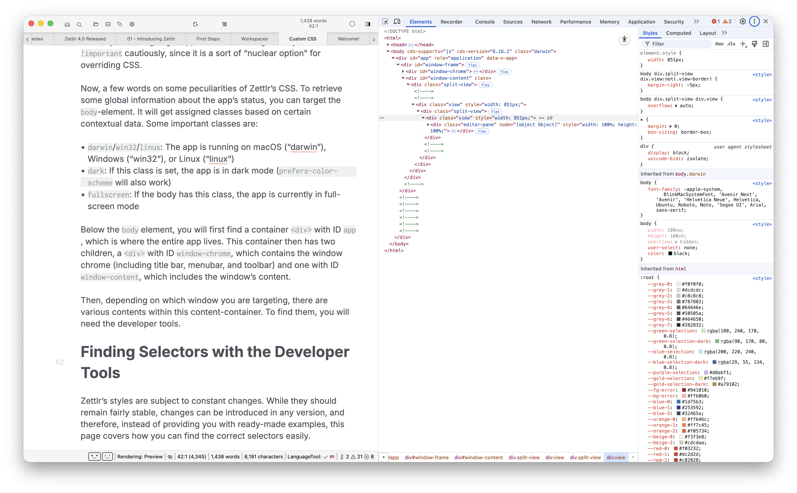
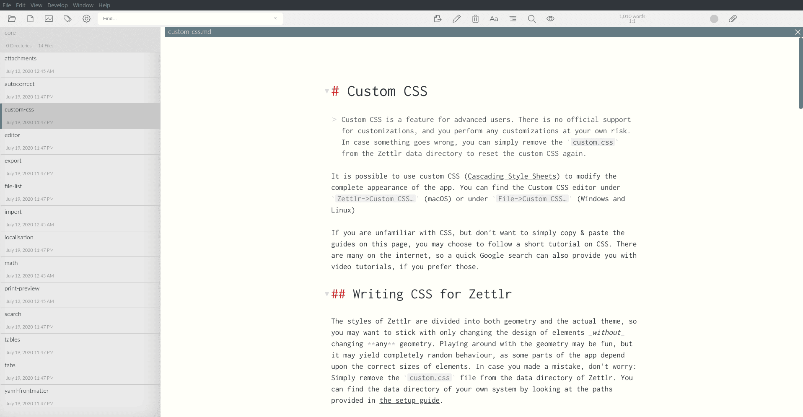
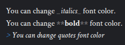
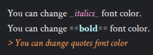
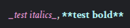
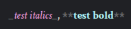
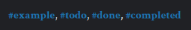
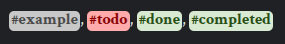
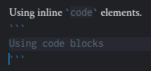
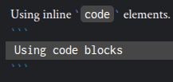

# CSS personalizado

Zettlr permite que você personalize totalmente a aparência do aplicativo usando CSS personalizado ([Cascading Style Sheets](https://en.wikipedia.org/wiki/Cascading_Style_Sheets)). Você pode encontrar o editor CSS personalizado em [gerenciador de ativos](../export/assets-manager.md).

**Aviso:**

  CSS personalizado é um recurso apenas para usuários avançados. Não há suporte oficial para personalizações e você realiza qualquer personalização por sua conta e risco. Usar CSS personalizado requer conhecimento de HTML e CSS.

Se você não está familiarizado com CSS, recomendamos que siga um breve [tutorial sobre CSS](https://developer.mozilla.org/en-US/docs/Learn/CSS/Introduction_to_CSS). Existem muitos guias na internet, e uma pesquisa rápida no Google também pode fornecer tutoriais em vídeo, se você preferir.

## Escrevendo CSS para Zettlr

CSS permite personalizar totalmente a aparência, o posicionamento e a geometria de qualquer elemento do aplicativo. No entanto, é absolutamente aconselhável **não** alterar quaisquer propriedades geométricas (mover elementos ou tornar-los maiores ou menores), pois isso pode causar comportamento indesejado. Alterar o tamanho do ícone ou da fonte, ou tamanhos semelhantes, deve servir.

Caso algumas de suas alterações causem comportamento indesejado e você não consiga remover as alterações problemáticas de dentro do aplicativo, você pode remover o arquivo `custom.css` do diretório de dados do aplicativo. Você pode encontrar o diretório de dados do seu próprio sistema observando os caminhos fornecidos no [guia de configuração](../getting-started/setup.md).

## Anatomia do CSS do Zettlr

Zettlr usa principalmente identificadores (IDs), classes e variáveis ​​CSS para definir estilos aos elementos. Elementos exclusivos (como o gerenciador de arquivos) geralmente têm um ID que você pode direcionar, enquanto os elementos dos quais existem vários (por exemplo, itens de árvore no gerenciador de arquivos) geralmente têm classes.

Como seu CSS personalizado será carregado por último, normalmente você pode direcionar os elementos facilmente, sem ser muito específico. No entanto, às vezes, você precisará fornecer um caminho específico para substituir certas regras. Em alguns casos, aplicamos estilos diretamente ao elemento (usando sua propriedade de estilo). Neste caso, pode ser necessário usar `!important` para garantir que suas alterações sejam aplicadas. Geralmente, você deve usar `!important` com cautela, pois é uma espécie de “opção nuclear” para substituir CSS.

Agora, algumas palavras sobre algumas especializações do CSS do Zettlr. Para recuperar algumas informações globais sobre o status do aplicativo, você pode direcionar o elemento `body`. Ele receberá classes atribuídas com base em determinados dados contextuais. Algumas aulas importantes são:

* `darwin`/`win32`/`linux`: O aplicativo está sendo executado em macOS (“darwin”), Windows (“win32”) ou Linux (“linux”)
* `dark`: Se esta classe estiver definida, o aplicativo não ficará no modo escuro (`prefers-color-scheme` também funcionará)
* `fullscreen`: Se o corpo tiver esta classe, o aplicativo está atualmente em modo de tela cheia

Abaixo do elemento `body`, você encontrará primeiro um contêiner `<div>` com ID `app`, que é onde reside todo o aplicativo. Este contêiner então tem dois filhos, um `<div>` com ID `window-chrome`, que contém o cromo da janela (incluindo barra de título, barra de menu e barra de ferramentas) e outro com ID `window-content`, que inclui o conteúdo da janela.

Então, dependendo de qual janela você está direcionando, existem vários conteúdos dentro deste contêiner de conteúdo. Para encontrá-los, você precisará das ferramentas do desenvolvedor.

**Observação:**

  Como o CSS do Zettlr pode mudar a qualquer momento, não fornecemos nenhum exemplo específico da aparência desses conteúdos e, em vez disso, informaremos como identificar o que mudar abaixo.

## Encontrando-se seletivo com as ferramentas do desenvolvedor

Os estilos do Zettlr estão sujeitos a mudanças constantes. Embora devam permanecer razoavelmente razoáveis, as alterações podem ser alteradas em qualquer versão e, portanto, em vez de fornecer exemplos prontos, esta página aborda como você pode encontrar facilmente as opções corretas.

Antes de começar, comprove-se de “Ativar modo de depuração” nas opções → “Avançado”. Esta opção adicionará uma nova entrada na barra de menu chamada “Desenvolver” → “Alternar ferramentas de desenvolvedor”. Também ativará um atalho de teclado para alternar as ferramentas do desenvolvedor. Você pode pressionar <kbd>Cmd</kbd>+<kbd>Alt</kbd>+<kbd>I</kbd> (macOS) ou <kbd>Ctrl</kbd>+<kbd>Alt</kbd>+<kbd>I</kbd> (Windows e Linux).

Assim que as ferramentas do desenvolvedor estiverem abertas, você poderá usá-las para encontrar elementos. Para ver a estrutura HTML da janela, escolha a aba “Elementos”. Caso a aba não seja aplicada na barra de abas, clique nas duas setas (`>>`) e selecione a aba “Elementos” no menu que aparece.

Agora, o aplicativo deve ficar assim:



No lado esquerdo você pode ver o conteúdo da janela, enquanto no lado direito você pode ver a aba de elementos. Você verá que há dois trechos abaixo (dependendo do tamanho das ferramentas do desenvolvedor, essas duas novidades podem ser empilhadas verticalmente): Primeiro, a estrutura HTML, começando com `<!DOCTYPE html>`, e depois os estilos. À medida que você navega pela estrutura HTML e clica nos elementos, uma seção de estilo será atualizada para refletir os estilos do elemento atualmente selecionados.

**Dica:**

Essas ferramentas de desenvolvedor são iguais às ferramentas de desenvolvedor do Chrome. Para saber mais sobre como eles funcionam, consulte a [documentação do Google](https://developer.chrome.com/docs/devtools/overview#elements).

Como a estrutura em árvore do HTML nem sempre é visualmente óbvia no layout do aplicativo, geralmente é complicado navegar pela página de elementos até encontrar o elemento correto. Em vez disso, recomendamos a seguinte abordagem:

1. Com as ferramentas abertas do desenvolvedor, navegue pelo aplicativo até encontrar o elemento que deseja alterar.
2. Clique na seta no canto superior esquerdo das ferramentas do desenvolvedor. Conforme você avança no aplicativo, vários elementos serão destacados. Passe sobre o elemento que deseja funcionar e clique com o botão esquerdo do mouse.
3. Isso agora navegará diretamente pela estrutura da árvore HTML até o elemento que você acabou de clicar.

Na área inferior das ferramentas do desenvolvedor, você verá as disposições CSS usadas para estilizar todos os elementos desta forma específica.

## Usando a seção de estilos para modificar elementos

Agora que você encontrou o elemento que deseja alterar, é hora de testar algumas alterações no CSS até que funcionem como você deseja. Para isso, você precisa da seção de estilos na aba “Elementos”. Depois de selecionar o elemento de destino, esta seção foi atualizada para mostrar todos os estilos CSS que estão atualmente aplicados ao seu elemento.

Existem três grandes tipos de estilos. No topo, você verá uma seção `element.style`. Contém quaisquer regras que são aplicadas diretamente ao elemento. Por exemplo, um elemento que possui o atributo `style="width: 1413px;"` irá, nesta seção, mostrar `width: 1413px;`. Esta seção, portanto, aplica-se apenas a esta *uma única instância* do elemento. Abaixo disso, você verá várias regras CSS de vários lugares que aplicam várias regras a elementos desta classe ou ID (por exemplo, `body div.split-view div.view:not(.view-border)` que aplica um estilo a um `div` da classe `view` que está contido em um `div` com classe `split-view` e não possui a classe `view-border`). Além disso, também existem alguns estilos cursivos que dizem “folha de estilo do agente do usuário” – essas são regras de estilo que vêm por padrão com o Chrome e não estão contidas em nenhum dos arquivos CSS do Zettlr.

Você deve ler a seção de cima para baixo. As regras condicionais na parte superior substituem as regras que estão mais na parte inferior. Por exemplo, se duas regras CSS diferentes especificam uma margem para algum elemento, aquele que será carregado por último terá precedência e, portanto, essa regra será colocada mais no topo da seção de estilos.

Para testar algumas alterações em um elemento, recomendamos que você escreva esses estilos na seção `element.style`. Essas regras serão então aplicadas apenas a esse único elemento. Você pode ajustá-los até ficar feliz. Se algo quebrar, você pode recarregar o aplicativo no menu “Desenvolver” ou iniciar <kbd>F5</kbd>, ou que redefinirá os estilos.

Quando estiver satisfeito, você deverá copiar esses estilos para o CSS personalizado no gerenciador de ativos. Como seletor, você deve usar a regra que melhor descreve quais instâncias do elemento você deseja atingir. Geralmente é uma das regras específicas na seção de estilos. Pode ser necessária alguma experiência com CSS e personalização do Zettlr para encontrar a regra correta com segurança. Dentro do seu CSS personalizado, uma nova seção deve ser semelhante a esta:

```css
body div.class {
    color: green;
    margin: 10px;
}
```

Onde `body div.class` é a regra do painel de estilos e tudo entre colchetes são os estilos que você achou que tinham uma boa aparência.

## Estilizando o Editor

A maioria dos usuários provavelmente desejará alterar núcleos ou fontes no editor principal. Como o editor é baseado em [CodeMirror 6](https://www.codemirror.net), ele segue sua estrutura na aplicação de estilos a diversos elementos. Para poder encontrar os elementos corretos, forneça algumas instruções de orientação para ajudá-lo a navegar na estrutura DOM criada pelo CodeMirror.

Primeiro, o editor é separado em **camadas**. Para garantir que recursos como planos de fundo, cursores e opções sejam planejados, o CodeMirror oferece várias camadas nas quais o Zettlr deseja seus elementos. Existem quatro camadas principais:

1. A camada **texto**. Isso é o que você estilizará principalmente quando alterar cores ou fontes. É acessível diretamente no elemento de rolagem.
2. A camada **cursor**. Os cursores de texto são renderizados em uma camada diferente para garantir que sempre estejam no topo de todo ou resto.
3. A camada de **seleção**. As opções devem ser renderizadas atrás dos cursores e do texto para que realmente se ofereçam com opções, mesmo quando renderizadas com núcleos sólidos.
4. A camada **fundo do código**. Esta é uma camada personalizada em que o Zettlr implementa planos de fundo de código. Para tornar o código distinto do texto circundante, todo código embutido e em bloco tem um cor de fundo atribuído a ele. Todos esses planos de fundo são implementados como elementos distintos - e não como uma parte de plano de fundo - nesta camada de plano de fundo do código. Você pode modificar esta camada para alterar a forma como os planos de fundo do código são renderizados. É a camada mais baixa para garantir que os planos de fundo do código permaneçam atrás de todos os cursores, textos e escolhidos.

Para saber mais sobre a estrutura geral do editor e poder estilizar os elementos aqui, por favor [veja este guia para a estrutura do CodeMirror](https://codemirror.net/examples/styling/).

Embora o estilo de elementos específicos possa ser difícil devido à estrutura complexa do editor, o Zettlr implementa uma variedade de [variáveis​​CSS](https://developer.mozilla.org/en-US/docs/Web/CSS/Guides/Cascading_variables/Using_custom_properties). Isso torna o estilo de elementos específicos muito mais simples, pois permite aplicar estilos comuns a elementos específicos simplesmente alterando uma variável CSS, em vez de ter que direcionar especificamente vários elementos no editor.

Para usar tal variável, você simplesmente precisa direcionar o elemento `.cm-editor` e alterar as variáveis ​​de acordo, por exemplo:

```css
.cm-editor {
  --zettlr-editor-font: 'Inter', sans-serif;
}
```

Variáveis diferentes assumem valores diferentes, como núcleos, fontes ou números. O que você precisa fornecer geralmente fica claro no nome da variável. Em caso de incerteza, consulte [este arquivo](https://github.com/Zettlr/Zettlr/blob/develop/source/common/modules/markdown-editor/theme/editor.ts), onde você pode encontrar comentários descritivos para todas as variáveis. Além disso, sempre serão mostradas as variáveis​​exatas suportadas.

No momento da redação deste artigo (2 de maio de 2026), as seguintes variações são inovadoras:

* `--zettlr-editor-primary-color`
* `--zettlr-editor-secondary-color`
* `--zettlr-editor-scroller-color`
* `--zettlr-editor-scroller-bg`
* `--zettlr-editor-selection-color`
* `--zettlr-editor-highlight-color`
* `--zettlr-editor-font`
* `--zettlr-editor-code-font`
* `--zettlr-editor-font-size`
* `--zettlr-editor-line-height`
* `--zettlr-editor-code-style`
* `--zettlr-editor-emphasis-style`
* `--zettlr-editor-strong-style`
* `--zettlr-editor-header-style`
* `--zettlr-editor-citation-color`
* `--zettlr-editor-citation-bg`
* `--zettlr-editor-code-color`
* `--zettlr-editor-code-bg`
* `--zettlr-editor-escape-color`
* `--zettlr-editor-accent-color`
* `--zettlr-editor-accent-bg`
* `--zettlr-editor-header-1-size`
* `--zettlr-editor-header-2-size`
* `--zettlr-editor-header-3-size`
* `--zettlr-editor-header-4-size`
* `--zettlr-editor-header-5-size`
* `--zettlr-editor-header-6-size`
* `--zettlr-editor-error-color`
* `--zettlr-editor-opacity`
* `--zettlr-editor-line-decoration`

Tal como acontece com qualquer outro estilo, esta lista de variáveis ​​pode mudar a qualquer momento e não garante qualquer estabilidade para ela. Você pode encontrar uma lista atualizada de variáveis ​​CSS disponíveis [este arquivo](https://github.com/Zettlr/Zettlr/blob/develop/source/common/modules/markdown-editor/theme/editor.ts).

## Exemplos de código CSS

Nesta seção, mostramos alguns exemplos do que você pode mudar nos estilos do Zettlr. Esta seção não pretende ser exaustiva nem cobrir seus desejos pessoais. O objetivo é apenas dar alguma inspiração e mostrar o que é possível.

Esses exemplos não funcionam imediatamente se tivermos que alterar o CSS e esquecermos de atualizar esta seção. Caso um exemplo não funcione conforme o esperado, informe-nos abrindo um problema no [Repositório de documentos Zettlr](https://github.com/Zettlr/zettlr-docs).

### Usando uma fonte de editor personalizada

Por padrão, o Zettlr vem com algumas fontes para seus temas que funcionam imediatamente e têm boa aparência. No entanto, você pode querer alterar a fonte do editor para algo que considere mais agradável visualmente. Ou, se você sofre de dislexia, pode desejar usar a fonte Dislexia no editor para poder ler melhor o texto.

No trecho abaixo, substitua `<your-font-name here>` pelo **nome completo** da fonte que você deseja usar para Zettlr. Substitui `<placeholder>` de acordo com a fonte:

- Caso você queira usar uma fonte **serif**, como Times New Roman ou Georgia, use `serif`
- Caso sua fonte seja **sans serif**, como Arial ou Helvetica, use `sans-serif`
- Caso você queira mudar para a fonte clássica **monoespaçada**, use o espaço reservado `monospace`

O espaço reservado garantirá que, mesmo que sua fonte não seja encontrada, uma fonte equivalente será usada. Servir como um substituto. Além disso, se o nome da fonte contiver espaços, comprove-se de colocá-lo entre aspas, por exemplo, `"Times New Roman"`.

```css
.main-editor-wrapper .cm-editor .cm-scroller {
    font-family: "<your-font-name here>", <placeholder>;
}
```

Para usar a fonte Inter, por exemplo, pode ficar assim:

```css
.main-editor-wrapper .cm-editor .cm-scroller {
    font-family: "Inter", sans-serif;
}
```

### Use números de largura fixa no gerenciador de arquivos

Se você usar dados em seus nomes de arquivo (por exemplo, `2025-12-03 Meeting Notes` ou `2025-11-01 Meeting Notes`), poderá descobrir que os números não estão totalmente alinhados. Você pode usar números tabulares para alinhá-los. O snippet CSS correspondente é simples:

```css
#file-manager {
  font-variant-numeric: tabular-nums;
}
```

**Observação:**

  A própria fonte deve fornecer números tabulares (largura fixa) para que isso funcione. Muitas fontes modernas sim.

### Alterar o estilo da linha ativa no modo de máquina de escrever

Você pode alterar o estilo da linha ativa no modo Máquina de escrever. Substitua `top-border-hex-code`, `bottom-border-hex-code` e `background-hex-code` nos trechos CSS abaixo dos núcleos CSS de sua preferência. Você pode querer ter cores diferentes para o modo claro e escuro.

```css
/* Light mode */
body .main-editor-wrapper .cm-editor .cm-content .typewriter-active-line {
  border-top: 2px solid <top-border-hex-code>;
  border-bottom: 2px solid <bottom-border-hex-code>;
  background-color: <background-hex-code>;
}

/* Dark mode */
body.dark .main-editor-wrapper .cm-editor .cm-content .typewriter-active-line {
  border-top: 2px solid <top-border-hex-code>;
  border-bottom: 2px solid <bottom-border-hex-code>;
  background-color: <background-hex-code>;
}
```

### Defina uma largura máxima para o texto

Se você tiver uma tela grande, poderá descobrir que as linhas do seu texto são muito longas. Se desejar ter linhas mais curtas no editor, com margens em ambos os lados, você pode usar o seguinte snippet CSS (substitua `<preferred-line-width>` por uma largura CSS válida, por exemplo, `50vw` ou `600px`):

```css
.main-editor-wrapper .cm-content {
  max-width: <preferred-line-width>;
  margin-right: auto;
}

.main-editor-wrapper .cm-gutters {
  margin-left: auto;
}
```

Resultado:



### Personalize como núcleos da fonte

É possível alterar os núcleos da fonte de alguns elementos de marcação para outros para torná-los mais proeminentes. Substitua `body` por `body.dark` para alterar a aparência no modo escuro.

```css
/* Quotes */
body .cm-editor .cm-quote {
   color: rgba(250, 160, 85, 1);
}

/* Bold */
body .cm-editor .cm-strong {
   color: rgba(182, 249, 250, 1);
}

/* Italics */
body .cm-editor .cm-emphasis {
  color: rgba(255, 165, 230, 1);
}
```

Antes:



Depois:



Você também pode alterar o cor dos elementos da sintaxe do Markdown, como `_` para itálico ou `*` para negrito, tornando-os mais próximos do cor de fundo para reduzir distrações. Novamente, substitua `body` por `body.dark` para direcionar os elementos no modo escuro.

```css
/* Bold marks */
body .cm-editor .cm-strong.cm-code-mark {
   color: rgba(204, 204, 204, 0.4);
}

/* Italic marks */
body .cm-editor .cm-emphasis.cm-code-mark {
   color: rgba(204, 204, 204, 0.4);
}
```

Antes:



Depois:



### Personalize a aparência das tags

Você pode alterar a aparência das tags adicionando núcleos personalizados para cada tag diferente:

```css
/* Generic tags */
body .cm-zkn-tag {
   background-color: rgba(200, 200, 200, 1);
   color: rgba(74, 74, 74, 1);
   padding: 2px;
   border-radius:5px;
}

/* Custom colors for custom tags */
body .cm-zkn-tag-todo > .cm-zkn-tag {
  background-color: rgba(275,171,171, 1);
  color: rgba(138,0,0, 1);
}

body :is(.cm-zkn-tag-done, .cm-zkn-tag-completed)  > .cm-zkn-tag {
  background-color: #d8ead2;
  color: #274e13;
}
```

Antes:



Depois:



### Personalize uma barra de rolagem

Você pode personalizar a barra de rolagem para minimizar seu tamanho em segurança e expandi-la somente ao passar o mouse sobre ela.

```css
::-webkit-scrollbar {
  width: 12px;
  height: 12px;
}

::-webkit-scrollbar-thumb {
  background: #ababab;
  border-radius: 10px;
  border: 2px solid transparent;
  background-clip: padding-box;
}

::-webkit-scrollbar-thumb:hover{
  border: 0;
}

::-webkit-scrollbar-track {
  background: transparent;
}
```

### Personalizar blocos de código

Ao usar o modo escuro, os blocos de código podem ser mais difíceis de ler. Portanto, você pode personalizá-los para torná-los mais legíveis:

```css
body.dark .cm-editor .cm-monospace {
   color: rgba(255, 255, 255, 1);
   background-color: rgba(70, 70, 70, 1);
   padding: 2px;
   padding-right: 5px;
   padding-left: 5px;
   border-radius: 5px;
}

.code-block-line {
   background-color: rgba(70, 70, 70, 1);
}
```

Antes:



Depois:

