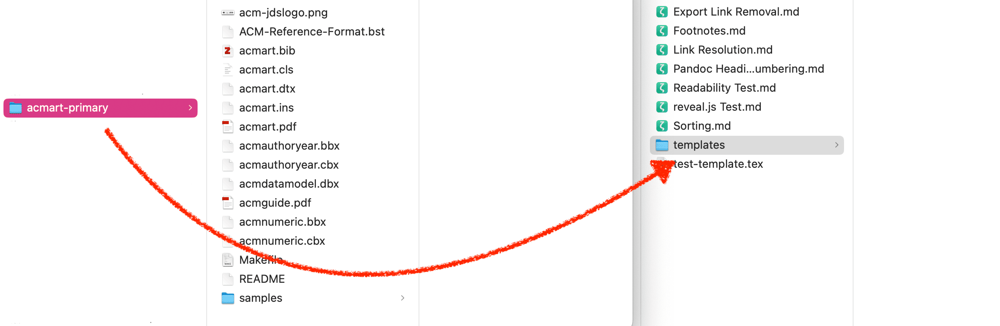
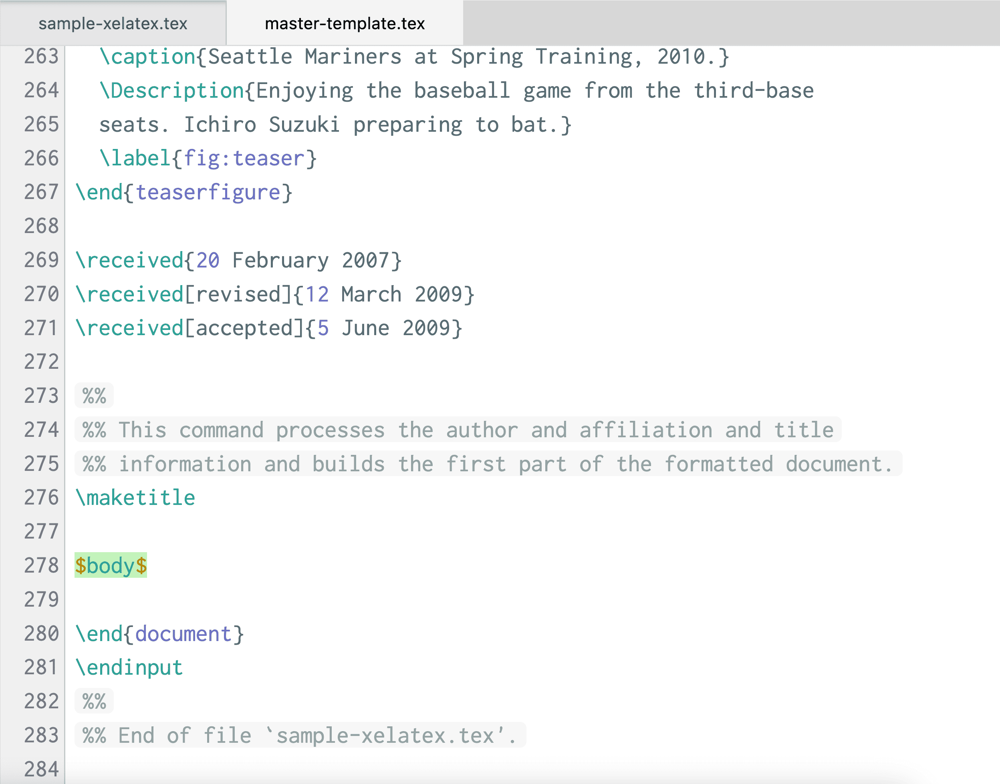
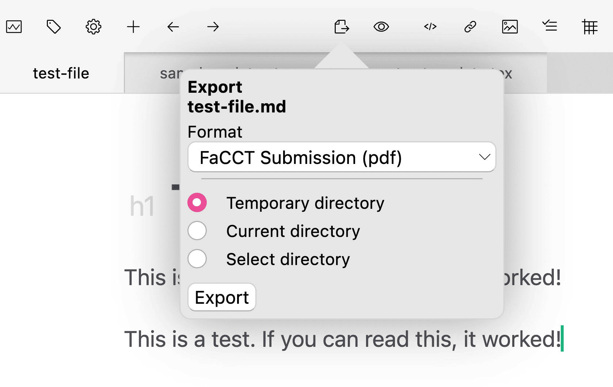
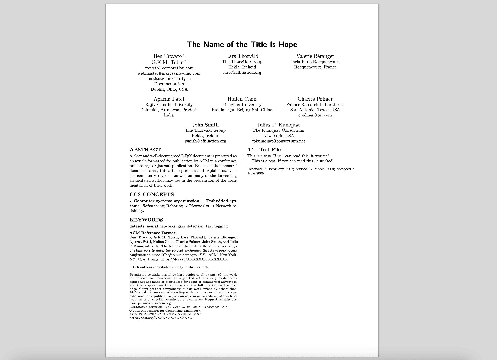
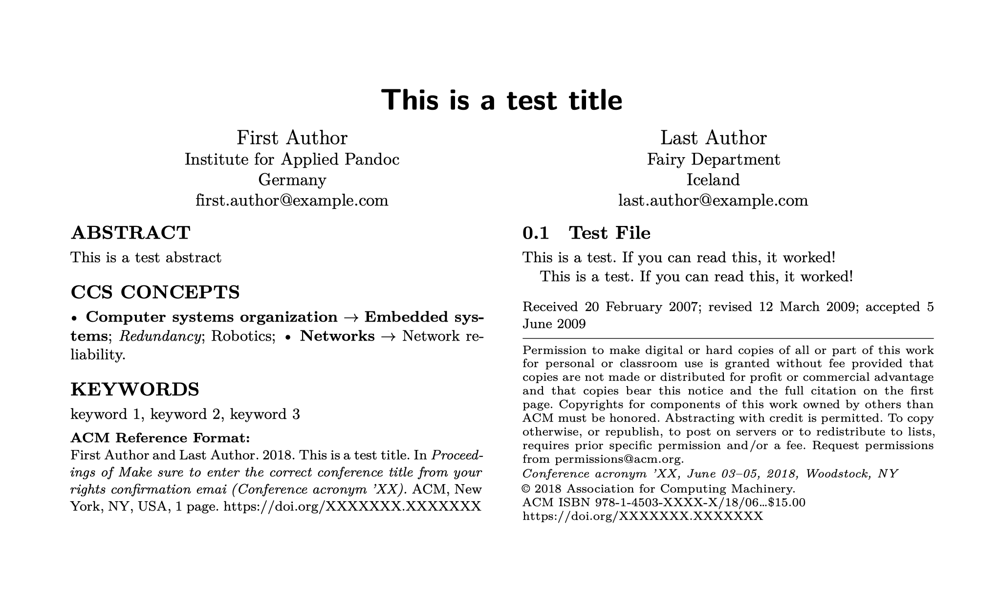

# Enviando para um diário usando um modelo LaTeX

Um fluxo de trabalho que muitos usuários do Zettlr precisarão é preparar e enviar um artigo usando um modelo LaTeX fornecido para uma conferência ou jornal. Neste guia, mostraremos como adicionar qualquer modelo LaTeX ao Zettlr para que você possa escrever seu artigo em Markdown e exportá-lo para um arquivo PDF pronto para câmera que você pode enviar de acordo com os requisitos da revista ou conferência.

## Nosso exemplo: FaCCT/ACM

Neste guia, usaremos o modelo atual da FaCCT (Conferência ACM sobre Justiça, Responsabilidade e Transparência) para mostrar as etapas fáceis, mas é claro, para que funcionem com qualquer conferência ou jornal que você exija que use um modelo LaTeX e envie via PDF.

A FaCCT é uma conferência da Association for Computing Machinery (ACM), portanto, as diretrizes de submissão para a conferência serão vinculadas ao guia de procedimentos da ACM. Assim, [abrimos o site](https://authors.acm.org/proceedings/production-information/preparing-your-article-with-latex) e baixamos o template LaTeX.

Muitos modelos LaTeX são como um arquivo Zip que inclui o próprio modelo (um arquivo `*.tex`), vários arquivos auxiliares e, muitas vezes, alguns fragmentos de exemplo para lhe dar uma ideia de como o modelo deve ser usado.

Para nossos propósitos, baixaremos o [arquivo Zip](https://portalparts.acm.org/hippo/latex_templates/acmart-primary.zip) de proteção e descompactaremos seu conteúdo em nosso computador.

## Mova os arquivos para um local de proteção

Depois de recuperar o modelo, o primeiro passo é encontrar um local adequado para ele. Para facilitar a adaptação do modelo posteriormente, precisamos colocá-lo em uma pasta que o Zettlr possa encontrar. Lembre-se de que o Zettlr também pode abrir arquivos LaTeX, o que será útil mais tarde. Você poderia usar, por exemplo, uma pasta chamada "templates". Copie todo o conteúdo da pasta para lá. Sinta-se à vontade para renomeá-lo com um nome mais adequado.



## Transforme uma amostra em um modelo

Inspecionando a pasta de modelos, você verá que ela **não contém um único modelo mestre**. Em vez disso, você verá que existe uma pasta "samples" que contém uma variedade de arquivos de exemplos diferentes. Precisamos pegar um desses e criar um modelo real.

Iremos duplicar o arquivo "sample-xelatex.tex", mas pode ser necessário escolher outro. Consulte uma conferência se você enfrentar esta situação e pergunte qual modelo seria o mais seguro para usar. Em seguida, mova o arquivo duplicado da pasta “samples” para a pasta principal. Isto é importante porque o LaTeX espera os arquivos auxiliares na mesma pasta do seu modelo.

**Observação:**

seção, os arquivos LaTeX contêm comentários úteis. Por exemplo, o modelo ACM informa que, "[f]ou submissão e revisão do seu manuscrito, altere o comando para \documentclass[manuscript, screen, review]{acmart}." Tome nota destes comentários, pois eles podem conter informações importantes para o seu próprio envio.

Agora que temos um modelo “mestre”, temos que garantir que ele funcione com o Pandoc. Para isso, temos que colocar uma variável `$body$` em algum lugar entre os comandos `\begin{document}` e `\end{document}`. Muitos modelos LaTeX fornecem alguns exemplos para mostrar como o modelo deve ser usado.

Lembre-se de que, para exportação, o Pandoc converterá seu Markdown em código LaTeX, mas muitas vezes há várias maneiras de obter o mesmo resultado, e pode haver situações em que você terá que usar o código LaTeX literal em seus arquivos Markdown para evitar que o Pandoc use os comandos "errados" que o modelo não suporta. Se você apenas escreve um texto, isso não deve ser um problema, mas saiba que é uma possibilidade.

Por enquanto, como ainda temos o exemplo original, podemos ser ratipis e excluir a maior parte do código do exemplo. Procure a linha que contém `\section{Introduction}`, pois é aí que o código de amostra real começa. Exclua tudo até a linha `\end{document}` tudo entre os comandos do documento e coloque uma única variável `$body$` lá.



Além disso, há uma iteração do modelo ACM que também inclui uma referência a uma imagem, "sampleteaser". Esta referência de imagem teaser também precisa ser removida, caso contrário o Pandoc reclamará que não encontrou a imagem.

Antes de continuar a adaptar o modelo, é uma boa ideia testá-lo para garantir que funciona. Para isso, vamos agora criar rapidamente um perfil de exportação para isso e testá-lo.

## Crie um novo perfil de exportação

Embora você possa, em princípio, adicionar o modelo ao modelo de exportação de PDF padrão, isso não é recomendado, pois dessa forma seria exportar outros arquivos para arquivos PDF normais sem um modelo específico.

Portanto, vamos primeiro abrir o gerenciador de ações pressionando <kbd>Cmd/Ctrl</kbd>+<kbd>Alt</kbd>+<kbd>,</kbd> e depois ir para o guia de exportação.

Na lista, adquira o modelo “XeLaTeX PDF”, digite um novo nome no campo de texto do nome do arquivo e clique em “Renomear arquivo”. Para nossos propósitos, escolhemos o nome “FaCCT Submission”.

**Observação:**

  Como o modelo XeLaTeX PDF é um perfil protegido, o Zettlr ou recria assim que você o renomeou. Porém, observe que o arquivo recriado conterá apenas as configurações de fábrica. **Se você personalizou seu modelo, agora você deve copiar todo o conteúdo do perfil "FaCCT Submission" e copiá-lo de volta para o perfil "XeLaTeX PDF" para não perdê-lo**.

Agora podemos adaptar o perfil para funcionar com nosso novo modelo. A única etapa necessária é fornecer um link para nosso modelo para que o Pandoc o encontre. Portanto, copie o **caminho absoluto** para o modelo e aponte o perfil para ele, por exemplo assim:

```yaml
# ... more contents ...
reader: markdown
writer: pdf
template: /Users/<username>/Documents/Zettlr Workspace/templates/acmart-primary/master-template.tex
# ... more contents ...
```

**Observação:**

  É importante que você utilize o caminho absoluto, pois o Pandoc sempre funcionará no diretório do arquivo que você está exportando, que pode mudar dependendo do arquivo.

## Teste o novo perfil

Agora vamos testar rapidamente o perfil. Para isso, basta pegar qualquer arquivo da instalação do Zettlr e exportá-lo usando o perfil. Você não precisa usar um arquivo complicado, uma linha simples é suficiente.



A única coisa que você deve garantir é definir uma variável de frontmatter específica: `pandoc_working_dir`. Esta é uma propriedade especial que o Zettlr entende para especificar um diretório de trabalho Pandoc. Por padrão, o Zettlr executa o Pandoc no diretório onde reside o arquivo que você está exportando. Na maioria das situações, isso é muito conveniente. Porém, como estamos usando um modelo especial, precisamos direcionar o Pandoc para usar outra pasta, já que o LaTeX precisa encontrar todos os arquivos que acompanham o modelo.

Usando nosso caminho do exemplo acima, isso é o que você precisaria especificar no frontmatter YAML:

```yaml
zettlr:
    pandoc_working_dir: /Users/<username>/Documents/Zettlr Workspace/templates/acmart-primary
```

**Observação:**

Observe que você pode receber alguns erros ao tentar exportar, incluindo pacotes ausentes. [Leia isto para saber como corrigi-los](../getting-started/installing-latex.md#installing-additional-packages).

Depois disso, seu PDF deverá abrir com o conteúdo, mas você poderá notar que ainda há muitos exemplos de código nele. Isto é o que precisamos chegar agora:



## Adaptando ainda mais o modelo

Como você pode ver, ainda há um exemplo de código na seção de resumo, exemplos de autores e um exemplo de título. Agora que o modelo funciona, é hora de aprimorá-lo e garantir que você possa definir todas as informações diferentes para cada envio da maneira adequada.

**Observação:**

A seguir, não explicaremos muito sobre o que estamos fazendo, pois o básico é explicado detalhadamente em nossa [documentação sobre modelos personalizados](../export/custom-templates.md). Aqui simplesmente aplicamos essas diretrizes para transformar o modelo estático em um modelo Pandoc dinâmico.

Primeiro, vamos transformar o título em uma variável. Para isso, procuramos pela convenção `\title` e substituímos por uma variável de estilo Pandoc:

```latex
% Replace 
\title{The Name of the Title Is Hope}

% with
$if(title)$
\title{$title$}
$endif$
```

Agora você pode especificar um título de frontmatter YAML e ele será usado como título para o envio.

Em seguida, devemos garantir que podemos especificar corretamente os nomes dos autores no frontmatter YAML e usá-los. Você verá que os autores estão incluídos como tal:

```latex
\author{Lars Th{\o}rv{\"a}ld}
\affiliation{%
  \institution{The Th{\o}rv{\"a}ld Group}
  \streetaddress{1 Th{\o}rv{\"a}ld Circle}
  \city{Hekla}
  \country{Iceland}}
\email{larst@affiliation.org}
```

Então, vamos tornar isso adequado também:

```latex
$for(author)$
$if(author.name)$
\author{$author.name$}
$if(author.affiliation)$
\affiliation{%
\institution{$author.affiliation$}
\country{$author.country$}
}
$endif$
$if(author.email)$
\email{$author.email$}
$endif$
$else$
\author{$author$}
$endif$
$endfor$
```

Em seguida, você pode fornecer nomes de autores em seu frontmatter YAML da seguinte forma:

```yaml
author:
  - name: First Author
    affiliation: Institute for Applied Pandoc
    country: Germany
    email: first.author@example.com
  - name: Last Author
    affiliation: Fairy Department
    country: Iceland
    email: last.author@example.com
```

**Observação:**

  Observe que os modelos ACM desativam um país variável. Nestes casos, o LaTeX fornecerá uma mensagem de erro. Outros modelos podem ser mais simples e permitir que você obtenha menos informações. Certifique-se de se familiarizar com o modelo.

As últimas coisas que adaptaremos aqui são resumo e palavras-chave. Existem algumas outras coisas, como os conceitos CCS ou o DOI, que estão fora do escopo deste tutorial. Com o conhecimento deste guia, você será capaz de lidar com eles da maneira adequada.

Para alterar o resumo e as palavras-chave, podemos repetir as etapas acima:

```latex
% Replace
\begin{abstract}
  The abstract text
\end{abstract}

% with
$if(abstract)$
\begin{abstract}
  $abstract$
\end{abstract}
$endif$
```

Para as palavras-chave, é semelhante:

```latex
% Replace
\keywords{datasets, neural networks, gaze detection, text tagging}

% with
$if(keywords)$
  \keywords{$for(keywords)$$keywords$$sep$, $endfor$}
$endif$
```

Depois disso, você poderá produzir o seguinte arquivo PDF usando estas variáveis de frontmatter:

```yaml
title: This is a test title
author:
  - name: First Author
    affiliation: Institute for Applied Pandoc
    country: Germany
    email: first.author@example.com
  - name: Last Author
    affiliation: Fairy Department
    country: Iceland
    email: last.author@example.com
abstract: |
  This is a test abstract
keywords:
- keyword 1
- keyword 2
- keyword 3
zettlr:
  pandoc_working_dir: /Users/<username>/Documents/Zettlr Workspace/templates/acmart-primary
```



## Garantindo a compatibilidade do Pandoc

O Pandoc precisa inserir alguns comandos e lógica para garantir que um modelo funcione conforme planejado com o Pandoc. Para habilitar a compatibilidade do Pandoc com seu modelo, você só precisa inserir uma linha de código, que direcionará o Pandoc a inserir suas próprias definições e convenções comuns em seu modelo:

```latex
$common.latex()$
```

## Considerações Finais

Agora você deve ter todo o conhecimento necessário para criar modelos para as diversas conferências e jornais aos quais planejam enviar. Há muito mais que você pode fazer com modelos LaTeX, variáveis ​​Pandoc e Zettlr.