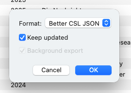

# Integração do Gerenciador de Referência

Neste guia, orientamos você na integração do Zettlr com o Zotero, um dos gerenciadores de referência mais usados. O objetivo deste guia é permitir que você cite nenhum Zettlr e que essas restrições sejam válidas corretamente sempre que você exportar um documento ou projeto.

**Dica:**

    Zettlr suporta diretamente JabRef, porque JabRef funciona em um banco de dados de instruções simples que você pode importar diretamente. O mesmo vale para as bibliotecas BibTeX e BibLaTeX, que são suportadas diretamente. Este guia se aplica apenas a aplicativos que usam formato de banco de dados, como o Zotero.

Embora este guia seja direcionado especificamente ao Zotero, etapas semelhantes também se aplicam a qualquer outro gerenciador de referências. Essencialmente, o que você precisa fazer é encontrar uma maneira de exportar sua biblioteca de referência para um formato de arquivo que o Zettlr entenda.

## Etapa 1: Instale BetterBibTex

O primeiro passo é instalar [o plugin BetterBibTex para Zotero](https://retorque.re/zotero-better-bibtex/installation/). Usar BetterBibTex tem dois benefícios importantes em relação a não usá-lo. Primeiro, ele mantém todas as suas chaves de restrições exclusivas em toda a sua biblioteca. Em segundo lugar, permite manter o arquivo da biblioteca exportado atualizado para que você não precise reexportá-lo sempre que algo mudar.

Se você não utilizar o BetterBibTex, suas chaves de citação poderão sofrer com o indicado e não poderão ser exclusivas em todas as suas bibliotecas. No entanto, ter boas chaves de citação é uma etapa crucial para facilitar a citação. Em segundo lugar, se você não usar BetterBibTex, você sempre terá que exportar manualmente sua biblioteca sempre que algo mudar.

Portanto, recomendamos fortemente o BetterBibTex e presumimos que você instalou o plugin nas próximas etapas.

## Etapa 2: exportar sua biblioteca

A próxima etapa é exportar sua biblioteca para um arquivo que o Zettlr possa entender. Para isso, clique com o botão direito em “Minha Biblioteca” no topo da lista de coleções e selecione “Exportar Biblioteca…”

Na caixa de diálogo que aparece agora, selecione o formato “Better CSL JSON”. -se de verificar a configuração Certifique-se de “Manter atualização”. Isso garantirá que o plugin BetterBibTex sempre reexportará o arquivo sempre que algo mudar no Zotero. Dessa forma, se você adicionar novos itens ou corrigir erros, basta aguardar alguns segundos para que essas alterações sejam aplicadas automaticamente no Zettlr.

A seguir, o Zotero solicitará um local para este arquivo. Recomendamos que você escolha uma pasta que seja fácil de localizar. Lembre-se da escolha que você fez.

**Observação:**

    Você também pode optar por exportar uma biblioteca como Better BibTeX ou Better BibLaTeX. Esses formatos também são suportados pelo Zettlr. CSL JSON é mais rápido e fácil de carregar, e é por isso que recomendamos este formato, a menos que você tenha um motivo para escolher BibTeX ou BibLaTeX (por exemplo, para suporte com Overleaf).

## Etapa 3: carregue sua biblioteca

A etapa final é indicada o Zettlr para sua biblioteca recém-exportada. Para fazer isso, abra as preferências e navegue até “Citações”. Localize o arquivo que você acabou de exportar.

O Zettlr agora abrirá, lerá e carregará o arquivo automaticamente. Dependendo da quantidade de itens em sua biblioteca, isso pode demorar alguns segundos. Feito isso, você poderá referenciar suas chaves de citação do Zotero no Zettlr e assim citar itens.

Zettlr observará o arquivo em busca de quaisquer alterações. Se BetterBibTex reexportar o arquivo (porque você alterou um item de referência ou adicionou um novo), o Zettlr detectará isso automaticamente e relerá o arquivo para garantir que você sempre possa acessar as alterações mais recentes.